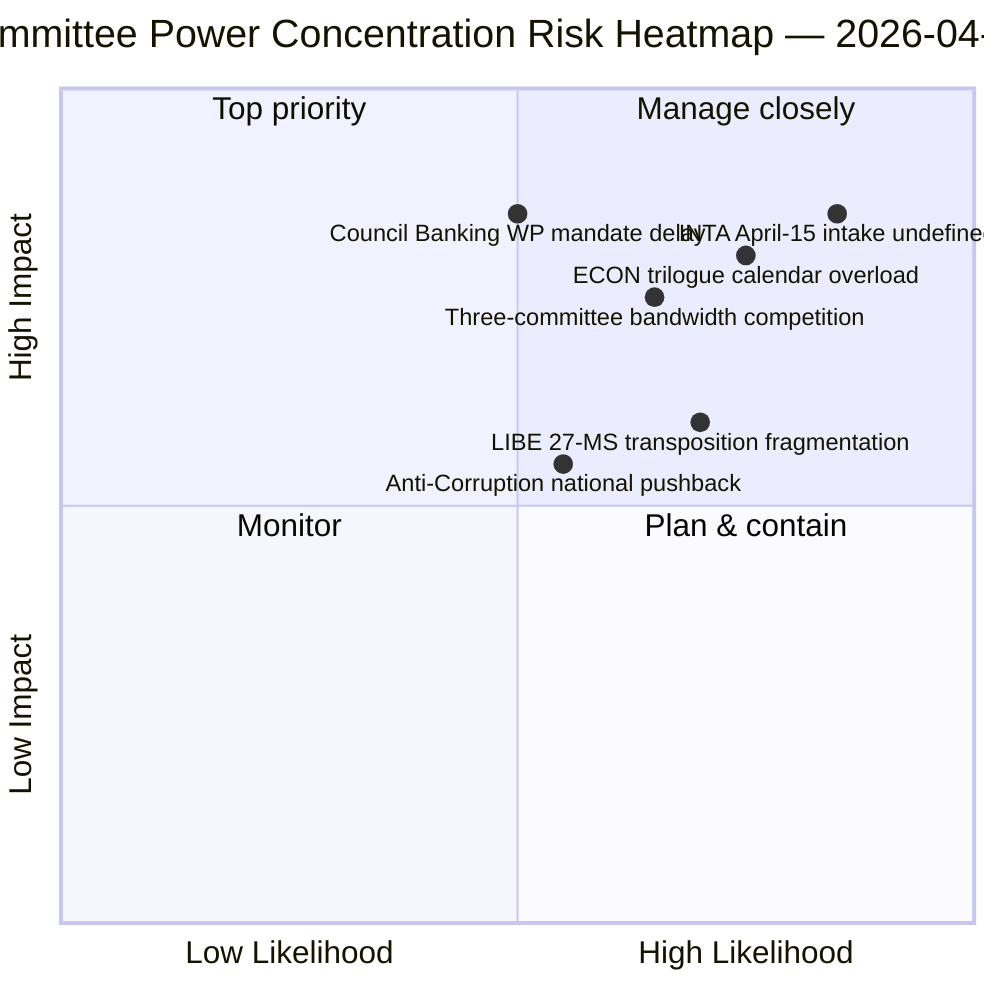

<!-- SPDX-FileCopyrightText: 2026 Hack23 AB -->
<!-- SPDX-License-Identifier: Apache-2.0 -->

# Exekutiv sammanfattning — Utskottsrapporter: Påskrecess Dag 11 Retrospektiv | 2026-04-06

**Klassificering:** OSINT — Offentligt parlamentariskt dokument
**Konfidensgrad:** 🟡 MEDEL (recessperiod — ingen ny utskottsaktivitet; pre-recessretrospektiv 🟢 HÖG)
**Körning:** `analysis/daily/2026-04-06/committee-reports/` (05:03 UTC)
**Täckning:** Påskrecess Dag 11/18 — retrospektiv utskottsmaktanalys av pre-receskorpus
**Genererad:** 2026-05-16 (retrospektiv sammanfattning, inga nya MCP-anrop)
**Primära källor:** Pre-recesskorpus av antagna texter (TA-10-2026-0090/0091/0092 ECON; TA-10-2026-0094 LIBE; TA-10-2026-0096 INTA); 20 analysfiler.

---

## 🎯 BLUF

**Denna körning på Annandag Påsk ger den retrospektiva utskottsmaktanalysen av pre-recesskorpuset — det analytiska komplementet till breaking-klustret samma datum: där breaking-körningarna dokumenterade det dubbelspåriga koalitionsmönstret, dokumenterar utskottsrapportkörningen den *utskottsnivåkoncentration* som möjliggjorde det.** Tre utskott producerade Q1 2026:s mest konsekventa output: **ECON** (Bankunionstriplett: SRMR3 TA-10-2026-0092 + DGSD2 TA-10-2026-0090 + BRRD3 TA-10-2026-0091 — slutförande av fleråriga bankunionsdossier som påverkar hela EU:s banksektor), **LIBE** (Antikorruptionsdirektiv TA-10-2026-0094 — det första gränsöverskridande EU-straffrättsinstrumentet sedan Europeiska åklagarmyndigheten EPPO), och **INTA** (USA-tullsvar TA-10-2026-0096 — den fil som aktiveras den 15 april). Körningens säregna bidrag är **utskottsmaktkoncentrationsfyndet**: tre utskott innehar oproportionerlig institutionell tyngd under Q2, med ECON dominerande Q2-trilogkalenderns bandbredd (Bankunionen → Rådets mandat → Kommissionens tolkning), LIBE ägande den 27-MS-transponeringsvägen under Q2–Q4, och INTA absorberar rollen som operativt genomförandetillsyn från den 15 april. Retrospektivet publiceras i en degraderad API-miljö (4/8 flöden aktiva) men vilar på primärt flödesbekräftade poster.

---

## 🧭 3 Beslut som denna sammanfattning stödjer

| # | Beslut | Beslutsfattare | Deadline | Underlag |
|:-:|--------|----------------|:--------:|----------|
| 1 | **ECON Q2-trilogschemaläggningsreservation** — Bankunionstriplett kräver reserverad rådskapacitet | ECON-ordförande + Rådets bankarbetsgrupp | senast 14 april | §Fynd 1 (ECON-dominans) |
| 2 | **LIBE 27-MS-transponeringssamordning** — första gränsöverskridande EU-straffrättsinstrumentet kräver liaison med nationella parlament | LIBE-ordförande + nationalparlamentariska representanter | löpande Q2–Q4 | §Fynd 2 (LIBE som förstegångare) |
| 3 | **INTA granskningsintag design** — implementeringsfasen aktiveras 15 april; intag odefinierat | INTA-ordförande + koordinatorer | senast 14 april | §Fynd 3 (INTA operativ roll) |

---

## 📰 60-sekunders läsning

- 🔴 **Tre-utskottsdominans Q1** — ECON · LIBE · INTA.
- 🟠 **ECON Bankunionstriplett** — SRMR3 + DGSD2 + BRRD3 (slutförande av flerårig process).
- 🟢 **LIBE Antikorruption** — första gränsöverskridande EU-straffrättsinstrumentet sedan EPPO.
- 🟡 **INTA USA-tull** — operativt genomförande aktiveras 15 april.
- 🔵 **236 antagna texter i kumulativt korpus** — verifierbart via veckans flöde.
- 🟣 **20 analysfiler** — utskottsnivåmetodik tillämpas per fil.
- 🩷 **API 4/8 flöden aktiva** — degraderat men utskottsdata tillgängliga.
- ⚪ **Konfidensgrad MEDEL** — recessperiod; pre-receskorpus hög; framåtprognos medel.

---

## 🏛️ Utskottsmaktkoncentration (körningens säregna bidrag)

| Utskott | Nyckelärende(n) Q1 | Institutionell tyngd Q2 | Trajektoria Q2–Q4 |
|---------|--------------------|-------------------------|-------------------|
| **ECON** | TA-0090 / 0091 / 0092 (Bankunionstriplett) | Trilogkalenderdominans | Bankunionfullbordande → Rådets mandat Q2 |
| **LIBE** | TA-0094 (Antikorruption) | 27-MS-transponeringstillsyn | Q2–Q4 löpande transponering; nationell parlamentarisk liaison |
| **INTA** | TA-0096 (USA-tull) | Operativt genomförandetillsyn | T-0 15 april; granskningsfönsterförhandling |

---

## ⚠️ Riskpanorama

---

## 🔮 Topp framåtutlösare (nästa 14 dagar)

1. **14 april — Utskottsvecka inleds** — tre-utskottets bandbreddskonkurrens börjar.
2. **15 april — TA-10-2026-0096 aktiveras** — INTA:s operativa roll.
3. **17 april — ECB:s räntebeslut** — ECON:s externa utlösare.
4. **Sent april — Rådets bankarbetsgrupp mandat** — ECON:s trilogport.
5. **Q2 — 27-MS-transponeringsrullande start** — LIBE:s tillsynsaktivering.

---

## 🛡️ Källkvalitetsbedömning

- **Pre-recesskorpus (A1):** primära flödesposter; TA-ID:n verifierbara.
- **Tre-utskottskoncentration (A2):** utskottsmaktmetodik; medelkonfidensgrad gällande relativ viktning.
- **20 analysfiler (A2):** systematisk per-fil-metodik.
- **Netto konfidensgrad:** 🟢 HÖG gällande Q1-poster; 🟡 MEDEL gällande Q2-viktprognos.

---

## 📎 Körningsartefakter

| Lager | Artefakt | Varför |
|-------|----------|--------|
| Artikel | `article.md` (1 234 rader) | Offentligt utskottsrapportnarrativ |
| Syntes | `existing/synthesis-summary.md` | Tre-utskottsfynd (auktoritativt) |
| Metoder | classification · existing · risk-scoring · threat-assessment | Standard utskottsrapportmetodik |
| Följeslagare | breaking (00:33) · breaking-2 (06:45) · breaking-3 (12:15) · breaking-4 (18:18) · motions · propositions | Påskmåndagskluster |

---

**Dokumentkontroll**
- **Mallreferens:** `analysis/templates/executive-brief.md`
- **Artefaktsökväg:** `analysis/daily/2026-04-06/committee-reports/executive-brief.md`
- **Klassificering:** Offentlig
- **Retrospektiv:** Sammanfattning skriven 2026-05-16 från körningens arkiverade artefakter; **inga nya MCP-anrop gjordes**.
