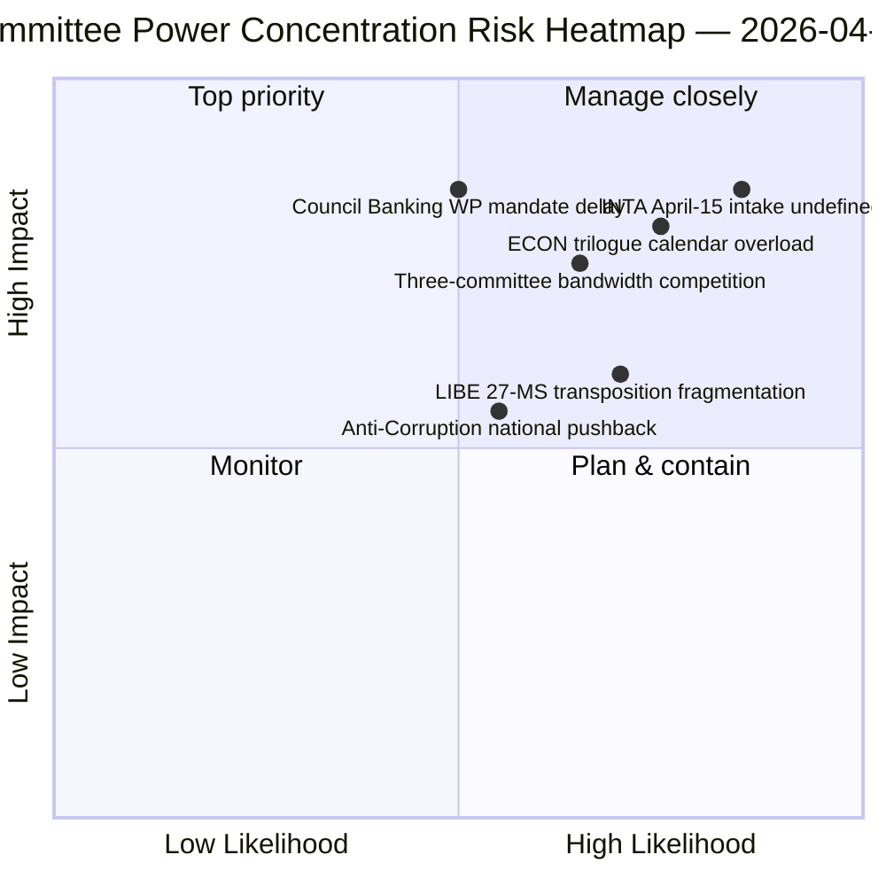

<!-- SPDX-FileCopyrightText: 2026 Hack23 AB -->
<!-- SPDX-License-Identifier: Apache-2.0 -->

# 执行简报 — 委员会报告：复活节休会第11天 回顾性总结 | 2026-04-06

**分类：** OSINT — 公开议会记录
**可信度：** 🟡 中等（休会期间 — 无新的委员会活动；休会前回顾 🟢 高）
**运行：** `analysis/daily/2026-04-06/committee-reports/` (05:03 UTC)
**覆盖范围：** 复活节休会第11/18天 — 对休会前语料库的委员会权力回顾分析
**生成日期：** 2026-05-16（回顾性简报，无新MCP调用）
**主要来源：** 休会前已通过文本语料库（TA-10-2026-0090/0091/0092 ECON；TA-10-2026-0094 LIBE；TA-10-2026-0096 INTA）；20个分析文件。

---

## 🎯 BLUF

**本次复活节周一运行生成对休会前语料库的委员会权力回顾分析 — 作为同一日期突发新闻集群的分析补充：突发新闻运行记录了双轨联盟模式，委员会报告运行则记录了使其成为可能的*委员会层面的集中*。** 三个委员会产生了2026年第一季度最具决定性的成果：**ECON**（银行联盟三合一方案：SRMR3 TA-10-2026-0092 + DGSD2 TA-10-2026-0090 + BRRD3 TA-10-2026-0091 — 影响整个欧盟银行业的多年期银行联盟议题完成），**LIBE**（反腐败指令 TA-10-2026-0094 — 欧洲检察官公署EPPO成立以来首个全欧洲刑法工具），以及**INTA**（美国关税应对 TA-10-2026-0096 — 于4月15日激活的文件）。本次运行的独特贡献是**委员会权力集中的发现**：三个委员会在第二季度拥有不成比例的机构权重，ECON主导第二季度三方会谈日程的带宽（银行联盟 → 理事会授权 → 委员会解释），LIBE拥有贯穿第二至第四季度的27个成员国转置轨道，INTA从4月15日起承担运营实施监督角色。回顾性简报在降级的API环境（4/8个数据流处于活跃状态）中发布，但基于经主要数据流确认的记录。

---

## 🧭 本简报支持的3项决策

| # | 决策 | 决策者 | 截止日期 | 证据 |
|:-:|-----|-------|:------:|------|
| 1 | **ECON第二季度三方会谈日程预留** — 银行联盟三合一方案需要预留理事会带宽 | ECON主席 + 理事会银行工作组 | 4月14日前 | §发现1（ECON主导地位） |
| 2 | **LIBE 27成员国转置协调** — 首个全欧洲刑法工具需要与各国议会建立联络 | LIBE主席 + 各国议会代表 | 第二至第四季度滚动推进 | §发现2（LIBE作为先行者） |
| 3 | **INTA审查受理机制设计** — 实施阶段于4月15日激活；受理程序尚未定义 | INTA主席 + 协调员 | 4月14日前 | §发现3（INTA运营角色） |

---

## 📰 60秒速读

- 🔴 **三委员会第一季度主导地位** — ECON · LIBE · INTA。
- 🟠 **ECON银行联盟三合一** — SRMR3 + DGSD2 + BRRD3（多年期完成）。
- 🟢 **LIBE反腐败** — EPPO成立以来首个全欧洲刑法工具。
- 🟡 **INTA美国关税** — 4月15日激活运营实施。
- 🔵 **累计语料库中236项已通过文本** — 可通过周数据流核验。
- 🟣 **20个分析文件** — 委员会层面方法论逐文件应用。
- 🩷 **API 4/8数据流处于活跃** — 降级但委员会数据可访问。
- ⚪ **可信度中等** — 休会期；休会前语料库高；前瞻性预测中等。

---

## 🏛️ 委员会权力集中（本次运行的独特贡献）

| 委员会 | 第一季度旗舰议题 | 第二季度机构权重 | 第二至四季度轨迹 |
|-------|--------------|----------------|----------------|
| **ECON** | TA-0090 / 0091 / 0092（银行联盟三合一） | 三方会谈日程主导地位 | 多年期银行联盟完成 → 第二季度理事会授权 |
| **LIBE** | TA-0094（反腐败） | 27成员国转置监督 | 第二至四季度滚动转置；各国议会联络 |
| **INTA** | TA-0096（美国关税） | 运营实施监督 | T-0 4月15日；审查窗口谈判 |

---

## ⚠️ 风险快照

---

## 🔮 主要前瞻性触发因素（未来14天）

1. **4月14日 — 委员会周开幕** — 三委员会带宽竞争开始。
2. **4月15日 — TA-10-2026-0096激活** — INTA运营角色启动。
3. **4月17日 — 欧洲央行利率决定** — ECON外部触发因素。
4. **4月底 — 理事会银行工作组授权** — ECON三方会谈门槛。
5. **第二季度 — 27成员国转置滚动启动** — LIBE监督激活。

---

## 🛡️ 来源质量评估

- **休会前语料库（A1）：** 主要数据流记录；TA-ID可核验。
- **三委员会集中（A2）：** 委员会权力方法论；相对权重的可信度中等。
- **20个分析文件（A2）：** 逐文件系统方法论。
- **综合可信度：** 🟢 第一季度记录高；🟡 第二季度权重预测中等。

---

## 📎 运行成果物

| 层级 | 成果物 | 原因 |
|-----|--------|------|
| 文章 | `article.md`（1,234行） | 委员会报告公开叙述 |
| 综合 | `existing/synthesis-summary.md` | 三委员会发现（权威性） |
| 方法论 | classification · existing · risk-scoring · threat-assessment | 标准委员会报告方法论 |
| 配套 | breaking (00:33) · breaking-2 (06:45) · breaking-3 (12:15) · breaking-4 (18:18) · motions · propositions | 复活节周一集群 |

---

**文件管控**
- **模板参考：** `analysis/templates/executive-brief.md`
- **成果物路径：** `analysis/daily/2026-04-06/committee-reports/executive-brief.md`
- **分类：** 公开
- **回顾说明：** 本简报于2026-05-16根据运行归档成果物编写；**未进行任何新的MCP调用**。
