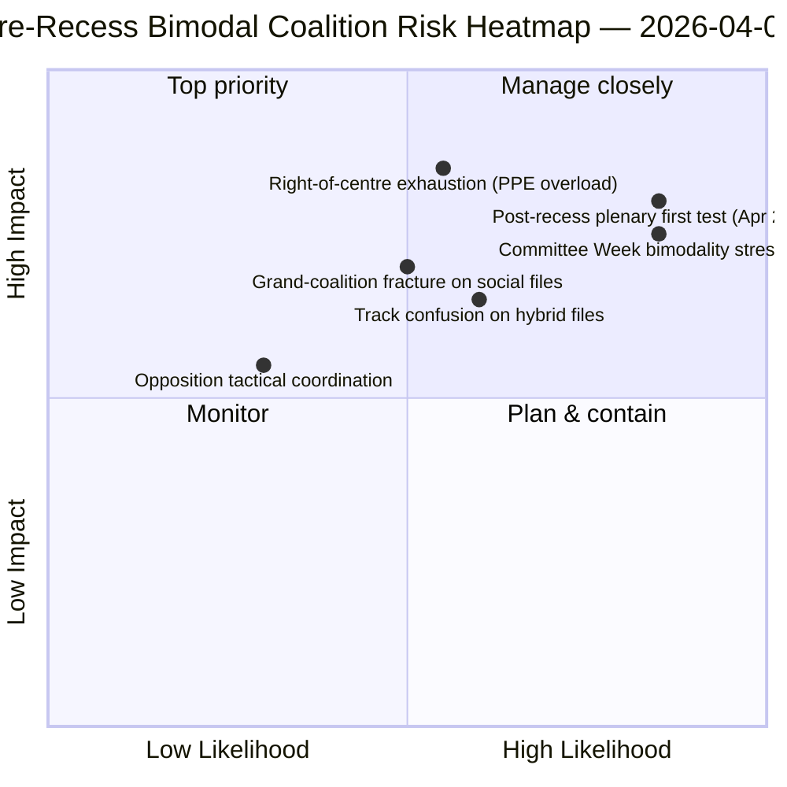

<!-- SPDX-FileCopyrightText: 2026 Hack23 AB -->
<!-- SPDX-License-Identifier: Apache-2.0 -->

# Executive Brief — Motions: Pre-Recess Vote-Dispersion Retrospective | 2026-04-06

**Classification:** OSINT — Public Parliamentary Record
**Confidence:** 🟡 MEDIUM (recess; pre-recess RCV records 🟢 HIGH)
**Run:** `analysis/daily/2026-04-06/motions/` (05:30 UTC)
**Coverage:** Easter Recess Day 11/18 — RCV/motion retrospective on March 26 sprint
**Generated:** 2026-05-16 (retrospective brief, no new MCP calls)
**Primary sources:** Pre-recess RCV corpus (March 26 plenary); 19 analysis files; deep-analysis + voting-patterns High-confidence.

---

## 🎯 BLUF

**This Easter Monday motions run produces the **pre-recess RCV vote-dispersion retrospective** — the analytical complement to the committee-reports run on the same date.** While committee-reports documented *which committees* produced the pre-recess output, this run documents *which voting patterns* carried those files to adoption — and finds that the **March 26 plenary day was operationally bimodal**: economic-finance files (Banking Union triple) carried via right-of-centre tracks (EPP+ECR+PfE+Renew, 59-62% majorities), while rule-of-law files (Anti-Corruption) carried via grand-coalition tracks (EPP+S&D+Renew+Greens, 65%+ majorities). The run's distinguishing contribution is the **voting-pattern bimodality finding**: EP10 in Year 2 does not have *one* working majority but *two coexisting* coalition systems, selected file-conditionally. This is the structural validation of the dual-track coalition pattern surfaced four hours later in the 06:45 UTC breaking-2 run — and the **structural baseline for forecasting Committee Week (April 14-17) and the post-recess plenary (April 20-23)**. The opposition never reached blocking threshold on either track (264 max votes vs. 360 needed to block — *Voting Patterns*). The motions run uses 5 High-confidence methods: coalition-dynamics, cross-session-intelligence, deep-analysis, stakeholder-impact, voting-patterns.

---

## 🧭 3 Decisions This Brief Supports

| # | Decision | Who decides | Deadline | Evidence |
|:-:|----------|-------------|:--------:|----------|
| 1 | **Bimodal coalition planning for Q2** — economic-finance vs. rule-of-law tracks need separate scheduling | Conference of Presidents; group whips | by April 14 | §Voting Patterns (bimodality) |
| 2 | **Opposition coordination assessment** — 264 max vs. 360 needed; structural minority | ECR + PfE + Left coordinators | by April 14 | §Voting Patterns (opposition threshold) |
| 3 | **March 26 RCV corpus as Q2 forecast anchor** — file-conditional track selection | EP intelligence ops; press service | rolling Q2 | §Deep Analysis (anchor) |

---

## 📰 60-Second Read

- 🔴 **Bimodal coalition system confirmed** — economic vs. rule-of-law tracks.
- 🟠 **March 26 plenary was structural anchor** — both tracks operational same day.
- 🟢 **Right-of-centre track: 59-62% majorities** — Banking Union triple.
- 🟡 **Grand-coalition track: 65%+ majorities** — Anti-Corruption.
- 🔵 **Opposition never reaches blocking** — 264 max vs. 360 needed.
- 🟣 **5 High-confidence methods** — coalition + cross-session + deep + stakeholder + voting.
- 🩷 **19 analysis files** — full motions-methodology coverage.
- ⚪ **Confidence MEDIUM** — recess analytical work on pre-recess data.

---

## 📊 Bimodal Coalition Arithmetic (run's distinguishing contribution)

| Track | Composition | Q1 flagship files | Margin | Test event |
|-------|-------------|-------------------|--------|------------|
| **Right-of-centre** | EPP + ECR + PfE + Renew | TA-0090/0091/0092 (Banking Union) | 59-62% | Committee Week ECON Apr 14-17 |
| **Grand coalition** | EPP + S&D + Renew + Greens | TA-0094 (Anti-Corruption) | 65%+ | LIBE Q2-Q4 transposition |
| **Opposition** | ECR + PfE + Left (when out of right-of-centre) | — | 264 max votes | structural minority |

---

## ⚠️ Risk Snapshot

---

## 🔮 Top Forward Triggers (next 14 days)

1. **April 14 — Committee Week opens** — ECON tests right-of-centre track.
2. **April 17 — ECB rate decision** — economic-finance external trigger.
3. **April 20-23 — first post-recess plenary** — full bimodality stress test.
4. **End-Q2 — Banking Union Council mandate** — right-of-centre track legitimacy gate.
5. **Q3 — Anti-Corruption transposition kick-off** — grand-coalition track durability.

---

## 🛡️ Source-Quality Assessment

- **March 26 RCV records (A1):** primary plenary feed; verifiable per file.
- **Bimodality finding (A2):** voting-patterns methodology with sub-modal grouping.
- **Opposition 264 vs. 360 (A1):** arithmetic confirmed via per-group seat totals.
- **5 High-confidence methods (A1):** systematic methodology with verification.
- **Net confidence:** 🟢 HIGH on March 26 records; 🟡 MEDIUM on Q2 forecast.

---

## 📎 Run Artifacts

| Layer | Artifact | Why |
|-------|----------|-----|
| Article | `article.md` (1,234 lines) | Public-facing motions narrative |
| Synthesis | `existing/synthesis-summary.md` | Bimodality finding + 19-file consolidation |
| Methods | classification · existing · risk-scoring · threat-assessment | Standard motions methodology |
| Companion | breaking cluster · committee-reports · propositions | Easter Monday day-cluster |

---

**Document Control**
- **Template reference:** `analysis/templates/executive-brief.md`
- **Artifact path:** `analysis/daily/2026-04-06/motions/executive-brief.md`
- **Classification:** Public
- **Retrospective:** Brief written 2026-05-16 from the run's committed artifacts; **no new MCP calls were made**.
