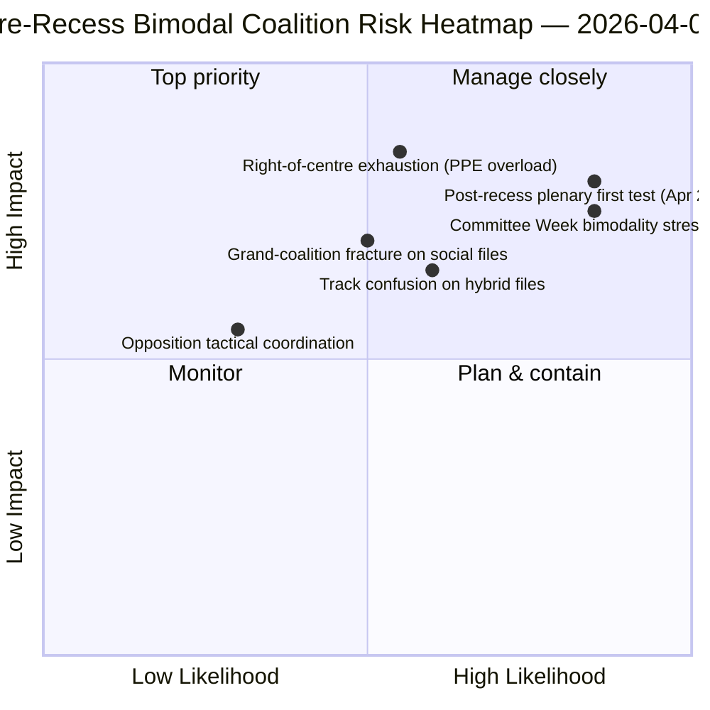

<!-- SPDX-FileCopyrightText: 2026 Hack23 AB -->
<!-- SPDX-License-Identifier: Apache-2.0 -->

# ملخص تنفيذي — المقترحات: استعراض توزيع الأصوات قبل العطلة | 2026-04-06

**التصنيف:** OSINT — السجلات البرلمانية العامة
**مستوى الثقة:** 🟡 متوسط (فترة عطلة؛ سجلات التصويت الإلكتروني قبل العطلة 🟢 عالٍ)
**الجولة:** `analysis/daily/2026-04-06/motions/` (05:30 UTC)
**التغطية:** اليوم 11/18 من عطلة عيد الفصح — استعراض أثر التصويت والمقترحات لسباق 26 مارس
**تاريخ الإنشاء:** 2026-05-16 (ملخص استرجاعي، لا مكالمات MCP جديدة)
**المصادر الأساسية:** مجموعة التصويت الإلكتروني قبل العطلة (يوم الجلسة العامة 26 مارس)؛ 19 ملف تحليلي؛ تحليل معمّق + أنماط التصويت، ثقة عالية.

---

## 🎯 BLUF

**تنتج جولة الاثنين من عيد الفصح هذه **الاستعراض الاسترجاعي لتوزيع التصويت الإلكتروني قبل العطلة** — المكمل التحليلي لجولة تقارير اللجان في نفس التاريخ.** في حين وثّقت تقارير اللجان *أي اللجان* أنتجت مخرجات ما قبل العطلة، توثّق هذه الجولة *أي أنماط تصويت* حملت تلك الملفات إلى الاعتماد — وتجد أن **يوم الجلسة العامة 26 مارس كان ثنائي الأسلوب من الناحية التشغيلية**: اعتُمدت ملفات الاقتصاد والمالية (ثلاثية الاتحاد المصرفي) عبر مسارات يمين الوسط (EPP+ECR+PfE+Renew، أغلبية 59-62 %)، في حين اعتُمدت ملفات سيادة القانون (مكافحة الفساد) عبر مسارات الائتلاف الكبير (EPP+S&D+Renew+Greens، أغلبية 65 %+). الإسهام المميز لهذه الجولة هو **اكتشاف ثنائية الوضع في أنماط التصويت**: لا يمتلك البرلمان الأوروبي العاشر في السنة الثانية *أغلبية عمل واحدة* بل *نظامي ائتلاف متعاشين* يُختاران بحسب الملف. هذا هو التحقق الهيكلي لنمط ائتلاف المسارين المزدوجين الذي ظهر بعد أربع ساعات في جولة التقرير العاجل الثاني الساعة 06:45 UTC — والخط الأساسي الهيكلي لتوقعات أسبوع اللجان (14-17 أبريل) وجلسة ما بعد العطلة (20-23 أبريل). لم تبلغ المعارضة أبداً عتبة الحجب على أي مسار (264 صوتاً بحد أقصى مقابل 360 مطلوبة للحجب — *أنماط التصويت*). تستخدم جولة المقترحات 5 طرق عالية الثقة: ديناميكيات الائتلاف، الاستخبارات عبر الجلسات، التحليل المعمّق، تأثير أصحاب المصلحة، أنماط التصويت.

---

## 🧭 3 Decisions This Brief Supports

| # | القرار | من يقرر | الموعد النهائي | الأدلة |
|:-:|--------|---------|:--------------:|--------|
| 1 | **التخطيط الائتلافي ثنائي الأسلوب للربع الثاني** — مسارا الاقتصاد والمالية مقابل سيادة القانون يستدعيان جدولاً منفصلاً | مؤتمر الرؤساء؛ مندوبو المجموعات | بحلول 14 أبريل | §أنماط التصويت (ثنائية الأسلوب) |
| 2 | **تقييم تنسيق المعارضة** — 264 بحد أقصى مقابل 360 مطلوبة؛ أقلية هيكلية | ECR + PfE + منسقو اليسار | بحلول 14 أبريل | §أنماط التصويت (عتبة المعارضة) |
| 3 | **مجموعة التصويت الإلكتروني لـ26 مارس كمرساة توقعية للربع الثاني** — اختيار المسار مشروط بالملف | عمليات الاستخبارات في البرلمان؛ دائرة الصحافة | الربع الثاني المتجدد | §التحليل المعمّق (المرساة) |

---

## 📰 60-Second Read

- 🔴 **تأكيد النظام الائتلافي ثنائي الأسلوب** — مسار الاقتصاد مقابل سيادة القانون.
- 🟠 **يوم الجلسة العامة 26 مارس كان مرساة هيكلية** — كلا المسارين نشطان في نفس اليوم.
- 🟢 **مسار يمين الوسط: أغلبية 59-62 %** — ثلاثية الاتحاد المصرفي.
- 🟡 **مسار الائتلاف الكبير: أغلبية 65 %+** — مكافحة الفساد.
- 🔵 **المعارضة لا تبلغ الحجب أبداً** — 264 بحد أقصى مقابل 360 مطلوبة.
- 🟣 **5 طرق عالية الثقة** — ائتلاف + عبر الجلسات + معمّق + أصحاب مصلحة + تصويت.
- 🩷 **19 ملف تحليلي** — تغطية كاملة لمنهجية المقترحات.
- ⚪ **مستوى الثقة متوسط** — عمل تحليلي خلال العطلة على بيانات ما قبل العطلة.

---

## 📊 Bimodal Coalition Arithmetic (run's distinguishing contribution)

| المسار | التركيبة | ملفات العلامة الرائدة للربع الأول | الهامش | حدث الاختبار |
|--------|---------|----------------------------------|--------|--------------|
| **يمين الوسط** | EPP + ECR + PfE + Renew | TA-0090/0091/0092 (الاتحاد المصرفي) | 59-62 % | أسبوع اللجان ECON 14-17 أبريل |
| **الائتلاف الكبير** | EPP + S&D + Renew + Greens | TA-0094 (مكافحة الفساد) | 65 %+ | LIBE الربعان الثاني-الرابع نقل |
| **المعارضة** | ECR + PfE + اليسار (خارج يمين الوسط) | — | 264 صوتاً بحد أقصى | أقلية هيكلية |

---

## ⚠️ Risk Snapshot

---

## 🔮 Top Forward Triggers (next 14 days)

1. **14 أبريل — افتتاح أسبوع اللجان** — تختبر ECON مسار يمين الوسط.
2. **17 أبريل — قرار سعر الفائدة للبنك المركزي الأوروبي** — محفّز خارجي اقتصادي-مالي.
3. **20-23 أبريل — أول جلسة عامة بعد العطلة** — اختبار ضغط ثنائية الأسلوب الكامل.
4. **نهاية الربع الثاني — ولاية المجلس بشأن الاتحاد المصرفي** — بوابة شرعية مسار يمين الوسط.
5. **الربع الثالث — انطلاق نقل قانون مكافحة الفساد** — اختبار متانة مسار الائتلاف الكبير.

---

## 🛡️ Source-Quality Assessment

- **سجلات التصويت الإلكتروني لـ26 مارس (A1):** التغذية الرئيسية للجلسة العامة؛ قابلة للتحقق لكل ملف.
- **اكتشاف ثنائية الأسلوب (A2):** منهجية أنماط التصويت مع التجميع تحت الأسلوبي.
- **المعارضة 264 مقابل 360 (A1):** الحسابات مؤكدة عبر إجماليات المقاعد لكل مجموعة.
- **5 طرق عالية الثقة (A1):** منهجية منهجية مع التحقق.
- **الثقة الصافية:** 🟢 عالٍ على سجلات 26 مارس؛ 🟡 متوسط على توقعات الربع الثاني.

---

## 📎 Run Artifacts

| الطبقة | القطعة | السبب |
|--------|--------|-------|
| المقالة | `article.md` (1,234 سطراً) | السرد العام للمقترحات |
| التوليف | `existing/synthesis-summary.md` | اكتشاف ثنائية الأسلوب + توحيد 19 ملف |
| المنهجيات | التصنيف · الموجود · تقييم المخاطر · تقييم التهديدات | منهجية المقترحات القياسية |
| المرافق | مجموعة التقارير العاجلة · تقارير اللجان · المقترحات | مجموعة يوم اثنين عيد الفصح |

---

**ضبط الوثيقة**
- **مرجع القالب:** `analysis/templates/executive-brief.md`
- **مسار القطعة:** `analysis/daily/2026-04-06/motions/executive-brief.md`
- **التصنيف:** عام
- **استرجاعي:** كتب الملخص بتاريخ 2026-05-16 من قطع الجولة المُلتزمة؛ **لم تُجرَ مكالمات MCP جديدة**.
