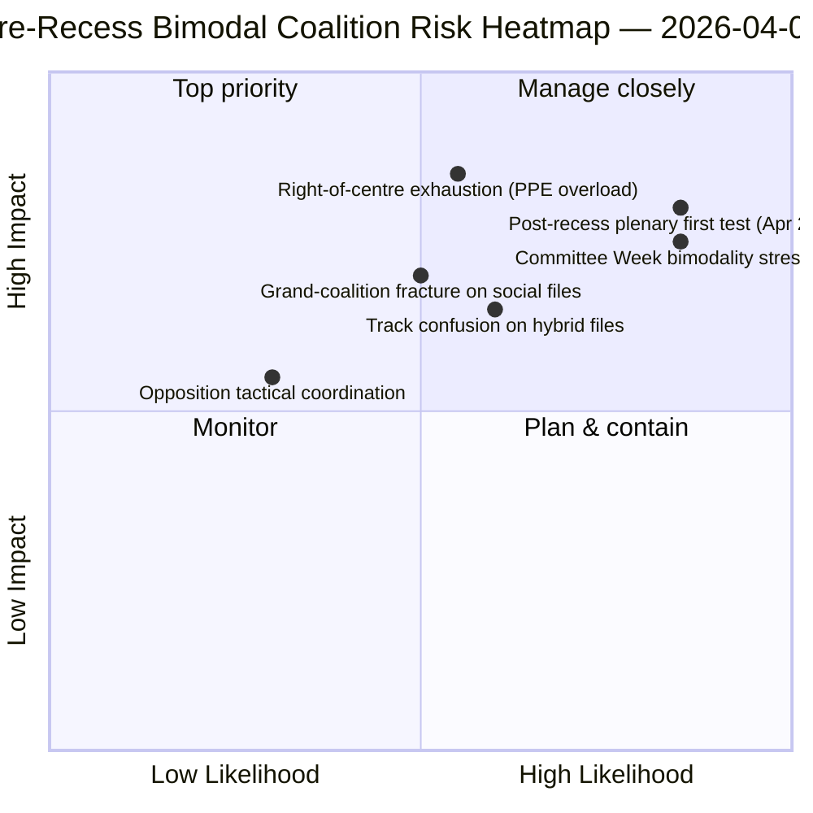

<!-- SPDX-FileCopyrightText: 2026 Hack23 AB -->
<!-- SPDX-License-Identifier: Apache-2.0 -->

# Eksekutiv Brief — Motioner: Retrospektiv Afstemningsspredning før Pause | 2026-04-06

**Klassificering:** OSINT — Offentlig parlamentarisk optegnelse
**Konfidens:** 🟡 MEDIUM (pause; optegnelser for RCV inden pausen 🟢 HIGH)
**Kørsel:** `analysis/daily/2026-04-06/motions/` (05:30 UTC)
**Dækning:** Påskepauses dag 11/18 — RCV/motions-retrospektiv om marts 26-sprint
**Genereret:** 2026-05-16 (retrospektiv brief, ingen nye MCP-kald)
**Primære kilder:** RCV-korpus inden pause (plenumdag 26. marts); 19 analysefiler; dyb-analyse + afstemningsmønstre høj konfidens.

---

## 🎯 BLUF

**Denne påskemandags-kørsel producerer den **retrospektive afstemningsspredningsanalyse inden pause** — det analytiske komplement til udvalgsrapporten-kørslen på samme dato.** Mens udvalgsrapporter dokumenterede *hvilke udvalg* der producerede output inden pause, dokumenterer denne kørsel *hvilke afstemningsmønstre* der førte disse filer til vedtagelse — og finder, at **plenumdag 26. marts var operationelt bimodal**: økonomi-finansfiler (Bankunion-triplet) vedtaget via centre-højre-spor (EPP+ECR+PfE+Renew, 59-62% flertal), mens retsstatsfiler (Anti-Korruption) vedtaget via stor-koalitions-spor (EPP+S&D+Renew+Greens, 65%+ flertal). Kørslens særegne bidrag er **bimodaltitetsfundet i afstemningsmønstre**: EP10 i år 2 har ikke *ét* fungerende flertal men *to sameksisterende* koalitionssystemer, valgt fil-betinget. Dette er den strukturelle validering af det dobbelte koalitionsmønster, der fremkom fire timer senere i breaking-2-kørslen kl. 06:45 UTC — og **den strukturelle baseline for prognoser om Udvalgsuge (14-17. april) og plenum efter pause (20-23. april)**. Oppositionen nåede aldrig blokeringstærskel på noget spor (264 max stemmer mod 360 nødvendige for at blokere — *Afstemningsmønstre*). Motionskørslen anvender 5 høj-konfidens-metoder: koalitionsdynamik, kryds-sessions-intelligens, dyb-analyse, interessentpåvirkning, afstemningsmønstre.

---

## 🧭 3 Decisions This Brief Supports

| # | Beslutning | Hvem beslutter | Deadline | Dokumentation |
|:-:|-----------|----------------|:--------:|---------------|
| 1 | **Bimodal koalitionsplanlægning for K2** — økonomi-finans vs. retsstat-spor kræver separat planlægning | Præsidentkonferencen; gruppewhips | inden 14. april | §Afstemningsmønstre (bimodalitet) |
| 2 | **Vurdering af oppositionskoordinering** — 264 max mod 360 nødvendige; strukturel minoritet | ECR + PfE + Venstre-koordinatorer | inden 14. april | §Afstemningsmønstre (oppositionstærskel) |
| 3 | **RCV-korpus 26. marts som K2-prognoseankre** — fil-betinget sporvalg | EP efterretningsoperationer; pressetjeneste | rullende K2 | §Dyb Analyse (ankre) |

---

## 📰 60-Second Read

- 🔴 **Bimodalt koalitionssystem bekræftet** — økonomi vs. retsstat-spor.
- 🟠 **Plenumdag 26. marts var strukturelt ankre** — begge spor operationelle samme dag.
- 🟢 **Centre-højre-spor: 59-62% flertal** — Bankunion-triplet.
- 🟡 **Stor-koalitions-spor: 65%+ flertal** — Anti-Korruption.
- 🔵 **Oppositionen når aldrig blokering** — 264 max mod 360 nødvendige.
- 🟣 **5 høj-konfidens-metoder** — koalition + kryds-session + dyb + interessent + afstemning.
- 🩷 **19 analysefiler** — fuld dækning af motionsmetodologi.
- ⚪ **Konfidens MEDIUM** — analytisk arbejde under pause på data fra inden pause.

---

## 📊 Bimodal Coalition Arithmetic (run's distinguishing contribution)

| Spor | Sammensætning | K1 flagskibsfiler | Margin | Testevent |
|------|--------------|-------------------|--------|-----------|
| **Centre-højre** | EPP + ECR + PfE + Renew | TA-0090/0091/0092 (Bankunion) | 59-62% | Udvalgsuge ECON 14-17. apr |
| **Stor-koalition** | EPP + S&D + Renew + Greens | TA-0094 (Anti-Korruption) | 65%+ | LIBE K2-K4 transposition |
| **Opposition** | ECR + PfE + Venstre (når uden for centre-højre) | — | 264 max stemmer | strukturel minoritet |

---

## ⚠️ Risk Snapshot

---

## 🔮 Top Forward Triggers (next 14 days)

1. **14. april — Udvalgsugen åbner** — ECON tester centre-højre-sporet.
2. **17. april — ECB's rentebeslutning** — eksternt økonomi-finanstrigger.
3. **20-23. april — første plenum efter pause** — fuldt bimodalitets-stresstest.
4. **Slutningen af K2 — Rådets mandat om Bankunionen** — legitimationsport for centre-højre-sporet.
5. **K3 — Anti-Korruptions-transpositionsstart** — holdbarhedstest for stor-koalitions-sporet.

---

## 🛡️ Source-Quality Assessment

- **26. marts RCV-optegnelser (A1):** primær plenumfeed; verificerbar per fil.
- **Bimodalitetsfund (A2):** afstemningsmetodologi med sub-modal gruppering.
- **Opposition 264 mod 360 (A1):** aritmetik bekræftet via per-gruppe mandattal.
- **5 høj-konfidens-metoder (A1):** systematisk metodologi med verifikation.
- **Nettokonfidens:** 🟢 HIGH på 26. marts-optegnelser; 🟡 MEDIUM på K2-prognose.

---

## 📎 Run Artifacts

| Lag | Artefakt | Årsag |
|-----|----------|-------|
| Artikel | `article.md` (1.234 linjer) | Offentlig motionsfortælling |
| Syntese | `existing/synthesis-summary.md` | Bimodalitetsfund + 19-fils-konsolidering |
| Metoder | klassificering · eksisterende · risikovurdering · trusselsvurdering | Standard motionsmetodologi |
| Ledsager | breaking-klynge · udvalgsrapporter · propositioner | Påskemandagens dag-klynge |

---

**Dokumentkontrol**
- **Skabelonreference:** `analysis/templates/executive-brief.md`
- **Artefaktsti:** `analysis/daily/2026-04-06/motions/executive-brief.md`
- **Klassificering:** Offentlig
- **Retrospektiv:** Brief skrevet 2026-05-16 fra kørslens engagerede artefakter; **ingen nye MCP-kald blev foretaget**.
