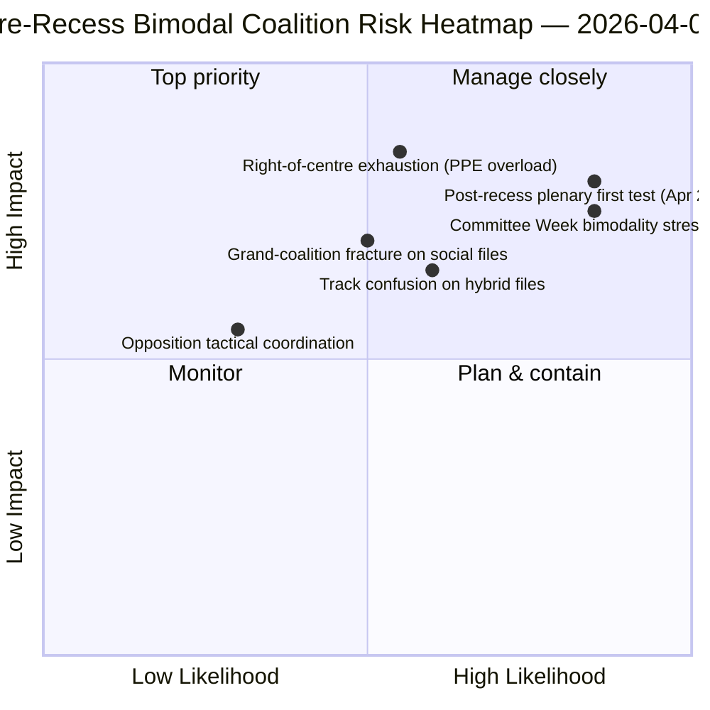

<!-- SPDX-FileCopyrightText: 2026 Hack23 AB -->
<!-- SPDX-License-Identifier: Apache-2.0 -->

# Exekutivbericht — Motionen: Retrospektive Abstimmungsverteilung vor der Pause | 2026-04-06

**Einstufung:** OSINT — Öffentliche parlamentarische Unterlagen
**Konfidenzstufe:** 🟡 MEDIUM (Pause; RCV-Unterlagen vor der Pause 🟢 HIGH)
**Lauf:** `analysis/daily/2026-04-06/motions/` (05:30 UTC)
**Abdeckung:** Osterpauses Tag 11/18 — RCV/Motions-Retrospektive zum Sprint vom 26. März
**Erstellt:** 2026-05-16 (retrospektiver Bericht, keine neuen MCP-Aufrufe)
**Primäre Quellen:** RCV-Korpus vor der Pause (Plenarsitzungstag 26. März); 19 Analysedateien; Tiefenanalyse + Abstimmungsmuster mit hoher Konfidenz.

---

## 🎯 BLUF

**Dieser Ostermontags-Lauf produziert die **retrospektive Abstimmungsverteilungsanalyse vor der Pause** — das analytische Komplement zum Ausschussbericht-Lauf vom selben Datum.** Während Ausschussberichte dokumentierten, *welche Ausschüsse* die Vorpausen-Ergebnisse produziert haben, dokumentiert dieser Lauf, *welche Abstimmungsmuster* diese Dateien zur Annahme geführt haben — und stellt fest, dass **der Plenarsitzungstag 26. März operativ bimodal war**: Wirtschafts-Finanzdateien (Bankenunion-Tripel) über Mitte-Rechts-Spuren angenommen (EVP+EKR+PfE+Renew, 59–62 % Mehrheiten), während Rechtsstaatsdateien (Antikorruption) über Große-Koalitions-Spuren angenommen wurden (EVP+S&D+Renew+Greens, 65 %+ Mehrheiten). Der besondere Beitrag dieses Laufs ist der **Bimodalitätsbefund bei Abstimmungsmustern**: Das EP10 im zweiten Jahr hat nicht *eine* funktionierende Mehrheit, sondern *zwei koexistierende* Koalitionssysteme, die dateibedingt ausgewählt werden. Dies ist die strukturelle Validierung des Doppelspurkoalitionsmusters, das vier Stunden später im Breaking-2-Lauf um 06:45 UTC aufgetaucht ist — und die **strukturelle Basislinie für Prognosen zur Ausschusswoche (14.–17. April) und zum Plenum nach der Pause (20.–23. April)**. Die Opposition erreichte auf keiner Spur die Blockierungsschwelle (264 maximale Stimmen gegenüber 360 benötigten zur Blockierung — *Abstimmungsmuster*). Der Motionslauf verwendet 5 Hochkonfidenz-Methoden: Koalitionsdynamik, Kross-Sitzungs-Aufklärung, Tiefenanalyse, Interessentenwirkung, Abstimmungsmuster.

---

## 🧭 3 Decisions This Brief Supports

| # | Entscheidung | Wer entscheidet | Frist | Belege |
|:-:|-------------|----------------|:-----:|--------|
| 1 | **Bimodale Koalitionsplanung für Q2** — Wirtschaft-Finanz vs. Rechtsstaat-Spuren benötigen separate Zeitplanung | Konferenz der Vorsitzenden; Fraktionswhips | bis 14. April | §Abstimmungsmuster (Bimodalität) |
| 2 | **Bewertung der Oppositionskoordinierung** — 264 max. gegenüber 360 benötigten; strukturelle Minderheit | EKR + PfE + Linke-Koordinatoren | bis 14. April | §Abstimmungsmuster (Oppositionsschwelle) |
| 3 | **RCV-Korpus 26. März als Q2-Prognose-Anker** — dateibedingte Spurauswahl | EP-Geheimdienstoperationen; Pressedienst | rollierendes Q2 | §Tiefenanalyse (Anker) |

---

## 📰 60-Second Read

- 🔴 **Bimodales Koalitionssystem bestätigt** — Wirtschaft vs. Rechtsstaat-Spuren.
- 🟠 **Plenarsitzungstag 26. März war struktureller Anker** — beide Spuren am selben Tag in Betrieb.
- 🟢 **Mitte-Rechts-Spur: 59–62 % Mehrheiten** — Bankenunion-Tripel.
- 🟡 **Große-Koalitions-Spur: 65 %+ Mehrheiten** — Antikorruption.
- 🔵 **Opposition erreicht nie Blockierung** — 264 max. vs. 360 benötigte.
- 🟣 **5 Hochkonfidenz-Methoden** — Koalition + Kross-Sitzung + Tiefe + Interessenten + Abstimmung.
- 🩷 **19 Analysedateien** — vollständige Motionsmethodologie-Abdeckung.
- ⚪ **Konfidenz MEDIUM** — analytische Arbeit in der Pause mit Daten von vor der Pause.

---

## 📊 Bimodal Coalition Arithmetic (run's distinguishing contribution)

| Spur | Zusammensetzung | Q1-Flaggschiff-Dateien | Marge | Testereignis |
|------|----------------|----------------------|-------|--------------|
| **Mitte-Rechts** | EVP + EKR + PfE + Renew | TA-0090/0091/0092 (Bankenunion) | 59–62 % | Ausschusswoche ECON 14.–17. Apr |
| **Große Koalition** | EVP + S&D + Renew + Greens | TA-0094 (Antikorruption) | 65 %+ | LIBE Q2–Q4 Transposition |
| **Opposition** | EKR + PfE + Linke (wenn außerhalb Mitte-Rechts) | — | 264 max. Stimmen | strukturelle Minderheit |

---

## ⚠️ Risk Snapshot

---

## 🔮 Top Forward Triggers (next 14 days)

1. **14. April — Ausschusswoche beginnt** — ECON testet Mitte-Rechts-Spur.
2. **17. April — EZB-Zinsentscheidung** — externer Wirtschafts-Finanz-Auslöser.
3. **20.–23. April — erstes Plenum nach der Pause** — vollständiger Bimodalitäts-Stresstest.
4. **Ende Q2 — Ratsmandat zur Bankenunion** — Legitimitätstor für die Mitte-Rechts-Spur.
5. **Q3 — Antikorruptions-Transpositions-Kickoff** — Dauerhaftigkeitstest für die Große-Koalitions-Spur.

---

## 🛡️ Source-Quality Assessment

- **RCV-Unterlagen 26. März (A1):** primärer Plenarfeed; dateiweise überprüfbar.
- **Bimodalitätsbefund (A2):** Abstimmungsmethodik mit sub-modaler Gruppierung.
- **Opposition 264 vs. 360 (A1):** Arithmetik bestätigt via gruppenweise Sitzzahlen.
- **5 Hochkonfidenz-Methoden (A1):** systematische Methodik mit Verifikation.
- **Nettokonfidenz:** 🟢 HIGH bei den Unterlagen vom 26. März; 🟡 MEDIUM bei Q2-Prognose.

---

## 📎 Run Artifacts

| Schicht | Artefakt | Warum |
|---------|----------|-------|
| Artikel | `article.md` (1.234 Zeilen) | Öffentliche Motionserzählung |
| Synthese | `existing/synthesis-summary.md` | Bimodalitätsbefund + 19-Datei-Konsolidierung |
| Methoden | Klassifizierung · bestehend · Risikobewertung · Bedrohungsbeurteilung | Standard-Motionsmethodik |
| Begleitend | Breaking-Cluster · Ausschussberichte · Propositionen | Ostermontags-Tagescluster |

---

**Dokumentenkontrolle**
- **Vorlagenreferenz:** `analysis/templates/executive-brief.md`
- **Artefaktpfad:** `analysis/daily/2026-04-06/motions/executive-brief.md`
- **Einstufung:** Öffentlich
- **Retrospektiv:** Bericht am 2026-05-16 aus den festgeschriebenen Artefakten des Laufs erstellt; **keine neuen MCP-Aufrufe wurden gemacht**.
