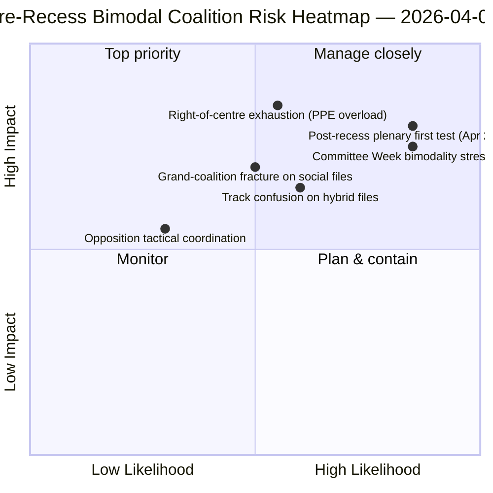

<!-- SPDX-FileCopyrightText: 2026 Hack23 AB -->
<!-- SPDX-License-Identifier: Apache-2.0 -->

# Resumen Ejecutivo — Mociones: Retrospectiva de la Dispersión de Votos antes del Receso | 2026-04-06

**Clasificación:** OSINT — Registro parlamentario público
**Nivel de confianza:** 🟡 MEDIO (receso; registros RCV antes del receso 🟢 ALTO)
**Ejecución:** `analysis/daily/2026-04-06/motions/` (05:30 UTC)
**Cobertura:** Día 11/18 del receso de Pascua — retrospectiva RCV/mociones del sprint del 26 de marzo
**Generado:** 2026-05-16 (informe retrospectivo, sin nuevas llamadas MCP)
**Fuentes primarias:** Corpus RCV antes del receso (día de sesión plenaria del 26 de marzo); 19 archivos de análisis; análisis profundo + patrones de votación, alta confianza.

---

## 🎯 BLUF

**Esta ejecución del Lunes de Pascua produce la **retrospectiva de dispersión de votos RCV antes del receso** — el complemento analítico a la ejecución de informes de comités de la misma fecha.** Mientras que los informes de comités documentaban *qué comités* produjeron los resultados antes del receso, esta ejecución documenta *qué patrones de votación* llevaron esos archivos a la adopción — y descubre que **el día de sesión plenaria del 26 de marzo fue operativamente bimodal**: archivos económico-financieros (triplete Unión Bancaria) adoptados por vías de centro-derecha (PPE+ECR+PfE+Renew, mayorías del 59-62 %), mientras que los archivos del Estado de Derecho (anticorrupción) fueron adoptados por vías de gran coalición (PPE+S&D+Renew+Verdes, mayorías del 65 %+). La contribución distintiva de esta ejecución es el **hallazgo de bimodalidad en los patrones de votación**: el PE10 en el Año 2 no tiene *una* mayoría funcional sino *dos sistemas de coalición coexistentes*, seleccionados de forma condicional según los archivos. Esta es la validación estructural del patrón de coalición de doble vía que surgió cuatro horas después en la ejecución breaking-2 a las 06:45 UTC — y la **base estructural para las previsiones de la Semana de Comités (14-17 de abril) y la sesión plenaria posterior al receso (20-23 de abril)**. La oposición nunca alcanzó el umbral de bloqueo en ninguna de las vías (264 votos máximos frente a 360 necesarios para bloquear — *Patrones de votación*). La ejecución de mociones utiliza 5 métodos de alta confianza: dinámica de coaliciones, inteligencia entre sesiones, análisis profundo, impacto en las partes interesadas, patrones de votación.

---

## 🧭 3 Decisions This Brief Supports

| # | Decisión | Quién decide | Plazo | Evidencia |
|:-:|---------|-------------|:-----:|-----------|
| 1 | **Planificación de coalición bimodal para el T2** — las vías económico-financieras vs. Estado de Derecho requieren programación separada | Conferencia de Presidentes; whips de grupos | antes del 14 de abril | §Patrones de votación (bimodalidad) |
| 2 | **Evaluación de la coordinación de la oposición** — 264 máx. frente a 360 necesarios; minoría estructural | ECR + PfE + coordinadores de Izquierda | antes del 14 de abril | §Patrones de votación (umbral de oposición) |
| 3 | **Corpus RCV del 26 de marzo como ancla de pronóstico T2** — selección condicional de vía según archivos | Operaciones de inteligencia del PE; servicio de prensa | T2 continuado | §Análisis profundo (ancla) |

---

## 📰 60-Second Read

- 🔴 **Sistema de coalición bimodal confirmado** — vías económica vs. Estado de Derecho.
- 🟠 **La sesión plenaria del 26 de marzo fue el ancla estructural** — ambas vías operativas el mismo día.
- 🟢 **Vía de centro-derecha: mayorías del 59-62 %** — triplete Unión Bancaria.
- 🟡 **Vía de gran coalición: mayorías del 65 %+** — Anticorrupción.
- 🔵 **La oposición nunca alcanza el bloqueo** — 264 máx. frente a 360 necesarios.
- 🟣 **5 métodos de alta confianza** — coalición + entre sesiones + profundo + partes interesadas + votación.
- 🩷 **19 archivos de análisis** — cobertura completa de la metodología de mociones.
- ⚪ **Confianza MEDIA** — trabajo analítico durante el receso sobre datos previos al receso.

---

## 📊 Bimodal Coalition Arithmetic (run's distinguishing contribution)

| Vía | Composición | Archivos insignia T1 | Margen | Evento de prueba |
|-----|------------|---------------------|-------|-----------------|
| **Centro-derecha** | PPE + ECR + PfE + Renew | TA-0090/0091/0092 (Unión Bancaria) | 59-62 % | Semana de Comités ECON 14-17 abr. |
| **Gran coalición** | PPE + S&D + Renew + Verdes | TA-0094 (Anticorrupción) | 65 %+ | LIBE T2-T4 transposición |
| **Oposición** | ECR + PfE + Izquierda (fuera de centro-derecha) | — | 264 votos máx. | minoría estructural |

---

## ⚠️ Risk Snapshot

---

## 🔮 Top Forward Triggers (next 14 days)

1. **14 de abril — Se abre la Semana de Comités** — ECON prueba la vía de centro-derecha.
2. **17 de abril — Decisión de tipos del BCE** — factor desencadenante externo económico-financiero.
3. **20-23 de abril — primera sesión plenaria post-receso** — prueba de estrés de bimodalidad completa.
4. **Fin del T2 — Mandato del Consejo sobre la Unión Bancaria** — puerta de legitimidad de la vía de centro-derecha.
5. **T3 — Inicio de la transposición anticorrupción** — prueba de durabilidad de la vía de gran coalición.

---

## 🛡️ Source-Quality Assessment

- **Registros RCV del 26 de marzo (A1):** canal plenario primario; verificable por archivo.
- **Hallazgo de bimodalidad (A2):** metodología de patrones de votación con agrupación sub-modal.
- **Oposición 264 frente a 360 (A1):** aritmética confirmada mediante totales de escaños por grupo.
- **5 métodos de alta confianza (A1):** metodología sistemática con verificación.
- **Confianza neta:** 🟢 ALTA en los registros del 26 de marzo; 🟡 MEDIA en el pronóstico T2.

---

## 📎 Run Artifacts

| Capa | Artefacto | Por qué |
|------|----------|---------|
| Artículo | `article.md` (1.234 líneas) | Narrativa pública de mociones |
| Síntesis | `existing/synthesis-summary.md` | Hallazgo de bimodalidad + consolidación de 19 archivos |
| Métodos | clasificación · existente · puntuación de riesgos · evaluación de amenazas | Metodología estándar de mociones |
| Compañero | cluster de breaking · informes de comités · proposiciones | Cluster del día Lunes de Pascua |

---

**Control documental**
- **Referencia de plantilla:** `analysis/templates/executive-brief.md`
- **Ruta del artefacto:** `analysis/daily/2026-04-06/motions/executive-brief.md`
- **Clasificación:** Público
- **Retrospectivo:** Informe redactado el 2026-05-16 a partir de los artefactos comprometidos de la ejecución; **no se realizaron nuevas llamadas MCP**.
