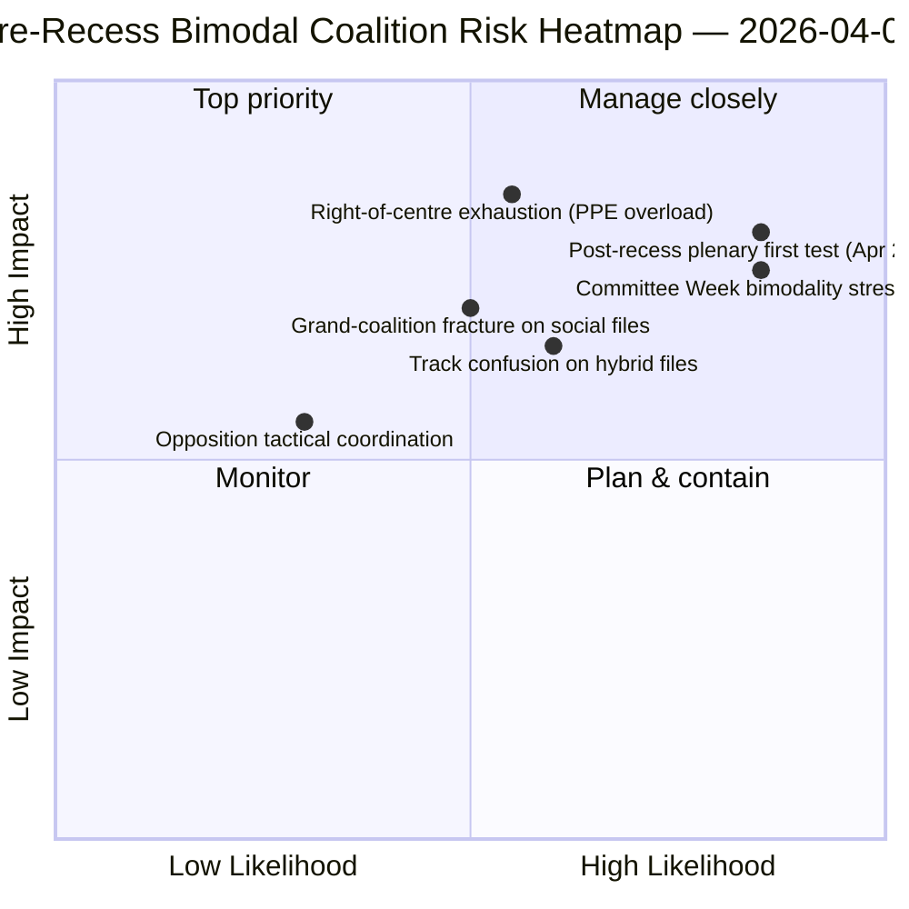

<!-- SPDX-FileCopyrightText: 2026 Hack23 AB -->
<!-- SPDX-License-Identifier: Apache-2.0 -->

# Johtokunnan tiedote — Mietinnöt: Takautuva äänestysjakautuminen ennen taukoa | 2026-04-06

**Luokittelu:** OSINT — Julkinen parlamentaarinen asiakirja
**Varmuustaso:** 🟡 MEDIUM (tauko; RCV-asiakirjat ennen taukoa 🟢 HIGH)
**Ajo:** `analysis/daily/2026-04-06/motions/` (05:30 UTC)
**Kattavuus:** Pääsiäistauon päivä 11/18 — RCV/mietintöjen retrospektiivi maaliskuun 26 -sprintistä
**Luotu:** 2026-05-16 (takautuva tiedote, ei uusia MCP-kutsuja)
**Ensisijaiset lähteet:** RCV-korpus ennen taukoa (täysistuntopäivä 26. maaliskuuta); 19 analyysitiedostoa; syväanalyysi + äänestysmallit korkea varmuus.

---

## 🎯 BLUF

**Tämä pääsiäismaanantain mietintöajo tuottaa **takautuvan äänestysjakautumisanalyysin ennen taukoa** — analyyttisen täydennyksen samana päivänä tehdylle valiokuntaraportti-ajolle.** Valiokuntaraportit dokumentoivat *mitkä valiokunnat* tuottivat tuloksia ennen taukoa; tämä ajo dokumentoi *mitkä äänestysmallit* veivät nämä tiedostot hyväksyntään — ja havaitsee, että **täysistuntopäivä 26. maaliskuuta oli operatiivisesti bimodaalinen**: talous-rahoitustiedostot (Pankkiunioni-kolmikko) hyväksyttiin oikeistokeskusta-raitaa pitkin (EPP+ECR+PfE+Renew, 59–62 % enemmistöllä), kun taas oikeusvaltioon liittyvät tiedostot (korruption vastainen) hyväksyttiin suurkoalitioraitaa pitkin (EPP+S&D+Renew+Greens, yli 65 % enemmistöllä). Ajon erottuva panos on **äänestysmallien bimodaalisuushavainto**: EP10:llä ei vuonna 2 ole *yhtä* toimivaa enemmistöä vaan *kaksi rinnakkain toimivaa* koalitiorakennetta, jotka valitaan tiedostokohtaisesti. Tämä on rakenteellinen vahvistus kaksoiskoalitiorakenteesta, joka nousi esiin neljä tuntia myöhemmin breaking-2-ajossa klo 06:45 UTC — ja **rakenteellinen lähtötaso Valiokuntojen viikon (14.–17. huhtikuuta) ja taukoa seuraavan täysistunnon (20.–23. huhtikuuta) ennusteille**. Oppositio ei saavuttanut estämiskynnystä millään raiteella (264 ääntä enintään, 360 tarvittiin estämiseen — *Äänestysmallit*). Mietintöajo käyttää 5 korkean varmuuden menetelmää: koalitiodynamiikka, ristiinistunto-älytiedustelu, syväanalyysi, sidosryhmävaikutus, äänestysmallit.

---

## 🧭 3 Decisions This Brief Supports

| # | Päätös | Kuka päättää | Määräaika | Näyttö |
|:-:|--------|-------------|:---------:|--------|
| 1 | **Bimodaalinen koalitiosuunnittelu Q2:lle** — talous-rahoitus vs. oikeusvaltioraita tarvitsee erillisen aikataulutuksen | Puheenjohtajien konferenssi; ryhmäwhipit | 14. huhtikuuta mennessä | §Äänestysmallit (bimodaalisuus) |
| 2 | **Opposition koordinoinnin arviointi** — 264 enintään vs. 360 tarvittavia; rakenteellinen vähemmistö | ECR + PfE + Vasemmisto-koordinaattorit | 14. huhtikuuta mennessä | §Äänestysmallit (oppositionkynnys) |
| 3 | **26. maaliskuun RCV-korpus Q2-ennusteankkurina** — tiedostokohtainen raitavalinta | EP-tiedusteluoperaatiot; tiedotuspalvelu | liukuva Q2 | §Syväanalyysi (ankkuri) |

---

## 📰 60-Second Read

- 🔴 **Bimodaalinen koalitiojärjestelmä vahvistettu** — talous vs. oikeusvaltioraita.
- 🟠 **Täysistuntopäivä 26. maaliskuuta oli rakenteellinen ankkuri** — molemmat raiteet toiminnassa samana päivänä.
- 🟢 **Oikeistokeskusta-raita: 59–62 % enemmistö** — Pankkiunioni-kolmikko.
- 🟡 **Suurkoalitioraita: yli 65 % enemmistö** — Korruption vastainen.
- 🔵 **Oppositio ei koskaan saavuta estämistä** — 264 enintään vs. 360 tarvittavia.
- 🟣 **5 korkean varmuuden menetelmää** — koalitio + ristiinistunto + syvä + sidosryhmä + äänestys.
- 🩷 **19 analyysitiedostoa** — täydellinen mietintömenetelmäkattavuus.
- ⚪ **Varmuustaso MEDIUM** — analyyttinen työ tauon aikana ennen taukoa kerätyllä datalla.

---

## 📊 Bimodal Coalition Arithmetic (run's distinguishing contribution)

| Raita | Kokoonpano | Q1-lippulaivat | Marginaali | Testipäätapahtuma |
|-------|-----------|----------------|:----------:|-------------------|
| **Oikeistokeskusta** | EPP + ECR + PfE + Renew | TA-0090/0091/0092 (Pankkiunioni) | 59–62 % | Valiokuntojen viikko ECON 14.–17.4. |
| **Suurkoalitio** | EPP + S&D + Renew + Greens | TA-0094 (Korruption vastainen) | yli 65 % | LIBE Q2–Q4 transponointi |
| **Oppositio** | ECR + PfE + Vasemmisto (oikeistokeskustan ulkopuolella) | — | 264 enint. ääntä | rakenteellinen vähemmistö |

---

## ⚠️ Risk Snapshot

---

## 🔮 Top Forward Triggers (next 14 days)

1. **14. huhtikuuta — Valiokuntojen viikko avautuu** — ECON testaa oikeistokeskusta-raitaa.
2. **17. huhtikuuta — EKP:n korkoratkaisu** — ulkoinen talous-rahoituslaukaisin.
3. **20.–23. huhtikuuta — ensimmäinen täysistunto tauon jälkeen** — täydellinen bimodaalisuusstressitesti.
4. **Q2:n loppu — Neuvoston Pankkiunioni-mandaatti** — oikeistokeskusta-raidan legitimiteettiportti.
5. **Q3 — Korruption vastaisen transponeinnin käynnistys** — suurkoalitioraidan kestävyystesti.

---

## 🛡️ Source-Quality Assessment

- **26. maaliskuun RCV-asiakirjat (A1):** ensisijainen täysistuntofeed; tiedostokohtaisesti todennettavissa.
- **Bimodaalisuushavainto (A2):** äänestysmenetelmä alimodaalisella ryhmittelyllä.
- **Oppositio 264 vs. 360 (A1):** aritmetiikka vahvistettu ryhmäkohtaisilla paikkaluvuilla.
- **5 korkean varmuuden menetelmää (A1):** systemaattinen menetelmä verifioinnilla.
- **Nettovarmuus:** 🟢 HIGH 26. maaliskuun asiakirjoilla; 🟡 MEDIUM Q2-ennusteella.

---

## 📎 Run Artifacts

| Kerros | Artefakti | Miksi |
|--------|----------|-------|
| Artikkeli | `article.md` (1 234 riviä) | Julkinen mietintökertomus |
| Synteesi | `existing/synthesis-summary.md` | Bimodaalisuushavainto + 19 tiedoston konsolidointi |
| Menetelmät | luokittelu · olemassa oleva · riskipisteytys · uhka-arviointi | Vakio mietintömenetelmä |
| Lisäasiakirja | breaking-klusteri · valiokuntaraportit · ehdotukset | Pääsiäismaanantain päiväklusteri |

---

**Asiakirjahallinta**
- **Malliviite:** `analysis/templates/executive-brief.md`
- **Artefaktipolku:** `analysis/daily/2026-04-06/motions/executive-brief.md`
- **Luokittelu:** Julkinen
- **Takautuva:** Tiedote kirjoitettu 2026-05-16 ajon tallennetuista artefakteista; **uusia MCP-kutsuja ei tehty**.
