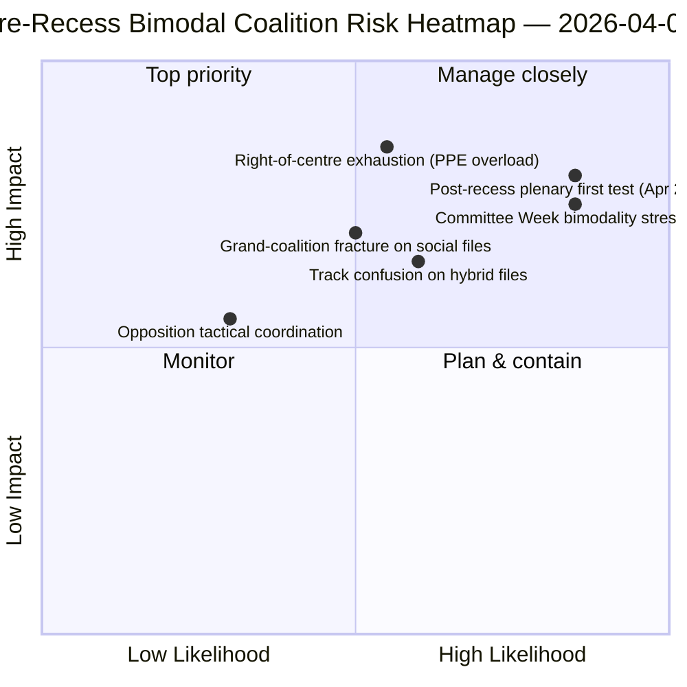

<!-- SPDX-FileCopyrightText: 2026 Hack23 AB -->
<!-- SPDX-License-Identifier: Apache-2.0 -->

# Note de synthèse — Motions : Rétrospective de la dispersion des votes avant la pause | 2026-04-06

**Classification :** OSINT — Archives parlementaires publiques
**Niveau de confiance :** 🟡 MOYEN (pause ; enregistrements RCV avant la pause 🟢 ÉLEVÉ)
**Exécution :** `analysis/daily/2026-04-06/motions/` (05:30 UTC)
**Couverture :** Jour 11/18 de la pause de Pâques — rétrospective RCV/motions sur le sprint du 26 mars
**Générée :** 2026-05-16 (note rétrospective, aucun nouvel appel MCP)
**Sources primaires :** Corpus RCV avant la pause (jour de séance plénière du 26 mars) ; 19 fichiers d'analyse ; analyse approfondie + modèles de vote, haute confiance.

---

## 🎯 BLUF

**Cette exécution du lundi de Pâques produit la **rétrospective de la dispersion des votes RCV avant la pause** — le complément analytique à l'exécution des rapports de commissions à la même date.** Tandis que les rapports de commissions documentaient *quelles commissions* ont produit les résultats avant la pause, cette exécution documente *quels modèles de vote* ont porté ces dossiers à l'adoption — et constate que **la journée plénière du 26 mars était opérationnellement bimodale** : les dossiers économico-financiers (trilogie Union bancaire) adoptés via les pistes de centre-droit (PPE+ECR+PfE+Renew, majorités de 59-62 %), tandis que les dossiers sur l'état de droit (anti-corruption) adoptés via les pistes de grande coalition (PPE+S&D+Renew+Verts, majorités de 65 %+). La contribution distinctive de cette exécution est la **constatation de bimodalité des modèles de vote** : le PE10 en année 2 n'a pas *une* majorité de travail mais *deux systèmes de coalition coexistants*, sélectionnés conditionnellement selon les dossiers. Il s'agit de la validation structurelle du schéma de coalition à double piste apparu quatre heures plus tard dans l'exécution breaking-2 à 06:45 UTC — et la **base structurelle pour les prévisions de la Semaine des commissions (14-17 avril) et de la plénière post-pause (20-23 avril)**. L'opposition n'a jamais atteint le seuil de blocage sur l'une ou l'autre piste (264 votes maximum contre 360 nécessaires pour bloquer — *Modèles de vote*). L'exécution des motions utilise 5 méthodes à haute confiance : dynamique des coalitions, renseignement inter-sessions, analyse approfondie, impact sur les parties prenantes, modèles de vote.

---

## 🧭 3 Decisions This Brief Supports

| # | Décision | Qui décide | Échéance | Preuves |
|:-:|---------|-----------|:--------:|---------|
| 1 | **Planification de coalition bimodale pour le T2** — les pistes économico-financières vs. état de droit nécessitent une programmation distincte | Conférence des présidents ; whips des groupes | avant le 14 avril | §Modèles de vote (bimodalité) |
| 2 | **Évaluation de la coordination de l'opposition** — 264 max. contre 360 nécessaires ; minorité structurelle | ECR + PfE + coordinateurs de Gauche | avant le 14 avril | §Modèles de vote (seuil d'opposition) |
| 3 | **Corpus RCV du 26 mars comme ancre de prévision T2** — sélection conditionnelle de piste selon les dossiers | Opérations de renseignement du PE ; service de presse | T2 glissant | §Analyse approfondie (ancre) |

---

## 📰 60-Second Read

- 🔴 **Système de coalition bimodal confirmé** — pistes économiques vs. état de droit.
- 🟠 **La séance plénière du 26 mars était l'ancre structurelle** — les deux pistes opérationnelles le même jour.
- 🟢 **Piste de centre-droit : majorités de 59-62 %** — trilogie Union bancaire.
- 🟡 **Piste de grande coalition : majorités de 65 %+** — Anti-corruption.
- 🔵 **L'opposition n'atteint jamais le blocage** — 264 max. contre 360 nécessaires.
- 🟣 **5 méthodes à haute confiance** — coalition + inter-session + approfondie + parties prenantes + vote.
- 🩷 **19 fichiers d'analyse** — couverture complète de la méthodologie des motions.
- ⚪ **Confiance MOYENNE** — travail analytique pendant la pause sur des données d'avant la pause.

---

## 📊 Bimodal Coalition Arithmetic (run's distinguishing contribution)

| Piste | Composition | Dossiers phares T1 | Marge | Événement test |
|-------|------------|-------------------|-------|----------------|
| **Centre-droit** | PPE + ECR + PfE + Renew | TA-0090/0091/0092 (Union bancaire) | 59-62 % | Semaine des commissions ECON 14-17 avr. |
| **Grande coalition** | PPE + S&D + Renew + Verts | TA-0094 (Anti-corruption) | 65 %+ | LIBE T2-T4 transposition |
| **Opposition** | ECR + PfE + Gauche (hors centre-droit) | — | 264 votes max. | minorité structurelle |

---

## ⚠️ Risk Snapshot

---

## 🔮 Top Forward Triggers (next 14 days)

1. **14 avril — Semaine des commissions s'ouvre** — ECON teste la piste de centre-droit.
2. **17 avril — Décision de taux de la BCE** — déclencheur externe économico-financier.
3. **20-23 avril — première plénière post-pause** — test de stress bimodalité complet.
4. **Fin T2 — Mandat du Conseil sur l'Union bancaire** — porte de légitimité de la piste de centre-droit.
5. **T3 — Lancement de la transposition anti-corruption** — test de durabilité de la piste de grande coalition.

---

## 🛡️ Source-Quality Assessment

- **Enregistrements RCV du 26 mars (A1) :** flux plénier primaire ; vérifiable par dossier.
- **Constatation de bimodalité (A2) :** méthodologie des modèles de vote avec regroupement sub-modal.
- **Opposition 264 contre 360 (A1) :** arithmétique confirmée via les totaux de sièges par groupe.
- **5 méthodes à haute confiance (A1) :** méthodologie systématique avec vérification.
- **Confiance nette :** 🟢 ÉLEVÉ sur les enregistrements du 26 mars ; 🟡 MOYEN sur la prévision T2.

---

## 📎 Run Artifacts

| Couche | Artefact | Pourquoi |
|--------|----------|----------|
| Article | `article.md` (1 234 lignes) | Récit public des motions |
| Synthèse | `existing/synthesis-summary.md` | Constatation de bimodalité + consolidation de 19 fichiers |
| Méthodes | classification · existant · évaluation des risques · évaluation des menaces | Méthodologie standard des motions |
| Compagnon | cluster breaking · rapports de commissions · propositions | Cluster du jour du lundi de Pâques |

---

**Contrôle documentaire**
- **Référence du modèle :** `analysis/templates/executive-brief.md`
- **Chemin de l'artefact :** `analysis/daily/2026-04-06/motions/executive-brief.md`
- **Classification :** Public
- **Rétrospectif :** Note rédigée le 2026-05-16 à partir des artefacts validés de l'exécution ; **aucun nouvel appel MCP n'a été effectué**.
