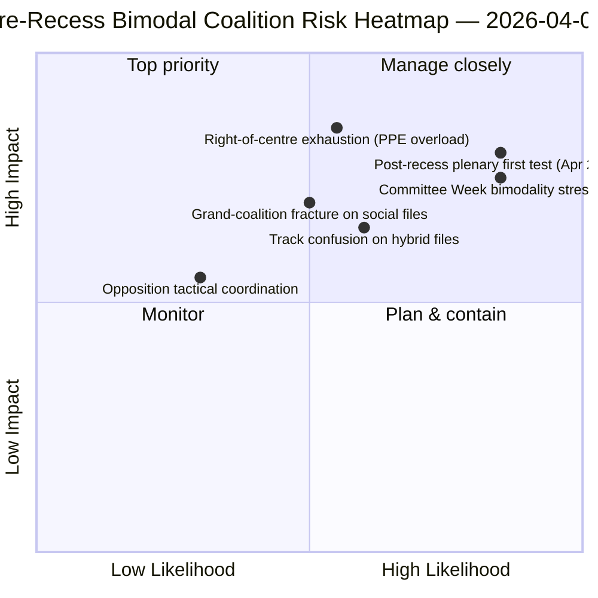

<!-- SPDX-FileCopyrightText: 2026 Hack23 AB -->
<!-- SPDX-License-Identifier: Apache-2.0 -->

# סיכום מנהלים — הצעות: סקירה רטרוספקטיבית של פיזור ההצבעות לפני ההפסקה | 2026-04-06

**סיווג:** OSINT — רשומה פרלמנטרית ציבורית
**רמת ביטחון:** 🟡 בינוני (הפסקה; רשומות RCV לפני ההפסקה 🟢 גבוה)
**ריצה:** `analysis/daily/2026-04-06/motions/` (05:30 UTC)
**כיסוי:** יום 11/18 של חופשת פסחא — סקירה רטרוספקטיבית של RCV/הצעות על ספרינט 26 במרץ
**נוצר:** 2026-05-16 (ברייפינג רטרוספקטיבי, ללא קריאות MCP חדשות)
**מקורות עיקריים:** אוסף RCV לפני ההפסקה (יום מושב מליאה 26 במרץ); 19 קבצי ניתוח; ניתוח מעמיק + דפוסי הצבעה, ביטחון גבוה.

---

## 🎯 BLUF

**ריצת יום שני של פסחא מייצרת את **הסקירה הרטרוספקטיבית של פיזור הצבעות RCV לפני ההפסקה** — ההשלמה האנליטית לריצת דוחות הוועדות באותו תאריך.** בעוד דוחות הוועדות תיעדו *אילו ועדות* ייצרו את התפוקה טרום-ההפסקה, ריצה זו מתעדת *אילו דפוסי הצבעה* ניהלו קבצים אלה לאישור — ומגלה כי **יום מושב המליאה של 26 במרץ היה ביצועית דו-מודלי**: קבצי כלכלה-פיננסים (טריפלט איחוד הבנקאות) אושרו דרך מסלולי מרכז-ימין (EPP+ECR+PfE+Renew, רוב 59-62 %), בעוד קבצי שלטון החוק (אנטי-שחיתות) אושרו דרך מסלולי קואליציה גדולה (EPP+S&D+Renew+Greens, רוב 65%+). התרומה המייחדת של ריצה זו היא **ממצא הדו-מודליות בדפוסי ההצבעה**: ה-EP10 בשנה 2 אינו מחזיק *רוב עובד אחד* אלא *שני מערכות קואליציה שמתקיימות במקביל*, הנבחרות באופן מותנה-קובץ. זוהי האימות המבני של תבנית הקואליציה ברצועה כפולה שעלתה ארבע שעות לאחר מכן בריצת breaking-2 בשעה 06:45 UTC — ו**הבסיס המבני לתחזיות שבוע הוועדות (14-17 באפריל) ומושב המליאה שאחרי ההפסקה (20-23 באפריל)**. האופוזיציה לא הגיעה אף פעם לסף החסימה על אף אחד מהמסלולים (264 קולות מקסימום לעומת 360 הנדרשים לחסימה — *דפוסי הצבעה*). ריצת ההצעות משתמשת ב-5 שיטות בעלות ביטחון גבוה: דינמיקת קואליציה, מודיעין בין-ישיבות, ניתוח מעמיק, השפעה על מחזיקי עניין, דפוסי הצבעה.

---

## 🧭 3 Decisions This Brief Supports

| # | החלטה | מי מחליט | מועד אחרון | ראיות |
|:-:|-------|---------|:----------:|-------|
| 1 | **תכנון קואליציה דו-מודלי לרבעון 2** — מסלולי כלכלה-פיננסים לעומת שלטון חוק מצריכים לוחות זמנים נפרדים | ועידת הנשיאים; ממשלי הסיעות | עד 14 באפריל | §דפוסי הצבעה (דו-מודליות) |
| 2 | **הערכת תיאום האופוזיציה** — 264 מקסימום לעומת 360 הנדרשים; מיעוט מבני | ECR + PfE + מתאמי שמאל | עד 14 באפריל | §דפוסי הצבעה (סף אופוזיציה) |
| 3 | **אוסף RCV של 26 במרץ כעוגן תחזיות רבעון 2** — בחירת מסלול מותנה-קובץ | מבצעי מודיעין EP; שירות עיתונות | רבעון 2 מתגלגל | §ניתוח מעמיק (עוגן) |

---

## 📰 60-Second Read

- 🔴 **מערכת קואליציה דו-מודלית אושרה** — מסלולי כלכלה לעומת שלטון חוק.
- 🟠 **יום מושב המליאה 26 במרץ היה עוגן מבני** — שני המסלולים פעילים באותו יום.
- 🟢 **מסלול מרכז-ימין: רוב 59-62 %** — טריפלט איחוד הבנקאות.
- 🟡 **מסלול קואליציה גדולה: רוב 65%+** — אנטי-שחיתות.
- 🔵 **האופוזיציה אף פעם לא מגיעה לחסימה** — 264 מקסימום לעומת 360 הנדרשים.
- 🟣 **5 שיטות בביטחון גבוה** — קואליציה + בין-ישיבות + מעמיק + מחזיקי עניין + הצבעה.
- 🩷 **19 קבצי ניתוח** — כיסוי מלא של מתודולוגיית ההצעות.
- ⚪ **ביטחון בינוני** — עבודה אנליטית בהפסקה על נתוני טרום-הפסקה.

---

## 📊 Bimodal Coalition Arithmetic (run's distinguishing contribution)

| מסלול | הרכב | קבצי דגל רבעון 1 | מרווח | אירוע בדיקה |
|-------|------|-----------------|-------|-------------|
| **מרכז-ימין** | EPP + ECR + PfE + Renew | TA-0090/0091/0092 (איחוד בנקאות) | 59-62 % | שבוע ועדות ECON 14-17 אפריל |
| **קואליציה גדולה** | EPP + S&D + Renew + Greens | TA-0094 (אנטי-שחיתות) | 65%+ | LIBE רבעונים 2-4 טרנספוזיציה |
| **אופוזיציה** | ECR + PfE + שמאל (מחוץ למרכז-ימין) | — | 264 קולות מקסימום | מיעוט מבני |

---

## ⚠️ Risk Snapshot

---

## 🔮 Top Forward Triggers (next 14 days)

1. **14 באפריל — שבוע הוועדות נפתח** — ECON בוחנת את מסלול מרכז-ימין.
2. **17 באפריל — החלטת הריבית של ה-ECB** — טריגר חיצוני כלכלי-פיננסי.
3. **20-23 באפריל — מושב מליאה ראשון אחרי ההפסקה** — מבחן עומס דו-מודליות מלא.
4. **סוף רבעון 2 — מנדט המועצה על איחוד הבנקאות** — שער לגיטימציה למסלול מרכז-ימין.
5. **רבעון 3 — התחלת טרנספוזיציה אנטי-שחיתות** — מבחן עמידות למסלול קואליציה גדולה.

---

## 🛡️ Source-Quality Assessment

- **רשומות RCV של 26 במרץ (A1):** עדכון מליאה ראשוני; ניתן לאימות לפי קובץ.
- **ממצא דו-מודליות (A2):** מתודולוגיית דפוסי הצבעה עם קיבוץ תת-מודלי.
- **אופוזיציה 264 לעומת 360 (A1):** חשבון מאושר דרך סיכומי מושבים לפי סיעה.
- **5 שיטות בביטחון גבוה (A1):** מתודולוגיה שיטתית עם אימות.
- **ביטחון נטו:** 🟢 גבוה על רשומות 26 במרץ; 🟡 בינוני על תחזיות רבעון 2.

---

## 📎 Run Artifacts

| שכבה | קובץ | למה |
|------|------|-----|
| מאמר | `article.md` (1,234 שורות) | סיפור ההצעות הציבורי |
| סינתזה | `existing/synthesis-summary.md` | ממצא דו-מודליות + איחוד 19 קבצים |
| שיטות | סיווג · קיים · ניקוד סיכונים · הערכת איומים | מתודולוגיית הצעות סטנדרטית |
| מלווה | אשכול breaking · דוחות ועדות · הצעות | אשכול יום שני של פסחא |

---

**בקרת מסמך**
- **הפניית תבנית:** `analysis/templates/executive-brief.md`
- **נתיב הקובץ:** `analysis/daily/2026-04-06/motions/executive-brief.md`
- **סיווג:** ציבורי
- **רטרוספקטיבי:** ברייפינג נכתב ב-2026-05-16 מהקבצים המחויבים של הריצה; **לא בוצעו קריאות MCP חדשות**.
