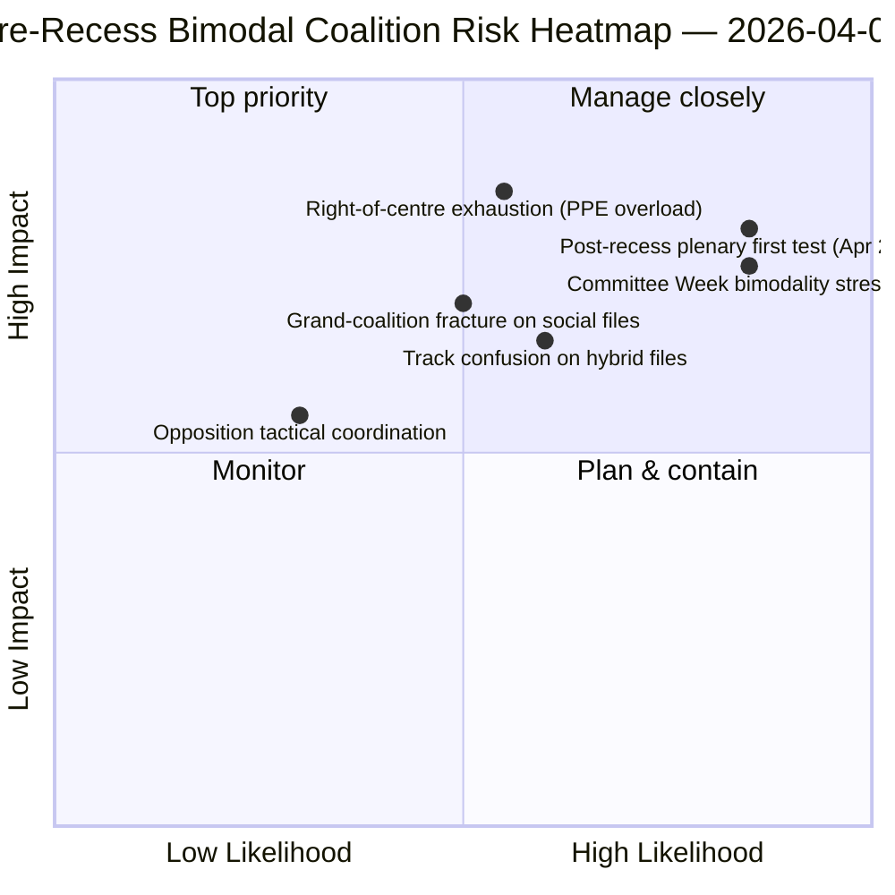

<!-- SPDX-FileCopyrightText: 2026 Hack23 AB -->
<!-- SPDX-License-Identifier: Apache-2.0 -->

# エグゼクティブブリーフ — 動議：休会前投票分散回顧 | 2026-04-06

**分類：** OSINT — 公開議会記録
**信頼度：** 🟡 中程度（休会期間；休会前RCV記録 🟢 高）
**実行：** `analysis/daily/2026-04-06/motions/` (05:30 UTC)
**対象：** 復活祭休暇第11/18日 — 3月26日スプリントのRCV/動議回顧
**生成日：** 2026-05-16（回顧ブリーフ、新規MCP呼び出しなし）
**主要情報源：** 休会前RCVコーパス（3月26日本会議日）；19分析ファイル；深層分析＋投票パターン、高信頼度。

---

## 🎯 BLUF

**この復活祭月曜日の実行は、**休会前RCV投票分散の回顧分析**を生成する — 同日の委員会報告実行の分析的補完である。** 委員会報告が休会前にどの委員会が成果を生み出したかを記録した一方、この実行はどの投票パターンがそれらのファイルを採択に導いたかを記録する — そして、**3月26日の本会議日は運用上二峰的であった**との結論を得た：経済・金融ファイル（銀行同盟トリプレット）は中道右派のルート（EPP+ECR+PfE+Renew、59-62%の過半数）を通じて採択され、法の支配ファイル（汚職対策）は大連立ルート（EPP+S&D+Renew+Greens、65%以上の過半数）を通じて採択された。この実行の際立った貢献は、**投票パターンの二峰性発見**である：第10欧州議会は第2年目において、*一つの*機能的多数ではなく、ファイルに条件付きで選択される*二つの共存する*連立システムを持つ。これは4時間後の06:45 UTCのbreaking-2実行で浮かび上がった二重トラック連立パターンの構造的検証であり — **委員会週（4月14-17日）と休会後本会議（4月20-23日）の予測のための構造的基準線**である。野党はいずれのトラックでも封鎖閾値に達しなかった（最大264票対封鎖に必要な360票 — *投票パターン*）。動議実行は5つの高信頼度手法を使用する：連立ダイナミクス、クロスセッション・インテリジェンス、深層分析、ステークホルダー影響、投票パターン。

---

## 🧭 3 Decisions This Brief Supports

| # | 決定事項 | 意思決定者 | 期限 | 根拠 |
|:-:|---------|----------|:----:|------|
| 1 | **Q2の二峰的連立計画** — 経済・金融対法の支配トラックには別々のスケジューリングが必要 | 議長会議；グループウィップ | 4月14日まで | §投票パターン（二峰性） |
| 2 | **野党調整評価** — 最大264対360が必要；構造的少数 | ECR + PfE + 左派コーディネーター | 4月14日まで | §投票パターン（野党閾値） |
| 3 | **3月26日RCVコーパスをQ2予測アンカーとして** — ファイル条件付きトラック選択 | EP情報オペレーション；報道サービス | 継続的Q2 | §深層分析（アンカー） |

---

## 📰 60-Second Read

- 🔴 **二峰的連立システムを確認** — 経済対法の支配トラック。
- 🟠 **3月26日の本会議日は構造的アンカーだった** — 同日に両トラックが稼働。
- 🟢 **中道右派トラック：59-62%の過半数** — 銀行同盟トリプレット。
- 🟡 **大連立トラック：65%以上の過半数** — 汚職対策。
- 🔵 **野党は決して封鎖に達しない** — 最大264対360が必要。
- 🟣 **5つの高信頼度手法** — 連立＋クロスセッション＋深層＋ステークホルダー＋投票。
- 🩷 **19分析ファイル** — 動議方法論の完全カバレッジ。
- ⚪ **信頼度：中程度** — 休会前データに対する休会期間中の分析作業。

---

## 📊 Bimodal Coalition Arithmetic (run's distinguishing contribution)

| トラック | 構成 | Q1旗艦ファイル | マージン | テストイベント |
|---------|------|--------------|--------|-------------|
| **中道右派** | EPP + ECR + PfE + Renew | TA-0090/0091/0092（銀行同盟） | 59-62% | 委員会週ECON 4月14-17日 |
| **大連立** | EPP + S&D + Renew + Greens | TA-0094（汚職対策） | 65%以上 | LIBE Q2-Q4転置 |
| **野党** | ECR + PfE + 左派（中道右派外） | — | 最大264票 | 構造的少数 |

---

## ⚠️ Risk Snapshot

---

## 🔮 Top Forward Triggers (next 14 days)

1. **4月14日 — 委員会週が開幕** — ECONが中道右派トラックをテスト。
2. **4月17日 — ECBの金利決定** — 外部経済・金融トリガー。
3. **4月20-23日 — 休会後初の本会議** — 完全な二峰性ストレステスト。
4. **Q2末 — 銀行同盟に関する理事会のマンデート** — 中道右派トラックの正当性ゲート。
5. **Q3 — 汚職対策転置の開始** — 大連立トラックの耐久性テスト。

---

## 🛡️ Source-Quality Assessment

- **3月26日RCV記録（A1）：** 本会議プライマリフィード；ファイルごとに検証可能。
- **二峰性発見（A2）：** サブモーダルグループ化を伴う投票パターン方法論。
- **野党264対360（A1）：** グループ別議席合計で確認された算術。
- **5つの高信頼度手法（A1）：** 検証付き体系的方法論。
- **正味信頼度：** 🟢 3月26日記録で高；🟡 Q2予測で中程度。

---

## 📎 Run Artifacts

| レイヤー | アーティファクト | 理由 |
|---------|---------------|------|
| 記事 | `article.md`（1,234行） | 公開向け動議ナラティブ |
| 合成 | `existing/synthesis-summary.md` | 二峰性発見 + 19ファイル統合 |
| 方法論 | 分類 · 既存 · リスクスコアリング · 脅威評価 | 標準動議方法論 |
| 付随 | breakingクラスター · 委員会報告 · 提案 | 復活祭月曜日デイクラスター |

---

**文書管理**
- **テンプレート参照：** `analysis/templates/executive-brief.md`
- **アーティファクトパス：** `analysis/daily/2026-04-06/motions/executive-brief.md`
- **分類：** 公開
- **回顧：** ブリーフは実行のコミット済みアーティファクトから2026-05-16に作成；**新規MCP呼び出しは行われなかった**。
