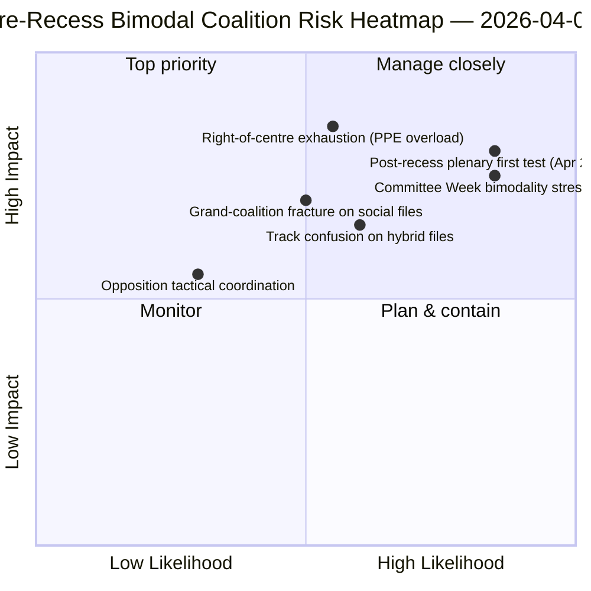

<!-- SPDX-FileCopyrightText: 2026 Hack23 AB -->
<!-- SPDX-License-Identifier: Apache-2.0 -->

# 집행 브리핑 — 동의안: 휴회 전 투표 분산 소급 검토 | 2026-04-06

**분류:** OSINT — 공개 의회 기록
**신뢰도:** 🟡 보통 (휴회; 휴회 전 RCV 기록 🟢 높음)
**실행:** `analysis/daily/2026-04-06/motions/` (05:30 UTC)
**범위:** 부활절 휴회 11/18일 — 3월 26일 스프린트 RCV/동의안 소급 검토
**생성일:** 2026-05-16 (소급 브리핑, 새로운 MCP 호출 없음)
**주요 출처:** 휴회 전 RCV 코퍼스 (3월 26일 본회의일); 분석 파일 19개; 심층 분석 + 투표 패턴, 높은 신뢰도.

---

## 🎯 BLUF

**이 부활절 월요일 실행은 **휴회 전 RCV 투표 분산 소급 분석**을 생성한다 — 같은 날짜의 위원회 보고서 실행에 대한 분석적 보완이다.** 위원회 보고서가 *어느 위원회*가 휴회 전 산출물을 생성했는지를 기록한 반면, 이 실행은 *어떤 투표 패턴*이 해당 파일들을 채택으로 이끌었는지를 기록하며 — **3월 26일 본회의일은 운영상 이중봉형이었다**는 결론에 도달한다: 경제·금융 파일들(은행동맹 3부작)은 중도우파 노선(EPP+ECR+PfE+Renew, 59-62% 다수)을 통해 채택되었고, 법치 파일들(반부패)은 대연립 노선(EPP+S&D+Renew+Greens, 65%+ 다수)을 통해 채택되었다. 이 실행의 두드러진 기여는 **투표 패턴 이중봉 발견**이다: 제10유럽의회는 2년차에서 *하나의* 작동 다수가 아니라 파일별로 조건부 선택되는 *두 개의 공존하는* 연립 시스템을 갖는다. 이것은 4시간 후 06:45 UTC의 breaking-2 실행에서 드러난 이중 노선 연립 패턴의 구조적 검증이며 — **위원회 주간(4월 14-17일)과 휴회 후 본회의(4월 20-23일) 예측을 위한 구조적 기준선**이다. 야당은 어떤 노선에서도 봉쇄 임계값에 도달하지 못했다(최대 264표 대 봉쇄에 필요한 360표 — *투표 패턴*). 동의안 실행은 5가지 높은 신뢰도 방법을 사용한다: 연립 역학, 교차 세션 인텔리전스, 심층 분석, 이해관계자 영향, 투표 패턴.

---

## 🧭 3 Decisions This Brief Supports

| # | 결정 | 결정자 | 마감일 | 증거 |
|:-:|-----|-------|:------:|------|
| 1 | **Q2를 위한 이중봉 연립 계획** — 경제·금융 대 법치 노선은 별도 일정이 필요 | 의장 회의; 교섭단체 원내총무 | 4월 14일까지 | §투표 패턴(이중봉) |
| 2 | **야당 조정 평가** — 최대 264 대 360 필요; 구조적 소수 | ECR + PfE + 좌파 코디네이터 | 4월 14일까지 | §투표 패턴(야당 임계값) |
| 3 | **3월 26일 RCV 코퍼스를 Q2 예측 앵커로** — 파일 조건부 노선 선택 | EP 인텔리전스 운영; 언론 서비스 | 지속적 Q2 | §심층 분석(앵커) |

---

## 📰 60-Second Read

- 🔴 **이중봉 연립 시스템 확인** — 경제 대 법치 노선.
- 🟠 **3월 26일 본회의일은 구조적 앵커였다** — 같은 날 두 노선 모두 가동.
- 🟢 **중도우파 노선: 59-62% 다수** — 은행동맹 3부작.
- 🟡 **대연립 노선: 65%+ 다수** — 반부패.
- 🔵 **야당은 결코 봉쇄에 도달하지 않음** — 최대 264 대 360 필요.
- 🟣 **5가지 높은 신뢰도 방법** — 연립 + 교차 세션 + 심층 + 이해관계자 + 투표.
- 🩷 **분석 파일 19개** — 동의안 방법론 전체 적용.
- ⚪ **신뢰도 보통** — 휴회 전 데이터에 대한 휴회 기간 분석 작업.

---

## 📊 Bimodal Coalition Arithmetic (run's distinguishing contribution)

| 노선 | 구성 | Q1 주력 파일 | 마진 | 테스트 이벤트 |
|-----|------|------------|------|------------|
| **중도우파** | EPP + ECR + PfE + Renew | TA-0090/0091/0092 (은행동맹) | 59-62% | 위원회 주간 ECON 4월 14-17일 |
| **대연립** | EPP + S&D + Renew + Greens | TA-0094 (반부패) | 65%+ | LIBE Q2-Q4 전환 |
| **야당** | ECR + PfE + 좌파(중도우파 외) | — | 최대 264표 | 구조적 소수 |

---

## ⚠️ Risk Snapshot

---

## 🔮 Top Forward Triggers (next 14 days)

1. **4월 14일 — 위원회 주간 개막** — ECON이 중도우파 노선 테스트.
2. **4월 17일 — ECB 금리 결정** — 외부 경제·금융 촉발 요인.
3. **4월 20-23일 — 휴회 후 첫 본회의** — 완전한 이중봉 스트레스 테스트.
4. **Q2 말 — 은행동맹에 관한 이사회 위임** — 중도우파 노선 정당성 게이트.
5. **Q3 — 반부패 전환 개시** — 대연립 노선 내구성 테스트.

---

## 🛡️ Source-Quality Assessment

- **3월 26일 RCV 기록 (A1):** 기본 본회의 피드; 파일별 검증 가능.
- **이중봉 발견 (A2):** 하위 모달 그룹화를 통한 투표 패턴 방법론.
- **야당 264 대 360 (A1):** 교섭단체별 의석 합계로 확인된 산술.
- **5가지 높은 신뢰도 방법 (A1):** 검증이 포함된 체계적 방법론.
- **순 신뢰도:** 🟢 3월 26일 기록에서 높음; 🟡 Q2 예측에서 보통.

---

## 📎 Run Artifacts

| 레이어 | 아티팩트 | 이유 |
|-------|---------|------|
| 기사 | `article.md` (1,234줄) | 공개 동의안 내러티브 |
| 합성 | `existing/synthesis-summary.md` | 이중봉 발견 + 19개 파일 통합 |
| 방법론 | 분류 · 기존 · 위험 점수화 · 위협 평가 | 표준 동의안 방법론 |
| 동반 | breaking 클러스터 · 위원회 보고서 · 제안서 | 부활절 월요일 당일 클러스터 |

---

**문서 관리**
- **템플릿 참조:** `analysis/templates/executive-brief.md`
- **아티팩트 경로:** `analysis/daily/2026-04-06/motions/executive-brief.md`
- **분류:** 공개
- **소급:** 브리핑은 실행의 커밋된 아티팩트로부터 2026-05-16에 작성되었으며; **새로운 MCP 호출은 수행되지 않았다**.
