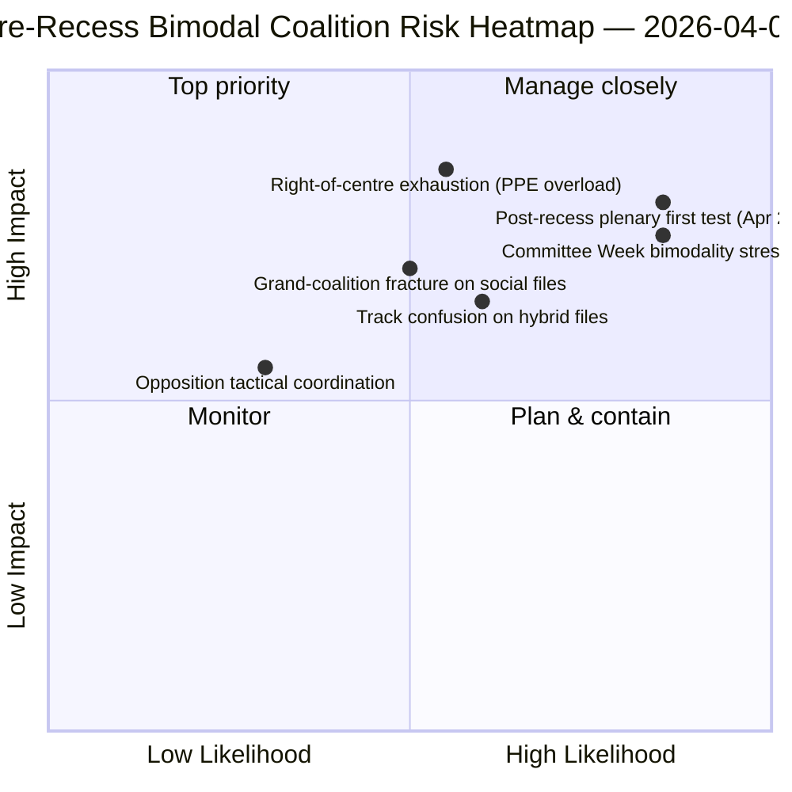

<!-- SPDX-FileCopyrightText: 2026 Hack23 AB -->
<!-- SPDX-License-Identifier: Apache-2.0 -->

# Uitvoerende Briefing — Moties: Retrospectieve Stemdispersie vóór het Reces | 2026-04-06

**Classificatie:** OSINT — Openbaar parlementair verslag
**Betrouwbaarheidsniveau:** 🟡 GEMIDDELD (reces; RCV-records vóór reces 🟢 HOOG)
**Uitvoering:** `analysis/daily/2026-04-06/motions/` (05:30 UTC)
**Dekking:** Paasreces dag 11/18 — RCV/moties-retrospectief over de sprint van 26 maart
**Gegenereerd:** 2026-05-16 (retrospectieve briefing, geen nieuwe MCP-aanroepen)
**Primaire bronnen:** RCV-corpus vóór reces (plenaire vergaderdag 26 maart); 19 analysebestanden; diepgaande analyse + stempatronen, hoge betrouwbaarheid.

---

## 🎯 BLUF

**Deze Paasmaandag-uitvoering produceert de **retrospectieve stemdispersieanalyse vóór het reces** — het analytisch complement bij de commissierapport-uitvoering op dezelfde datum.** Terwijl commissierapporten documenteerden *welke commissies* de pre-reces output produceerden, documenteert deze uitvoering *welke stempatronen* die bestanden naar aanneming droegen — en stelt vast dat **de plenaire vergaderdag van 26 maart operationeel bimodaal was**: economisch-financiële bestanden (Bankenunie-drietal) aangenomen via rechts van het midden-sporen (EVP+ECR+PfE+Renew, meerderheden van 59-62 %), terwijl rechtsstaatbestanden (anti-corruptie) aangenomen werden via grootcoalitie-sporen (EVP+S&D+Renew+Groenen, meerderheden van 65 %+). De onderscheidende bijdrage van deze uitvoering is de **bevinding van bimodaliteit in stempatronen**: EP10 in Jaar 2 heeft niet *één* werkende meerderheid maar *twee coëxisterende* coalitiesystemen, bestandsvoorwaardelijk geselecteerd. Dit is de structurele validatie van het dubbelspoorcoalitiepatroon dat vier uur later opdook in de breaking-2-uitvoering om 06:45 UTC — en de **structurele basislijn voor prognoses over de Commissieweek (14-17 april) en de post-reces plenaire vergadering (20-23 april)**. De oppositie bereikte nooit de blokkeringsdrempel op een van de sporen (264 maximale stemmen versus 360 nodig om te blokkeren — *Stempatronen*). De motiesuitvoering gebruikt 5 hoge-betrouwbaarheidsmethoden: coalitiedynamiek, cross-sessie-intelligentie, diepgaande analyse, invloed op belanghebbenden, stempatronen.

---

## 🧭 3 Decisions This Brief Supports

| # | Besluit | Wie beslist | Deadline | Bewijs |
|:-:|--------|------------|:--------:|--------|
| 1 | **Bimodale coalitionplanning voor K2** — economisch-financiële vs. rechtsstatelijke sporen vereisen afzonderlijke planning | Conferentie van Voorzitters; fractiewhips | vóór 14 april | §Stempatronen (bimodaliteit) |
| 2 | **Beoordeling van oppositiecoördinatie** — 264 max. versus 360 nodig; structurele minderheid | ECR + PfE + Links-coördinatoren | vóór 14 april | §Stempatronen (oppositiedrempel) |
| 3 | **RCV-corpus 26 maart als K2-prognoseankerpunt** — bestandsvoorwaardelijke spoorselec­tie | EP-inlichtingenoperaties; persdienst | doorlopend K2 | §Diepgaande analyse (ankerpunt) |

---

## 📰 60-Second Read

- 🔴 **Bimodaal coalitiesysteem bevestigd** — economische vs. rechtsstaatsporen.
- 🟠 **Plenaire vergaderdag 26 maart was structureel ankerpunt** — beide sporen operationeel op dezelfde dag.
- 🟢 **Rechts van het midden-spoor: meerderheden van 59-62 %** — Bankenunie-drietal.
- 🟡 **Grootcoalitie-spoor: meerderheden van 65 %+** — Anti-corruptie.
- 🔵 **Oppositie bereikt nooit blokkering** — 264 max. versus 360 nodig.
- 🟣 **5 hoge-betrouwbaarheidsmethoden** — coalitie + cross-sessie + diep + belanghebbende + stem.
- 🩷 **19 analysebestanden** — volledige dekking van motiesmethodologie.
- ⚪ **Betrouwbaarheid GEMIDDELD** — analytisch werk tijdens reces op pre-reces data.

---

## 📊 Bimodal Coalition Arithmetic (run's distinguishing contribution)

| Spoor | Samenstelling | K1-vlaggenschipbestanden | Marge | Testevenement |
|-------|--------------|--------------------------|-------|---------------|
| **Rechts van het midden** | EVP + ECR + PfE + Renew | TA-0090/0091/0092 (Bankenunie) | 59-62 % | Commissieweek ECON 14-17 apr. |
| **Grote coalitie** | EVP + S&D + Renew + Groenen | TA-0094 (Anti-corruptie) | 65 %+ | LIBE K2-K4 omzetting |
| **Oppositie** | ECR + PfE + Links (buiten rechts van het midden) | — | 264 max. stemmen | structurele minderheid |

---

## ⚠️ Risk Snapshot

---

## 🔮 Top Forward Triggers (next 14 days)

1. **14 april — Commissieweek opent** — ECON test rechts van het midden-spoor.
2. **17 april — ECB-rentebesluit** — extern economisch-financieel signaal.
3. **20-23 april — eerste plenaire vergadering na het reces** — volledig bimodaliteitsstresstest.
4. **Einde K2 — Raadsmandat over de Bankenunie** — legitimiteitportaal voor rechts van het midden-spoor.
5. **K3 — Kickoff anti-corruptietransposition** — duurzaamheidstest voor grootcoalitie-spoor.

---

## 🛡️ Source-Quality Assessment

- **RCV-records 26 maart (A1):** primaire plenaire feed; per bestand verifieerbaar.
- **Bimodaliteitsbevinding (A2):** stempatroonmethodologie met sub-modale groepering.
- **Oppositie 264 versus 360 (A1):** rekenkunde bevestigd via zeteltellingen per fractie.
- **5 hoge-betrouwbaarheidsmethoden (A1):** systematische methodologie met verificatie.
- **Netto betrouwbaarheid:** 🟢 HOOG op records van 26 maart; 🟡 GEMIDDELD op K2-prognose.

---

## 📎 Run Artifacts

| Laag | Artefact | Waarom |
|------|----------|--------|
| Artikel | `article.md` (1.234 regels) | Publiek gericht motiesverhaal |
| Synthese | `existing/synthesis-summary.md` | Bimodaliteitsbevinding + 19-bestands-consolidatie |
| Methoden | classificatie · bestaand · risicobeoordeling · dreigingsbeoordeling | Standaard motiesmethodologie |
| Begeleidend | breaking-cluster · commissierapporten · proposities | Paasmaandag dagcluster |

---

**Documentbeheer**
- **Sjabloonreferentie:** `analysis/templates/executive-brief.md`
- **Artefactpad:** `analysis/daily/2026-04-06/motions/executive-brief.md`
- **Classificatie:** Openbaar
- **Retrospectief:** Briefing geschreven op 2026-05-16 op basis van de vastgelegde artefacten van de uitvoering; **er zijn geen nieuwe MCP-aanroepen gedaan**.
