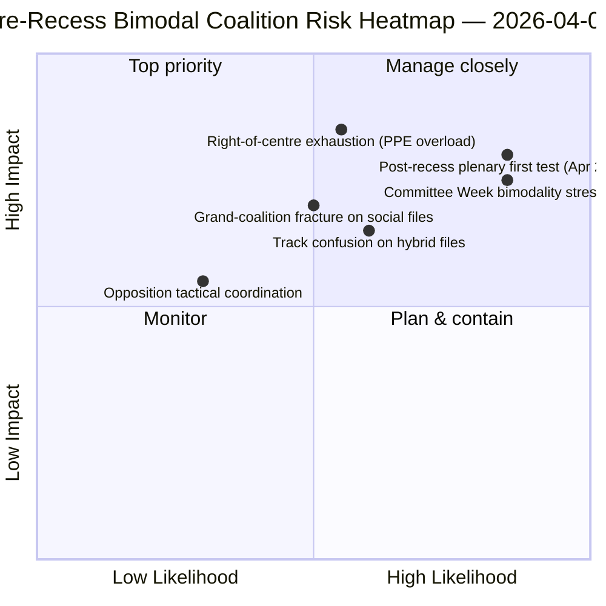

<!-- SPDX-FileCopyrightText: 2026 Hack23 AB -->
<!-- SPDX-License-Identifier: Apache-2.0 -->

# Eksekutivbriefing — Motioner: Retrospektiv Stemmefordeling før Pause | 2026-04-06

**Klassifisering:** OSINT — Offentlig parlamentarisk opptegnelse
**Konfidens:** 🟡 MEDIUM (pause; RCV-opptegnelser før pause 🟢 HIGH)
**Kjøring:** `analysis/daily/2026-04-06/motions/` (05:30 UTC)
**Dekning:** Påskepauses dag 11/18 — RCV/mosjons-retrospektiv om mars 26-sprint
**Generert:** 2026-05-16 (retrospektiv brief, ingen nye MCP-kall)
**Primære kilder:** RCV-korpus før pause (plenumdag 26. mars); 19 analysefiler; dyp-analyse + stemmemønstre høy konfidens.

---

## 🎯 BLUF

**Denne påskemandags-kjøringen produserer den **retrospektive stemmefordelingsanalysen før pause** — det analytiske komplementet til komitérapport-kjøringen på samme dato.** Mens komitérapporter dokumenterte *hvilke komiteer* som produserte output før pause, dokumenterer denne kjøringen *hvilke stemmemønstre* som førte disse filene til vedtagelse — og finner at **plenumdag 26. mars var operasjonelt bimodal**: økonomi-finansfiler (Bankunion-trippel) vedtatt via sentrum-høyre-spor (EPP+ECR+PfE+Renew, 59-62% flertall), mens rettsstatsfiler (Anti-Korrupsjon) vedtatt via storkoalisjons-spor (EPP+S&D+Renew+Greens, 65%+ flertall). Kjøringens særegne bidrag er **bimodalitetsfunnet i stemmemønstre**: EP10 i år 2 har ikke *ett* fungerende flertall men *to sameksisterende* koalisjonssystemer, valgt fil-betinget. Dette er den strukturelle valideringen av det doble koalisjonsmønsteret som dukket opp fire timer senere i breaking-2-kjøringen 06:45 UTC — og **den strukturelle basislinje for prognoser om Komitéuke (14-17. april) og plenum etter pause (20-23. april)**. Opposisjonen nådde aldri blokkeringsterskelen på noen spor (264 maks stemmer mot 360 nødvendige for å blokkere — *Stemmemønstre*). Mosjons-kjøringen bruker 5 høy-konfidens-metoder: koalisjonssdynamikk, kryss-sessions-intelligens, dyp-analyse, interessentpåvirkning, stemmemønstre.

---

## 🧭 3 Decisions This Brief Supports

| # | Beslutning | Hvem bestemmer | Frist | Dokumentasjon |
|:-:|-----------|----------------|:-----:|---------------|
| 1 | **Bimodal koalisjonsplanlegging for K2** — økonomi-finans vs. rettsstat-spor trenger separat planlegging | Konferansen for presidentene; gruppevhips | innen 14. april | §Stemmemønstre (bimodalitet) |
| 2 | **Vurdering av opposisjonskoordinering** — 264 maks mot 360 nødvendige; strukturell minoritet | ECR + PfE + Venstre-koordinatorer | innen 14. april | §Stemmemønstre (opposisjonsterskel) |
| 3 | **RCV-korpus 26. mars som K2-prognoseankre** — fil-betinget sporvalg | EP etterretningsoperasjoner; pressetjeneste | rullende K2 | §Dyp Analyse (ankre) |

---

## 📰 60-Second Read

- 🔴 **Bimodalt koalisjonssystem bekreftet** — økonomi vs. rettsstat-spor.
- 🟠 **Plenumdag 26. mars var strukturelt ankre** — begge spor operative samme dag.
- 🟢 **Sentrum-høyre-spor: 59-62% flertall** — Bankunion-trippel.
- 🟡 **Storkoalisjons-spor: 65%+ flertall** — Anti-Korrupsjon.
- 🔵 **Opposisjonen når aldri blokkering** — 264 maks mot 360 nødvendige.
- 🟣 **5 høy-konfidens-metoder** — koalisjon + kryss-session + dyp + interessent + stemme.
- 🩷 **19 analysefiler** — full dekning av mosjonsmetodologi.
- ⚪ **Konfidens MEDIUM** — analytisk arbeid under pause på data fra før pause.

---

## 📊 Bimodal Coalition Arithmetic (run's distinguishing contribution)

| Spor | Sammensetning | K1 flaggskipsfiler | Margin | Testevent |
|------|--------------|-------------------|--------|-----------|
| **Sentrum-høyre** | EPP + ECR + PfE + Renew | TA-0090/0091/0092 (Bankunion) | 59-62% | Komitéuke ECON 14-17. apr |
| **Storkoalisjon** | EPP + S&D + Renew + Greens | TA-0094 (Anti-Korrupsjon) | 65%+ | LIBE K2-K4 transposisjon |
| **Opposisjon** | ECR + PfE + Venstre (når utenfor sentrum-høyre) | — | 264 maks stemmer | strukturell minoritet |

---

## ⚠️ Risk Snapshot

---

## 🔮 Top Forward Triggers (next 14 days)

1. **14. april — Komitéuken åpner** — ECON tester sentrum-høyre-sporet.
2. **17. april — ECBs rentebeslutning** — eksternt økonomi-finanstrigger.
3. **20-23. april — første plenum etter pause** — fullt bimodalitets-stresstest.
4. **Slutten av K2 — Rådets mandat om Bankunionen** — legitimasjonsport for sentrum-høyre-sporet.
5. **K3 — Anti-Korrupsjon transposisjonsstart** — holdbarhetsttest for storkoalisjons-sporet.

---

## 🛡️ Source-Quality Assessment

- **26. mars RCV-opptegnelser (A1):** primær plenumfeed; verifiserbar per fil.
- **Bimodalitetsfunn (A2):** stemmemetodologi med sub-modal gruppering.
- **Opposisjon 264 mot 360 (A1):** aritmetikk bekreftet via per-gruppe mandattall.
- **5 høy-konfidens-metoder (A1):** systematisk metodologi med verifisering.
- **Netto konfidens:** 🟢 HIGH på 26. mars-opptegnelser; 🟡 MEDIUM på K2-prognose.

---

## 📎 Run Artifacts

| Lag | Artefakt | Årsak |
|-----|----------|-------|
| Artikkel | `article.md` (1 234 linjer) | Offentlig mosjonsfortelling |
| Syntese | `existing/synthesis-summary.md` | Bimodalitetsfunn + 19-fils-konsolidering |
| Metoder | klassifisering · eksisterende · risikovurdering · trusselsvurdering | Standard mosjonsmetodologi |
| Ledsager | breaking-klynge · komitérapporter · proposisjoner | Påskemandagens dag-klynge |

---

**Dokumentkontroll**
- **Malreferanse:** `analysis/templates/executive-brief.md`
- **Artefaktsti:** `analysis/daily/2026-04-06/motions/executive-brief.md`
- **Klassifisering:** Offentlig
- **Retrospektiv:** Brief skrevet 2026-05-16 fra kjøringens committede artefakter; **ingen nye MCP-kall ble gjort**.
