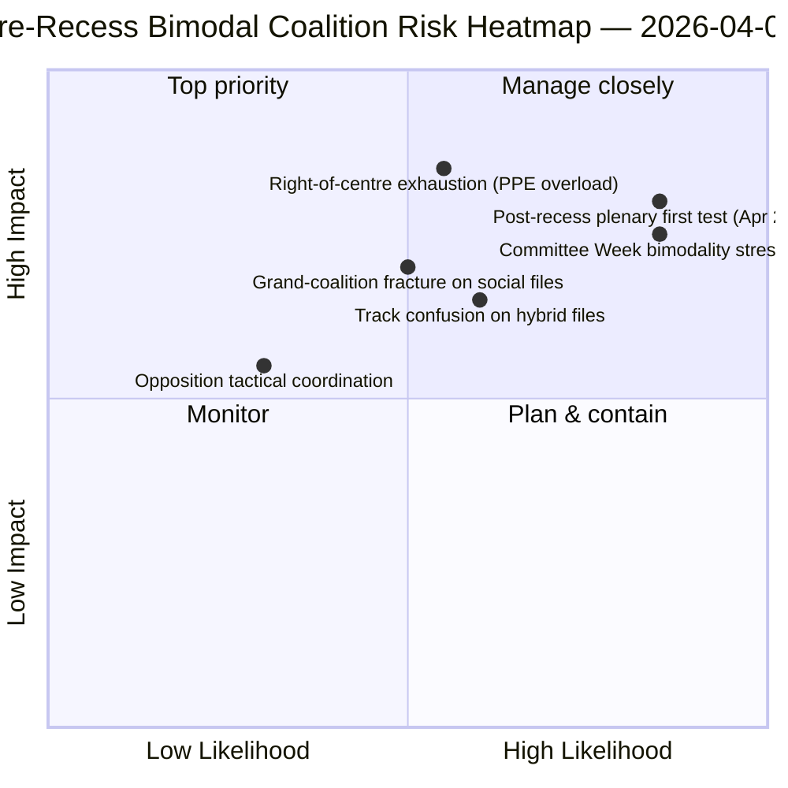

<!-- SPDX-FileCopyrightText: 2026 Hack23 AB -->
<!-- SPDX-License-Identifier: Apache-2.0 -->

# Exekutivbriefing — Motioner: Retrospektiv Röstspridning före Rast | 2026-04-06

**Klassificering:** OSINT — Offentligt parlamentariskt protokoll
**Konfidensgrad:** 🟡 MEDIUM (rast; omröstningsprotokoll (RCV) före rast 🟢 HIGH)
**Körning:** `analysis/daily/2026-04-06/motions/` (05:30 UTC)
**Täckning:** Påskrast Dag 11/18 — RCV/motionsretrospektiv på mars 26-sprint
**Genererad:** 2026-05-16 (retrospektiv brief, inga nya MCP-anrop)
**Primära källor:** RCV-korpus före rast (plenumdag 26 mars); 19 analysfiler; djupanalys + omröstningmönster Hög konfidens.

---

## 🎯 BLUF

**Denna Påskdagsmotion-körning producerar den **retrospektiva röstspridningsanalysen före rast** — det analytiska komplettet till kommittérapport-körningen samma datum.** Medan kommittérapporter dokumenterade *vilka kommittéer* som producerade resultaten före rast, dokumenterar denna körning *vilka röstmönster* som bar dessa filer till antagande — och finner att **plenumdag 26 mars var operativt bimodal**: ekonomi-finansfiler (Bankunion-triplett) antogs via högercentrum-spår (EPP+ECR+PfE+Renew, 59-62% majorities), medan rättsstatsfiler (anti-korruption) antogs via storkoalitionsspår (EPP+S&D+Renew+Greens, 65%+ majorities). Körningens säregna bidrag är **fyndet om röstmönstrets bimodalitet**: EP10 År 2 har inte *en* fungerande majoritet utan *två samexisterande* koalitionssystem, valda fil-villkorligt. Detta är den strukturella valideringen av det dubbla koalitionsmönstret som framkom fyra timmar senare i breaking-2-körningen 06:45 UTC — och **strukturell baslinje för prognoser om Kommittéveckan (14-17 april) och plenumet efter rast (20-23 april)**. Oppositionen nådde aldrig blockeringströskel på något spår (264 max röster mot 360 nödvändiga för blockering — *Röstmönster*). Motionskörningen använder 5 metoder med hög konfidens: koalitionsdynamik, korsessions-intelligens, djupanalys, intressentpåverkan, röstmönster.

---

## 🧭 3 Decisions This Brief Supports

| # | Beslut | Vem beslutar | Deadline | Bevis |
|:-:|--------|-------------|:--------:|-------|
| 1 | **Bimodal koalitionsplanering för K2** — ekonomi-finans vs. rättsstats-spår behöver separat schemaläggning | Konferensen för ordförande; gruppvhips | till 14 april | §Röstmönster (bimodalitet) |
| 2 | **Bedömning av oppositionssamordning** — 264 max mot 360 nödvändiga; strukturell minoritet | ECR + PfE + Vänster-koordinatorer | till 14 april | §Röstmönster (oppositionströskel) |
| 3 | **RCV-korpus 26 mars som K2-prognosankare** — fil-villkorligt spårval | EP underrättelseops; presstjänst | rullande K2 | §Djupanalys (ankare) |

---

## 📰 60-Second Read

- 🔴 **Bimodalt koalitionssystem bekräftat** — ekonomi vs. rättsstats-spår.
- 🟠 **Plenumdag 26 mars var strukturell ankare** — båda spåren operativa samma dag.
- 🟢 **Högercentrum-spår: 59-62% majorities** — Bankunion-triplett.
- 🟡 **Storkoalitions-spår: 65%+ majorities** — Anti-korruption.
- 🔵 **Oppositionen når aldrig blockering** — 264 max mot 360 nödvändiga.
- 🟣 **5 metoder med hög konfidens** — koalition + korsession + djup + intressent + röstning.
- 🩷 **19 analysfiler** — full täckning av motionsmetodologi.
- ⚪ **Konfidens MEDIUM** — analytiskt arbete under rast på data från före rast.

---

## 📊 Bimodal Coalition Arithmetic (run's distinguishing contribution)

| Spår | Sammansättning | Q1 flaggskeppsfiler | Marginal | Testevent |
|------|---------------|---------------------|----------|-----------|
| **Högercentrum** | EPP + ECR + PfE + Renew | TA-0090/0091/0092 (Bankunion) | 59-62% | Kommittévecka ECON 14-17 apr |
| **Storkoalition** | EPP + S&D + Renew + Greens | TA-0094 (Anti-korruption) | 65%+ | LIBE K2-K4 transposition |
| **Opposition** | ECR + PfE + Vänster (när utanför högercentrum) | — | 264 max röster | strukturell minoritet |

---

## ⚠️ Risk Snapshot

---

## 🔮 Top Forward Triggers (next 14 days)

1. **14 april — Kommittéveckan öppnar** — ECON testar högercentrum-spåret.
2. **17 april — ECB:s räntebeslut** — externt ekonomi-finanstrigger.
3. **20-23 april — första plenumet efter rast** — fullt bimodalt stresstest.
4. **Slutet av K2 — Rådets mandat om Bankunionen** — legitimationsport för högercentrum-spåret.
5. **K3 — Uppstart anti-korruptions-transposition** — hållbarhetstest för storkoalitions-spåret.

---

## 🛡️ Source-Quality Assessment

- **Omröstningsprotokoll 26 mars (A1):** primär plenumfeed; verifierbar per fil.
- **Bimodalitetsfynd (A2):** röstmönster-metodologi med submodal gruppering.
- **Opposition 264 mot 360 (A1):** aritmetik bekräftad via per-grupp mandattal.
- **5 metoder med hög konfidens (A1):** systematisk metodologi med verifiering.
- **Nettokonfidensgrad:** 🟢 HIGH på mars 26-protokoll; 🟡 MEDIUM på K2-prognos.

---

## 📎 Run Artifacts

| Lager | Artefakt | Varför |
|-------|----------|--------|
| Artikel | `article.md` (1 234 rader) | Offentlig motionsberättelse |
| Syntes | `existing/synthesis-summary.md` | Bimodalitetsfynd + 19-filskonsolidering |
| Metoder | klassificering · befintlig · riskbedömning · hotbedömning | Standardmotionsmetodologi |
| Ledsagare | breaking-kluster · kommittérapporter · propositioner | Påskdagens dag-kluster |

---

**Dokumentkontroll**
- **Mallreferens:** `analysis/templates/executive-brief.md`
- **Artefaktsökväg:** `analysis/daily/2026-04-06/motions/executive-brief.md`
- **Klassificering:** Offentlig
- **Retrospektiv:** Brief skriven 2026-05-16 från körningens commitade artefakter; **inga nya MCP-anrop gjordes**.
