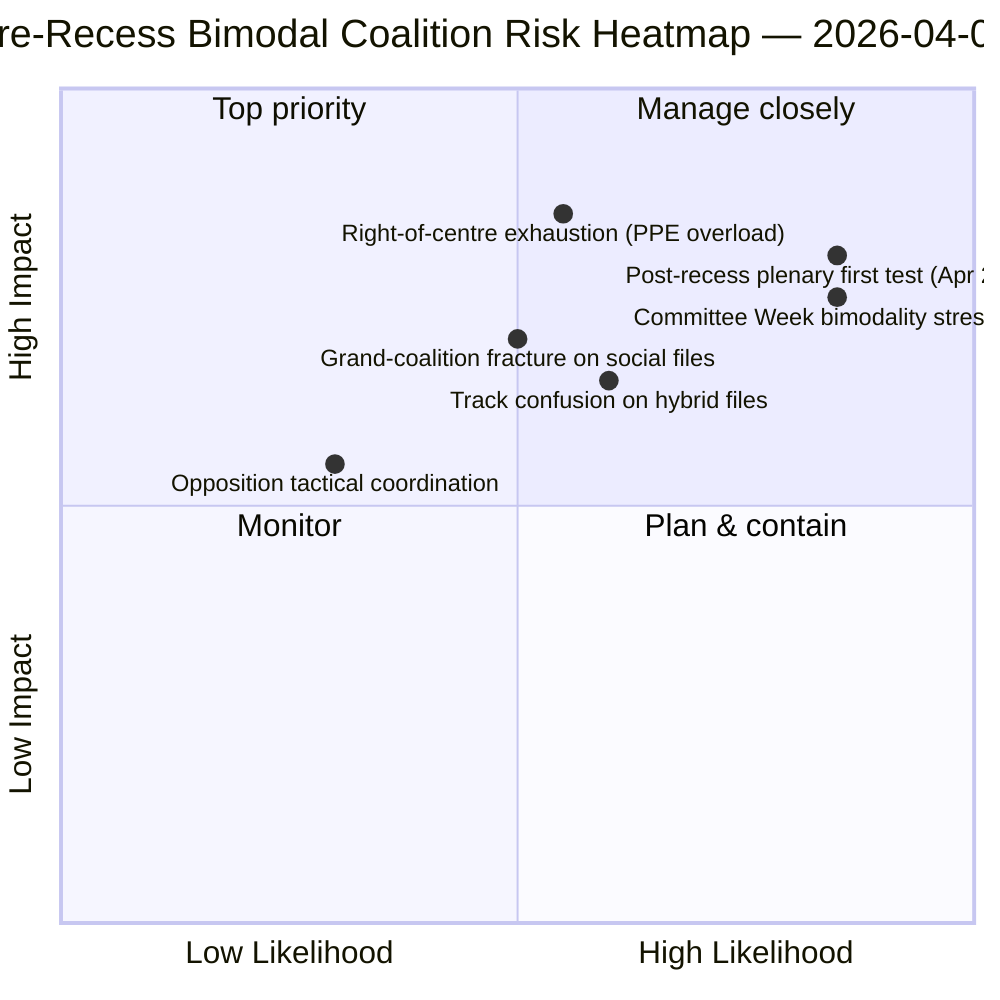

<!-- SPDX-FileCopyrightText: 2026 Hack23 AB -->
<!-- SPDX-License-Identifier: Apache-2.0 -->

# 执行简报 — 动议：休会前投票分散回顾分析 | 2026-04-06

**分类：** OSINT — 公开议会记录
**可信度：** 🟡 中等（休会期；休会前RCV记录 🟢 高）
**运行：** `analysis/daily/2026-04-06/motions/` (05:30 UTC)
**覆盖范围：** 复活节休会第11/18天 — 3月26日冲刺阶段RCV/动议回顾
**生成日期：** 2026-05-16（回顾简报，无新MCP调用）
**主要来源：** 休会前RCV语料库（3月26日全体会议日）；19个分析文件；深度分析 + 投票模式，高可信度。

---

## 🎯 BLUF

**本次复活节星期一运行产生**休会前RCV投票分散回顾分析** — 同日委员会报告运行的分析性补充。** 委员会报告记录了*哪些委员会*产生了休会前的成果，而本次运行则记录了*哪些投票模式*推动这些文件走向通过 — 并发现**3月26日的全体会议日在运营上呈双峰态**：经济金融文件（银行联盟三件套）经由中右路线采纳（EPP+ECR+PfE+Renew，59-62%的多数），而法治文件（反腐败）经由大联合路线采纳（EPP+S&D+Renew+Greens，65%以上多数）。本次运行的独特贡献是**投票模式双峰性发现**：第十届欧洲议会第二年并非拥有*一个*运转中的多数，而是拥有*两个共存的*联合系统，按文件条件选择。这是四小时后06:45 UTC的breaking-2运行中浮现的双轨联合格局的结构性验证 — 同时也是**预测委员会周（4月14-17日）和休会后全体会议（4月20-23日）的结构基准**。反对派在任何一条轨道上均未达到封锁阈值（最多264票对封锁所需的360票 — *投票模式*）。动议运行采用5种高可信度方法：联合动态、跨会期情报、深度分析、利益相关者影响、投票模式。

---

## 🧭 3 Decisions This Brief Supports

| # | 决定事项 | 谁来决定 | 截止日期 | 证据 |
|:-:|---------|---------|:-------:|------|
| 1 | **Q2双峰联合规划** — 经济金融与法治轨道需要分别安排时间 | 主席会议；各党团鞭策官 | 4月14日前 | §投票模式（双峰性） |
| 2 | **反对派协调评估** — 最多264对360所需；结构性少数 | ECR + PfE + 左翼协调员 | 4月14日前 | §投票模式（反对派阈值） |
| 3 | **3月26日RCV语料库作为Q2预测锚点** — 文件条件性轨道选择 | EP情报运营；新闻服务 | 滚动Q2 | §深度分析（锚点） |

---

## 📰 60-Second Read

- 🔴 **确认双峰联合体系** — 经济与法治轨道。
- 🟠 **3月26日全体会议日为结构性锚点** — 两条轨道同日运转。
- 🟢 **中右轨道：59-62%多数** — 银行联盟三件套。
- 🟡 **大联合轨道：65%以上多数** — 反腐败。
- 🔵 **反对派从未达到封锁** — 最多264对360所需。
- 🟣 **5种高可信度方法** — 联合+跨会期+深度+利益相关者+投票。
- 🩷 **19个分析文件** — 动议方法论的完整覆盖。
- ⚪ **可信度：中等** — 休会期间基于休会前数据的分析工作。

---

## 📊 Bimodal Coalition Arithmetic (run's distinguishing contribution)

| 轨道 | 构成 | Q1旗舰文件 | 边际 | 测试事件 |
|------|-----|-----------|-----|---------|
| **中右** | EPP + ECR + PfE + Renew | TA-0090/0091/0092（银行联盟） | 59-62% | 委员会周ECON 4月14-17日 |
| **大联合** | EPP + S&D + Renew + Greens | TA-0094（反腐败） | 65%以上 | LIBE Q2-Q4转置 |
| **反对派** | ECR + PfE + 左翼（中右之外） | — | 最多264票 | 结构性少数 |

---

## ⚠️ Risk Snapshot

---

## 🔮 Top Forward Triggers (next 14 days)

1. **4月14日 — 委员会周开幕** — ECON测试中右轨道。
2. **4月17日 — 欧洲央行利率决定** — 外部经济金融触发因素。
3. **4月20-23日 — 休会后首次全体会议** — 完整双峰压力测试。
4. **Q2末 — 理事会关于银行联盟的授权** — 中右轨道合法性门槛。
5. **Q3 — 反腐败转置启动** — 大联合轨道耐久性测试。

---

## 🛡️ Source-Quality Assessment

- **3月26日RCV记录（A1）：** 主要全体会议来源；可按文件逐一核实。
- **双峰性发现（A2）：** 带子模态分组的投票模式方法论。
- **反对派264对360（A1）：** 通过各党团议席总数确认的算术。
- **5种高可信度方法（A1）：** 带验证的系统性方法论。
- **净可信度：** 🟢 3月26日记录高；🟡 Q2预测中等。

---

## 📎 Run Artifacts

| 层级 | 产出物 | 原因 |
|------|-------|------|
| 文章 | `article.md`（1,234行） | 面向公众的动议叙述 |
| 综合 | `existing/synthesis-summary.md` | 双峰性发现 + 19个文件合并 |
| 方法论 | 分类 · 现有 · 风险评分 · 威胁评估 | 标准动议方法论 |
| 配套 | breaking集群 · 委员会报告 · 议案 | 复活节星期一当日集群 |

---

**文件管理**
- **模板参考：** `analysis/templates/executive-brief.md`
- **产出物路径：** `analysis/daily/2026-04-06/motions/executive-brief.md`
- **分类：** 公开
- **回顾性说明：** 简报于2026-05-16根据运行的已提交产出物编写；**未进行新的MCP调用**。
