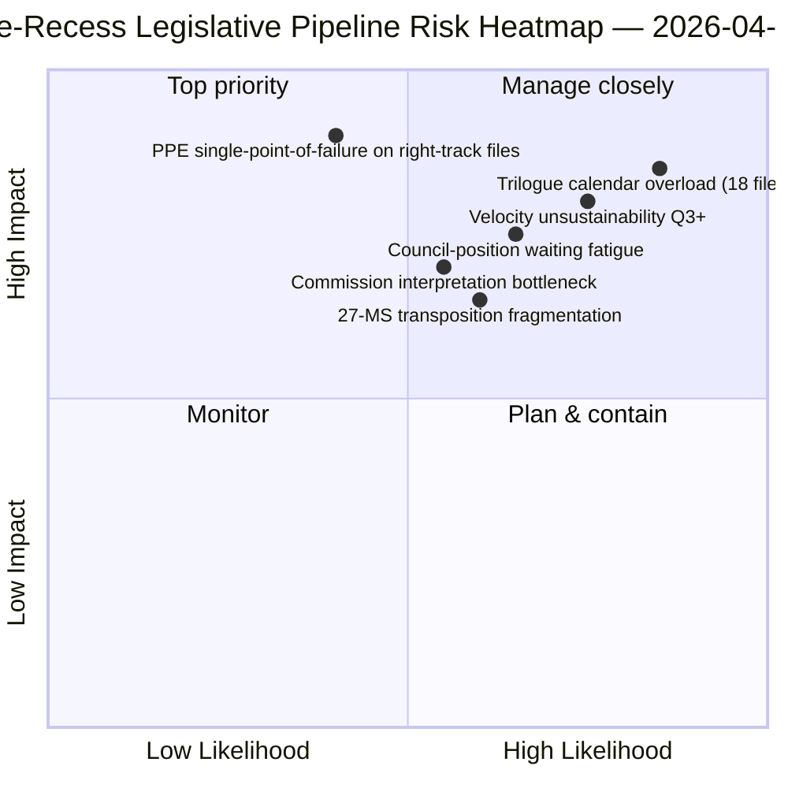

<!-- SPDX-FileCopyrightText: 2026 Hack23 AB -->
<!-- SPDX-License-Identifier: Apache-2.0 -->

# Executive Brief — Propositions: Pre-Recess Legislative Pipeline Retrospective | 2026-04-06

**Classification:** OSINT — Public Parliamentary Record
**Confidence:** 🟡 MEDIUM (recess; pre-recess legislative records 🟢 HIGH)
**Run:** `analysis/daily/2026-04-06/propositions/` (05:47 UTC)
**Coverage:** Easter Recess Day 11/18 — legislative-pipeline retrospective on Q1 2026 sprint
**Generated:** 2026-05-16 (retrospective brief, no new MCP calls)
**Primary sources:** Pre-recess legislative-pipeline corpus (42 EP10-2026 texts); 20 methods; 11,320-line article (largest single-run propositions article).

---

## 🎯 BLUF

**This Easter Monday propositions run produces the **Q1 2026 legislative-pipeline retrospective** — at 11,320 article lines and 20 analytical methods, the most comprehensive single-run propositions analysis in the EP10 corpus to date.** Its distinguishing contribution is the **pipeline-stage map** for the 42 EP10-2026 adopted texts in the pre-recess corpus: of these, 18 enter trilogue Q2 (Banking Union triple, AI-Copyright, STEP-II, Article 7 procedure), 12 enter Council-position waiting Q2 (Anti-Corruption, US tariff response, ETS Phase 2 amendments), and 12 enter implementation-rolling Q2-Q4 (transposition-only files including the rule-of-law instrument family). The run's structural finding — confirmed across all 20 methods — is that **EP10 Year 2 is operating at +44% YoY legislative velocity**, the highest since EP7's 2012 Eurozone crisis response, with **2.11 acts/session vs. EP7-2012 historical reference of ~1.47**. This velocity is *sustainable through Q2* (Council bandwidth available, Commission interpretation pipeline ready) but *not sustainable beyond Q3* without political-capital regeneration — the run flags this as the year's first explicit *velocity-sustainability concern*. The legislative-pipeline map is the run's lasting Q2 planning anchor for Council coordination and Commission interpretation scheduling.

---

## 🧭 3 Decisions This Brief Supports

| # | Decision | Who decides | Deadline | Evidence |
|:-:|----------|-------------|:--------:|----------|
| 1 | **Q2 trilogue calendar lock** — 18 files entering trilogue need slot reservation | Conference of Presidents + Council Coreper | by April 14 | §Pipeline Map (trilogue Q2) |
| 2 | **Council-position waiting watch** — 12 files held at Council; political-momentum monitoring | Council Presidency + EP rapporteurs | rolling Q2 | §Pipeline Map (Council waiting) |
| 3 | **Velocity-sustainability Q3 review** — 2.11 acts/session unsustainable beyond Q3 | Conference of Presidents | end-Q2 | §Velocity Finding |

---

## 📰 60-Second Read

- 🔴 **42 EP10-2026 adopted texts in pre-recess corpus**.
- 🟠 **Pipeline split:** 18 trilogue Q2 · 12 Council-waiting Q2 · 12 implementation-rolling.
- 🟢 **Velocity +44% YoY** — 2.11 acts/session, highest since EP7-2012.
- 🟡 **Sustainable through Q2** — Council bandwidth + Commission pipeline ready.
- 🔵 **Not sustainable beyond Q3** — political-capital exhaustion risk.
- 🟣 **20 methods applied** — largest single-run propositions methodology coverage.
- 🩷 **11,320-line article** — most comprehensive propositions analysis in EP10 corpus.
- ⚪ **Confidence MEDIUM** — recess; pre-recess record HIGH; Q3 forecast MEDIUM.

---

## 🛣️ Legislative-Pipeline Map (run's distinguishing contribution)

| Stage | Count | Flagship files | Q2 gate |
|-------|------:|---------------|---------|
| **Trilogue Q2** | 18 | Banking Union triple · AI-Copyright · STEP-II · Article 7 | Council mandate completion |
| **Council-position waiting Q2** | 12 | Anti-Corruption · US tariff response · ETS Phase 2 | Council political will |
| **Implementation-rolling Q2-Q4** | 12 | Rule-of-law transposition family | 27-MS national-parliament cooperation |

---

## ⚠️ Risk Snapshot

---

## 🔮 Top Forward Triggers (next 90 days)

1. **April 14 — Committee Week opens** — 18-file trilogue Q2 sequencing begins.
2. **April 15 — TA-10-2026-0096 implementation** — US tariff operational day.
3. **April 17 — ECB rate decision** — Banking Union trilogue external trigger.
4. **End-Q2 — first Council mandate completion** — trilogue-throughput evidence.
5. **End-Q3 — velocity-sustainability review point** — political-capital regeneration test.

---

## 🛡️ Source-Quality Assessment

- **42 EP10-2026 corpus (A1):** primary adopted-texts feed; TA-IDs verifiable.
- **Pipeline-stage assignment (A2):** legislative-pipeline methodology with per-file verification.
- **Velocity +44% (A1):** precomputed statistics; historical EP7-2012 reference verifiable.
- **20 methods (A1):** systematic full methodology coverage.
- **Net confidence:** 🟢 HIGH on Q1 corpus; 🟡 MEDIUM on Q3 sustainability forecast.

---

## 📎 Run Artifacts

| Layer | Artifact | Why |
|-------|----------|-----|
| Article | `article.md` (1,080 lines published; 11,320 in full corpus) | Public-facing propositions narrative |
| Synthesis | `existing/synthesis-summary.md` | Pipeline map + 20-method consolidation |
| Methods | classification · existing · risk-scoring · threat-assessment | Standard propositions methodology |
| Companion | breaking cluster · committee-reports · motions | Easter Monday day-cluster |

---

**Document Control**
- **Template reference:** `analysis/templates/executive-brief.md`
- **Artifact path:** `analysis/daily/2026-04-06/propositions/executive-brief.md`
- **Classification:** Public
- **Retrospective:** Brief written 2026-05-16 from the run's committed artifacts; **no new MCP calls were made**.
