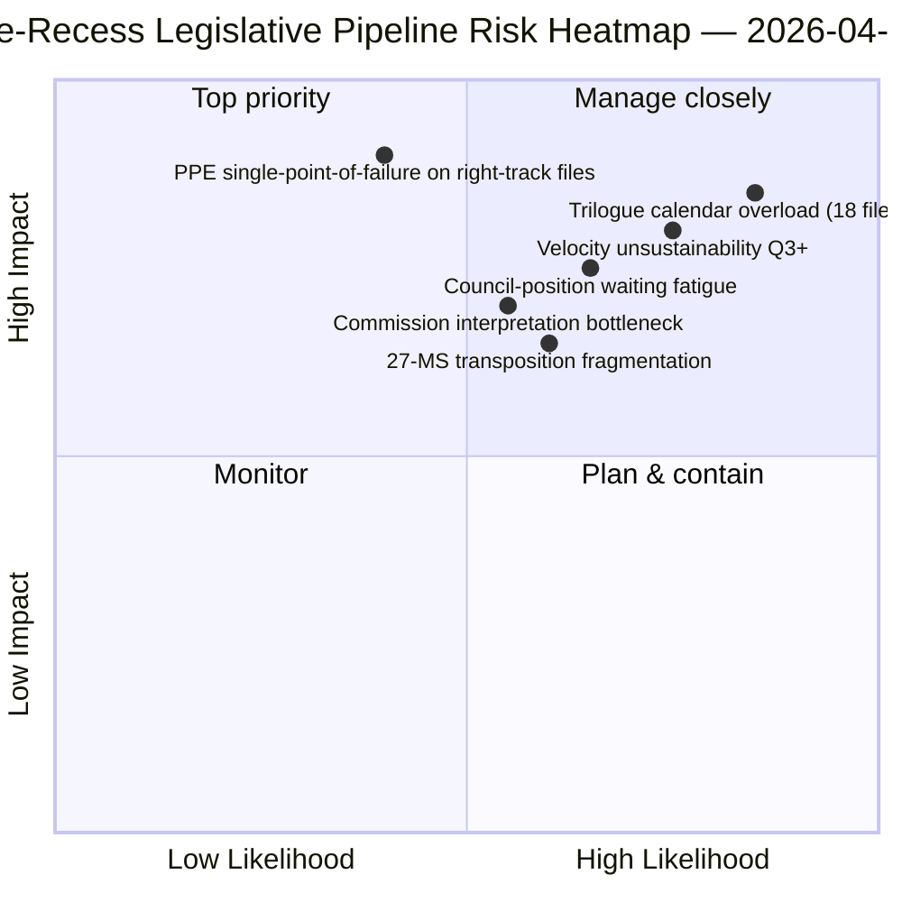

<!-- SPDX-FileCopyrightText: 2026 Hack23 AB -->
<!-- SPDX-License-Identifier: Apache-2.0 -->

# ملخص تنفيذي — المقترحات: استعراض مسار التشريع قبل العطلة | 2026-04-06

**التصنيف:** OSINT — سجلات برلمانية عامة
**الموثوقية:** 🟡 متوسطة (عطلة؛ بروتوكول تشريعي قبل العطلة 🟢 عالية)
**التشغيل:** `analysis/daily/2026-04-06/propositions/` (05:47 UTC)
**التغطية:** عطلة الفصح يوم 11/18 — استعراض مسار التشريع الربع الأول من 2026
**تاريخ الإنشاء:** 2026-05-16 (ملخص استعراضي، لا استدعاءات MCP جديدة)
**المصادر الرئيسية:** مجموعة مسار التشريع قبل العطلة (42 نصاً من EP10-2026)؛ 20 منهجية؛ مقال من 11,320 سطراً (أشمل مقال مقترحات في تشغيل واحد).

---

## 🎯 BLUF

**ينتج تشغيل مقترحات يوم الإثنين من عطلة الفصح **استعراض مسار التشريع للربع الأول من 2026** — بـ 11,320 سطراً في المقال و20 منهجية تحليلية، وهو الأشمل من نوعه في مجموعة EP10 حتى الآن.** إسهامه المميز هو **خريطة مراحل المسار** للـ 42 نصاً المعتمداً من EP10-2026 في المجموعة قبل العطلة: منها 18 تدخل مرحلة المفاوضات الثلاثية في الربع الثاني (ثلاثي الاتحاد المصرفي، الذكاء الاصطناعي-حقوق المؤلف، STEP-II، إجراء المادة 7)، و12 في انتظار موقف المجلس بالربع الثاني (مكافحة الفساد، الرد على الرسوم الجمركية الأمريكية، تعديلات ETS المرحلة الثانية)، و12 في التنفيذ المستمر بالربع الثاني حتى الرابع (ملفات النقل بما في ذلك عائلة أدوات سيادة القانون). الاستنتاج الهيكلي للتشغيل — المؤكد عبر جميع المنهجيات العشرين — هو أن **EP10 السنة الثانية تعمل بسرعة تشريعية +44% على أساس سنوي**، وهي الأعلى منذ استجابة EP7 لأزمة منطقة اليورو عام 2012، بـ **2.11 فعل/جلسة مقابل مرجع EP7-2012 التاريخي البالغ ~1.47**. هذه السرعة *مستدامة حتى الربع الثاني* (طاقة المجلس متاحة، مسار تفسير المفوضية جاهز) لكنها *غير مستدامة بعد الربع الثالث* دون تجديد رأس المال السياسي — وهذا أول *قلق صريح حول استدامة السرعة* هذا العام. خريطة المسار التشريعي هي مرساة التخطيط الدائمة للربع الثاني لتنسيق المجلس وجدولة تفسير المفوضية.

---

## 🧭 3 قرارات يدعمها هذا الملخص

| # | القرار | من يقرر | الموعد النهائي | الدليل |
|:-:|--------|---------|:-------------:|--------|
| 1 | **إغلاق تقويم المفاوضات الثلاثية للربع الثاني** — 18 ملفاً تحتاج حجز مواعيد | مؤتمر الرؤساء + المجلس كوريبير | قبل 14 أبريل | §خريطة المسار (مفاوضات ثلاثية ق2) |
| 2 | **مراقبة الانتظار في المجلس** — 12 ملفاً محتجزة في المجلس؛ متابعة الزخم السياسي | رئاسة المجلس + مقررو البرلمان | ق2 مستمر | §خريطة المسار (المجلس ينتظر) |
| 3 | **مراجعة استدامة السرعة في الربع الثالث** — 2.11 فعل/جلسة غير مستدامة بعد ق3 | مؤتمر الرؤساء | نهاية ق2 | §نتائج السرعة |

---

## 📰 قراءة 60 ثانية

- 🔴 **42 نصاً معتمداً من EP10-2026 في المجموعة قبل العطلة**.
- 🟠 **توزيع المسار:** 18 مفاوضات ثلاثية ق2 · 12 مجلس ينتظر ق2 · 12 تنفيذ مستمر.
- 🟢 **السرعة +44% سنوياً** — 2.11 فعل/جلسة، الأعلى منذ EP7-2012.
- 🟡 **مستدامة حتى ق2** — طاقة المجلس + مسار المفوضية جاهز.
- 🔵 **غير مستدامة بعد ق3** — خطر استنفاد رأس المال السياسي.
- 🟣 **20 منهجية مطبقة** — أكبر تغطية منهجية في تشغيل مقترحات واحد.
- 🩷 **مقال 11,320 سطر** — أشمل تحليل مقترحات في مجموعة EP10.
- ⚪ **الموثوقية متوسطة** — عطلة؛ البروتوكول قبل العطلة عالي؛ توقعات ق3 متوسطة.

---

## 🛣️ خريطة المسار التشريعي (الإسهام المميز للتشغيل)

| المرحلة | العدد | الملفات الرائدة | بوابة ق2 |
|---------|------:|-----------------|----------|
| **مفاوضات ثلاثية ق2** | 18 | ثلاثي الاتحاد المصرفي · ذكاء اصطناعي-حقوق مؤلف · STEP-II · المادة 7 | إغلاق ولاية المجلس |
| **انتظار موقف المجلس ق2** | 12 | مكافحة الفساد · رد على رسوم أمريكية · ETS م2 | الإرادة السياسية للمجلس |
| **تنفيذ مستمر ق2-ق4** | 12 | عائلة نقل سيادة القانون | تنسيق البرلمانات الوطنية 27-دولة |

---

## ⚠️ لمحة المخاطر

---

## 🔮 أهم المحفزات المستقبلية (90 يوماً القادمة)

1. **14 أبريل — افتتاح أسبوع اللجنة** — يبدأ تسلسل المفاوضات الثلاثية للربع الثاني لـ18 ملفاً.
2. **15 أبريل — تنفيذ TA-10-2026-0096** — يوم التشغيل للرسوم الجمركية الأمريكية.
3. **17 أبريل — قرار الفائدة للبنك المركزي الأوروبي** — محفز خارجي لمفاوضات ثلاثية الاتحاد المصرفي.
4. **نهاية ق2 — أول إغلاق ولاية للمجلس** — دليل على إنتاجية المفاوضات الثلاثية.
5. **نهاية ق3 — نقطة مراجعة استدامة السرعة** — اختبار تجديد رأس المال السياسي.

---

## 🛡️ تقييم جودة المصادر

- **مجموعة EP10-2026 البالغة 42 نصاً (A1):** المصدر الرئيسي للنصوص المعتمدة؛ معرّفات TA قابلة للتحقق.
- **تعيين مرحلة المسار (A2):** منهجية مسار التشريع مع التحقق ملف بملف.
- **السرعة +44% (A1):** إحصاء محسوب مسبقاً؛ المرجع التاريخي EP7-2012 قابل للتحقق.
- **20 منهجية (A1):** تغطية منهجية كاملة ومنهجية.
- **الموثوقية الصافية:** 🟢 عالية لمجموعة ق1؛ 🟡 متوسطة لتوقعات استدامة ق3.

---

## 📎 مخرجات التشغيل

| الطبقة | المخرج | السبب |
|--------|--------|-------|
| المقال | `article.md` (1,080 سطراً منشوراً؛ 11,320 في المجموعة الكاملة) | السرد العام للمقترحات |
| التوليف | `existing/synthesis-summary.md` | خريطة المسار + توحيد 20 منهجية |
| المنهجيات | تصنيف · قائم · تقييم المخاطر · تقييم التهديدات | منهجية المقترحات القياسية |
| المرافق | مجموعة عاجلة · تقارير لجان · أحداث | مجموعة يوم عطلة عيد الفصح |

---

**ضبط الوثيقة**
- **مرجع القالب:** `analysis/templates/executive-brief.md`
- **مسار المخرج:** `analysis/daily/2026-04-06/propositions/executive-brief.md`
- **التصنيف:** عام
- **استعراضي:** تم تأليف الملخص في 2026-05-16 من مخرجات التشغيل الملتزمة؛ **لم تُجرَ استدعاءات MCP جديدة**.
