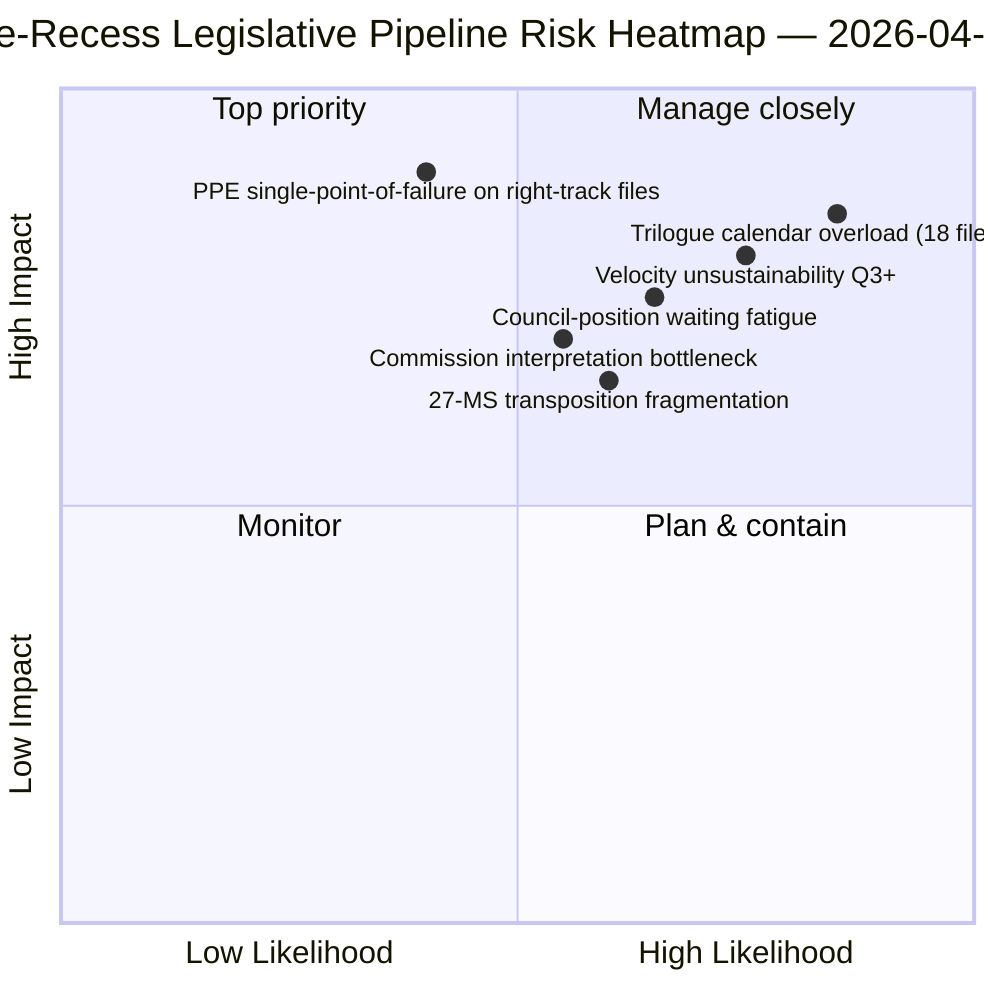

<!-- SPDX-FileCopyrightText: 2026 Hack23 AB -->
<!-- SPDX-License-Identifier: Apache-2.0 -->

# Eksekutiv Briefing — Forslag: Retrospektiv af lovgivningspipeline før ferie | 2026-04-06

**Klassificering:** OSINT — Offentlig parlamentarisk optegnelse
**Tillid:** 🟡 MIDDEL (ferie; lovgivningsoptegnelser før ferie 🟢 HØJ)
**Kørsel:** `analysis/daily/2026-04-06/propositions/` (05:47 UTC)
**Dækning:** Påskeferie dag 11/18 — retrospektiv af lovgivningspipeline Q1 2026
**Genereret:** 2026-05-16 (retrospektiv briefing, ingen nye MCP-kald)
**Primære kilder:** Lovgivningspipeline-korpus før ferie (42 EP10-2026-tekster); 20 metoder; 11.320-linjers artikel (den mest omfattende forslagsartikel fra en enkelt kørsel).

---

## 🎯 BLUF

**Denne påskemandag-forslagskørsel producerer **Q1 2026 retrospektiv analyse af lovgivningspipelinen** — med 11.320 artikellinjer og 20 analytiske metoder, den mest omfattende forslagsanalyse fra en enkelt kørsel i EP10-korpusset hidtil.** Dens særlige bidrag er **pipeline-stadiekortet** for de 42 EP10-2026-vedtagne tekster i korpusset før ferien: af disse går 18 i trialog Q2 (Banking Union-triple, AI-Copyright, STEP-II, artikel 7-procedure), 12 i rådspositionsventen Q2 (antikorruption, svar på amerikanske told, ETS fase 2-ændringer) og 12 i implementeringsrullende Q2-Q4 (transpositionsfiler inkl. retsstatsinstrumentfamilien). Kørslens strukturelle fund — bekræftet på tværs af alle 20 metoder — er at **EP10 år 2 opererer med +44% YoY lovgivningshastighed**, den højeste siden EP7's eurozone-kriserespons i 2012, med **2,11 retsakter/session vs. EP7-2012 historisk reference på ~1,47**. Denne hastighed er *bæredygtig through Q2* (rådskapacitet tilgængelig, Kommissionens fortolkningspipeline klar) men *ikke bæredygtig ud over Q3* uden regenerering af politisk kapital — kørslens første eksplicitte *hastigheds-bæredygtighedsbekymring*. Lovgivningspipeline-kortet er kørslens varige Q2-planlægningsanker for rådskoordinering og Kommissionens fortolkningsplanlægning.

---

## 🧭 3 Beslutninger denne briefing understøtter

| # | Beslutning | Hvem beslutter | Deadline | Bevis |
|:-:|------------|----------------|:--------:|-------|
| 1 | **Q2-trialogkalenderlås** — 18 filer i trialog Q2 behøver tidsbookning | Formandskonferencen + Rådet Coreper | inden 14. april | §Pipeline-kort (trialog Q2) |
| 2 | **Overvågning af rådspositionsventen** — 12 filer holdt i rådet; overvågning af politisk momentum | Rådsformandskabet + EP-ordførere | rullende Q2 | §Pipeline-kort (rådet venter) |
| 3 | **Q3-gennemgang af hastighedsbæredygtighed** — 2,11 retsakter/session ikke bæredygtig ud over Q3 | Formandskonferencen | slut-Q2 | §Hastighedsfund |

---

## 📰 60-sekunders læsning

- 🔴 **42 EP10-2026-vedtagne tekster i corpus før ferie**.
- 🟠 **Pipeline-opdeling:** 18 trialog Q2 · 12 rådet venter Q2 · 12 implementeringsrullende.
- 🟢 **Hastighed +44% YoY** — 2,11 retsakter/session, højest siden EP7-2012.
- 🟡 **Bæredygtig through Q2** — rådskapacitet + Kommissionens pipeline klar.
- 🔵 **Ikke bæredygtig ud over Q3** — risiko for udmattelse af politisk kapital.
- 🟣 **20 metoder anvendt** — størst metodologidækning i enkelt forslagskørsel.
- 🩷 **11.320-linjers artikel** — den mest omfattende forslagsanalyse i EP10-korpusset.
- ⚪ **Tillid MIDDEL** — ferie; optegnelser før ferie HØJ; Q3-prognose MIDDEL.

---

## 🛣️ Lovgivningspipeline-kort (kørslens særlige bidrag)

| Stadie | Antal | Flagskibsfiler | Q2-port |
|--------|------:|---------------|---------|
| **Trialog Q2** | 18 | Banking Union-triple · AI-Copyright · STEP-II · artikel 7 | Rådets mandatafslutning |
| **Rådspositionsventen Q2** | 12 | Antikorruption · Svar på amerikanske told · ETS fase 2 | Rådets politiske vilje |
| **Implementeringsrullende Q2-Q4** | 12 | Retsstatstranspositionsfamilie | 27-MS nationalparlamentarisk samarbejde |

---

## ⚠️ Risikoøjebliksbillede

---

## 🔮 Top fremtidige udløsere (næste 90 dage)

1. **14. april — Udvalgsuge åbner** — 18-fils trialog Q2-sekvensering begynder.
2. **15. april — TA-10-2026-0096 implementering** — Operativ dag for amerikanske told.
3. **17. april — ECB-rentebeslutning** — Ekstern udløser for Banking Union-trialog.
4. **Slut-Q2 — første rådets mandatafslutning** — Bevis for trialog-gennemstrømning.
5. **Slut-Q3 — punkt for gennemgang af hastighedsbæredygtighed** — Test for regenerering af politisk kapital.

---

## 🛡️ Vurdering af kildekvalitet

- **42 EP10-2026-korpus (A1):** primært feed af vedtagne tekster; TA-ID'er verificerbare.
- **Pipeline-stadie-tildeling (A2):** lovgivningspipeline-metodologi med per-fils verifikation.
- **Hastighed +44% (A1):** forudberegnet statistik; historisk EP7-2012-reference verificerbar.
- **20 metoder (A1):** systematisk fuld metodologidækning.
- **Nettotillid:** 🟢 HØJ på Q1-korpus; 🟡 MIDDEL på Q3-bæredygtighedsprognose.

---

## 📎 Kørselsartefakter

| Lag | Artefakt | Hvorfor |
|-----|----------|---------|
| Artikel | `article.md` (1.080 linjer publiceret; 11.320 i fuldt korpus) | Offentlig forslagsnarrativ |
| Syntese | `existing/synthesis-summary.md` | Pipeline-kort + 20-metodes konsolidering |
| Metoder | klassificering · eksisterende · risikovurdering · trusselsvurdering | Standard forslagsmetodologi |
| Ledsager | breaking-klynge · udvalgsrapporter · motioner | Påskedagsklynge |

---

**Dokumentkontrol**
- **Skabelonreference:** `analysis/templates/executive-brief.md`
- **Artefaktsti:** `analysis/daily/2026-04-06/propositions/executive-brief.md`
- **Klassificering:** Offentlig
- **Retrospektiv:** Briefing skrevet 2026-05-16 fra kørslens committede artefakter; **ingen nye MCP-kald blev foretaget**.
