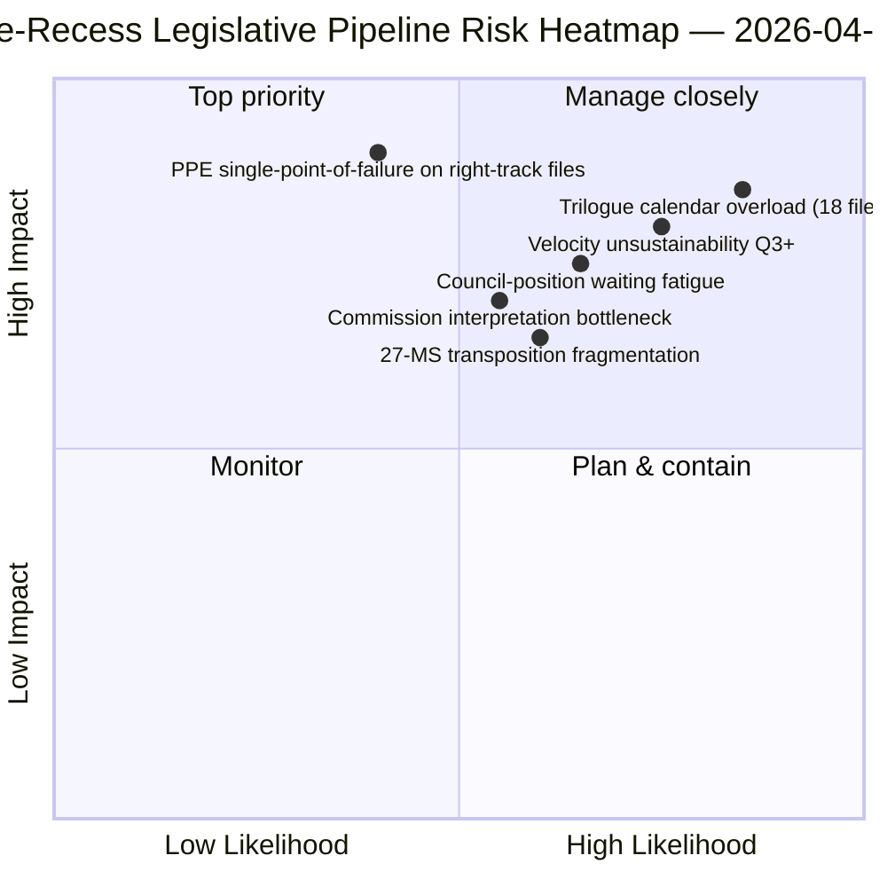

<!-- SPDX-FileCopyrightText: 2026 Hack23 AB -->
<!-- SPDX-License-Identifier: Apache-2.0 -->

# Kurzfassung — Vorschläge: Rückblick auf die Legislative Pipeline vor der Pause | 2026-04-06

**Klassifizierung:** OSINT — Öffentliche parlamentarische Aufzeichnungen
**Zuverlässigkeit:** 🟡 MITTEL (Pause; Gesetzgebungsprotokoll vor der Pause 🟢 HOCH)
**Lauf:** `analysis/daily/2026-04-06/propositions/` (05:47 UTC)
**Abdeckung:** Osterpause Tag 11/18 — Rückblick auf die legislative Pipeline Q1 2026
**Erstellt:** 2026-05-16 (retrospektive Zusammenfassung, keine neuen MCP-Aufrufe)
**Primärquellen:** Legislative Pipeline-Korpus vor der Pause (42 EP10-2026-Texte); 20 Methoden; 11.320-zeilige Artikel (der umfassendste Vorschlagsartikel eines einzelnen Laufs).

---

## 🎯 BLUF

**Dieser Ostermontag-Vorschlagslauf produziert die **Q1 2026-Rückschau auf die legislative Pipeline** — mit 11.320 Artikelzeilen und 20 analytischen Methoden, die umfassendste Vorschlagsanalyse eines einzelnen Laufs im EP10-Korpus bisher.** Ihr herausragender Beitrag ist die **Pipeline-Stadien-Karte** für die 42 EP10-2026-Verabschiedungstexte im Korpus vor der Pause: Davon gehen 18 in das Trilog Q2 ein (Banking Union-Trio, AI-Urheberrecht, STEP-II, Artikel-7-Verfahren), 12 in Warteposition des Rates Q2 (Antikorruption, Antwort auf US-Zölle, ETS-Phase-2-Änderungen) und 12 in laufende Implementierung Q2-Q4 (Umsetzungsdateien einschließlich der Rechtsstaatlichkeits-Instrumentenfamilie). Das strukturelle Befund des Laufs — bestätigt über alle 20 Methoden hinweg — ist, dass **EP10 Jahr 2 mit einer um +44% gegenüber dem Vorjahr gesteigerten Gesetzgebungsgeschwindigkeit operiert**, der höchsten seit der Eurokrisenreaktion EP7 2012, mit **2,11 Rechtsakten/Sitzung gegenüber der historischen EP7-2012-Referenz von ~1,47**. Diese Geschwindigkeit ist *nachhaltig durch Q2* (Ratskapazität verfügbar, Interpretationspipeline der Kommission bereit), aber *nicht nachhaltig über Q3 hinaus* ohne Wiederherstellung von politischem Kapital — dies ist die erste explizite *Nachhaltigkeitssorge hinsichtlich der Geschwindigkeit* des laufenden Jahres. Die Legislative Pipeline-Karte ist der dauerhafte Q2-Planungsanker für die Koordinierung mit dem Rat und die Terminplanung der Kommissionsinterpretation.

---

## 🧭 3 Entscheidungen, die diese Zusammenfassung unterstützt

| # | Entscheidung | Wer entscheidet | Frist | Beleg |
|:-:|--------------|-----------------|:-----:|-------|
| 1 | **Q2-Trilog-Kalenderverriegelung** — 18 Dateien in Trilog Q2 erfordern Zeitbuchungen | Konferenz der Präsidenten + Rat Coreper | bis 14. April | §Pipeline-Karte (Trilog Q2) |
| 2 | **Überwachung der Ratswarteposition** — 12 Dateien im Rat gehalten; Beobachtung des politischen Impulses | Ratsvorsitz + EP-Berichterstatter | laufend Q2 | §Pipeline-Karte (Rat wartet) |
| 3 | **Q3-Überprüfung der Geschwindigkeitsnachhaltigkeit** — 2,11 Rechtsakte/Sitzung nicht nachhaltig über Q3 | Konferenz der Präsidenten | Ende Q2 | §Geschwindigkeitsbefund |

---

## 📰 60-Sekunden-Lektüre

- 🔴 **42 EP10-2026-Verabschiedungstexte im Korpus vor der Pause**.
- 🟠 **Pipeline-Aufteilung:** 18 Trilog Q2 · 12 Rat wartet Q2 · 12 Implementierung laufend.
- 🟢 **Geschwindigkeit +44% gegenüber Vorjahr** — 2,11 Rechtsakte/Sitzung, höchste seit EP7-2012.
- 🟡 **Nachhaltig durch Q2** — Ratskapazität + Kommissions-Pipeline bereit.
- 🔵 **Nicht nachhaltig über Q3 hinaus** — Erschöpfungsrisiko des politischen Kapitals.
- 🟣 **20 Methoden angewendet** — größte Methodenabdeckung in einem einzelnen Vorschlagslauf.
- 🩷 **11.320-zeilige Artikel** — umfassendste Vorschlagsanalyse im EP10-Korpus.
- ⚪ **Zuverlässigkeit MITTEL** — Pause; Protokoll vor der Pause HOCH; Q3-Prognose MITTEL.

---

## 🛣️ Legislative Pipeline-Karte (herausragender Beitrag des Laufs)

| Stadium | Anzahl | Flaggschiff-Dateien | Q2-Tor |
|---------|-------:|---------------------|--------|
| **Trilog Q2** | 18 | Banking Union-Trio · AI-Urheberrecht · STEP-II · Artikel 7 | Mandatsabschluss des Rates |
| **Ratswarteposition Q2** | 12 | Antikorruption · Antwort auf US-Zölle · ETS Phase 2 | Politischer Wille des Rates |
| **Implementierung laufend Q2-Q4** | 12 | Rechtsstaatlichkeits-Umsetzungsfamilie | 27-MS Nationalparlamentskoordination |

---

## ⚠️ Risiko-Schnappschuss

---

## 🔮 Top-Zukunftsauslöser (nächste 90 Tage)

1. **14. April — Ausschusswoche öffnet** — Sequenzierung des 18-Dateien-Trilogs Q2 beginnt.
2. **15. April — TA-10-2026-0096 Implementierung** — Operativer Tag für US-Zölle.
3. **17. April — EZB-Zinsentscheidung** — Externer Auslöser für das Banking Union-Trilog.
4. **Ende Q2 — erster Mandatsabschluss des Rates** — Nachweis für Trilog-Durchsatz.
5. **Ende Q3 — Prüfpunkt der Geschwindigkeitsnachhaltigkeit** — Test der Regenerierung politischen Kapitals.

---

## 🛡️ Bewertung der Quellqualität

- **42 EP10-2026-Korpus (A1):** primärer Feed verabschiedeter Texte; TA-IDs verifizierbar.
- **Pipeline-Stadien-Zuordnung (A2):** Legislative Pipeline-Methodologie mit dateiweiser Verifikation.
- **Geschwindigkeit +44% (A1):** vorberechnete Statistik; historische EP7-2012-Referenz verifizierbar.
- **20 Methoden (A1):** systematisch vollständige Methodenabdeckung.
- **Netto-Zuverlässigkeit:** 🟢 HOCH für Q1-Korpus; 🟡 MITTEL für Q3-Nachhaltigkeitsprognose.

---

## 📎 Lauf-Artefakte

| Schicht | Artefakt | Warum |
|---------|----------|-------|
| Artikel | `article.md` (1.080 veröffentlichte Zeilen; 11.320 im vollständigen Korpus) | Öffentliches Vorschlagsnarrativ |
| Synthese | `existing/synthesis-summary.md` | Pipeline-Karte + 20-Methoden-Konsolidierung |
| Methoden | Klassifizierung · Bestand · Risikobewertung · Bedrohungsbewertung | Standard-Vorschlagsmethodik |
| Begleitend | Breaking-Cluster · Ausschussberichte · Motionen | Osterfeiertag-Tagescluster |

---

**Dokumentenkontrolle**
- **Vorlagenreferenz:** `analysis/templates/executive-brief.md`
- **Artefaktpfad:** `analysis/daily/2026-04-06/propositions/executive-brief.md`
- **Klassifizierung:** Öffentlich
- **Retrospektiv:** Zusammenfassung am 2026-05-16 aus den committeten Artefakten des Laufs erstellt; **keine neuen MCP-Aufrufe wurden gemacht**.
