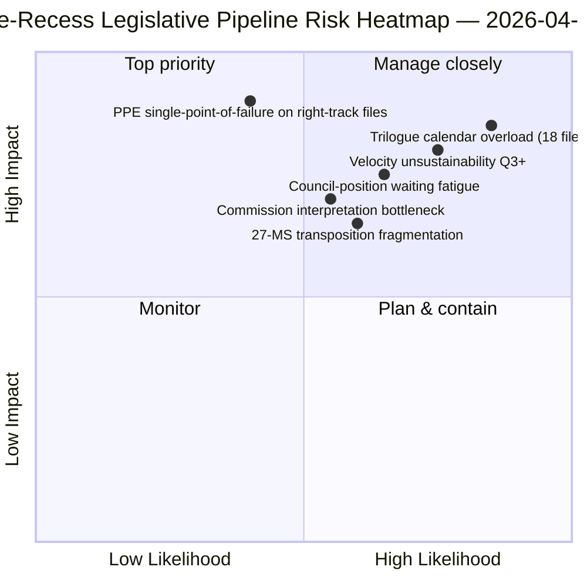

<!-- SPDX-FileCopyrightText: 2026 Hack23 AB -->
<!-- SPDX-License-Identifier: Apache-2.0 -->

# Resumen Ejecutivo — Propuestas: Retrospectiva del Canal Legislativo antes del Receso | 2026-04-06

**Clasificación:** OSINT — Registro parlamentario público
**Fiabilidad:** 🟡 MEDIA (receso; protocolo legislativo previo al receso 🟢 ALTA)
**Ejecución:** `analysis/daily/2026-04-06/propositions/` (05:47 UTC)
**Cobertura:** Receso de Pascua día 11/18 — retrospectiva del canal legislativo T1 2026
**Generado:** 2026-05-16 (resumen retrospectivo, sin nuevas llamadas MCP)
**Fuentes principales:** Corpus del canal legislativo previo al receso (42 textos EP10-2026); 20 metodologías; artículo de 11 320 líneas (el artículo de propuestas de mayor alcance de una sola ejecución).

---

## 🎯 BLUF

**Esta ejecución de propuestas del lunes de Pascua produce la **retrospectiva del canal legislativo T1 2026** — con 11 320 líneas de artículo y 20 metodologías analíticas, el análisis de propuestas más exhaustivo de una sola ejecución en el corpus EP10 hasta la fecha.** Su contribución distintiva es el **mapa de etapas del canal** para los 42 textos adoptados EP10-2026 en el corpus previo al receso: de estos, 18 entran en trílogo T2 (trío Unión Bancaria, IA-Derechos de Autor, STEP-II, procedimiento Artículo 7), 12 en espera de posición del Consejo T2 (anticorrupción, respuesta a aranceles EE.UU., modificaciones ETS fase 2) y 12 en implementación continua T2-T4 (archivos de transposición incluyendo la familia de instrumentos de Estado de Derecho). El hallazgo estructural de la ejecución — confirmado a través de las 20 metodologías — es que **el EP10 año 2 opera con una velocidad legislativa +44 % interanual**, la más alta desde la respuesta a la crisis de la zona euro del EP7 en 2012, con **2,11 actos/sesión frente a la referencia histórica EP7-2012 de ~1,47**. Esta velocidad es *sostenible hasta T2* (capacidad del Consejo disponible, canal de interpretación de la Comisión listo) pero *no sostenible más allá de T3* sin regeneración de capital político — esta es la primera *preocupación de sostenibilidad de velocidad* explícita del año en curso. El mapa del canal legislativo es el ancla duradera de planificación T2 para la coordinación con el Consejo y la programación de la interpretación de la Comisión.

---

## 🧭 3 Decisiones que este resumen respalda

| # | Decisión | Quién decide | Plazo | Evidencia |
|:-:|----------|--------------|:-----:|-----------|
| 1 | **Bloqueo del calendario de trílogo T2** — 18 archivos en trílogo T2 requieren reservas de tiempo | Conferencia de Presidentes + Consejo Coreper | antes del 14 de abril | §Mapa del canal (trílogo T2) |
| 2 | **Monitoreo de la espera de posición del Consejo** — 12 archivos retenidos en el Consejo; seguimiento del impulso político | Presidencia del Consejo + ponentes PE | T2 continuo | §Mapa del canal (Consejo en espera) |
| 3 | **Revisión de sostenibilidad de velocidad en T3** — 2,11 actos/sesión no sostenibles más allá de T3 | Conferencia de Presidentes | final T2 | §Hallazgo de velocidad |

---

## 📰 Lectura de 60 segundos

- 🔴 **42 textos adoptados EP10-2026 en el corpus previo al receso**.
- 🟠 **División del canal:** 18 trílogo T2 · 12 Consejo en espera T2 · 12 implementación continua.
- 🟢 **Velocidad +44 % i.a.** — 2,11 actos/sesión, la más alta desde EP7-2012.
- 🟡 **Sostenible hasta T2** — capacidad del Consejo + canal de la Comisión listo.
- 🔵 **No sostenible más allá de T3** — riesgo de agotamiento del capital político.
- 🟣 **20 metodologías aplicadas** — mayor cobertura metodológica en una sola ejecución de propuestas.
- 🩷 **Artículo de 11 320 líneas** — el análisis de propuestas más exhaustivo del corpus EP10.
- ⚪ **Fiabilidad MEDIA** — receso; protocolo previo al receso ALTA; previsión T3 MEDIA.

---

## 🛣️ Mapa del Canal Legislativo (contribución distintiva de la ejecución)

| Etapa | Cantidad | Archivos insignia | Puerta T2 |
|-------|--------:|-------------------|----------|
| **Trílogo T2** | 18 | Trío Unión Bancaria · IA-Derechos de Autor · STEP-II · Artículo 7 | Cierre del mandato del Consejo |
| **Espera posición Consejo T2** | 12 | Anticorrupción · Respuesta aranceles EE.UU. · ETS fase 2 | Voluntad política del Consejo |
| **Implementación continua T2-T4** | 12 | Familia de transposición Estado de Derecho | Coordinación parlamentos nacionales 27-EM |

---

## ⚠️ Instantánea de riesgos

---

## 🔮 Principales desencadenantes futuros (próximos 90 días)

1. **14 de abril — Apertura de semana de comisión** — Comienza la secuenciación del trílogo T2 de 18 archivos.
2. **15 de abril — Implementación TA-10-2026-0096** — Día operativo para los aranceles de EE.UU.
3. **17 de abril — Decisión de tipos del BCE** — Desencadenante externo para el trílogo Unión Bancaria.
4. **Final T2 — primer cierre de mandato del Consejo** — Prueba del rendimiento del trílogo.
5. **Final T3 — punto de revisión sostenibilidad de velocidad** — Prueba de regeneración del capital político.

---

## 🛡️ Evaluación de la calidad de las fuentes

- **42 corpus EP10-2026 (A1):** fuente principal de textos adoptados; identificadores TA verificables.
- **Asignación de etapa del canal (A2):** metodología del canal legislativo con verificación por archivo.
- **Velocidad +44 % (A1):** estadística precalculada; referencia histórica EP7-2012 verificable.
- **20 metodologías (A1):** cobertura metodológica sistemáticamente completa.
- **Fiabilidad neta:** 🟢 ALTA en corpus T1; 🟡 MEDIA en previsión de sostenibilidad T3.

---

## 📎 Artefactos de ejecución

| Capa | Artefacto | Por qué |
|------|-----------|---------|
| Artículo | `article.md` (1 080 líneas publicadas; 11 320 en el corpus completo) | Narrativa pública de propuestas |
| Síntesis | `existing/synthesis-summary.md` | Mapa del canal + consolidación 20 metodologías |
| Metodologías | clasificación · existente · puntuación de riesgos · evaluación de amenazas | Metodología estándar de propuestas |
| Acompañamiento | clúster breaking · informes de comisión · mociones | Clúster diario de fiesta de Pascua |

---

**Control documental**
- **Referencia de plantilla:** `analysis/templates/executive-brief.md`
- **Ruta del artefacto:** `analysis/daily/2026-04-06/propositions/executive-brief.md`
- **Clasificación:** Público
- **Retrospectivo:** Resumen redactado el 2026-05-16 a partir de los artefactos comprometidos de la ejecución; **no se realizaron nuevas llamadas MCP**.
