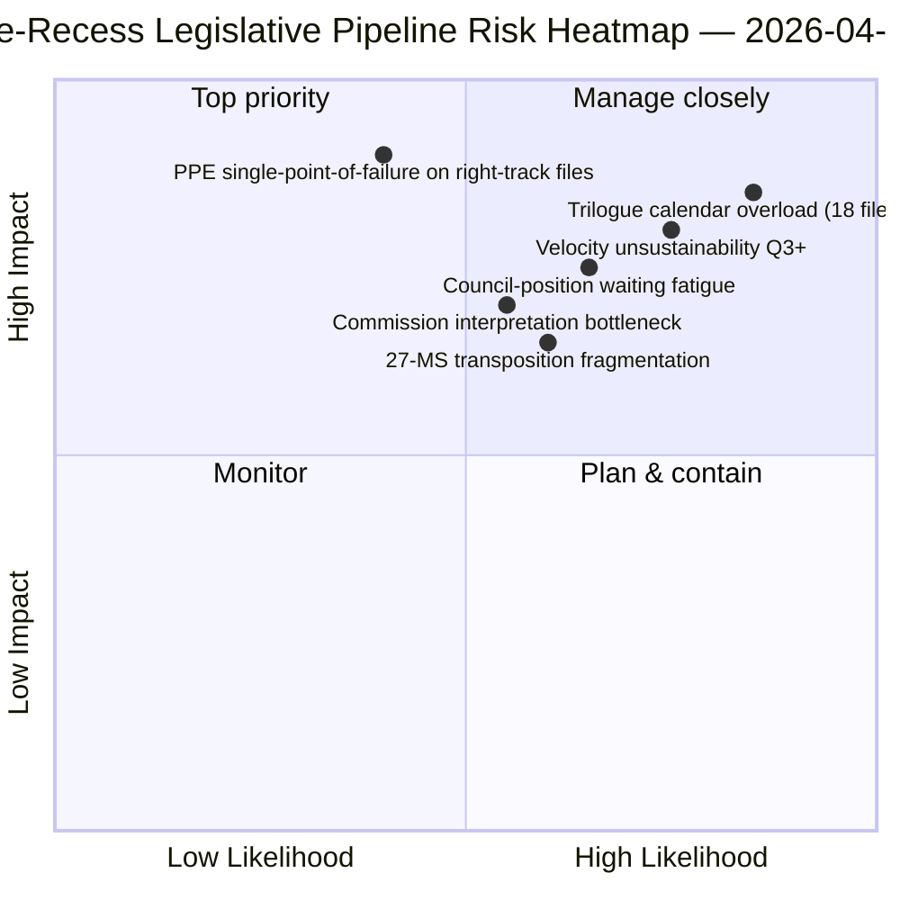

<!-- SPDX-FileCopyrightText: 2026 Hack23 AB -->
<!-- SPDX-License-Identifier: Apache-2.0 -->

# Johdon yhteenveto — Ehdotukset: Lainsäädäntöputken retrospektiivi ennen taukoa | 2026-04-06

**Luokittelu:** OSINT — Julkinen parlamentaarinen asiakirja
**Luotettavuus:** 🟡 KESKITASO (tauko; lainsäädäntöasiakirjat ennen taukoa 🟢 KORKEA)
**Ajo:** `analysis/daily/2026-04-06/propositions/` (05:47 UTC)
**Kattavuus:** Pääsiäistauko päivä 11/18 — lainsäädäntöputken retrospektiivi Q1 2026
**Luotu:** 2026-05-16 (retrospektiivinen yhteenveto, ei uusia MCP-kutsuja)
**Päälähteet:** Lainsäädäntöputken korpus ennen taukoa (42 EP10-2026-tekstiä); 20 menetelmää; 11 320 riviä artikkeli (laajin yksittäisen ajon ehdotusartikkeli).

---

## 🎯 BLUF

**Tämä pääsiäismaanantain ehdotusajo tuottaa **Q1 2026 lainsäädäntöputken retrospektiivisen analyysin** — 11 320 artikkelirivillä ja 20 analyyttisellä menetelmällä, laajin yksittäisen ajon ehdotusanalyysi EP10-korpuksessa tähän mennessä.** Sen erityinen panos on **putken vaiheen kartta** 42 EP10-2026-hyväksytylle tekstille taukoa edeltävässä korpuksessa: näistä 18 siirtyy kolmikantaneuvotteluun Q2:ssa (Banking Union -kolmikko, AI-Copyright, STEP-II, 7 artiklan menettely), 12 neuvoston kantavaihtelua Q2:ssa (korruption vastainen, vastaus Yhdysvaltain tulleihin, ETS vaiheen 2 muutokset) ja 12 täytäntöönpanoa Q2-Q4:ssä (saattamistiedostot mukaan lukien oikeusvaltioinstrumenttiperhe). Ajon rakenteellinen havainto — vahvistettu kaikkien 20 menetelmän yli — on, että **EP10 vuosi 2 toimii +44% vuositasolla lainsäädäntönopeudella**, korkein sitten EP7:n euroalueen kriisivasteen vuonna 2012, **2,11 säädöstä/istunto vs. EP7-2012 historiallinen viite ~1,47**. Tämä nopeus on *kestävä Q2:n ajan* (neuvostokapasiteetti saatavilla, komission tulkintaputki valmis) mutta *ei kestävä Q3:n jälkeen* ilman poliittisen pääoman uudistumista — ajo merkitsee tämän vuoden ensimmäiseksi nimenomaiseksi *nopeuden kestävyyshuoleksi*. Lainsäädäntöputken kartta on ajon pysyvä Q2-suunnittelun ankkuri neuvoston koordinointiin ja komission tulkinta-aikataulutukseen.

---

## 🧭 3 Päätöstä, joita tämä yhteenveto tukee

| # | Päätös | Kuka päättää | Määräaika | Näyttö |
|:-:|--------|--------------|:---------:|--------|
| 1 | **Q2-kolmikantakalenterin lukitseminen** — 18 tiedostoa Q2-kolmikantaan tarvitsee ajanvarauksia | Puheenjohtajakonferenssi + Neuvosto Coreper | 14. huhtikuuta mennessä | §Putken kartta (kolmikanta Q2) |
| 2 | **Neuvoston kantavaihtelu-seuranta** — 12 tiedostoa neuvostossa; poliittisen kehityksen seuranta | Neuvoston puheenjohtajuus + EP-esittelijät | juokseva Q2 | §Putken kartta (neuvosto odottaa) |
| 3 | **Q3-nopeuden kestävyyden tarkistus** — 2,11 säädöstä/istunto kestämätön Q3:n jälkeen | Puheenjohtajakonferenssi | Q2:n loppu | §Nopeuslöydös |

---

## 📰 60 sekunnin lukeminen

- 🔴 **42 EP10-2026-hyväksyttyä tekstiä taukoa edeltävässä korpuksessa**.
- 🟠 **Putken jako:** 18 kolmikanta Q2 · 12 neuvosto odottaa Q2 · 12 täytäntöönpanoa juokseva.
- 🟢 **Nopeus +44% vuositasolla** — 2,11 säädöstä/istunto, korkein sitten EP7-2012.
- 🟡 **Kestävä Q2:n ajan** — neuvostokapasiteetti + komission putki valmis.
- 🔵 **Ei kestävä Q3:n jälkeen** — poliittisen pääoman uupumisen riski.
- 🟣 **20 menetelmää sovellettiin** — laajin menetelmäkattavuus yksittäisessä ehdotusajossa.
- 🩷 **11 320 riviä artikkeli** — laajin ehdotusanalyysi EP10-korpuksessa.
- ⚪ **Luotettavuus KESKITASO** — tauko; asiakirjat ennen taukoa KORKEA; Q3-ennuste KESKITASO.

---

## 🛣️ Lainsäädäntöputken kartta (ajon erityinen panos)

| Vaihe | Määrä | Lippulaivat | Q2-portti |
|-------|------:|-------------|----------|
| **Kolmikanta Q2** | 18 | Banking Union -kolmikko · AI-Copyright · STEP-II · 7 artikla | Neuvoston mandaatin päättyminen |
| **Neuvoston kantavaihtelu Q2** | 12 | Korruption vastainen · Vastaus Yhdysvaltain tulleihin · ETS vaihe 2 | Neuvoston poliittinen tahto |
| **Täytäntöönpano juokseva Q2-Q4** | 12 | Oikeusvaltiosaattamisperhe | 27-MS kansallisparlamentaarinen yhteistyö |

---

## ⚠️ Riskikuva

---

## 🔮 Tärkeimmät tulevat laukaisijat (seuraavat 90 päivää)

1. **14. huhtikuuta — Valiokuntaviikko avautuu** — 18 tiedoston kolmikanta Q2 -sekvensointia alkaa.
2. **15. huhtikuuta — TA-10-2026-0096 täytäntöönpano** — Yhdysvaltain tullien operatiivinen päivä.
3. **17. huhtikuuta — EKP:n korkopäätös** — Banking Union -kolmikannan ulkoinen laukaisija.
4. **Q2:n loppu — ensimmäinen neuvoston mandaatin päättyminen** — Todiste kolmikannan läpivirtauksesta.
5. **Q3:n loppu — nopeuden kestävyyden tarkistuspiste** — Poliittisen pääoman uudistumisen testi.

---

## 🛡️ Lähdekvaliteetin arviointi

- **42 EP10-2026-korpus (A1):** ensisijainen hyväksyttyjen tekstien syöte; TA-tunnukset todennettavissa.
- **Putken vaiheen osoitus (A2):** lainsäädäntöputken metodologia per-tiedoston tarkistuksella.
- **Nopeus +44% (A1):** ennalta laskettu tilasto; historiallinen EP7-2012-viite todennettavissa.
- **20 menetelmää (A1):** systemaattinen täydellinen metodologiakattavuus.
- **Nettovarmuus:** 🟢 KORKEA Q1-korpuksessa; 🟡 KESKITASO Q3-kestävyysennusteessa.

---

## 📎 Ajoartefaktit

| Kerros | Artefakti | Miksi |
|--------|-----------|-------|
| Artikkeli | `article.md` (1 080 riviä julkaistu; 11 320 täydessä korpuksessa) | Julkinen ehdotuskertomus |
| Synteesi | `existing/synthesis-summary.md` | Putken kartta + 20-menetelmän konsolidointi |
| Menetelmät | luokittelu · olemassa oleva · riskipisteytys · uhka-arvio | Vakio ehdotusmenetelmologia |
| Kumppani | breaking-klusteri · valiokunnan raportit · liikkeet | Pääsiäispäivän päiväklusteri |

---

**Asiakirjan hallinta**
- **Malliviite:** `analysis/templates/executive-brief.md`
- **Artefaktin polku:** `analysis/daily/2026-04-06/propositions/executive-brief.md`
- **Luokittelu:** Julkinen
- **Retrospektiivi:** Yhteenveto kirjoitettu 2026-05-16 ajon commitoiduista artefakteista; **uusia MCP-kutsuja ei tehty**.
