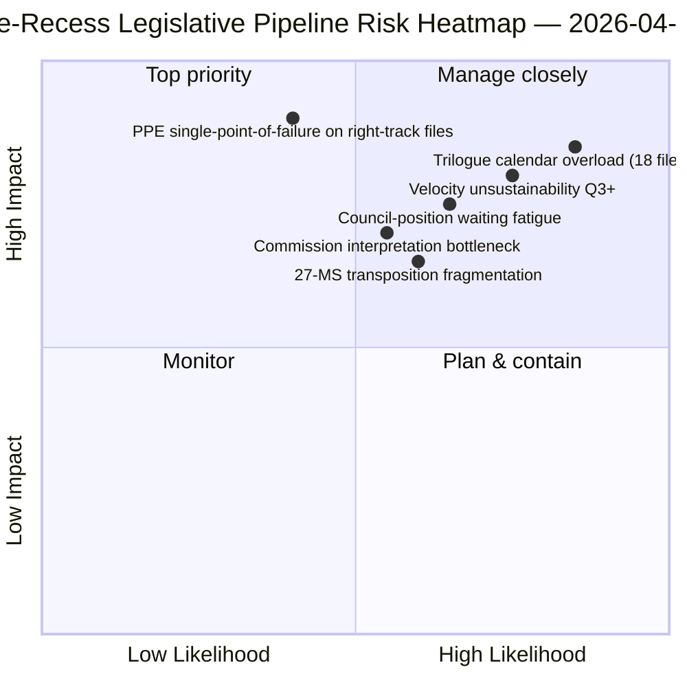

<!-- SPDX-FileCopyrightText: 2026 Hack23 AB -->
<!-- SPDX-License-Identifier: Apache-2.0 -->

# Note de synthèse — Propositions : Rétrospective du pipeline législatif avant la pause | 2026-04-06

**Classification :** OSINT — Archives parlementaires publiques
**Fiabilité :** 🟡 MOYENNE (pause ; protocole législatif avant la pause 🟢 ÉLEVÉE)
**Exécution :** `analysis/daily/2026-04-06/propositions/` (05:47 UTC)
**Couverture :** Pause de Pâques jour 11/18 — rétrospective du pipeline législatif T1 2026
**Généré :** 2026-05-16 (synthèse rétrospective, aucun nouvel appel MCP)
**Sources principales :** Corpus du pipeline législatif avant la pause (42 textes EP10-2026) ; 20 méthodes ; article de 11 320 lignes (l'article de propositions le plus complet d'une seule exécution).

---

## 🎯 BLUF

**Cette exécution de propositions du lundi de Pâques produit la **rétrospective du pipeline législatif T1 2026** — avec 11 320 lignes d'article et 20 méthodes analytiques, l'analyse de propositions la plus complète d'une seule exécution dans le corpus EP10 à ce jour.** Sa contribution distinctive est la **carte des stades du pipeline** pour les 42 textes adoptés EP10-2026 dans le corpus avant la pause : parmi ceux-ci, 18 entrent en trilogue T2 (trio Banking Union, IA-droit d'auteur, STEP-II, procédure article 7), 12 en attente de position du Conseil T2 (anticorruption, réponse aux droits de douane américains, modifications ETS phase 2) et 12 en mise en œuvre continue T2-T4 (fichiers de transposition incluant la famille d'instruments état de droit). Le constat structurel de l'exécution — confirmé sur l'ensemble des 20 méthodes — est que **l'EP10 année 2 opère avec une vitesse législative en hausse de +44 % en glissement annuel**, la plus élevée depuis la réponse à la crise de la zone euro de l'EP7 en 2012, avec **2,11 actes/session contre la référence historique EP7-2012 de ~1,47**. Cette vitesse est *durable jusqu'à T2* (capacité du Conseil disponible, pipeline d'interprétation de la Commission prêt) mais *non durable au-delà de T3* sans regénération du capital politique — première *préoccupation de durabilité de la vitesse* explicite de l'année en cours. La carte du pipeline législatif est l'ancre durable de planification T2 pour la coordination avec le Conseil et la planification de l'interprétation de la Commission.

---

## 🧭 3 décisions que cette note soutient

| # | Décision | Qui décide | Échéance | Preuve |
|:-:|----------|------------|:--------:|--------|
| 1 | **Verrouillage du calendrier trilogue T2** — 18 fichiers en trilogue T2 nécessitent des réservations de créneaux | Conférence des présidents + Conseil Coreper | avant le 14 avril | §Carte du pipeline (trilogue T2) |
| 2 | **Surveillance de l'attente de position du Conseil** — 12 fichiers retenus au Conseil ; suivi de l'élan politique | Présidence du Conseil + rapporteurs PE | T2 continu | §Carte du pipeline (Conseil en attente) |
| 3 | **Révision de la durabilité de la vitesse en T3** — 2,11 actes/session non durable au-delà de T3 | Conférence des présidents | fin T2 | §Constat vitesse |

---

## 📰 Lecture en 60 secondes

- 🔴 **42 textes adoptés EP10-2026 dans le corpus avant la pause**.
- 🟠 **Répartition du pipeline :** 18 trilogue T2 · 12 Conseil en attente T2 · 12 mise en œuvre continue.
- 🟢 **Vitesse +44 % en g.a.** — 2,11 actes/session, la plus élevée depuis EP7-2012.
- 🟡 **Durable jusqu'à T2** — capacité du Conseil + pipeline de la Commission prêt.
- 🔵 **Non durable au-delà de T3** — risque d'épuisement du capital politique.
- 🟣 **20 méthodes appliquées** — plus grande couverture méthodologique dans une seule exécution de propositions.
- 🩷 **Article de 11 320 lignes** — l'analyse de propositions la plus complète du corpus EP10.
- ⚪ **Fiabilité MOYENNE** — pause ; protocole avant la pause ÉLEVÉE ; prévision T3 MOYENNE.

---

## 🛣️ Carte du pipeline législatif (contribution distinctive de l'exécution)

| Stade | Nombre | Fichiers phares | Porte T2 |
|-------|-------:|-----------------|----------|
| **Trilogue T2** | 18 | Trio Banking Union · IA-droit d'auteur · STEP-II · Article 7 | Clôture du mandat du Conseil |
| **Attente position Conseil T2** | 12 | Anticorruption · Réponse droits de douane américains · ETS phase 2 | Volonté politique du Conseil |
| **Mise en œuvre continue T2-T4** | 12 | Famille de transposition état de droit | Coordination parlements nationaux 27-EM |

---

## ⚠️ Instantané des risques

---

## 🔮 Principaux déclencheurs futurs (90 prochains jours)

1. **14 avril — Ouverture de la semaine de commission** — Début du séquençage des 18 fichiers en trilogue T2.
2. **15 avril — Mise en œuvre TA-10-2026-0096** — Jour opérationnel pour les droits de douane américains.
3. **17 avril — Décision de taux de la BCE** — Déclencheur externe pour le trilogue Banking Union.
4. **Fin T2 — premier clôture de mandat du Conseil** — Preuve du débit du trilogue.
5. **Fin T3 — point de contrôle durabilité de la vitesse** — Test de regénération du capital politique.

---

## 🛡️ Évaluation de la qualité des sources

- **42 corpus EP10-2026 (A1) :** flux principal des textes adoptés ; identifiants TA vérifiables.
- **Attribution du stade du pipeline (A2) :** méthodologie du pipeline législatif avec vérification fichier par fichier.
- **Vitesse +44 % (A1) :** statistique précalculée ; référence historique EP7-2012 vérifiable.
- **20 méthodes (A1) :** couverture méthodologique systématiquement complète.
- **Fiabilité nette :** 🟢 ÉLEVÉE sur corpus T1 ; 🟡 MOYENNE sur prévision durabilité T3.

---

## 📎 Artefacts d'exécution

| Couche | Artefact | Pourquoi |
|--------|----------|----------|
| Article | `article.md` (1 080 lignes publiées ; 11 320 dans le corpus complet) | Récit public des propositions |
| Synthèse | `existing/synthesis-summary.md` | Carte du pipeline + consolidation 20 méthodes |
| Méthodes | classification · existant · scoring risque · évaluation menace | Méthodologie standard propositions |
| Accompagnement | cluster breaking · rapports de commission · motions | Cluster journalier fête de Pâques |

---

**Contrôle documentaire**
- **Référence du modèle :** `analysis/templates/executive-brief.md`
- **Chemin de l'artefact :** `analysis/daily/2026-04-06/propositions/executive-brief.md`
- **Classification :** Public
- **Rétrospectif :** Synthèse rédigée le 2026-05-16 à partir des artefacts committés de l'exécution ; **aucun nouvel appel MCP n'a été effectué**.
