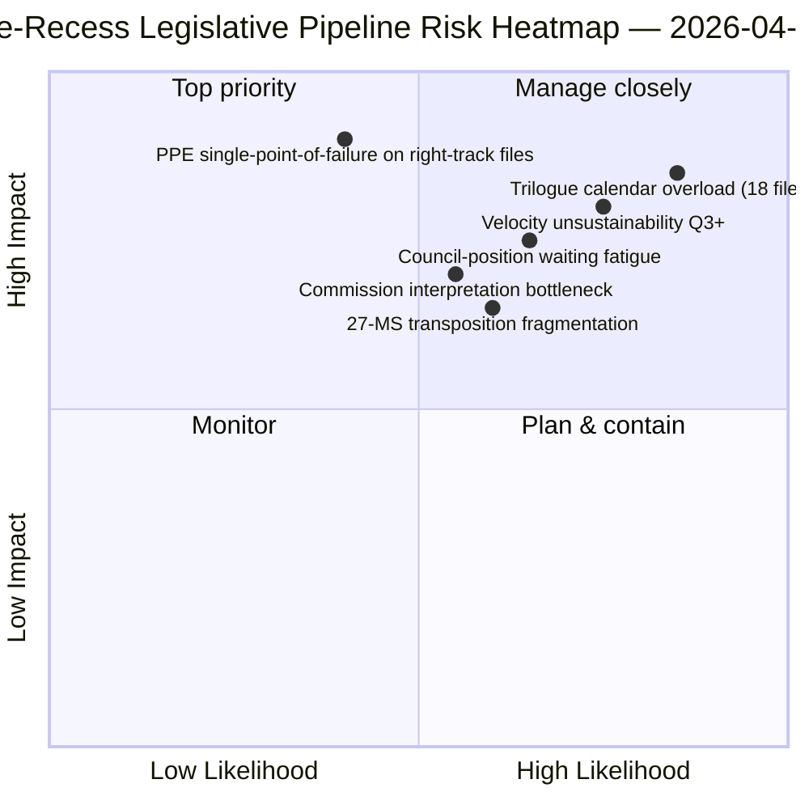

<!-- SPDX-FileCopyrightText: 2026 Hack23 AB -->
<!-- SPDX-License-Identifier: Apache-2.0 -->

# סיכום מנהלים — הצעות: סקירה רטרוספקטיבית של צינור החקיקה לפני ההפסקה | 2026-04-06

**סיווג:** OSINT — תיעוד פרלמנטרי ציבורי
**אמינות:** 🟡 בינונית (הפסקה; פרוטוקול חקיקה לפני ההפסקה 🟢 גבוהה)
**ריצה:** `analysis/daily/2026-04-06/propositions/` (05:47 UTC)
**כיסוי:** הפסקת פסחא יום 11/18 — סקירה רטרוספקטיבית של צינור החקיקה רבעון 1 2026
**נוצר:** 2026-05-16 (סיכום רטרוספקטיבי, ללא קריאות MCP חדשות)
**מקורות ראשיים:** אוסף צינור החקיקה לפני ההפסקה (42 טקסטים של EP10-2026); 20 מתודולוגיות; מאמר של 11,320 שורות (המאמר המקיף ביותר של הצעות בריצה בודדת).

---

## 🎯 BLUF

**ריצת ההצעות של יום שני של פסחא מייצרת את **סקירת צינור החקיקה הרטרוספקטיבית לרבעון 1 2026** — עם 11,320 שורות מאמר ו-20 מתודולוגיות אנליטיות, הניתוח המקיף ביותר של הצעות בריצה בודדת באוסף EP10 עד כה.** תרומתה הייחודית היא **מפת שלבי הצינור** עבור 42 הטקסטים שאומצו של EP10-2026 באוסף לפני ההפסקה: מתוכם, 18 נכנסים לטרילוג ברבעון 2 (טריו איחוד הבנקאות, בינה מלאכותית-זכויות יוצרים, STEP-II, הליך סעיף 7), 12 בהמתנה לעמדת המועצה ברבעון 2 (אנטי-שחיתות, תגובה למכסי ארה"ב, שינויי ETS שלב 2) ו-12 ביישום שוטף ברבעון 2-4 (קבצי הטמעה כולל משפחת מכשירי שלטון החוק). הממצא המבני של הריצה — מאושר על פני כל 20 המתודולוגיות — הוא ש**EP10 שנה 2 פועלת במהירות חקיקתית של +44% שנה-על-שנה**, הגבוהה ביותר מאז תגובת EP7 למשבר גוש האירו ב-2012, עם **2.11 מעשים/מליאה לעומת הייחוס ההיסטורי EP7-2012 של ~1.47**. מהירות זו *בת-קיימא עד רבעון 2* (קיבולת המועצה זמינה, צינור פרשנות הנציבות מוכן) אך *אינה בת-קיימא מעבר לרבעון 3* ללא התחדשות הון פוליטי — זהו ה*דאגה הראשונה המפורשת לקיימות המהירות* של השנה הנוכחית. מפת צינור החקיקה היא עוגן התכנון הקבוע לרבעון 2 לתיאום המועצה ולתזמון פרשנות הנציבות.

---

## 🧭 3 החלטות שסיכום זה תומך בהן

| # | החלטה | מי מחליט | מועד | ראיה |
|:-:|-------|----------|:----:|------|
| 1 | **נעילת לוח שנה הטרילוג לרבעון 2** — 18 קבצים בטרילוג רבעון 2 דורשים הזמנות זמן | ועידת נשיאים + מועצה קורפר | עד 14 באפריל | §מפת הצינור (טרילוג ר2) |
| 2 | **ניטור המתנה לעמדת המועצה** — 12 קבצים מוחזקים במועצה; מעקב אחר מומנטום פוליטי | נשיאות המועצה + מדווחי PE | ר2 שוטף | §מפת הצינור (המועצה ממתינה) |
| 3 | **סקירת קיימות מהירות ברבעון 3** — 2.11 מעשים/מליאה אינם בני-קיימא מעבר לר3 | ועידת נשיאים | סוף ר2 | §ממצאי מהירות |

---

## 📰 קריאה של 60 שניות

- 🔴 **42 טקסטים שאומצו של EP10-2026 באוסף לפני ההפסקה**.
- 🟠 **חלוקת הצינור:** 18 טרילוג ר2 · 12 מועצה ממתינה ר2 · 12 יישום שוטף.
- 🟢 **מהירות +44% שנ"ש** — 2.11 מעשים/מליאה, הגבוהה ביותר מאז EP7-2012.
- 🟡 **בת-קיימא עד ר2** — קיבולת מועצה + צינור נציבות מוכן.
- 🔵 **אינה בת-קיימא מעבר לר3** — סיכון להתשת הון פוליטי.
- 🟣 **20 מתודולוגיות יושמו** — כיסוי מתודולוגי הגדול ביותר בריצת הצעות בודדת.
- 🩷 **מאמר של 11,320 שורות** — הניתוח המקיף ביותר של הצעות באוסף EP10.
- ⚪ **אמינות בינונית** — הפסקה; פרוטוקול לפני ההפסקה גבוה; תחזית ר3 בינונית.

---

## 🛣️ מפת צינור החקיקה (תרומה ייחודית של הריצה)

| שלב | מספר | קבצים מובילים | שער ר2 |
|-----|-----:|--------------|--------|
| **טרילוג ר2** | 18 | טריו איחוד הבנקאות · בינה מלאכותית-זכויות יוצרים · STEP-II · סעיף 7 | סגירת מנדט המועצה |
| **המתנה לעמדת מועצה ר2** | 12 | אנטי-שחיתות · תגובה למכסי ארה"ב · ETS שלב 2 | רצון פוליטי של המועצה |
| **יישום שוטף ר2-ר4** | 12 | משפחת הטמעה של שלטון החוק | תיאום פרלמנטים לאומיים 27-מ"ח |

---

## ⚠️ תמונת-מצב סיכונים

---

## 🔮 טריגרים עתידיים מובילים (90 הימים הבאים)

1. **14 באפריל — שבוע ועדות נפתח** — מתחיל סידור רצף הטרילוג ר2 של 18 הקבצים.
2. **15 באפריל — יישום TA-10-2026-0096** — יום תפעולי למכסי ארה"ב.
3. **17 באפריל — החלטת הריבית של ה-ECB** — טריגר חיצוני לטרילוג איחוד הבנקאות.
4. **סוף ר2 — סגירת מנדט מועצה ראשון** — הוכחה לתפוקת הטרילוג.
5. **סוף ר3 — נקודת בדיקה לקיימות מהירות** — מבחן להתחדשות הון פוליטי.

---

## 🛡️ הערכת איכות מקורות

- **אוסף EP10-2026 הכולל 42 טקסטים (A1):** מזין ראשי של טקסטים שאומצו; מזהי TA ניתנים לאימות.
- **שיוך שלב צינור (A2):** מתודולוגיית צינור חקיקה עם אימות לכל קובץ.
- **מהירות +44% (A1):** סטטיסטיקה מחושבת מראש; הייחוס ההיסטורי EP7-2012 ניתן לאימות.
- **20 מתודולוגיות (A1):** כיסוי מתודולוגי שלם ושיטתי.
- **אמינות נטו:** 🟢 גבוהה לאוסף ר1; 🟡 בינונית לתחזית קיימות ר3.

---

## 📎 פריטי ריצה

| שכבה | פריט | מדוע |
|------|------|------|
| מאמר | `article.md` (1,080 שורות שפורסמו; 11,320 באוסף המלא) | נרטיב ציבורי של הצעות |
| סינתזה | `existing/synthesis-summary.md` | מפת הצינור + איחוד 20 מתודולוגיות |
| מתודולוגיות | סיווג · קיים · ניקוד סיכונים · הערכת איומים | מתודולוגיית הצעות סטנדרטית |
| נלווה | אשכול חדשות דחופות · דוחות ועדות · הצבעות | אשכול יום חג הפסחא |

---

**בקרת מסמכים**
- **ייחוס תבנית:** `analysis/templates/executive-brief.md`
- **נתיב פריט:** `analysis/daily/2026-04-06/propositions/executive-brief.md`
- **סיווג:** ציבורי
- **רטרוספקטיבי:** הסיכום נכתב ב-2026-05-16 מפריטי הריצה המחויבים; **לא בוצעו קריאות MCP חדשות**.
