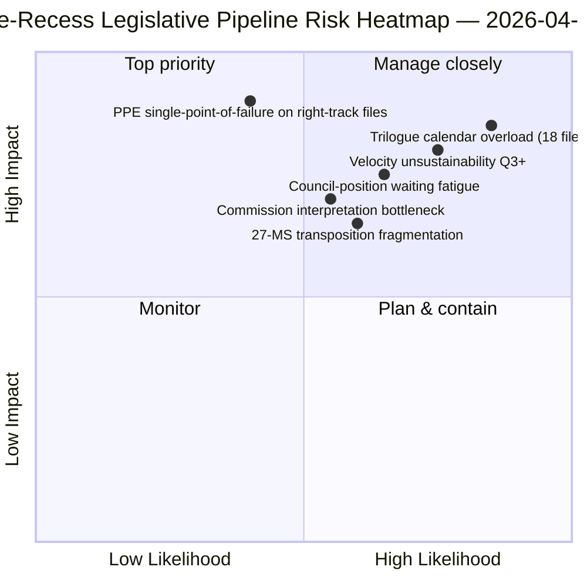

<!-- SPDX-FileCopyrightText: 2026 Hack23 AB -->
<!-- SPDX-License-Identifier: Apache-2.0 -->

# エグゼクティブ・ブリーフ — 提案：休会前の立法パイプライン回顧 | 2026-04-06

**分類:** OSINT — 公開議会記録
**信頼度:** 🟡 中 (休会中；休会前立法プロトコル 🟢 高)
**実行:** `analysis/daily/2026-04-06/propositions/` (05:47 UTC)
**対象範囲:** イースター休会 11/18日目 — 2026年第1四半期立法パイプライン回顧
**生成日:** 2026-05-16（回顧的サマリー、新規MCPコールなし）
**主要情報源:** 休会前立法パイプライン・コーパス（42件のEP10-2026テキスト）；20手法；11,320行記事（単一実行における最も包括的な提案記事）。

---

## 🎯 BLUF

**このイースター月曜日の提案実行は、**2026年第1四半期立法パイプライン回顧**を生成します — 11,320行の記事と20の分析手法を持ち、EP10コーパスにおける単一実行での最も包括的な提案分析です。** その際立った貢献は、休会前コーパスの42件のEP10-2026採択テキストに対する**パイプライン段階マップ**です：このうち18件がQ2三者協議に入り（銀行同盟トリオ、AI著作権、STEP-II、第7条手続き）、12件がQ2理事会立場待ち（汚職対策、米国関税対応、ETS第2段階改正）、12件がQ2〜Q4継続実施（法の支配措置ファミリーを含む移行ファイル）となっています。実行の構造的知見 — 20手法すべてで確認済み — は、**EP10第2年が前年比+44%の立法速度で稼働**しており、2012年のEP7ユーロ圏危機対応以来最高水準で、**2.11件/本会議 対 EP7-2012歴史的参照値～1.47**です。この速度は*Q2まで持続可能*（理事会能力利用可能、欧州委員会解釈パイプライン準備済み）ですが、政治的資本の再生なしに*Q3以降は持続不可能*です — 本年の**速度持続可能性への最初の明示的懸念**です。立法パイプライン・マップは、理事会調整と欧州委員会解釈スケジューリングのための恒久的なQ2計画アンカーです。

---

## 🧭 このブリーフが支援する3つの意思決定

| # | 意思決定 | 誰が決定 | 期限 | 根拠 |
|:-:|----------|---------|:----:|------|
| 1 | **Q2三者協議カレンダー確定** — Q2三者協議の18ファイルに時間確保が必要 | 議長会議 + 理事会コレペル | 4月14日まで | §パイプライン・マップ（三者協議Q2） |
| 2 | **理事会立場待ち監視** — 12ファイルが理事会で保留；政治的モメンタムの追跡 | 理事会議長国 + EP報告担当議員 | Q2継続 | §パイプライン・マップ（理事会待機） |
| 3 | **Q3速度持続可能性見直し** — 2.11件/本会議はQ3以降持続不可能 | 議長会議 | Q2末 | §速度知見 |

---

## 📰 60秒で読む

- 🔴 **休会前コーパスに42件のEP10-2026採択テキスト**。
- 🟠 **パイプライン分割:** 18件三者協議Q2 · 12件理事会待機Q2 · 12件継続実施。
- 🟢 **速度+44% 前年比** — 2.11件/本会議、EP7-2012以来最高。
- 🟡 **Q2まで持続可能** — 理事会能力 + 欧州委員会パイプライン準備済み。
- 🔵 **Q3以降持続不可能** — 政治的資本消耗リスク。
- 🟣 **20手法適用** — 単一提案実行で最大の方法論的カバレッジ。
- 🩷 **11,320行記事** — EP10コーパスで最も包括的な提案分析。
- ⚪ **信頼度 中** — 休会中；休会前プロトコル 高；Q3予測 中。

---

## 🛣️ 立法パイプライン・マップ（実行の際立った貢献）

| 段階 | 件数 | 主要ファイル | Q2ゲート |
|------|-----:|------------|--------|
| **三者協議Q2** | 18 | 銀行同盟トリオ · AI著作権 · STEP-II · 第7条 | 理事会マンデート終了 |
| **理事会立場待ちQ2** | 12 | 汚職対策 · 米国関税対応 · ETS第2段階 | 理事会政治的意志 |
| **継続実施Q2〜Q4** | 12 | 法の支配移行ファミリー | 27加盟国国内議会調整 |

---

## ⚠️ リスク・スナップショット

---

## 🔮 主要な将来のトリガー（今後90日間）

1. **4月14日 — 委員会週開始** — 18ファイルのQ2三者協議シーケンスが開始。
2. **4月15日 — TA-10-2026-0096実施** — 米国関税の運用開始日。
3. **4月17日 — ECB金利決定** — 銀行同盟三者協議の外部トリガー。
4. **Q2末 — 初の理事会マンデート終了** — 三者協議スループットの証拠。
5. **Q3末 — 速度持続可能性チェックポイント** — 政治的資本再生のテスト。

---

## 🛡️ 情報源品質評価

- **42件EP10-2026コーパス（A1）:** 採択テキストの主要フィード；TA-IDは検証可能。
- **パイプライン段階割り当て（A2）:** ファイルごと検証付き立法パイプライン手法。
- **速度+44%（A1）:** 事前計算済み統計；EP7-2012歴史的参照値は検証可能。
- **20手法（A1）:** 体系的完全方法論カバレッジ。
- **正味信頼度:** 🟢 Q1コーパスは高；🟡 Q3持続可能性予測は中。

---

## 📎 実行アーティファクト

| レイヤー | アーティファクト | 理由 |
|---------|--------------|------|
| 記事 | `article.md`（1,080行公開；11,320行完全コーパス） | 公開提案ナラティブ |
| 統合 | `existing/synthesis-summary.md` | パイプライン・マップ + 20手法統合 |
| 手法 | 分類 · 既存 · リスク評価 · 脅威評価 | 標準提案方法論 |
| 関連 | ブレーキングクラスター · 委員会報告 · 動議 | イースター祝日クラスター |

---

**ドキュメント管理**
- **テンプレート参照:** `analysis/templates/executive-brief.md`
- **アーティファクトパス:** `analysis/daily/2026-04-06/propositions/executive-brief.md`
- **分類:** 公開
- **回顧的:** このサマリーは2026-05-16に実行のコミット済みアーティファクトから作成；**新規MCPコールは行われていない**。
