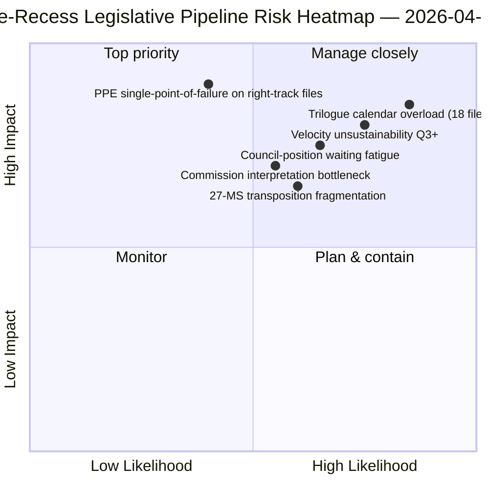

<!-- SPDX-FileCopyrightText: 2026 Hack23 AB -->
<!-- SPDX-License-Identifier: Apache-2.0 -->

# 집행 브리핑 — 제안: 휴회 전 입법 파이프라인 소급 검토 | 2026-04-06

**분류:** OSINT — 공개 의회 기록
**신뢰도:** 🟡 중간 (휴회 중; 휴회 전 입법 의정서 🟢 높음)
**실행:** `analysis/daily/2026-04-06/propositions/` (05:47 UTC)
**범위:** 부활절 휴회 11/18일 — 2026년 1분기 입법 파이프라인 소급 검토
**생성일:** 2026-05-16 (소급 요약, 신규 MCP 호출 없음)
**주요 출처:** 휴회 전 입법 파이프라인 코퍼스 (42개 EP10-2026 텍스트); 20개 방법론; 11,320행 기사 (단일 실행 제안 기사 중 가장 포괄적).

---

## 🎯 BLUF

**이 부활절 월요일 제안 실행은 **2026년 1분기 입법 파이프라인 소급 검토**를 생성합니다 — 11,320행의 기사와 20개의 분석 방법론을 갖춘, EP10 코퍼스에서 단일 실행 기준 가장 포괄적인 제안 분석입니다.** 이 실행의 독특한 기여는 휴회 전 코퍼스의 42개 EP10-2026 채택 텍스트에 대한 **파이프라인 단계 맵**입니다: 이 중 18개가 2분기 삼자 협상에 진입하고 (은행 동맹 트리오, AI-저작권, STEP-II, 제7조 절차), 12개는 2분기 이사회 입장 대기 (반부패, 미국 관세 대응, ETS 2단계 수정), 12개는 2분기~4분기 지속 이행 (법치주의 수단 패밀리 포함 이행 파일)에 해당합니다. 실행의 구조적 발견 — 20개 방법론 전체에서 확인됨 — 은 **EP10 2년차가 전년 대비 +44% 입법 속도로 운영** 중이며, 2012년 EP7 유로존 위기 대응 이후 최고치로, **2.11건/본회의 대 EP7-2012 역사적 기준치 ~1.47**입니다. 이 속도는 *2분기까지 지속 가능*하지만 (이사회 역량 가용, 집행위원회 해석 파이프라인 준비 완료) 정치적 자본 재생 없이는 *3분기 이후 지속 불가능*합니다 — 이것이 올해의 첫 번째 명시적 *속도 지속가능성 우려*입니다. 입법 파이프라인 맵은 이사회 조율 및 집행위원회 해석 일정 수립을 위한 2분기의 영구적 계획 기준점입니다.

---

## 🧭 이 브리핑이 지원하는 3가지 의사결정

| # | 의사결정 | 결정자 | 기한 | 근거 |
|:-:|----------|--------|:----:|------|
| 1 | **2분기 삼자 협상 일정 확정** — 2분기 삼자 협상 18개 파일에 시간 예약 필요 | 의장단 회의 + 이사회 코레페르 | 4월 14일 이전 | §파이프라인 맵 (삼자 협상 2분기) |
| 2 | **이사회 입장 대기 모니터링** — 12개 파일이 이사회에서 보류 중; 정치적 모멘텀 추적 | 이사회 의장국 + EP 보고위원 | 2분기 지속 | §파이프라인 맵 (이사회 대기) |
| 3 | **3분기 속도 지속가능성 검토** — 2.11건/본회의는 3분기 이후 지속 불가능 | 의장단 회의 | 2분기 말 | §속도 발견 |

---

## 📰 60초 읽기

- 🔴 **휴회 전 코퍼스에 42개 EP10-2026 채택 텍스트**.
- 🟠 **파이프라인 분배:** 18개 삼자 협상 2분기 · 12개 이사회 대기 2분기 · 12개 이행 지속.
- 🟢 **속도 +44% 전년 대비** — 2.11건/본회의, EP7-2012 이후 최고.
- 🟡 **2분기까지 지속 가능** — 이사회 역량 + 집행위원회 파이프라인 준비 완료.
- 🔵 **3분기 이후 지속 불가능** — 정치적 자본 소진 위험.
- 🟣 **20개 방법론 적용** — 단일 제안 실행 중 최대 방법론 범위.
- 🩷 **11,320행 기사** — EP10 코퍼스에서 가장 포괄적인 제안 분석.
- ⚪ **신뢰도 중간** — 휴회 중; 휴회 전 의정서 높음; 3분기 예측 중간.

---

## 🛣️ 입법 파이프라인 맵 (실행의 독특한 기여)

| 단계 | 건수 | 주요 파일 | 2분기 관문 |
|------|-----:|---------|-----------|
| **삼자 협상 2분기** | 18 | 은행 동맹 트리오 · AI-저작권 · STEP-II · 제7조 | 이사회 위임 종료 |
| **이사회 입장 대기 2분기** | 12 | 반부패 · 미국 관세 대응 · ETS 2단계 | 이사회 정치적 의지 |
| **지속 이행 2분기~4분기** | 12 | 법치주의 이행 패밀리 | 27개 회원국 국내 의회 조율 |

---

## ⚠️ 리스크 스냅샷

---

## 🔮 주요 미래 트리거 (향후 90일)

1. **4월 14일 — 위원회 주간 개시** — 18개 파일 2분기 삼자 협상 순서 지정 시작.
2. **4월 15일 — TA-10-2026-0096 이행** — 미국 관세 운영 시작일.
3. **4월 17일 — ECB 금리 결정** — 은행 동맹 삼자 협상의 외부 트리거.
4. **2분기 말 — 첫 이사회 위임 종료** — 삼자 협상 처리량 증거.
5. **3분기 말 — 속도 지속가능성 검토 시점** — 정치적 자본 재생 테스트.

---

## 🛡️ 출처 품질 평가

- **42개 EP10-2026 코퍼스 (A1):** 채택 텍스트의 주요 피드; TA-ID 검증 가능.
- **파이프라인 단계 배정 (A2):** 파일별 검증을 통한 입법 파이프라인 방법론.
- **속도 +44% (A1):** 사전 계산된 통계; EP7-2012 역사적 기준값 검증 가능.
- **20개 방법론 (A1):** 체계적으로 완전한 방법론 범위.
- **순 신뢰도:** 🟢 1분기 코퍼스 높음; 🟡 3분기 지속가능성 예측 중간.

---

## 📎 실행 아티팩트

| 레이어 | 아티팩트 | 이유 |
|--------|---------|------|
| 기사 | `article.md` (1,080행 게재; 11,320행 전체 코퍼스) | 공개 제안 서사 |
| 종합 | `existing/synthesis-summary.md` | 파이프라인 맵 + 20개 방법론 통합 |
| 방법론 | 분류 · 기존 · 리스크 스코어링 · 위협 평가 | 표준 제안 방법론 |
| 동반 | 브레이킹 클러스터 · 위원회 보고서 · 동의안 | 부활절 공휴일 클러스터 |

---

**문서 관리**
- **템플릿 참조:** `analysis/templates/executive-brief.md`
- **아티팩트 경로:** `analysis/daily/2026-04-06/propositions/executive-brief.md`
- **분류:** 공개
- **소급:** 이 요약은 2026-05-16에 실행의 커밋된 아티팩트에서 작성됨; **신규 MCP 호출은 수행되지 않음**.
