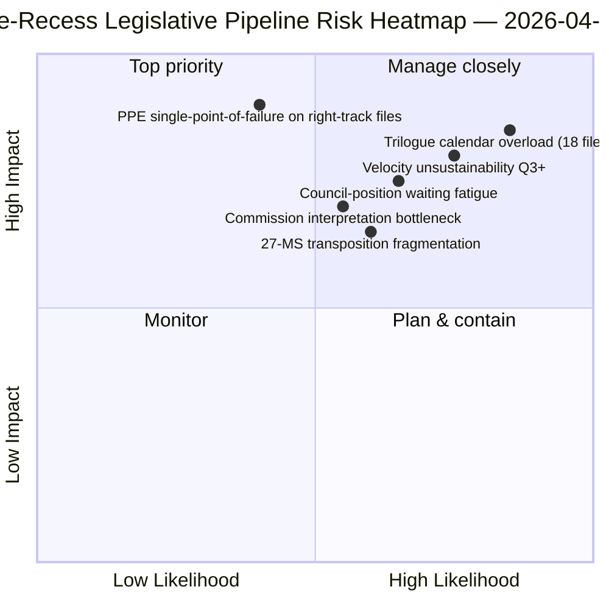

<!-- SPDX-FileCopyrightText: 2026 Hack23 AB -->
<!-- SPDX-License-Identifier: Apache-2.0 -->

# Samenvatting — Voorstellen: Terugblik op de wetgevingspijplijn vóór reces | 2026-04-06

**Classificatie:** OSINT — Openbaar parlementair archief
**Betrouwbaarheid:** 🟡 GEMIDDELD (reces; wetgevingsprotocol vóór reces 🟢 HOOG)
**Uitvoering:** `analysis/daily/2026-04-06/propositions/` (05:47 UTC)
**Dekking:** Paasreces dag 11/18 — terugblik op de wetgevingspijplijn K1 2026
**Gegenereerd:** 2026-05-16 (retrospectieve samenvatting, geen nieuwe MCP-aanroepen)
**Primaire bronnen:** Wetgevingspijplijn-corpus vóór reces (42 EP10-2026-teksten); 20 methoden; artikel van 11.320 regels (het meest uitgebreide voorstellenartikel van één enkele uitvoering).

---

## 🎯 BLUF

**Deze Paasmaandag-voorstellenuitvoering produceert de **terugblik op de wetgevingspijplijn K1 2026** — met 11.320 artikelregels en 20 analytische methoden, de meest uitgebreide voorstellenanalyse van een enkele uitvoering in het EP10-corpus tot nu toe.** Haar kenmerkende bijdrage is de **pijplijnfasenkaart** voor de 42 EP10-2026-aangenomen teksten in het corpus vóór reces: hiervan gaan er 18 de trialoog K2 in (Banking Union-drietal, AI-Auteursrecht, STEP-II, artikel 7-procedure), 12 in afwachting van Raadspositie K2 (antikorruptie, reactie op Amerikaanse heffingen, ETS fase 2-wijzigingen) en 12 in doorlopende implementatie K2-K4 (omzettingsbestanden inclusief de rechtsstaat-instrumentenfamilie). De structurele bevinding van de uitvoering — bevestigd over alle 20 methoden — is dat **EP10 jaar 2 opereert met een wetgevingssnelheid van +44% jaar-op-jaar**, de hoogste sinds de reactie op de eurocrisis van EP7 in 2012, met **2,11 handelingen/sessie tegenover de historische EP7-2012-referentie van ~1,47**. Deze snelheid is *houdbaar tot K2* (Raadscapaciteit beschikbaar, interpretatiepijplijn van de Commissie gereed) maar *niet houdbaar voorbij K3* zonder regeneratie van politiek kapitaal — dit is de eerste expliciete *zorg over snelheidsduurzaamheid* van het lopende jaar. De wetgevingspijplijnkaart is het duurzame K2-planningsanker voor Raadscoördinatie en planningsinterpretatie van de Commissie.

---

## 🧭 3 Beslissingen die deze samenvatting ondersteunt

| # | Beslissing | Wie beslist | Deadline | Bewijs |
|:-:|------------|-------------|:--------:|--------|
| 1 | **K2-trialooogkalendervergrendeling** — 18 bestanden in trialoog K2 vereisen tijdboekingen | Conferentie van voorzitters + Raad Coreper | vóór 14 april | §Pijplijnkaart (trialoog K2) |
| 2 | **Bewaking Raadspositie-wachttijd** — 12 bestanden vastgehouden in de Raad; monitoring politiek momentum | Raadsvoorzitterschap + EP-rapporteurs | doorlopend K2 | §Pijplijnkaart (Raad wacht) |
| 3 | **K3-herziening snelheidsduurzaamheid** — 2,11 handelingen/sessie niet houdbaar voorbij K3 | Conferentie van voorzitters | eind K2 | §Snelheidsbevinding |

---

## 📰 Lezen in 60 seconden

- 🔴 **42 EP10-2026-aangenomen teksten in het corpus vóór reces**.
- 🟠 **Pijplijnverdeling:** 18 trialoog K2 · 12 Raad wacht K2 · 12 implementatie doorlopend.
- 🟢 **Snelheid +44% j-o-j** — 2,11 handelingen/sessie, hoogste sinds EP7-2012.
- 🟡 **Houdbaar tot K2** — Raadscapaciteit + Commissiepijplijn gereed.
- 🔵 **Niet houdbaar voorbij K3** — risico op uitputting van politiek kapitaal.
- 🟣 **20 methoden toegepast** — grootste methodologische dekking in een enkele voorstellenuitvoering.
- 🩷 **Artikel van 11.320 regels** — de meest uitgebreide voorstellenanalyse in het EP10-corpus.
- ⚪ **Betrouwbaarheid GEMIDDELD** — reces; protocol vóór reces HOOG; K3-prognose GEMIDDELD.

---

## 🛣️ Wetgevingspijplijnkaart (kenmerkende bijdrage van de uitvoering)

| Fase | Aantal | Vlaggenschipbestanden | K2-poort |
|------|-------:|----------------------|----------|
| **Trialoog K2** | 18 | Banking Union-drietal · AI-Auteursrecht · STEP-II · Artikel 7 | Raadsmandaatafsluiting |
| **Raadspositie-wachttijd K2** | 12 | Antikorruptie · Reactie op VS-heffingen · ETS fase 2 | Politieke wil Raad |
| **Implementatie doorlopend K2-K4** | 12 | Rechtsstaat-omzettingsfamilie | 27-LS nationale parlementscoördinatie |

---

## ⚠️ Risico-overzicht

---

## 🔮 Top toekomstige triggers (komende 90 dagen)

1. **14 april — Commissieweek opent** — Sequentiëring van de 18-bestanden trialoog K2 begint.
2. **15 april — TA-10-2026-0096 implementatie** — Operationele dag voor VS-heffingen.
3. **17 april — ECB-rentebeslissing** — Externe trigger voor de Banking Union-trialoog.
4. **Eind K2 — eerste Raadsmandaatafsluiting** — Bewijs voor trialoogdoorvoer.
5. **Eind K3 — controlepunt snelheidsduurzaamheid** — Test van regeneratie van politiek kapitaal.

---

## 🛡️ Beoordeling bronkwaliteit

- **42 EP10-2026-corpus (A1):** primaire feed van aangenomen teksten; TA-ID's verifieerbaar.
- **Pijplijnfase-toewijzing (A2):** wetgevingspijplijn-methodologie met bestandsgewijze verificatie.
- **Snelheid +44% (A1):** voorberekende statistiek; historische EP7-2012-referentie verifieerbaar.
- **20 methoden (A1):** systematisch volledige methodologische dekking.
- **Netto-betrouwbaarheid:** 🟢 HOOG voor K1-corpus; 🟡 GEMIDDELD voor K3-duurzaamheidsprognose.

---

## 📎 Uitvoeringsartefacten

| Laag | Artefact | Waarom |
|------|----------|--------|
| Artikel | `article.md` (1.080 gepubliceerde regels; 11.320 in volledig corpus) | Openbaar voorstellenverhaal |
| Synthese | `existing/synthesis-summary.md` | Pijplijnkaart + consolidatie 20 methoden |
| Methoden | classificatie · bestaand · risicoscores · dreigingsbeoordeling | Standaard voorstellenmethodologie |
| Begeleidend | breaking-cluster · commissierapporten · moties | Feestdag-dagcluster Pasen |

---

**Documentbeheer**
- **Sjabloonreferentie:** `analysis/templates/executive-brief.md`
- **Artefactpad:** `analysis/daily/2026-04-06/propositions/executive-brief.md`
- **Classificatie:** Openbaar
- **Retrospectief:** Samenvatting opgesteld op 2026-05-16 uit de gecommitteerde artefacten van de uitvoering; **er werden geen nieuwe MCP-aanroepen gedaan**.
