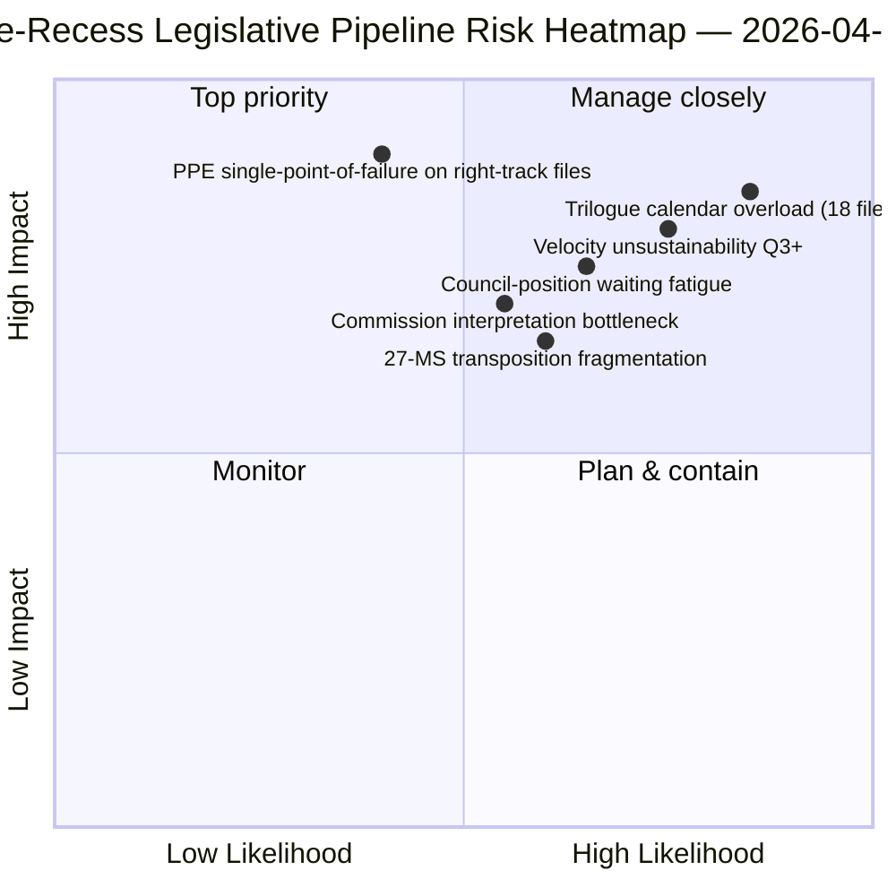

<!-- SPDX-FileCopyrightText: 2026 Hack23 AB -->
<!-- SPDX-License-Identifier: Apache-2.0 -->

# Ledersammendrag — Forslag: Tilbakeblikk på lovgivningspipeline før ferie | 2026-04-06

**Klassifisering:** OSINT — Offentlig parlamentarisk protokoll
**Konfidens:** 🟡 MIDDELS (ferie; lovgivningsprotokoll før ferie 🟢 HØY)
**Kjøring:** `analysis/daily/2026-04-06/propositions/` (05:47 UTC)
**Dekning:** Påskeferie dag 11/18 — tilbakeblikk på lovgivningspipeline Q1 2026
**Generert:** 2026-05-16 (retrospektivt sammendrag, ingen nye MCP-kall)
**Primærkilder:** Lovgivningspipeline-korpus før ferie (42 EP10-2026-tekster); 20 metoder; 11 320-linjes artikkel (den mest omfattende forslagsartikkelen fra en enkelt kjøring).

---

## 🎯 BLUF

**Denne påskemandag-forslagskjøringen produserer **Q1 2026-tilbakeblikk på lovgivningspipelinen** — med 11 320 artikkellinjer og 20 analytiske metoder, den mest omfattende forslagsanalysen fra en enkelt kjøring i EP10-korpuset hittil.** Dens særpregede bidrag er **pipeline-stadiekartet** for de 42 EP10-2026-vedtatte tekstene i korpuset før ferien: av disse går 18 inn i trilogen Q2 (Banking Union-trippel, AI-Copyright, STEP-II, artikkel 7-prosedyre), 12 inn i rådsposisjonsventing Q2 (antikorrupsjon, svar på amerikanske toll, ETS fase 2-endringer) og 12 inn i implementeringsrullende Q2-Q4 (transposisjonsfiler inkl. rettsstats-instrumentfamilien). Kjøringens strukturelle funn — bekreftet på tvers av alle 20 metoder — er at **EP10 år 2 opererer med +44% YoY lovgivningshastighet**, den høyeste siden EP7s eurosone-kriserespons i 2012, med **2,11 akter/sesjon mot EP7-2012 historisk referanse på ~1,47**. Denne hastigheten er *bærekraftig gjennom Q2* (rådskapasitet tilgjengelig, Kommisjonens tolkningspipeline klar) men *ikke bærekraftig utover Q3* uten regenerering av politisk kapital — kjøringens første eksplisitte *bekymring for hastighetsbærekraft*. Lovgivningspipelinekartet er kjøringens varige Q2-planleggingsanker for rådskoordinering og Kommisjonens tolkningsplanlegging.

---

## 🧭 3 Beslutninger dette sammendraget støtter

| # | Beslutning | Hvem bestemmer | Frist | Bevis |
|:-:|------------|----------------|:-----:|-------|
| 1 | **Q2-trilogkalenderlås** — 18 filer inn i trilog Q2 trenger tidsbooking | Presidentkonferansen + Rådet Coreper | innen 14. april | §Pipeline-kart (trilog Q2) |
| 2 | **Overvåking av rådsposisjonsventing** — 12 filer holdt i rådet; overvåking av politisk momentum | Rådsformannskapet + EP-ordførere | rullende Q2 | §Pipeline-kart (rådet venter) |
| 3 | **Q3-gjennomgang av hastighetsbærekraft** — 2,11 akter/sesjon ikke bærekraftig utover Q3 | Presidentkonferansen | slutt-Q2 | §Hastighetsfunn |

---

## 📰 60-sekunders lesing

- 🔴 **42 EP10-2026-vedtatte tekster i korpus før ferie**.
- 🟠 **Pipeline-deling:** 18 trilog Q2 · 12 rådet venter Q2 · 12 implementeringsrullende.
- 🟢 **Hastighet +44% YoY** — 2,11 akter/sesjon, høyest siden EP7-2012.
- 🟡 **Bærekraftig gjennom Q2** — rådskapasitet + Kommisjonens pipeline klar.
- 🔵 **Ikke bærekraftig utover Q3** — risiko for utmattelse av politisk kapital.
- 🟣 **20 metoder anvendt** — størst metodologidekning i enkelt forslagskjøring.
- 🩷 **11 320-linjes artikkel** — den mest omfattende forslagsanalysen i EP10-korpuset.
- ⚪ **Konfidens MIDDELS** — ferie; protokoll før ferie HØY; Q3-prognose MIDDELS.

---

## 🛣️ Lovgivningspipelinekart (kjøringens særpregede bidrag)

| Stadium | Antall | Flaggskipsfiler | Q2-port |
|---------|-------:|-----------------|---------|
| **Trilog Q2** | 18 | Banking Union-trippel · AI-Copyright · STEP-II · artikkel 7 | Rådets mandatavslutning |
| **Rådsposisjonsventing Q2** | 12 | Antikorrupsjon · Svar på amerikanske toll · ETS fase 2 | Rådets politiske vilje |
| **Implementeringsrullende Q2-Q4** | 12 | Rettstats-transposisjonsfamilie | 27-MS nasjonalparlamentarisk samarbeid |

---

## ⚠️ Risikoøyeblikksbilde

---

## 🔮 Topp fremtidige utløsere (neste 90 dager)

1. **14. april — Komitéuke åpner** — 18-filers trilog Q2-sekvensering begynner.
2. **15. april — TA-10-2026-0096 implementering** — Operativ dag for amerikanske toll.
3. **17. april — ECB-rentebeslutning** — Ekstern utløser for Banking Union-trilog.
4. **Slutt-Q2 — første rådets mandatavslutning** — Bevis for trilog-gjennomstrømning.
5. **Slutt-Q3 — punkt for gjennomgang av hastighetsbærekraft** — Test for regenerering av politisk kapital.

---

## 🛡️ Kildekvalitetsvurdering

- **42 EP10-2026-korpus (A1):** primært feed av vedtatte tekster; TA-IDer verifiserbare.
- **Pipeline-stadietildeling (A2):** lovgivningspipeline-metodologi med per-fils verifisering.
- **Hastighet +44% (A1):** forhåndsberegnet statistikk; historisk EP7-2012-referanse verifiserbar.
- **20 metoder (A1):** systematisk fullstendig metodologidekning.
- **Nettokonfidensen:** 🟢 HØY på Q1-korpus; 🟡 MIDDELS på Q3-bærekraftsprognose.

---

## 📎 Kjøringsartefakter

| Lag | Artefakt | Hvorfor |
|-----|----------|---------|
| Artikkel | `article.md` (1 080 linjer publisert; 11 320 i fullstendig korpus) | Offentlig forslagsnarrativ |
| Syntese | `existing/synthesis-summary.md` | Pipeline-kart + 20-metodes konsolidering |
| Metoder | klassifisering · eksisterende · risikovurdering · trusselvurdering | Standard forslagsmetodologi |
| Ledsager | breaking-klynge · komitérapporter · motioner | Påskedagsklynge |

---

**Dokumentkontroll**
- **Malreferanse:** `analysis/templates/executive-brief.md`
- **Artefaktsti:** `analysis/daily/2026-04-06/propositions/executive-brief.md`
- **Klassifisering:** Offentlig
- **Retrospektiv:** Sammendrag skrevet 2026-05-16 fra kjøringens committede artefakter; **ingen nye MCP-kall ble gjort**.
