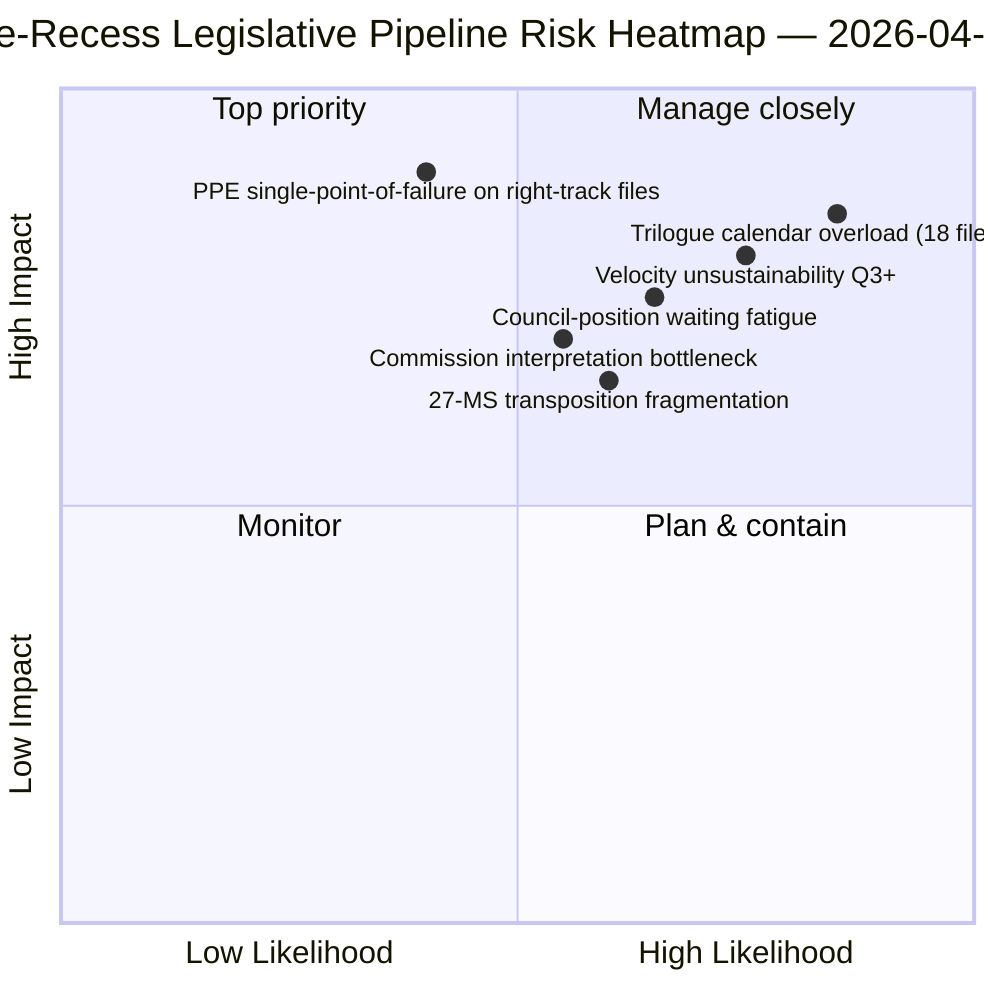

<!-- SPDX-FileCopyrightText: 2026 Hack23 AB -->
<!-- SPDX-License-Identifier: Apache-2.0 -->

# Exekutivt Briefing — Propositioner: Retrospektiv av lagstiftningspipelinen före uppehåll | 2026-04-06

**Klassificering:** OSINT — Offentligt parlamentariskt register
**Konfidens:** 🟡 MEDEL (uppehåll; lagstiftningsregister före uppehåll 🟢 HÖG)
**Körning:** `analysis/daily/2026-04-06/propositions/` (05:47 UTC)
**Täckning:** Påskuppehåll dag 11/18 — retrospektiv av lagstiftningspipelinen Q1 2026
**Genererad:** 2026-05-16 (retrospektiv briefing, inga nya MCP-anrop)
**Primärkällor:** Lagstiftningspipeline-korpus före uppehåll (42 EP10-2026-texter); 20 metoder; 11 320-raders artikel (den mest omfattande enskilda körningens propositionsartikel).

---

## 🎯 BLUF

**Denna påskdagskörning av propositioner producerar den Q1 2026 retrospektiva analysen av lagstiftningspipelinen — med 11 320 artikelrader och 20 analytiska metoder är detta den mest heltäckande enskilda körningens propositionsanalys i EP10-korpuset hittills.** Dess särskiljande bidrag är **pipelinestadiekartan** för de 42 EP10-2026-antagna texterna i korpuset före uppehåll: av dessa går 18 in i trilogen Q2 (Banking Union-trippel, AI-Copyright, STEP-II, artikel 7-förfarande), 12 in i rådspositionsväntan Q2 (antikorruption, svar på USA-tullar, ETS fas 2-ändringar) och 12 in i implementeringsrullning Q2-Q4 (transponeringsfiler inklusive rättsstatsinstrumentfamiljen). Körningens strukturella fynd — bekräftat av alla 20 metoder — är att **EP10 år 2 opererar med +44% lagstiftningshastighet år för år**, den högsta sedan EP7:s krishantering 2012, med **2,11 lagar/session mot EP7-2012 historisk referens på ~1,47**. Denna hastighet är *hållbar genom Q2* (rådskapacitet tillgänglig, kommissionens tolkningspipeline redo) men *inte hållbar bortom Q3* utan regenerering av politiskt kapital — körningen flaggar detta som årets första explicita *hållbarhetsproblem för hastigheten*. Lagstiftningspipelinekartan är körningens varaktiga Q2-planeringsankare för rådssamordning och kommissionens tolkningsschemaläggning.

---

## 🧭 3 Beslut som denna briefing stödjer

| # | Beslut | Vem beslutar | Tidsgräns | Bevis |
|:-:|--------|--------------|:---------:|-------|
| 1 | **Låsning av Q2-trilogkalender** — 18 filer som går in i trilogen behöver tidsbokningar | Ordförandekonferensen + Rådet Coreper | senast 14 april | §Pipelinekarta (trilogen Q2) |
| 2 | **Bevakning av rådspositionsväntan** — 12 filer hålls i rådet; politisk dynamikbevakning | Rådsordförandeskapet + EP-föredragande | rullande Q2 | §Pipelinekarta (rådet väntar) |
| 3 | **Q3-granskning av hastighetshållbarhet** — 2,11 lagar/session ohållbart bortom Q3 | Ordförandekonferensen | slutet av Q2 | §Hastighetsfynd |

---

## 📰 60-sekunders läsning

- 🔴 **42 EP10-2026-antagna texter i korpuset före uppehåll**.
- 🟠 **Pipelinedelning:** 18 trilog Q2 · 12 rådet väntar Q2 · 12 implementeringsrullning.
- 🟢 **Hastighet +44% YoY** — 2,11 lagar/session, högst sedan EP7-2012.
- 🟡 **Hållbart genom Q2** — rådskapacitet + kommissionens pipeline redo.
- 🔵 **Inte hållbart bortom Q3** — risk för uttömning av politiskt kapital.
- 🟣 **20 metoder tillämpade** — störst täckning av metodologi i enskild körning av propositioner.
- 🩷 **11 320-raders artikel** — den mest heltäckande propositionsanalysen i EP10-korpuset.
- ⚪ **Konfidens MEDEL** — uppehåll; register före uppehåll HÖG; Q3-prognos MEDEL.

---

## 🛣️ Lagstiftningspipelinekarta (körningens särskiljande bidrag)

| Stadium | Antal | Flaggskeppsfiler | Q2-grind |
|---------|------:|-----------------|----------|
| **Trilog Q2** | 18 | Banking Union-trippel · AI-Copyright · STEP-II · artikel 7 | Rådets mandatavslut |
| **Rådspositionsväntan Q2** | 12 | Antikorruption · Svar på USA-tullar · ETS fas 2 | Rådets politiska vilja |
| **Implementeringsrullning Q2-Q4** | 12 | Rättsstatstranspositionsfamilj | 27-MS nationalparlamentariskt samarbete |

---

## ⚠️ Riskögonblicksbild

---

## 🔮 Toppframåtutlösare (nästa 90 dagar)

1. **14 april — Utskottsveckan öppnar** — 18-filars trilog Q2-sekvensering börjar.
2. **15 april — TA-10-2026-0096 implementering** — USA-tulloperativ dag.
3. **17 april — ECB-räntebeslut** — extern utlösare för Banking Union-trilog.
4. **Slutet av Q2 — första rådets mandatavslut** — bevis på genomströmning i trilog.
5. **Slutet av Q3 — punkt för granskning av hastighetshållbarhet** — test av regenerering av politiskt kapital.

---

## 🛡️ Bedömning av källkvalitet

- **42 EP10-2026-korpuset (A1):** primär feed av antagna texter; TA-IDs verifierbara.
- **Pipelinestadietilldelning (A2):** lagstiftningspipelinemetodik med per-fil-verifiering.
- **Hastighet +44% (A1):** förberäknad statistik; historisk EP7-2012-referens verifierbar.
- **20 metoder (A1):** systematisk fullständig metodologitäckning.
- **Nettokonfidensen:** 🟢 HÖG på Q1-korpuset; 🟡 MEDEL på Q3-hållbarhetsprognosen.

---

## 📎 Körningsartefakter

| Lager | Artefakt | Varför |
|-------|----------|--------|
| Artikel | `article.md` (1 080 rader publicerade; 11 320 i fullständigt korpus) | Offentlig narrativ för propositioner |
| Syntes | `existing/synthesis-summary.md` | Pipelinekarta + 20-metods-konsolidering |
| Metoder | klassificering · befintlig · riskvärdering · hotbedömning | Standardmetodik för propositioner |
| Följeslagare | breaking-kluster · utskottsrapporter · motioner | Påskdagens dagkluster |

---

**Dokumentkontroll**
- **Mallreferens:** `analysis/templates/executive-brief.md`
- **Artefaktsökväg:** `analysis/daily/2026-04-06/propositions/executive-brief.md`
- **Klassificering:** Offentlig
- **Retrospektiv:** Briefing skriven 2026-05-16 från körningens committade artefakter; **inga nya MCP-anrop gjordes**.
