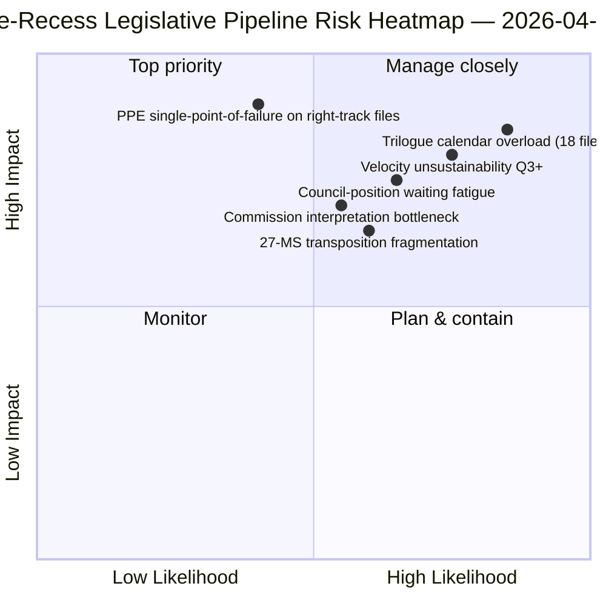

<!-- SPDX-FileCopyrightText: 2026 Hack23 AB -->
<!-- SPDX-License-Identifier: Apache-2.0 -->

# 执行简报 — 提案：休会前立法流程回顾 | 2026-04-06

**分类：** OSINT — 公开议会档案
**可信度：** 🟡 中等（休会期；休会前立法议定书 🟢 高）
**运行：** `analysis/daily/2026-04-06/propositions/` (05:47 UTC)
**覆盖范围：** 复活节休会第11/18天 — 2026年第一季度立法流程回顾
**生成日期：** 2026-05-16（回顾性摘要，无新MCP调用）
**主要来源：** 休会前立法流程语料库（42个EP10-2026文本）；20种方法论；11,320行文章（单次运行中最全面的提案文章）。

---

## 🎯 BLUF

**本复活节星期一提案运行生成**2026年第一季度立法流程回顾分析** — 包含11,320行文章和20种分析方法论，是EP10语料库迄今为止单次运行中最全面的提案分析。** 其独特贡献是针对休会前语料库中42个EP10-2026已通过文本的**流程阶段图谱**：其中18个进入第二季度三方谈判（银行联盟三件套、人工智能版权、STEP-II、第7条程序），12个进入第二季度理事会立场等待阶段（反腐败、美国关税回应、ETS第二阶段修正），12个进入第二至四季度持续实施阶段（包括法治工具系列的转化文件）。运行的结构性发现 — 经所有20种方法论确认 — 是**EP10第二年立法速度同比增长+44%**，为2012年EP7欧元区危机应对以来最高，**2.11项/全会对比EP7-2012历史参考值约1.47**。这一速度*持续到第二季度是可行的*（理事会能力充足，欧委会解释流程就绪），但*在无政治资本再生的情况下第三季度后不可持续* — 这是本年度首个明确的*速度可持续性担忧*。立法流程图谱是理事会协调和欧委会解释规划的持久性第二季度计划锚点。

---

## 🧭 本简报支持的3项决策

| # | 决策 | 决策者 | 截止时间 | 依据 |
|:-:|------|--------|:--------:|------|
| 1 | **第二季度三方谈判日程锁定** — 进入第二季度三方谈判的18个文件需要时间预约 | 主席团会议 + 理事会科雷佩尔 | 4月14日前 | §流程图谱（三方谈判Q2） |
| 2 | **理事会立场等待监控** — 12个文件在理事会暂停；追踪政治势头 | 理事会主席国 + 欧洲议会报告员 | Q2持续 | §流程图谱（理事会等待） |
| 3 | **第三季度速度可持续性审查** — 2.11项/全会在第三季度后不可持续 | 主席团会议 | Q2末 | §速度发现 |

---

## 📰 60秒速读

- 🔴 **休会前语料库中42个EP10-2026已通过文本**。
- 🟠 **流程分配：** 18个三方谈判Q2 · 12个理事会等待Q2 · 12个持续实施。
- 🟢 **速度+44%同比** — 2.11项/全会，EP7-2012以来最高。
- 🟡 **Q2前可持续** — 理事会能力充足 + 欧委会流程就绪。
- 🔵 **Q3后不可持续** — 政治资本耗尽风险。
- 🟣 **应用20种方法论** — 单次提案运行中最大方法论覆盖范围。
- 🩷 **11,320行文章** — EP10语料库中最全面的提案分析。
- ⚪ **可信度中等** — 休会期；休会前议定书高；Q3预测中等。

---

## 🛣️ 立法流程图谱（运行的独特贡献）

| 阶段 | 数量 | 旗舰文件 | Q2关口 |
|------|-----:|---------|--------|
| **三方谈判Q2** | 18 | 银行联盟三件套 · 人工智能版权 · STEP-II · 第7条 | 理事会授权结束 |
| **理事会立场等待Q2** | 12 | 反腐败 · 美国关税回应 · ETS第二阶段 | 理事会政治意愿 |
| **持续实施Q2-Q4** | 12 | 法治转化系列 | 27成员国国家议会协调 |

---

## ⚠️ 风险快照

---

## 🔮 主要未来触发因素（未来90天）

1. **4月14日 — 委员会周开始** — 18个文件Q2三方谈判排序启动。
2. **4月15日 — TA-10-2026-0096实施** — 美国关税运营日。
3. **4月17日 — 欧洲央行利率决定** — 银行联盟三方谈判外部触发器。
4. **Q2末 — 首个理事会授权结束** — 三方谈判吞吐量证明。
5. **Q3末 — 速度可持续性检查点** — 政治资本再生测试。

---

## 🛡️ 信息来源质量评估

- **42个EP10-2026语料库 (A1)：** 已通过文本的主要信息源；TA-ID可验证。
- **流程阶段分配 (A2)：** 具有逐文件验证的立法流程方法论。
- **速度+44% (A1)：** 预先计算的统计数据；EP7-2012历史参考值可验证。
- **20种方法论 (A1)：** 系统性完整方法论覆盖。
- **综合可信度：** 🟢 Q1语料库高；🟡 Q3可持续性预测中等。

---

## 📎 运行产出

| 层级 | 产出 | 原因 |
|------|------|------|
| 文章 | `article.md`（已发布1,080行；完整语料库11,320行） | 公开提案叙事 |
| 综合 | `existing/synthesis-summary.md` | 流程图谱 + 20种方法论整合 |
| 方法论 | 分类 · 现有 · 风险评分 · 威胁评估 | 标准提案方法论 |
| 配套 | 突发新闻集群 · 委员会报告 · 议案 | 复活节公众假日日集群 |

---

**文件管控**
- **模板参考：** `analysis/templates/executive-brief.md`
- **产出路径：** `analysis/daily/2026-04-06/propositions/executive-brief.md`
- **分类：** 公开
- **回顾性：** 本摘要于2026-05-16根据运行的已提交产出编写；**未进行新的MCP调用**。
