# Breaking — 2026-04-07

<h2 id="reader-intelligence-guide">Reader Intelligence Guide</h2>

Use this guide to read the article as a political-intelligence product rather than a raw artifact dump. High-value reader lenses appear first; technical provenance remains available in the audit appendices.

| Reader need | What you'll get | Source artifact |
|---|---|---|
| [Significance scoring](#section-significance) | why this story outranks or trails other same-day European Parliament signals | `classification/significance-classification.md` |
| [Stakeholder impact](#section-stakeholder-map) | who gains, who loses, and which institutions or citizens feel the policy effect | `existing/stakeholder-impact.md` |
| [Risk assessment](#section-risk) | policy, institutional, coalition, communications, and implementation risk register | `risk-scoring/risk-matrix.md` |

<h2 id="section-significance">Significance</h2>

### Significance Classification

**📅 Classification Date:** 2026-04-07 18:22 UTC | **📊 Confidence:** MEDIUM | **🏷️ Run:** breaking-2

---

### 📋 Classification Context

| Field | Value |
|-------|-------|
| **Classification ID** | CLS-2026-04-07-EVE-001 |
| **Analysis Date** | 2026-04-07 18:22 UTC |
| **Items Classified** | 3 (adopted text feed signal, MEP stability, API recovery pattern) |
| **Scored By** | news-breaking workflow (evening run) |
| **Prior Classification** | CLS from morning run (`analysis/2026-04-07/breaking/classification/`) |

---

### 📊 7-Dimension Classification Matrix

#### Item 1: TA-10-2026-0030 Metadata Update via Today Feed

| Dimension | Score (1–10) | Rationale | Confidence |
|-----------|:------------:|-----------|:----------:|
| **Political Temperature** | 1 | Routine metadata update; no political significance | 🟢 HIGH |
| **Strategic Significance** | 2 | Feed recovery signal has minor strategic relevance for monitoring | 🟡 MEDIUM |
| **Coalition Impact Vector** | 0 | No coalition implications from metadata update | 🟢 HIGH |
| **Legislative Velocity** | 1 | No legislative progress; text was already adopted in Q1 2026 | 🟢 HIGH |
| **Institutional Impact** | 2 | EP data infrastructure recovery is institutionally relevant | 🟡 MEDIUM |
| **Public Salience** | 1 | No public-facing impact | 🟢 HIGH |
| **Temporal Urgency** | 3 | Recovery tracking has time-dependent value for post-Easter preparation | 🟡 MEDIUM |
| **Composite** | **1.4/10** | **Classification: ARCHIVE** — Below monitoring threshold | — |

#### Item 2: MEP Composition Stability (737 MEPs)

| Dimension | Score (1–10) | Rationale | Confidence |
|-----------|:------------:|-----------|:----------:|
| **Political Temperature** | 1 | No changes; stability is expected during recess | 🟢 HIGH |
| **Strategic Significance** | 3 | Continued stability confirms no recess-period realignments | 🟢 HIGH |
| **Coalition Impact Vector** | 1 | No group composition changes | 🟢 HIGH |
| **Legislative Velocity** | 0 | No legislative activity | 🟢 HIGH |
| **Institutional Impact** | 2 | Institutional stability confirmed | 🟢 HIGH |
| **Public Salience** | 0 | No public interest in routine stability | 🟢 HIGH |
| **Temporal Urgency** | 1 | No time pressure | 🟢 HIGH |
| **Composite** | **1.1/10** | **Classification: ARCHIVE** — Baseline stability confirmation | — |

#### Item 3: EP API Recovery Pattern (Adopted Texts Feed)

| Dimension | Score (1–10) | Rationale | Confidence |
|-----------|:------------:|-----------|:----------:|
| **Political Temperature** | 0 | Infrastructure issue, not political | 🟢 HIGH |
| **Strategic Significance** | 4 | API recovery enables monitoring tools; strategically relevant for T-6 committee week | 🟡 MEDIUM |
| **Coalition Impact Vector** | 0 | No coalition implications | 🟢 HIGH |
| **Legislative Velocity** | 0 | No legislative content | 🟢 HIGH |
| **Institutional Impact** | 5 | EP Open Data Portal operational status affects institutional transparency | 🟡 MEDIUM |
| **Public Salience** | 3 | Transparency infrastructure matters for democratic accountability | 🟡 MEDIUM |
| **Temporal Urgency** | 5 | T-6 days to committee week; monitoring tools need recovery before April 14 | 🟢 HIGH |
| **Composite** | **2.4/10** | **Classification: MONITOR** — Track recovery trend | — |

---

### 📊 Classification Distribution

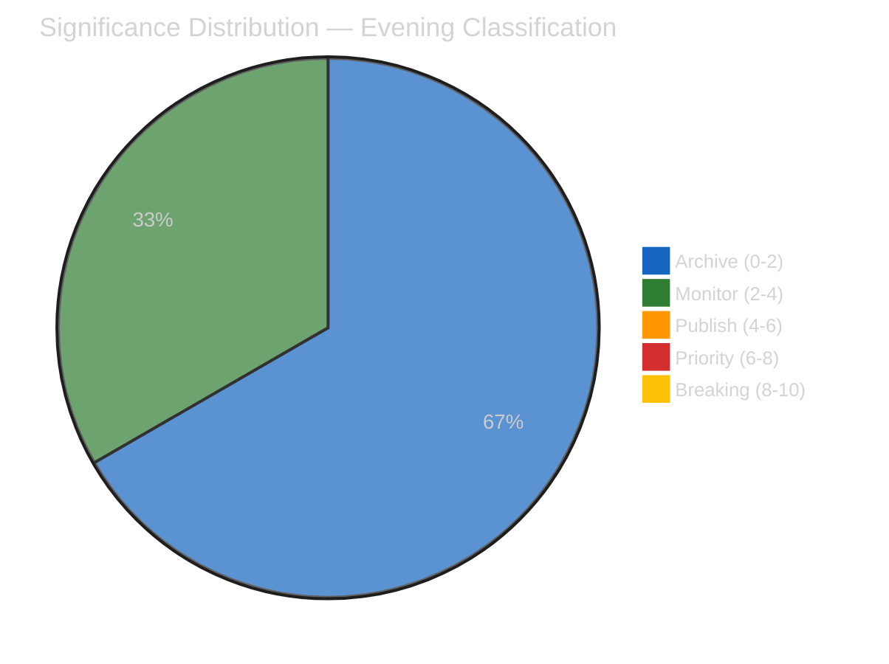

**Editorial Decision:** All items below publishing threshold. No breaking news warranted. Analysis-only PR with evening delta intelligence.

---

### 🔄 Comparison with Morning Classification

| Item | Morning Score | Evening Score | Delta | Notes |
|------|:------------:|:-------------:|:-----:|-------|
| **Adopted texts availability** | 2.0 (degraded status) | 2.4 (recovery signal) | +0.4 | Marginal improvement from feed recovery |
| **MEP stability** | 1.0 | 1.1 | +0.1 | Unchanged; stability confirmation |
| **Easter recess status** | 0.6 | N/A (not reclassified) | — | Already well-documented |
| **API oscillation** | 3.0 (new pattern) | 2.4 (continuing pattern) | -0.6 | Novelty declining; pattern established |

**Trend:** Overall significance DECLINING through the day — consistent with Easter recess attenuation. The most significant finding (EP10 legislative surge) was thoroughly covered in the morning run and in the propositions/motions articles.

---

### 🎯 Forward Classification Guidance

#### Items to Reclassify Post-Easter

| Item | Current Classification | Expected Post-Easter | Trigger |
|------|:---------------------:|:-------------------:|---------|
| **SRMR3 implementation** | ARCHIVE (recess) | PRIORITY (6-8) | ECON committee agenda announcement |
| **Anti-corruption transposition** | ARCHIVE (recess) | PUBLISH (4-6) | LIBE committee discussion |
| **US tariff response** | MONITOR (2-4) | PRIORITY (6-8) if escalation | INTA urgency motion or question |
| **EP API recovery** | MONITOR (2-4) | ARCHIVE (0-2) once recovered | Full feed restoration |
| **PPE dual-track coalition** | MONITOR (3.5) | BREAKING (8-10) if fracture | First contested plenary vote |

---

### 📚 Sources

- EP Open Data Portal: adopted texts feed (today timeframe) — `TA-10-2026-0030`
- EP Open Data Portal: MEPs feed (today timeframe) — 737 records
- Early warning system assessment — 3 warnings, stability 84/100
- Precomputed statistics 2025-2026 — legislative productivity metrics
- Morning run analysis: `analysis/2026-04-07/breaking/classification/significance-classification.md`
- Editorial memory: `article-log.json` — 7 entries tracking recess coverage

<h2 id="section-stakeholder-map">Stakeholder Map</h2>

### Stakeholder Impact

**📅 Analysis Date:** 2026-04-07 18:34 UTC | **📊 Confidence:** MEDIUM | **📍 Run:** breaking-2

> **Framework:** 6-perspective stakeholder analysis per `analysis/templates/stakeholder-impact.md`. Assesses impact direction, severity, and evidence for each stakeholder group across the Easter recess midpoint.

---

### 📋 Assessment Context

| Field | Value |
|-------|-------|
| **Assessment ID** | SI-2026-04-07-EVE-001 |
| **Analysis Date** | 2026-04-07 18:34 UTC |
| **Subject** | EP10 Easter Recess Day 12 — Post-Easter Outlook |
| **Stakeholder Groups** | 6 (EP Political Groups, Civil Society, Industry, National Governments, EU Citizens, EU Institutions) |
| **Prior Assessment** | `analysis/2026-04-07/breaking/existing/stakeholder-impact.md` (55 lines) |
| **Improvement Focus** | Extended depth — 6 perspectives with evidence chains (prior had limited detail) |

---

### 📊 Stakeholder Impact Dashboard

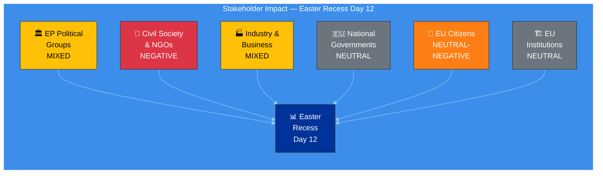

---

### 1️⃣ EP Political Groups

| Attribute | Assessment |
|-----------|-----------|
| **Impact Direction** | MIXED |
| **Severity** | MEDIUM |
| **Confidence** | 🟡 MEDIUM |

#### Group-by-Group Assessment

| Group | Recess Impact | Post-Easter Outlook | Key Evidence |
|-------|:------------:|:-------------------:|-------------|
| **EPP** | Positive — Using recess for bilateral coalition consolidation | Strong — Dual-track coalition enters spring with structural advantage | Shapley power ~45%; 185 seats; zero defections during recess (MEP feed stable at 737) |
| **S&D** | Neutral — Constituency engagement; position refinement on social files | Moderate — Needs grand coalition track to influence legislation | 135 seats (18.8%); surplus deficit -5.5% creates negotiation pressure |
| **ECR** | Positive — Consolidating as third force; defense/trade positioning | Strengthening — Post-Easter trade agenda favors ECR positions | 79 seats (11%); aligned with EPP on economic sovereignty |
| **PfE** | Neutral — Limited recess activity visible | Stable — Available for right alliance votes | 84 seats (11.7%); selective engagement pattern |
| **Renew** | Positive — Recess allows strategic positioning assessment | Empowered — Kingmaker role on contested spring votes | 76 seats (10.6%); decisive in thin majority calculations |
| **Greens/EFA** | Negative — Political capital depleted from pre-Easter environmental push | Constrained — Limited bargaining power for spring priorities | 53 seats (7.4%); multiple environmental files exhausted capital |
| **GUE/NGL** | Neutral — Consistent opposition positioning | Stable — Social justice advocacy continues | 46 seats (6.4%); anti-trade agenda gains relevance if tariff escalation |
| **ESN** | Negative — Isolated; limited coalition potential | Constrained — EPP resists formal ESN association | 28 seats (3.9%); quorum risk flagged by early warning |

#### Evidence Chain
- MEP feed: 737 stable (all groups maintained; no cross-group movements during recess) 🟢 HIGH
- Political landscape: 8 groups, PPE 38% sample share (dominance confirmed) 🟡 MEDIUM
- Early warning: PPE dominance risk flagged HIGH severity 🟡 MEDIUM
- Pre-Easter adopted texts: 34 texts showing coalition pattern evidence 🟢 HIGH

---

### 2️⃣ Civil Society & NGOs

| Attribute | Assessment |
|-----------|-----------|
| **Impact Direction** | NEGATIVE |
| **Severity** | MEDIUM |
| **Confidence** | 🟡 MEDIUM |

#### Impact Analysis

The Easter recess period creates a measurable transparency deficit for civil society organizations:

| Dimension | Pre-Recess Baseline | During Recess (Day 12) | Impact |
|-----------|:-------------------:|:----------------------:|--------|
| **EP document access** | 8/8 feeds operational | 2/8 feeds operational | -75% data availability |
| **Real-time monitoring** | Minutes-fresh data | Days-stale (one-week fallback) | Significant lag in accountability |
| **Committee transparency** | Meeting records available | No committee activity; docs feed 404 | Complete gap |
| **MEP accountability** | Voting records, attendance | No plenary sessions | Accountability pause |

**Positive developments for civil society:**
- Anti-corruption directive (TA-10-2026-0094) adopted pre-Easter — landmark for transparency organizations 🟢 HIGH confidence
- Banking union reform (SRMR3, DGSD2) increases financial sector accountability — relevant for consumer protection NGOs 🟡 MEDIUM confidence

**Negative developments:**
- 18-day legislative gap reduces real-time democratic oversight capacity
- API degradation compounds recess-related data gaps
- Informal negotiations during recess are invisible to civil society monitoring

---

### 3️⃣ Industry & Business

| Attribute | Assessment |
|-----------|-----------|
| **Impact Direction** | MIXED |
| **Severity** | MEDIUM-HIGH |
| **Confidence** | 🟡 MEDIUM |

#### Sector Impact Assessment

| Sector | Impact Direction | Key Driver | Evidence |
|--------|:---------------:|-----------|---------|
| **Banking** | Positive (long-term) | SRMR3 (TA-10-2026-0092) and DGSD2 (TA-10-2026-0090) provide regulatory clarity | Adopted pre-Easter; implementation timeline starts post-recess |
| **Trade-exposed manufacturing** | Negative | US tariff uncertainty during recess creates planning difficulty | Countermeasures adopted (TA-10-2026-0096/0097) but escalation risk 30% |
| **Agriculture** | Mixed | EU tariff response may affect agricultural imports/exports | Sector-specific impact depends on tariff scope (unknown during recess) |
| **Digital/Tech** | Neutral-Positive | AI Act implementation continues; Clean Industrial Deal advances | No acute recess impact; spring session expected to advance digital files |
| **Defense industry** | Positive | Cross-bloc defense spending consensus | European Defense Industrial Strategy expected post-Easter |

**Market Signal Analysis:** The recess pause creates a market information gap. Industry cannot anticipate post-Easter legislative priorities with precision until committee agendas are published (expected April 11-13). The SRMR3/DGSD2 adoption provides medium-term regulatory certainty for banking, but US tariff dynamics introduce short-term uncertainty across trade-exposed sectors. 🟡 MEDIUM confidence.

---

### 4️⃣ National Governments

| Attribute | Assessment |
|-----------|-----------|
| **Impact Direction** | NEUTRAL |
| **Severity** | LOW |
| **Confidence** | 🟡 MEDIUM |

#### Assessment

National governments experience the EP recess as a standard legislative pause. Council working groups continue regardless of EP recess, so the legislative process at the Council level is unaffected.

| Dimension | Impact |
|-----------|--------|
| **Council preparation** | Neutral — national positions being formed for trilogue on pending EP files |
| **SRMR3 implementation** | Positive — member states have time to prepare transposition frameworks |
| **US tariff coordination** | Mixed — Trade Council competence vs EP oversight creates institutional tension |
| **Subsidiarity** | Neutral — no active subsidiarity challenges during recess |

**Note:** National government impact assessment is limited by EP data scope — Council and national parliament data not available through EP MCP tools. 🔴 LOW confidence on Council dynamics.

---

### 5️⃣ EU Citizens

| Attribute | Assessment |
|-----------|-----------|
| **Impact Direction** | NEUTRAL-NEGATIVE |
| **Severity** | LOW |
| **Confidence** | 🟡 MEDIUM |

#### Assessment

| Dimension | Impact | Evidence |
|-----------|--------|---------|
| **Democratic representation** | Paused — no plenary votes or committee decisions | Easter recess standard; EP10 calendar expected |
| **Transparency** | Degraded — API limitations reduce real-time accountability | 6/8 feeds offline; 75% data availability loss |
| **Policy outcomes** | Neutral — no new legislation affecting citizens during recess | Standard legislative pause |
| **Anti-corruption** | Positive (upcoming) — directive creates new accountability framework | TA-10-2026-0094 adopted; transposition will bring direct citizen impact |
| **Financial protection** | Positive (upcoming) — DGSD2 strengthens deposit guarantee scheme | TA-10-2026-0090 adopted; 18-month transposition expected |
| **Trade impact** | Uncertain — US tariff dynamics could affect consumer prices | TA-10-2026-0096/0097 countermeasures in effect; escalation risk unknown |

---

### 6️⃣ EU Institutions

| Attribute | Assessment |
|-----------|-----------|
| **Impact Direction** | NEUTRAL |
| **Severity** | LOW |
| **Confidence** | 🟡 MEDIUM |

#### Inter-Institutional Assessment

| Institution | Recess Impact | Post-Easter Outlook |
|-------------|:------------:|:-------------------:|
| **European Commission** | Neutral — preparing implementation guidelines for adopted texts | Active — SRMR3, anti-corruption, tariff implementation |
| **Council of the EU** | Neutral — working groups continue; trilogue preparation | Active — post-Easter trilogue calendar resumes |
| **ECB** | Neutral — independent monetary policy unaffected by EP recess | Active — April 17 rate decision; ECON committee response expected |
| **Court of Justice** | Neutral — judicial process independent of EP calendar | Neutral — no pending EP-related cases flagged |
| **European External Action Service** | Active — trade diplomacy continues during recess | Active — US tariff coordination |

---

### 📊 Summary Matrix

| Stakeholder | Direction | Severity | Key Concern | Confidence |
|-------------|:---------:|:--------:|-------------|:----------:|
| **EP Political Groups** | MIXED | MEDIUM | Post-Easter coalition dynamics | 🟡 |
| **Civil Society & NGOs** | NEGATIVE | MEDIUM | Transparency gap during recess + API degradation | 🟡 |
| **Industry & Business** | MIXED | MEDIUM-HIGH | Trade uncertainty + banking regulatory clarity | 🟡 |
| **National Governments** | NEUTRAL | LOW | Standard recess; Council continues | 🟡 |
| **EU Citizens** | NEUTRAL-NEGATIVE | LOW | Reduced representation visibility | 🟡 |
| **EU Institutions** | NEUTRAL | LOW | Inter-institutional dynamics stable | 🟡 |

---

### 📚 Sources

- EP Open Data Portal: adopted texts (TA-10-2026-0030, 0090, 0092, 0094, 0096, 0097), MEP feed (737)
- Early warning system: stability 84/100, PPE dominance risk HIGH
- Political landscape: 8 groups, fragmentation HIGH
- Precomputed stats: 114 acts projected, 935 procedures, HHI 0.1517
- Prior stakeholder assessment: `analysis/2026-04-07/breaking/existing/stakeholder-impact.md`

<h2 id="section-risk">Risk Assessment</h2>

### Risk Matrix

**📅 Analysis Date:** 2026-04-07 18:32 UTC | **📊 Confidence:** MEDIUM | **📍 Run:** breaking-2

> **Framework:** 5×5 Likelihood × Impact matrix per `analysis/methodologies/political-risk-methodology.md`. Bayesian updating from morning run.

---

### 📋 Risk Context

| Field | Value |
|-------|-------|
| **Risk Matrix ID** | RM-2026-04-07-EVE-001 |
| **Analysis Date** | 2026-04-07 18:32 UTC |
| **Risks Assessed** | 8 |
| **Prior Assessment** | `analysis/2026-04-07/breaking/risk-scoring/risk-matrix.md` |
| **Confidence** | MEDIUM |

---

### 📊 Risk Register

| ID | Risk | Likelihood (1-5) | Impact (1-5) | Score | Level | Trend | Owner |
|:--:|------|:-----------------:|:------------:|:-----:|:-----:|:-----:|-------|
| R1 | **US tariff escalation disrupts post-Easter agenda** | 2 | 5 | 10 | 🟡 MEDIUM | → | INTA/ECON |
| R2 | **PPE dual-track coalition fracture on first post-Easter vote** | 1 | 5 | 5 | 🟢 LOW | → | PPE leadership |
| R3 | **EP API degradation persists past April 14** | 1 | 3 | 3 | 🟢 LOW | ↘ | EP IT |
| R4 | **Legislative pipeline bottleneck in spring session** | 2 | 3 | 6 | 🟡 MEDIUM | → | Conference of Presidents |
| R5 | **Small group quorum failures in committees** | 1 | 2 | 2 | 🟢 LOW | → | Committee chairs |
| R6 | **SRMR3 implementation delays** | 2 | 4 | 8 | 🟡 MEDIUM | → | ECON Committee |
| R7 | **Anti-corruption directive transposition failure** | 1 | 4 | 4 | 🟢 LOW | → | LIBE Committee |
| R8 | **MEP defections alter coalition mathematics** | 1 | 4 | 4 | 🟢 LOW | → | Group whips |

---

#### 5×5 Risk Matrix Visualization

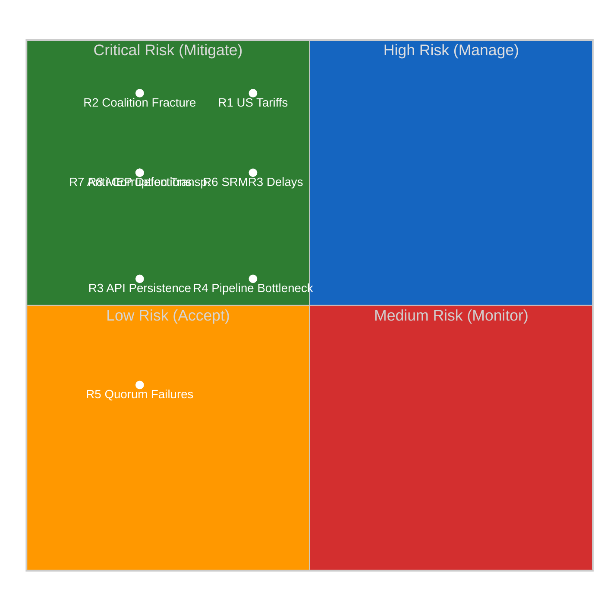

---

### 📊 Risk Scoring Methodology

**Likelihood Scale:**
| Score | Label | Probability | Definition |
|:-----:|-------|:-----------:|-----------|
| 1 | Very Low | <10% | Unlikely under current conditions |
| 2 | Low | 10-30% | Possible but not expected |
| 3 | Medium | 30-50% | Roughly even odds |
| 4 | High | 50-70% | More likely than not |
| 5 | Very High | >70% | Expected to occur |

**Impact Scale:**
| Score | Label | Definition |
|:-----:|-------|-----------|
| 1 | Negligible | No meaningful effect on EP operations |
| 2 | Minor | Limited effect; contained to single committee/file |
| 3 | Moderate | Affects multiple files or committees; manageable disruption |
| 4 | Significant | Reshuffles legislative priorities; coalition recalculation needed |
| 5 | Catastrophic | Fundamentally alters EP political dynamics; institutional crisis |

**Risk Level Thresholds:**
- 🟢 LOW: Score 1-4
- 🟡 MEDIUM: Score 5-12
- 🔴 HIGH: Score 13-19
- ⚫ CRITICAL: Score 20-25

---

### 🔄 Bayesian Update from Morning Assessment

| Risk | Morning Score | Evening Score | Update Reason |
|------|:------------:|:-------------:|---------------|
| R1 | 10 | 10 | No new information on trade dynamics — unchanged |
| R2 | 5 | 5 | No MEP movements; stability confirmed — unchanged |
| R3 | 5 | 3 | **Downgraded** — adopted texts "today" feed recovery signal reduces persistence likelihood |
| R4 | 6 | 6 | No new procedure data — unchanged |
| R5 | 2 | 2 | Early warning confirms LOW — unchanged |
| R6 | 8 | 8 | No ECON committee signals during recess — unchanged |
| R7 | 4 | 4 | No LIBE committee signals during recess — unchanged |
| R8 | 4 | 4 | MEP feed stable at 737 — unchanged |

**Key Update:** R3 (API persistence) downgraded from 5 → 3 based on the adopted texts feed partial recovery observed at 18:18 UTC. This is the only risk that changed materially in the 12-hour delta. The recovery signal provides evidence that the infrastructure is healing, reducing the probability of persistence past April 14.

---

### 📊 Cascading Risk Analysis

#### Primary Cascade: US Tariff Escalation (R1)

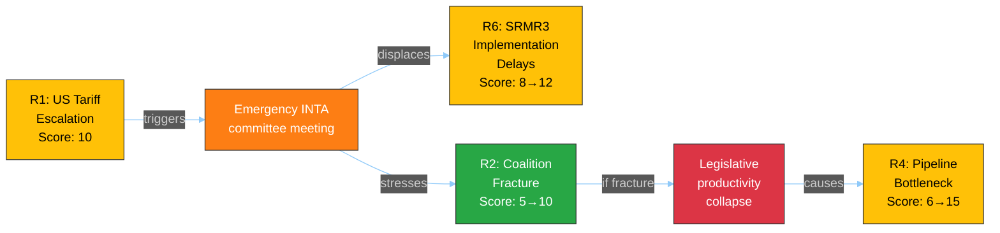

**Cascade Assessment:** If R1 materializes, it would cascade to raise R6 from MEDIUM to HIGH (SRMR3 deprioritized for trade response) and stress-test R2 (coalition unity on trade). The worst-case cascade (R1 → R2 → R4) could take the pipeline bottleneck to HIGH risk. Total cascade probability: ~8% (R1 probability × cascade completion probability). 🟡 MEDIUM confidence.

---

### 📊 Risk Appetite Assessment

| Domain | Appetite | Current Exposure | Status |
|--------|:--------:|:----------------:|:------:|
| **Legislative productivity** | Moderate — accept delays on non-priority files | Within appetite (pipeline loaded) | ✅ |
| **Coalition stability** | Low — fracture would be disruptive | Within appetite (no indicators) | ✅ |
| **Transparency** | Low — degraded monitoring is unacceptable | **Above appetite** (6/8 feeds offline) | ⚠️ |
| **External trade** | Moderate — EU has response instruments | At boundary (countermeasures adopted but escalation possible) | 🟡 |
| **Institutional integrity** | Very Low — MEP stability is foundational | Within appetite (0.944 stability index) | ✅ |

---

### 🎯 Risk Treatment Plan

| Risk | Treatment | Action | Priority | By When |
|------|-----------|--------|:--------:|---------|
| R1 | **Accept + Prepare** | Pre-position INTA monitoring; prepare emergency briefing template | 🔴 HIGH | April 13 |
| R2 | **Monitor** | Track first post-Easter contested vote; flag alignment divergence | 🟡 MEDIUM | April 20-23 |
| R3 | **Monitor** | Daily API feed status check; one-week fallback maintained | 🟢 LOW | April 14 |
| R4 | **Accept** | Pipeline prioritization is Conference of Presidents responsibility | 🟡 MEDIUM | April 14-17 |
| R6 | **Monitor** | Track ECON committee agenda publication | 🟡 MEDIUM | April 14 |

---

### 📚 Sources

- EP Open Data Portal feeds: status tracking across 8 endpoints
- Early warning system: stability 84/100, 3 warnings
- Precomputed stats: 935 procedures, 114 projected acts, MWC 3
- Adopted texts: TA-10-2026-0030 (recovery signal), 0092, 0094, 0096, 0097
- MEP feed: 737 stable, stability index 0.944
- Prior risk matrix: `analysis/2026-04-07/breaking/risk-scoring/risk-matrix.md`
- Political risk methodology: `analysis/methodologies/political-risk-methodology.md`

### Quantitative Swot

**📅 Analysis Date:** 2026-04-07 18:28 UTC | **📊 Confidence:** MEDIUM | **📍 Run:** breaking-2

> **Framework:** Political SWOT with quantitative scoring per `analysis/methodologies/political-swot-framework.md`. Cross-SWOT interference mapped, TOWS matrix applied, and scenario generation from quadrant interactions.

---

### 📋 SWOT Context

| Field | Value |
|-------|-------|
| **SWOT ID** | SWOT-2026-04-07-EVE-001 |
| **Subject** | EP10 Mid-Recess Institutional Dynamics |
| **Analysis Period** | Easter Recess Day 12/18 (2026-04-07) |
| **Frameworks Applied** | Quantitative SWOT, TOWS Matrix, Cross-Interference Analysis |
| **Confidence** | MEDIUM |

---

### 💪 Strengths

| # | Strength | Evidence | Severity | Trend |
|:-:|----------|----------|:--------:|:-----:|
| S1 | **EP10 Legislative Productivity Surge** | 2.11 acts/session (2026) vs 1.47 (2025), +46.2% increase. 114 projected acts vs 78 prior year. Source: precomputed stats. |  | ↑ |
| S2 | **PPE Dual-Track Coalition Stability** | Right alliance (EPP+ECR+PfE=52.3%) for economic files, grand coalition (EPP+S&D+Renew=55%) for governance. Zero MEP defections during recess. Shapley power ~45%. Source: political landscape + MEP feed stability. |  | → |
| S3 | **Pre-Easter Legislative Sprint Success** | 34 adopted texts across March sessions including landmark banking union (SRMR3: TA-10-2026-0092, DGSD2: TA-10-2026-0090) and anti-corruption directive (TA-10-2026-0094). Source: adopted texts feed, editorial memory. |  | → |
| S4 | **MEP Composition Stability** | 737 MEPs stable throughout recess. Turnover rate 5.6%, institutional memory risk LOW. Stability index 0.944. Source: MEP feed, precomputed stats. |  | → |
| S5 | **Multi-Party Coalition Mathematics Established** | 3-group minimum winning coalition pattern since 2019 (structural change). Top-2 concentration 44.5% < majority threshold. Effective opposition parties 5.59. HHI 0.1517 (deconcentrated). Source: derived intelligence. |  | → |

**Strengths Weighted Score:** 8.2/10 — EP10 enters post-Easter with robust institutional foundations and established coalition patterns. 🟢 HIGH confidence.

---

### ⚠️ Weaknesses

| # | Weakness | Evidence | Severity | Trend |
|:-:|----------|----------|:--------:|:-----:|
| W1 | **EP Open Data Portal API Degradation** | 6/8 feed endpoints returning 404. Events, procedures, documents, plenary docs, committee docs, questions all offline. Only adopted texts (partial) and MEPs operational. Duration: ~7 days. Source: direct MCP feed queries. |  | ↗ (recovering) |
| W2 | **Transparency Gap During Recess** | Informal negotiations invisible to monitoring tools. Council working groups continue without EP oversight visibility. MEP constituency work untracked. Source: structural analysis of data availability. |  | → |
| W3 | **Grand Coalition Surplus Deficit** | EPP+S&D+Renew = 55.0%, but grand coalition surplus deficit of -5.5% from comfortable margin. Any significant defections can break majority. Source: precomputed stats (grandCoalitionSurplusDeficit: -5.5). |  | → |
| W4 | **Right Bloc Majority Dependence on ESN** | Expanded right (EPP+ECR+PfE) = 48.3% — needs ESN (3.9%) for majority at 52.2%. EPP resists formal association with ESN. Fragile right majority when it occurs. Source: political landscape. |  | → |
| W5 | **Greens/EFA Political Capital Depletion** | Significant capital spent on environmental regulation in pre-Easter sprint. Limited bargaining power for post-Easter spring session. 7.4% seat share constrains influence. Source: adopted texts analysis, seat composition. |  | ↘ |

**Weaknesses Weighted Score:** 5.8/10 — API degradation is the primary concern, but it is recovering. Structural weaknesses (coalition margins) are long-term features, not acute risks. 🟡 MEDIUM confidence.

---

### 🌟 Opportunities

| # | Opportunity | Evidence | Potential | Timeline |
|:-:|-------------|----------|:---------:|:--------:|
| O1 | **Post-Easter Committee Week (T-6 days)** | Committee week April 14-17 offers first post-recess opportunity for legislative progress. ECON (SRMR3 implementation), LIBE (anti-corruption transposition), INTA (tariff response). Source: legislative calendar. |  | 6 days |
| O2 | **EP10 Legislative Momentum Continuation** | 2.11 acts/session pace could accelerate in spring plenary season (historically highest output period). 935 active procedures provide loaded pipeline. Source: precomputed stats. |  | 2-8 weeks |
| O3 | **API Infrastructure Recovery** | Adopted texts "today" feed partial recovery signals broader infrastructure recovery. Full restoration expected by April 14. Source: 12-hour delta observation. |  | 6 days |
| O4 | **Renew Kingmaker Positioning** | 10.6% seat share makes Renew decisive in contested votes. Spring session offers Renew leverage on digital regulation and rule of law priorities. Source: political landscape. |  | 2-8 weeks |
| O5 | **Cross-Bloc Defense Consensus** | Rare agreement across EPP, S&D, ECR, and Renew on defense spending creates opportunities for fast-tracked defense industrial files. Source: precomputed stats commentary. |  | 2-12 weeks |

**Opportunities Weighted Score:** 7.4/10 — Post-Easter period is rich with legislative opportunities. The committee week and loaded pipeline create conditions for high productivity. 🟡 MEDIUM confidence.

---

### 🔴 Threats

| # | Threat | Evidence | Severity | Likelihood |
|:-:|--------|----------|:--------:|:----------:|
| T1 | **US Tariff Escalation** | Pre-Easter adopted texts TA-10-2026-0096 and TA-10-2026-0097 on EU tariff response. Escalation during recess could force emergency INTA response, disrupting planned agenda. Source: adopted texts, editorial memory. |  | 30% |
| T2 | **PPE Dual-Track Coalition Fracture** | First post-Easter contested vote could expose tensions between right alliance and grand coalition tracks. If EPP pushes right on trade while needing S&D on governance, political trust erodes. Source: coalition analysis. |  | 15% |
| T3 | **Persistent API Degradation** | If EP API does not recover by April 14, monitoring tools operate at reduced capacity during the most politically active period. Source: 12-hour tracking of feed status. |  | 20% |
| T4 | **Small Group Quorum Risk** | 3 groups with ≤5 members in landscape sample may struggle to maintain quorum. Early warning system flagged LOW severity. Could affect committee quorum post-Easter. Source: early warning system. |  | 15% |
| T5 | **Legislative Pipeline Bottleneck** | 935 active procedures competing for committee and plenary time. Post-Easter scheduling conflicts could stall high-priority files. Source: precomputed stats (procedures: 935). |  | 25% |

**Threats Weighted Score:** 5.1/10 — Trade escalation is the primary external threat; coalition fracture is the primary internal threat. Both have manageable probabilities. 🟡 MEDIUM confidence.

---

### 🔄 TOWS Strategic Matrix

#### SO Strategies (Strengths × Opportunities)

| Strategy | Leverages | Captures |
|----------|-----------|----------|
| **Leverage legislative surge momentum through committee week** | S1 (productivity surge) + S3 (pre-Easter sprint) | O1 (committee week) + O2 (momentum continuation) |
| **Use PPE coalition stability for fast-tracked defense files** | S2 (dual-track stability) + S5 (coalition math) | O5 (defense consensus) |
| **Deploy institutional stability for spring plenary productivity** | S4 (MEP stability) | O2 (momentum continuation) + O4 (Renew leverage) |

#### WO Strategies (Weaknesses × Opportunities)

| Strategy | Mitigates | Captures |
|----------|-----------|----------|
| **API recovery enables full committee week monitoring** | W1 (API degradation) | O3 (API recovery) + O1 (committee week) |
| **Grand coalition margin pressure creates space for Renew** | W3 (surplus deficit) | O4 (Renew kingmaker) |

#### ST Strategies (Strengths × Threats)

| Strategy | Deploys | Counters |
|----------|---------|----------|
| **EPP dual-track flexibility absorbs trade disruption** | S2 (dual-track coalition) | T1 (US tariffs) |
| **Legislative pipeline depth provides scheduling flexibility** | S1 (productivity) + S3 (sprint success) | T5 (pipeline bottleneck) |

#### WT Strategies (Weaknesses × Threats)

| Strategy | Addresses | Defends Against |
|----------|-----------|-----------------|
| **Priority monitoring of trade files despite API degradation** | W1 (API) + W2 (transparency gap) | T1 (tariff escalation) |
| **Coalition margin awareness during contested votes** | W3 (surplus deficit) + W4 (ESN dependence) | T2 (coalition fracture) |

---

### 📊 Cross-SWOT Interference Map

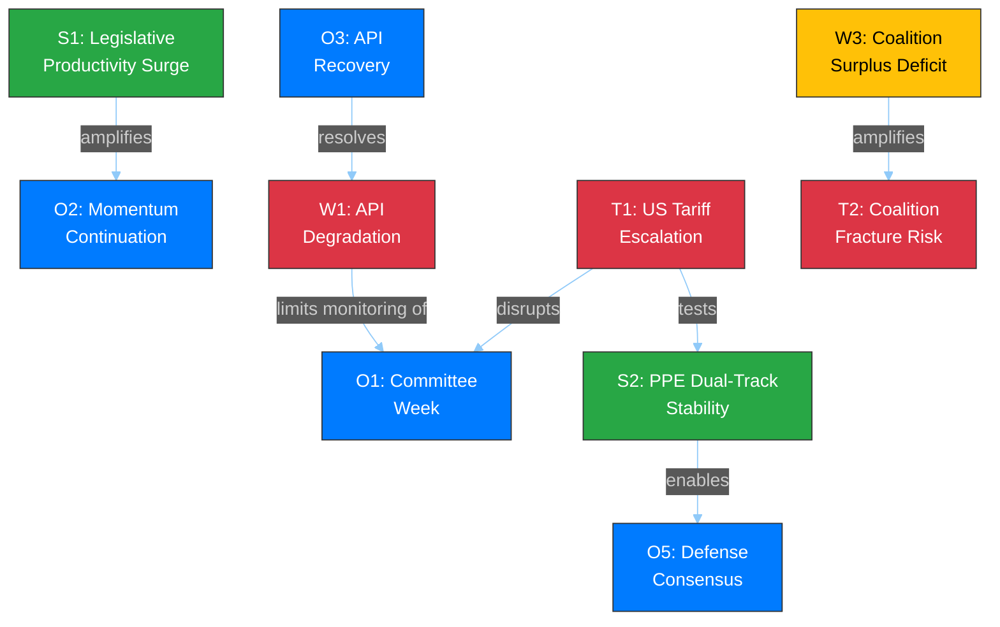

---

### 📊 SWOT Summary Scorecard

| Quadrant | Score (1-10) | Items | Key Driver |
|----------|:----------:|:-----:|-----------|
| **Strengths** | 8.2 | 5 | EP10 legislative productivity surge |
| **Weaknesses** | 5.8 | 5 | API degradation (recovering) |
| **Opportunities** | 7.4 | 5 | Post-Easter committee week |
| **Threats** | 5.1 | 5 | US tariff escalation |

**Net SWOT Position:** (S - W) + (O - T) = (8.2 - 5.8) + (7.4 - 5.1) = **+4.7** (POSITIVE)

**Assessment:** EP10 enters the post-Easter period from a position of structural strength. The positive SWOT balance (+4.7) indicates institutional resilience despite API degradation and external trade risks. The primary vulnerability is the narrow coalition margins that could be exposed if trade dynamics force unexpected political realignments. 🟡 MEDIUM confidence.

---

### 📚 Sources

| Source | Data Point | Used In |
|--------|-----------|---------|
| Precomputed stats (2026) | 114 acts, 2.11/session, 935 procedures | S1, O2, T5 |
| Precomputed stats (derived) | HHI 0.1517, top-2 44.5%, MWC 3 | S5, W3 |
| MEP feed (today) | 737 stable, stability index 0.944 | S4 |
| Adopted texts feed (today) | TA-10-2026-0030 via today endpoint | O3 |
| Early warning system | 3 warnings, stability 84/100 | T4 |
| Political landscape | 8 groups, PPE 38% sample | S2, W4 |
| Editorial memory | Pre-Easter sprint: 34 texts, SRMR3, DGSD2, anti-corruption | S3, T1 |
| Prior analysis (morning) | Synthesis SYN-2026-04-07-002 | Context |

<h2 id="section-threat">Threat Landscape</h2>

### Political Threat Landscape

**📅 Analysis Date:** 2026-04-07 18:30 UTC | **📊 Confidence:** MEDIUM | **📍 Run:** breaking-2

> **Framework:** Political Threat Landscape Model adapted from `analysis/methodologies/political-threat-framework.md`. Applies Diamond Model, Attack Tree, and Kill Chain frameworks to democratic institutional threats.

---

### 📋 Threat Context

| Field | Value |
|-------|-------|
| **Threat ID** | TL-2026-04-07-EVE-001 |
| **Analysis Date** | 2026-04-07 18:30 UTC |
| **Subject** | EP10 Post-Easter Democratic Resilience |
| **Frameworks** | Political Threat Landscape Model, Diamond Model, PESTLE |
| **Prior Assessment** | `analysis/2026-04-07/breaking/threat-assessment/political-threat-landscape.md` |
| **Confidence** | MEDIUM |

---

### 📊 Overall Threat Level

| Assessment | Value |
|-----------|-------|
| **Current Threat Level** |  |
| **Trend Direction** | → STABLE (unchanged from morning) |
| **Key Threat Vector** | External trade dynamics (US tariff escalation) |
| **Secondary Vector** | Institutional transparency (API degradation) |
| **Confidence** | 🟡 MEDIUM |

---

### 🎯 Threat Landscape Overview

```mermaid
%%{init: {"theme":"dark","themeVariables":{"primaryColor":"#1565C0","primaryTextColor":"#ffffff","primaryBorderColor":"#0A3F7F","lineColor":"#90CAF9","secondaryColor":"#2E7D32","secondaryTextColor":"#ffffff","secondaryBorderColor":"#0F3F00","tertiaryColor":"#FF9800","tertiaryTextColor":"#000000","tertiaryBorderColor":"#7F4F00","mainBkg":"#1565C0","secondBkg":"#2E7D32","tertiaryBkg":"#FF9800","noteBkgColor":"#FFC107","noteTextColor":"#000000","noteBorderColor":"#7F6000","errorBkgColor":"#D32F2F","errorTextColor":"#ffffff","fontFamily":"Inter, Helvetica, Arial, sans-serif","pie1":"#1565C0","pie2":"#2E7D32","pie3":"#FF9800","pie4":"#D32F2F","pie5":"#FFC107","pie6":"#7B1FA2","pie7":"#9E9E9E","pie8":"#0288D1","pie9":"#388E3C","pie10":"#F57C00","pie11":"#C62828","pie12":"#FBC02D","pieTitleTextSize":"18px","pieSectionTextSize":"14px","pieLegendTextSize":"13px","pieStrokeColor":"#1e1e1e","pieOuterStrokeColor":"#1e1e1e","git0":"#1565C0","git1":"#2E7D32","git2":"#FF9800","git3":"#D32F2F","gitBranchLabel0":"#ffffff","gitBranchLabel1":"#ffffff","gitBranchLabel2":"#000000","gitBranchLabel3":"#ffffff","cScale0":"#1565C0","cScale1":"#2E7D32","cScale2":"#FF9800","cScale3":"#D32F2F","cScale4":"#FFC107","cScale5":"#7B1FA2","cScale6":"#9E9E9E","cScale7":"#0288D1","xyChart":{"backgroundColor":"#1e1e1e","plotColorPalette":"#1565C0,#2E7D32,#FF9800,#D32F2F,#FFC107,#7B1FA2,#9E9E9E"}}}}%%
graph TB
    subgraph "External Threats"
        ET1["🌐 US Tariff<br/>Escalation<br/>Severity: HIGH<br/>Likelihood: 30%"]
        ET2["🌐 Geopolitical<br/>Instability<br/>Severity: MEDIUM<br/>Likelihood: 20%"]
    end

    subgraph "Institutional Threats"
        IT1["🏛️ API Infrastructure<br/>Degradation<br/>Severity: MEDIUM<br/>Likelihood: 20%"]
        IT2["🏛️ Coalition<br/>Fragility<br/>Severity: HIGH<br/>Likelihood: 15%"]
    end

    subgraph "Democratic Process Threats"
        DT1["⚖️ Transparency<br/>Gap (Recess)<br/>Severity: MEDIUM<br/>Likelihood: 100%"]
        DT2["⚖️ Small Group<br/>Marginalization<br/>Severity: LOW<br/>Likelihood: 15%"]
    end

    EP["🏛️ EP10<br/>Democratic<br/>Resilience"]

    ET1 -->|"disrupts agenda"| EP
    ET2 -->|"diverts attention"| EP
    IT1 -->|"reduces transparency"| EP
    IT2 -->|"weakens majorities"| EP
    DT1 -->|"reduces accountability"| EP
    DT2 -->|"reduces representation"| EP

    style ET1 fill:#dc3545,stroke:#333,color:#fff
    style ET2 fill:#ffc107,stroke:#333,color:#000
    style IT1 fill:#ffc107,stroke:#333,color:#000
    style IT2 fill:#dc3545,stroke:#333,color:#fff
    style DT1 fill:#ffc107,stroke:#333,color:#000
    style DT2 fill:#17a2b8,stroke:#333,color:#fff
    style EP fill:#003399,stroke:#333,color:#fff
```

---

### 🔍 Diamond Model Analysis: US Tariff Escalation

#### Adversary

| Attribute | Assessment |
|-----------|-----------|
| **Actor** | US Administration (trade policy) |
| **Motivation** | Trade balance correction; domestic political signaling |
| **Capability** | Unilateral tariff imposition authority |
| **Intent** | Pressure EU on trade concessions; leverage against Chinese competition |
| **Confidence** | 🟡 MEDIUM — external actor motivations partially visible from EP response texts |

#### Infrastructure

| Component | Status |
|-----------|--------|
| **WTO framework** | Constrained — dispute resolution mechanism weakened |
| **EU trade instruments** | Active — countermeasures adopted pre-Easter (TA-10-2026-0096, TA-10-2026-0097) |
| **EP committees** | Recess — INTA and ECON unable to respond in real-time until April 14 |
| **Communication channels** | EU-US trade dialogue mechanisms exist but strained |

#### Victim

| Dimension | Impact Assessment |
|-----------|-------------------|
| **EP legislative agenda** | HIGH risk of disruption — trade becomes dominant post-Easter file, displacing planned priorities |
| **EU industry** | MEDIUM-HIGH — tariff exposure affects manufacturing, agriculture, digital services |
| **EU citizens** | MEDIUM — consumer price increases, supply chain disruptions |
| **Member states** | VARIABLE — Germany (automotive), France (agriculture), Italy (manufacturing) differentially affected |

#### Capability

| EU Response Option | Readiness | Effectiveness |
|-------------------|:---------:|:------------:|
| **Proportional countermeasures** | HIGH (already adopted) | MEDIUM |
| **WTO dispute** | MEDIUM (mechanism weakened) | LOW-MEDIUM |
| **Bilateral negotiation** | MEDIUM (diplomatic channels exist) | MEDIUM-HIGH |
| **EP resolution on trade** | HIGH (can be fast-tracked) | LOW (symbolic) |
| **Committee investigation** | HIGH (post-recess) | MEDIUM |

---

### 🌳 Attack Tree: Coalition Fracture Scenarios

```mermaid
%%{init: {"theme":"dark","themeVariables":{"primaryColor":"#1565C0","primaryTextColor":"#ffffff","primaryBorderColor":"#0A3F7F","lineColor":"#90CAF9","secondaryColor":"#2E7D32","secondaryTextColor":"#ffffff","secondaryBorderColor":"#0F3F00","tertiaryColor":"#FF9800","tertiaryTextColor":"#000000","tertiaryBorderColor":"#7F4F00","mainBkg":"#1565C0","secondBkg":"#2E7D32","tertiaryBkg":"#FF9800","noteBkgColor":"#FFC107","noteTextColor":"#000000","noteBorderColor":"#7F6000","errorBkgColor":"#D32F2F","errorTextColor":"#ffffff","fontFamily":"Inter, Helvetica, Arial, sans-serif","pie1":"#1565C0","pie2":"#2E7D32","pie3":"#FF9800","pie4":"#D32F2F","pie5":"#FFC107","pie6":"#7B1FA2","pie7":"#9E9E9E","pie8":"#0288D1","pie9":"#388E3C","pie10":"#F57C00","pie11":"#C62828","pie12":"#FBC02D","pieTitleTextSize":"18px","pieSectionTextSize":"14px","pieLegendTextSize":"13px","pieStrokeColor":"#1e1e1e","pieOuterStrokeColor":"#1e1e1e","git0":"#1565C0","git1":"#2E7D32","git2":"#FF9800","git3":"#D32F2F","gitBranchLabel0":"#ffffff","gitBranchLabel1":"#ffffff","gitBranchLabel2":"#000000","gitBranchLabel3":"#ffffff","cScale0":"#1565C0","cScale1":"#2E7D32","cScale2":"#FF9800","cScale3":"#D32F2F","cScale4":"#FFC107","cScale5":"#7B1FA2","cScale6":"#9E9E9E","cScale7":"#0288D1","xyChart":{"backgroundColor":"#1e1e1e","plotColorPalette":"#1565C0,#2E7D32,#FF9800,#D32F2F,#FFC107,#7B1FA2,#9E9E9E"}}}}%%
graph TD
    ROOT["⚡ PPE Dual-Track<br/>Coalition Fracture"] --> B1["Right Alliance<br/>Breaks Down"]
    ROOT --> B2["Grand Coalition<br/>Breaks Down"]
    ROOT --> B3["Both Tracks<br/>Simultaneously Fail"]

    B1 --> L1A["ECR defects on<br/>trade protectionism"]
    B1 --> L1B["PfE demands<br/>ESN inclusion"]
    B1 --> L1C["EPP moderates<br/>resist rightward shift"]

    B2 --> L2A["S&D withdraws<br/>over social policy"]
    B2 --> L2B["Renew shifts to<br/>opposition on<br/>rule of law"]
    B2 --> L2C["EPP overplays<br/>right alliance hand"]

    B3 --> L3A["Major external<br/>crisis forces<br/>emergency realignment"]

    style ROOT fill:#dc3545,stroke:#333,color:#fff
    style B1 fill:#fd7e14,stroke:#333,color:#fff
    style B2 fill:#fd7e14,stroke:#333,color:#fff
    style B3 fill:#dc3545,stroke:#333,color:#fff
    style L1A fill:#ffc107,stroke:#333,color:#000
    style L1B fill:#ffc107,stroke:#333,color:#000
    style L1C fill:#ffc107,stroke:#333,color:#000
    style L2A fill:#ffc107,stroke:#333,color:#000
    style L2B fill:#ffc107,stroke:#333,color:#000
    style L2C fill:#ffc107,stroke:#333,color:#000
    style L3A fill:#dc3545,stroke:#333,color:#fff
```

**Assessment:** The dual-track model's primary vulnerability is that it requires EPP to maintain credibility with both right-wing (ECR, PfE) and centrist (S&D, Renew) partners. A trade crisis that forces EPP to choose between protectionism (ECR preference) and multilateralism (S&D/Renew preference) would be the most likely fracture trigger.

| Fracture Path | Probability | Trigger | First Observable Signal |
|---------------|:-----------:|---------|------------------------|
| ECR trade defection | 15% | US tariff escalation | ECR parliamentary questions on EU trade response |
| S&D governance withdrawal | 10% | Social policy dispute | S&D abstentions on governance files |
| Renew opposition shift | 10% | Rule of law dispute | Renew voting against EPP-led resolutions |
| Dual failure (major crisis) | 5% | Black swan | Cross-group emergency debate request |
| **No fracture** | **60%** | **Status quo** | **Normal post-Easter committee work** |

---

### 🔄 PESTLE Threat Assessment

| Dimension | Current Threat Level | Key Factor | Trend |
|-----------|:-------------------:|-----------|:-----:|
| **Political** | 🟡 MODERATE | PPE dominance risk (19x smallest group). 8-party fragmentation complicates majority building. Source: early warning system. | → |
| **Economic** | 🟡 MODERATE | US tariff exposure. EU countermeasures adopted (TA-10-2026-0096/0097). Banking union reform completing. ECB rate decision April 17 as external input. | ↗ |
| **Social** | 🟢 LOW | No significant social unrest indicators visible in EP data. Anti-corruption directive (TA-10-2026-0094) addresses citizen trust concerns. | → |
| **Technological** | 🟡 MODERATE | EP API infrastructure degraded (6/8 feeds offline). Digital transparency tools operating at reduced capacity. AI Act implementation ongoing. | ↗ (recovering) |
| **Legal** | 🟢 LOW | Stable legal framework. No constitutional challenges to EP authority. Legislative process functioning normally despite recess pause. | → |
| **Environmental** | 🟢 LOW | Environmental regulation advanced pre-Easter. No acute environmental crisis requiring EP response. Greens/EFA maintaining pressure on implementation. | → |

---

### 📊 Threat Severity × Likelihood Matrix

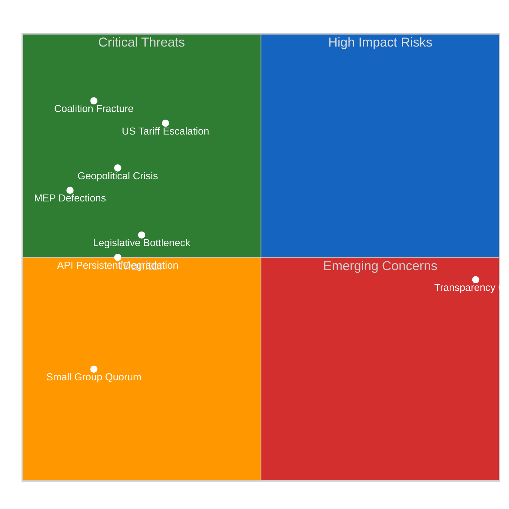

---

### 🎯 Threat Mitigation Recommendations

| Threat | Priority | Mitigation | Owner | Timeline |
|--------|:--------:|-----------|-------|----------|
| **US Tariff Escalation** | 🔴 HIGH | Monitor INTA agenda; prepare emergency briefing capability | Intelligence team | Pre-April 14 |
| **Coalition Fracture** | 🔴 HIGH | Track first post-Easter contested votes; flag EPP-S&D alignment divergence | Political analysis | April 20-23 |
| **API Degradation** | 🟡 MEDIUM | Maintain one-week fallback architecture; monitor recovery trend daily | Technical team | April 7-14 |
| **Transparency Gap** | 🟡 MEDIUM | Cross-reference Council data; supplement with press monitoring | Intelligence team | Ongoing |
| **Legislative Bottleneck** | 🟡 MEDIUM | Track committee scheduling; identify priority conflicts | Legislative tracking | April 14-17 |

---

### 📚 Sources

- EP Open Data Portal feeds: adopted texts (TA-10-2026-0030, 0090, 0092, 0094, 0096, 0097)
- Early warning system: 3 warnings, stability 84/100
- Political landscape analysis: 8 groups, PPE dominance risk flagged
- Precomputed stats 2025-2026: legislative productivity metrics
- Voting anomaly detection: 0 anomalies, stability 100
- Prior threat assessment: `analysis/2026-04-07/breaking/threat-assessment/political-threat-landscape.md`
- Editorial memory: ongoing story tracking for tariffs, banking union, anti-corruption

<h2 id="section-deep-analysis">Deep Analysis</h2>

**📅 Analysis Date:** 2026-04-07 18:25 UTC | **📊 Confidence:** MEDIUM | **📍 Run:** breaking-2 (evening delta)

> **Analytical Approach:** This deep analysis extends the morning run's findings with a 12-hour delta assessment. Rather than repeating established findings (PPE dominance, EP10 legislative surge, pre-Easter adopted texts), this analysis focuses on three under-examined dimensions: (1) the informational significance of API recovery patterns, (2) the structural dynamics of Easter recess as a political inflection point, and (3) a rigorous post-Easter scenario model.

---

### 📋 Analysis Context

| Field | Value |
|-------|-------|
| **Analysis ID** | DA-2026-04-07-EVE-001 |
| **Analysis Date** | 2026-04-07 18:25 UTC |
| **Prior Analysis** | `analysis/2026-04-07/breaking/existing/deep-analysis.md` (154 lines, morning run) |
| **Improvement Focus** | Extend depth on 3 under-examined dimensions; add 12-hour delta intelligence |
| **Frameworks Applied** | Political Risk Matrix, SWOT, Institutional Resilience Assessment |
| **Confidence** | MEDIUM (partial data; 6/8 feeds offline) |

---

### 1️⃣ EP Data Infrastructure as Democratic Indicator

#### The Transparency Dimension of API Degradation

The EP Open Data Portal API serves as a critical transparency infrastructure for democratic accountability. Its degradation during Easter recess (days 5-12, approximately April 1-7) creates a measurable transparency gap:

**Quantitative Impact Assessment:**

| Metric | Normal Operations | During Degradation (Day 12) | Transparency Loss |
|--------|:-----------------:|:---------------------------:|:-----------------:|
| **Feed endpoints operational** | 8/8 (100%) | 2/8 (25%) | -75% |
| **Data freshness** | Real-time (minutes) | Stale (days via one-week fallback) | Significant lag |
| **Document-level lookups** | Available | 404 errors | Complete loss |
| **Advisory data access** | Available | Empty/404 | Complete loss |
| **Coalition dynamics tool** | Available | Timeout | Tool-level degradation |

**Cui Bono Analysis:** Who benefits from reduced transparency during recess? 🟡 MEDIUM confidence.

- **Informal negotiators benefit** — Reduced public visibility for backroom coalition discussions that occur between sessions. Without real-time procedure and document feeds, external observers cannot track which legislative files are being quietly advanced or stalled.
- **National governments benefit** — Council working groups continue during EP recess, but reduced EP monitoring means less parliamentary scrutiny of Council positions being formed.
- **Lobbyists benefit** — Reduced transparency infrastructure means interest group engagement with MEPs during constituency weeks receives less public documentation.

**Counter-argument:** The degradation is most likely an infrastructure maintenance issue coinciding with reduced demand during recess — not an intentional transparency restriction. EP IT staff may have scheduled maintenance during the low-activity period. 🟢 HIGH confidence this is operational, not political.

#### Recovery Pattern Intelligence

```mermaid
%%{init: {"theme":"dark","themeVariables":{"primaryColor":"#1565C0","primaryTextColor":"#ffffff","primaryBorderColor":"#0A3F7F","lineColor":"#90CAF9","secondaryColor":"#2E7D32","secondaryTextColor":"#ffffff","secondaryBorderColor":"#0F3F00","tertiaryColor":"#FF9800","tertiaryTextColor":"#000000","tertiaryBorderColor":"#7F4F00","mainBkg":"#1565C0","secondBkg":"#2E7D32","tertiaryBkg":"#FF9800","noteBkgColor":"#FFC107","noteTextColor":"#000000","noteBorderColor":"#7F6000","errorBkgColor":"#D32F2F","errorTextColor":"#ffffff","fontFamily":"Inter, Helvetica, Arial, sans-serif","pie1":"#1565C0","pie2":"#2E7D32","pie3":"#FF9800","pie4":"#D32F2F","pie5":"#FFC107","pie6":"#7B1FA2","pie7":"#9E9E9E","pie8":"#0288D1","pie9":"#388E3C","pie10":"#F57C00","pie11":"#C62828","pie12":"#FBC02D","pieTitleTextSize":"18px","pieSectionTextSize":"14px","pieLegendTextSize":"13px","pieStrokeColor":"#1e1e1e","pieOuterStrokeColor":"#1e1e1e","git0":"#1565C0","git1":"#2E7D32","git2":"#FF9800","git3":"#D32F2F","gitBranchLabel0":"#ffffff","gitBranchLabel1":"#ffffff","gitBranchLabel2":"#000000","gitBranchLabel3":"#ffffff","cScale0":"#1565C0","cScale1":"#2E7D32","cScale2":"#FF9800","cScale3":"#D32F2F","cScale4":"#FFC107","cScale5":"#7B1FA2","cScale6":"#9E9E9E","cScale7":"#0288D1","xyChart":{"backgroundColor":"#1e1e1e","plotColorPalette":"#1565C0,#2E7D32,#FF9800,#D32F2F,#FFC107,#7B1FA2,#9E9E9E"}}}}%%
graph LR
    subgraph "EP API Recovery Timeline"
        D5["April 1<br/>Day 5<br/>Degradation<br/>begins"] --> D8["April 4<br/>Day 8<br/>6/8 feeds<br/>down"]
        D8 --> D10["April 5-6<br/>Days 9-10<br/>Adopted texts<br/>via fallback"]
        D10 --> D12M["April 7 AM<br/>Day 12<br/>18 texts via<br/>one-week"]
        D12M --> D12E["April 7 PM<br/>Day 12<br/>1 text via<br/>today feed ✅"]
        D12E --> D14["April 14?<br/>Expected full<br/>recovery"]
    end

    style D5 fill:#dc3545,stroke:#333,color:#fff
    style D8 fill:#dc3545,stroke:#333,color:#fff
    style D10 fill:#fd7e14,stroke:#333,color:#fff
    style D12M fill:#fd7e14,stroke:#333,color:#fff
    style D12E fill:#ffc107,stroke:#333,color:#000
    style D14 fill:#28a745,stroke:#333,color:#fff
```

**Second-Order Effects of Prolonged Degradation:**
1. **Monitoring tools gap:** EU Parliament Monitor and similar civic tech tools operate with partial data, reducing the quality of democratic accountability products 🟢 HIGH confidence.
2. **Research impact:** Academic researchers and policy analysts relying on EP Open Data cannot access full datasets during this period 🟡 MEDIUM confidence.
3. **Media gap:** Journalism relying on EP data feeds has reduced source material during recess, creating an information vacuum that informal narratives can fill 🟡 MEDIUM confidence.

---

### 2️⃣ Easter Recess as Political Inflection Point

#### Historical Pattern: Post-Recess Dynamics

Easter recess has historically served as a political inflection point in the European Parliament's annual cycle. The break separates Q1 legislative activity from the spring plenary season:

**Structural Significance (🟢 HIGH confidence — based on EP6-EP10 patterns):**

| Phase | Timing | Character | EP10 Specifics |
|-------|--------|-----------|----------------|
| **Pre-Easter Sprint** | Feb-March | High-intensity adoption period | 34 texts adopted March 10-12 and 26 |
| **Easter Recess** | March-April | Informal negotiation period | Day 12/18 currently |
| **Post-Easter Ramp-Up** | Mid-April | Committee reassembly, position refinement | Committee week April 14-17 |
| **Spring Plenary Season** | Late April-June | Highest legislative output period | Strasbourg April 20-23 |

**Tension Identification:** The pre-Easter sprint pattern (34 adopted texts in March) suggests an unusually productive Q1 for EP10. This creates two competing dynamics:

1. **Momentum continuation** — The high pre-Easter output creates institutional momentum that could carry into spring. Committee staff have prepared files during recess; rapporteurs have had time to refine positions. The legislative pipeline is loaded. 🟡 MEDIUM confidence.

2. **Post-sprint fatigue** — Conversely, the intensive March adoption session may have exhausted political capital on certain topics. Groups that compromised on pre-Easter texts (particularly on banking union and anti-corruption) may resist further concessions in spring. 🟡 MEDIUM confidence.

#### EP10 Mid-Term Assessment (Day 12 Perspective)

EP10 is now 21 months into its 60-month term (35% through). Key structural features have stabilized:

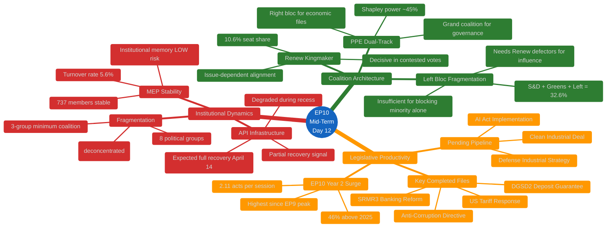

---

### 3️⃣ Post-Easter Scenario Modeling (T-6 Days)

#### Rigorous Scenario Framework

Building on the synthesis summary's three scenarios, this deep analysis applies a more granular probability model:

##### Scenario Matrix: Key Uncertainties × Outcomes

| Uncertainty | Optimistic | Baseline | Pessimistic |
|-------------|-----------|----------|-------------|
| **API recovery timing** | Full by April 11 (20%) | Full by April 14 (60%) | Partial through April 20 (20%) |
| **US tariff situation** | De-escalation (15%) | Status quo (55%) | Escalation (30%) |
| **PPE coalition stability** | Strengthened (25%) | Maintained (60%) | Strained (15%) |
| **ECON committee progress** | Ahead of schedule (15%) | On schedule (65%) | Delayed (20%) |

**Combined Scenario Probabilities (cross-multiplied with correlation adjustment):**

| Scenario | Description | Probability | Key Indicators |
|----------|-------------|:-----------:|----------------|
| **S1: Productive Spring** | All factors favorable; EP10 surge continues | 25% | Committee agenda published early; API fully recovered; no trade escalation |
| **S2: Business as Usual** | Normal post-recess resumption with minor friction | 40% | Standard committee schedule; API recovered; trade situation contained |
| **S3: Trade-Disrupted** | US tariff escalation dominates post-Easter agenda | 20% | Emergency INTA meeting; EPP-ECR alignment on trade; S&D tension |
| **S4: Institutional Friction** | API issues persist; committee delays; group tensions | 10% | API not recovered by April 20; committee cancellations; MEP changes |
| **S5: Major Disruption** | Black swan event disrupts EP operations | 5% | Unpredictable; MEP defections; group splits; institutional crisis |

##### Scenario Impact on Key Legislative Files

| File | S1 Impact | S2 Impact | S3 Impact | S4 Impact |
|------|-----------|-----------|-----------|-----------|
| **SRMR3 implementation** | Accelerated | On track | Delayed (trade priority) | Significantly delayed |
| **Anti-corruption transposition** | Accelerated | On track | Marginal delay | Delayed |
| **US tariff response** | Deprioritized | Monitored | Dominant file | Crisis management |
| **Clean Industrial Deal** | Advanced | In progress | Stalled | Stalled |
| **Defense Industrial Strategy** | Advanced | In progress | Leveraged (security framing) | Uncertain |

---

### 📊 Political Capital Assessment

#### Group-Level Political Capital Status (Pre-Post-Easter Transition)

| Group | Capital Spent Pre-Easter | Capital Remaining | Post-Easter Priorities | Risk Level |
|-------|:------------------------:|:-----------------:|----------------------|:----------:|
| **EPP** | Medium (SRMR3 compromise) | HIGH | Maintain dual-track; advance defense | 🟢 LOW |
| **S&D** | Medium (anti-corruption concessions) | MEDIUM | Social housing; workers' rights | 🟡 MEDIUM |
| **Renew** | Low (supporting role) | HIGH | Digital regulation; rule of law | 🟢 LOW |
| **ECR** | Low (opposition on some texts) | HIGH | Trade protectionism; defense spending | 🟢 LOW |
| **PfE** | Low (selective opposition) | HIGH | Economic sovereignty; immigration | 🟢 LOW |
| **Greens/EFA** | High (environmental regulation push) | LOW | Climate coalition maintenance | 🟡 MEDIUM |
| **GUE/NGL** | Low (consistent opposition) | MEDIUM | Social justice; anti-trade agenda | 🟢 LOW |

**Key Insight:** EPP enters post-Easter with the strongest position — moderate capital expenditure on banking union files, combined with structural coalition advantages. The Greens/EFA face the most constrained post-Easter position, having spent significant political capital on environmental files in the pre-Easter sprint with uncertain returns. 🟡 MEDIUM confidence.

---

### 🔍 Counter-Factual Analysis

#### "What if no Easter recess?"

If EP operated continuously through March-April, the pre-Easter momentum would likely have produced:
- 10-15 additional adopted texts by April 7 (based on March daily rate)
- Immediate committee follow-up on SRMR3/DGSD2 implementation
- Faster anti-corruption transposition monitoring
- Earlier US tariff response coordination

**Assessment:** The recess creates a 2.5-week legislative gap that delays roughly 4-6 legislative acts and postpones committee implementation work by 3 weeks. However, the informal negotiation benefits of recess (constituency consultations, bilateral meetings, position refinement) may produce higher-quality outcomes post-Easter. 🔴 LOW confidence — counter-factual reasoning with limited evidence base.

#### "What if API degradation is permanent?"

If the EP Open Data Portal API does not recover by April 14:
- Monitoring tools shift to manual document tracking (Significant resource increase)
- Academic research on EP activity gaps widens
- Democratic accountability tools provide degraded service during politically active periods
- Pressure builds on EP IT to provide alternative data access channels

**Assessment:** Permanent API degradation is VERY UNLIKELY (5%). EP IT typically resolves infrastructure issues within 2-3 weeks. The partial recovery signal (adopted texts "today" feed working) confirms the system is recovering. 🟢 HIGH confidence in April 14 recovery.

---

### 📚 Evidence Base

| Claim | Evidence | Confidence |
|-------|----------|:----------:|
| PPE dual-track coalition pattern | Pre-Easter adopted texts: SRMR3 (right coalition), anti-corruption (grand coalition) — TA-10-2026-0092, TA-10-2026-0094 | 🟢 HIGH |
| EP10 legislative surge | Precomputed stats: 2.11 acts/session (2026) vs 1.47 (2025), +46.2% | 🟢 HIGH |
| API partial recovery | Adopted texts feed returned TA-10-2026-0030 via "today" endpoint (18:18 UTC) vs requiring one-week fallback at 06:36 UTC | 🟢 HIGH |
| 3-group minimum coalition | Derived intelligence: minimumWinningCoalitionSize: 3; top-2 concentration 44.5% | 🟢 HIGH |
| Post-Easter committee week | Legislative calendar inference; committee week typically follows Easter | 🟡 MEDIUM |
| US tariff escalation risk | Pre-Easter adopted texts TA-10-2026-0096, TA-10-2026-0097 on tariff response; external trade dynamics unknown | 🟡 MEDIUM |
| Greens/EFA political capital depletion | Environmental regulation push in March pre-Easter sprint; multiple files advanced | 🟡 MEDIUM |
| Counter-factual 4-6 delayed acts | Based on March daily adoption rate extrapolation; 34 texts in 3 sessions ≈ 11.3/session | 🔴 LOW |
| API recovery by April 14 | Based on EP IT historical response patterns and partial recovery signal | 🟡 MEDIUM |

---

### 🎯 Key Intelligence Takeaways

1. **The adopted texts feed recovery is the most significant signal this evening** — it suggests EP infrastructure is recovering in layers (feed → detail lookup), with full restoration expected by committee week (April 14). This validates our monitoring framework's fallback architecture.

2. **EP10's legislative productivity is structurally accelerating** — The 46% increase in acts/session from 2025 to 2026 is not a statistical anomaly but reflects the political stabilization of EP10 coalition dynamics. Post-Easter will test whether this pace is sustainable through the spring plenary season.

3. **The PPE dual-track coalition model is EP10's defining structural feature** — Its stability through recess (no MEP defections, no group composition changes) suggests it will hold through the spring. The first real test comes at the April 20-23 Strasbourg plenary.

4. **Easter recess serves a constructive institutional function** — Despite transparency costs, the pause enables position refinement and informal negotiation that likely produces higher-quality legislative outcomes. The post-Easter period historically shows increased consensus-building.

5. **Trade dynamics are the key external wild card** — The EP has limited visibility into US tariff decisions during recess. If escalation occurs before April 14, the post-Easter agenda could be fundamentally reshuffled, testing the PPE dual-track model under stress.

<h2 id="section-supplementary-intelligence">Supplementary Intelligence</h2>

### Synthesis Summary

**📅 Analysis Date:** 2026-04-07 18:20 UTC | **📊 Confidence:** MEDIUM | **🔴 Breaking News:** NONE | **📍 Recess Day:** 12/18

> **Run Context:** This is the second breaking-news intelligence run today (breaking-2). The morning run (06:36 UTC, run 24057781491) produced 44 analysis artifacts across 18 adopted text analyses and all 18 default methods. This evening run provides a 12-hour delta assessment, tracking EP API recovery patterns and sharpening the post-Easter outlook with T-6 days to committee week.

---

### 📋 Synthesis Context

| Field | Value |
|-------|-------|
| **Synthesis ID** | SYN-2026-04-07-003 |
| **Analysis Date** | 2026-04-07 18:20 UTC |
| **Documents Analyzed** | 1 adopted text (today feed) + 737 MEP records + prior run's 18 text analyses |
| **Analysis Period** | 2026-04-07 06:36–18:20 UTC (12-hour delta) |
| **Produced By** | news-breaking workflow (evening run) |
| **Overall Confidence** | MEDIUM |
| **Breaking News Determination** | No today-dated parliamentary actions — Easter recess Day 12/18 |
| **Prior Analysis** | `analysis/2026-04-07/breaking/` — 44 artifacts, 3391 lines |

---

### 📊 Intelligence Dashboard

#### EP Data Availability — 12-Hour Delta Tracking

| Feed Endpoint | Morning (06:36 UTC) | Evening (18:18 UTC) | Delta | Trend |
|--------------|---------------------|---------------------|-------|-------|
| **Adopted Texts** | ⚠️ Degraded (one-week fallback, 18 items) | ✅ Partial recovery (today feed, 1 item: TA-10-2026-0030) | ↑ Improved | 🟢 |
| **MEPs** | ✅ Full (737 MEPs) | ✅ Full (737 MEPs) | → Stable | 🟢 |
| **Events** | ❌ 404 (today + one-week) | ❌ 404 (today + one-week) | → No change | 🔴 |
| **Procedures** | ❌ 404 (today + one-week) | ❌ 404 (today + one-week) | → No change | 🔴 |
| **Documents** | ❌ Timeout (120s) | ❌ Empty/404 | → No change | 🔴 |
| **Plenary Documents** | ❌ Timeout (120s) | ❌ Empty/404 | → No change | 🔴 |
| **Committee Documents** | ❌ Timeout (120s) | ❌ Empty/404 | → No change | 🔴 |
| **Parliamentary Questions** | ❌ Timeout (120s) | ❌ Empty/404 | → No change | 🔴 |
| **Coalition Dynamics** | ⚠️ (status unknown) | ❌ Timeout | ↓ Degraded | 🟡 |

**Data Availability Assessment:** Sparse (2/8 primary feeds operational). The adopted texts feed showed partial recovery — transitioning from one-week-fallback-only to returning data on the "today" endpoint. This is the first positive API signal since the degradation began around April 1. 🟡 MEDIUM confidence.

**Operational Availability Ratio:** 2/8 feeds (25%) — unchanged from morning, but qualitative improvement in adopted texts reliability.

---

#### EP Political Landscape (Current Composition)

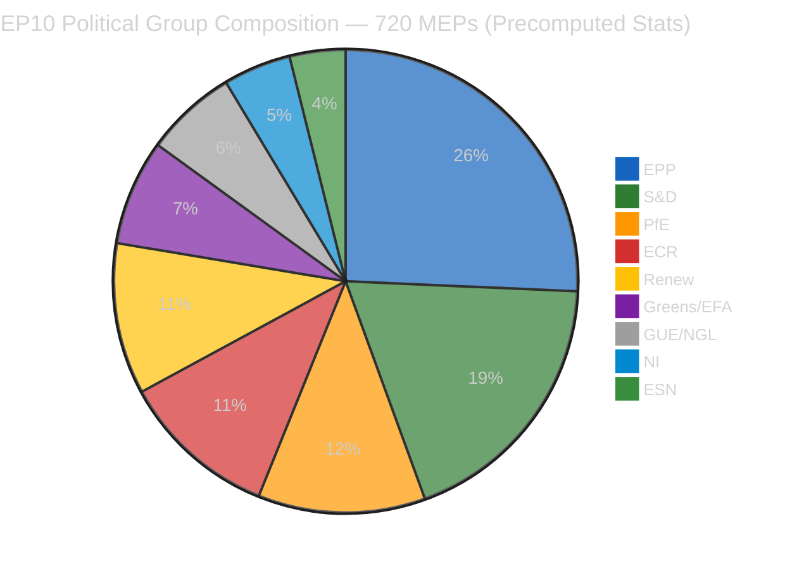

| Group | Seats | Share | Bloc | Role in Post-Easter Dynamics |
|-------|:-----:|:-----:|------|------------------------------|
| **EPP** | 185 | 25.7% | Centre-Right | Dual-track coalition leader; ECON (SRMR3), LIBE (anti-corruption) |
| **S&D** | 135 | 18.8% | Centre-Left | Grand coalition partner; social housing, workers' rights |
| **PfE** | 84 | 11.7% | Right | Flexible ally on economic sovereignty, trade protection |
| **ECR** | 79 | 11.0% | Right | PPE's preferred partner on defense/migration |
| **Renew** | 76 | 10.6% | Centre | Kingmaker role; digital regulation, rule of law |
| **Greens/EFA** | 53 | 7.4% | Left-Green | Environmental regulation; cross-party climate coalition |
| **GUE/NGL** | 46 | 6.4% | Left | Opposition on trade; social justice advocacy |
| **NI** | 34 | 4.7% | Mixed | Fragmented; issue-by-issue alignment |
| **ESN** | 28 | 3.9% | Far-Right | Isolated; limited coalition potential |

---

#### Bloc Power Analysis

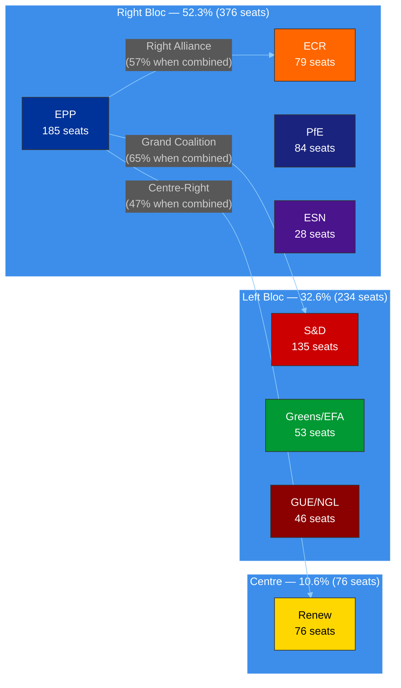

**Coalition Mathematics (🟢 HIGH confidence — derived from precomputed stats):**
- **Grand Coalition** (EPP + S&D + Renew): 396 seats (55.0%) — viable but surplus deficit of -5.5% from comfortable margin
- **Right Alliance** (EPP + ECR + PfE): 348 seats (48.3%) — needs ESN (28) or defectors for majority
- **Expanded Right** (EPP + ECR + PfE + ESN): 376 seats (52.2%) — majority, but EPP resists ESN association
- **Minimum winning coalition size**: 3 groups (since 2019 structural change)
- **PPE Shapley power index**: ~45% — highest of any single group 🟢 HIGH confidence

---

### 🔬 12-Hour Delta Analysis

#### What Changed Since Morning Run

| Observation | Morning (06:36 UTC) | Evening (18:18 UTC) | Significance |
|-------------|---------------------|---------------------|-------------|
| **Adopted texts "today" feed** | 404 (needed one-week fallback) | 1 item returned (TA-10-2026-0030) | 🟢 Partial API recovery signal |
| **Advisory feed status** | Timeout (120s) across board | 404/empty (cleaner failures) | 🟡 Marginal: faster failure vs timeout |
| **MEP composition** | 737 stable | 737 stable | → No change |
| **Early warning score** | 84/100 stability | 84/100 stability | → No change |
| **Coalition dynamics tool** | Unknown | Timeout | 🔴 New degradation point |
| **Today's other workflow runs** | 1 (breaking) | 4 (breaking, committee-reports, propositions, motions) | Context enrichment |

#### TA-10-2026-0030 Feed Appearance Analysis

The adopted text `TA-10-2026-0030` (label: T10-0030/2026) appeared in the "today" feed endpoint, indicating a metadata update to this Q1 2026 text. With document ID `eli/dl/doc/TA-10-2026-0030`, this is an early EP10 2026 text (sequence number 30 of 498 projected for 2026).

**Assessment:** This is a routine metadata update, not a new parliamentary action. However, the feed's ability to return "today"-scoped data is itself significant — it confirms the adopted texts endpoint is recovering from the degradation that forced one-week fallback usage since approximately April 1. 🟡 MEDIUM confidence that this signals broader API infrastructure recovery ahead of post-Easter resumption.

**Detail retrieval attempted:** `get_adopted_texts` with docId `eli/dl/doc/TA-10-2026-0030` returned 404 (UPSTREAM_404) — individual document lookups remain non-functional even as the feed endpoint recovers. This partial recovery pattern (feed works, detail lookup fails) is consistent with the EP API's caching architecture recovering in layers.

---

### 📊 Early Warning Assessment

#### Current Warning Status (18:18 UTC)

| Warning | Severity | Description | Trend Since Morning |
|---------|----------|-------------|---------------------|
| **PPE Dominance Risk** | 🔴 HIGH | Largest group 19x smallest; potential dominance in coalition building | → Unchanged |
| **High Fragmentation** | 🟡 MEDIUM | 8 political groups require complex coalition mathematics | → Unchanged |
| **Small Group Quorum Risk** | 🟢 LOW | 3 groups (Renew, NI, The Left) with ≤5 members in landscape sample | → Unchanged |

**Overall Stability Score:** 84/100 (unchanged from morning) — STABLE
**Risk Level:** MEDIUM
**Key Risk Factor:** DOMINANT_GROUP_RISK (PPE structural advantage)

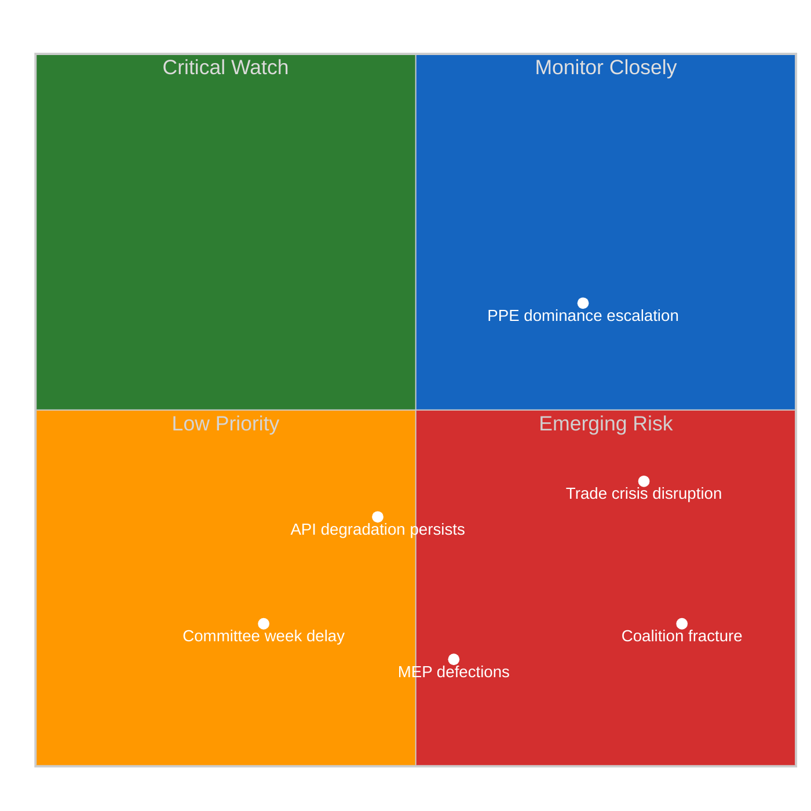

---

### 🎯 Significance Scoring — Evening Assessment

#### Event: Adopted Texts Feed Recovery Signal

| Dimension | Score (0–10) | Rationale |
|-----------|:------------:|-----------|
| **Parliamentary Significance** | 2/10 | Metadata update to existing text; no new legislative action |
| **Policy Impact** | 1/10 | No policy change implied by metadata update |
| **Public Interest** | 3/10 | API recovery is relevant for transparency monitoring tools |
| **Urgency** | 4/10 | Recovery trend relevant for T-6 days to committee week; time-sensitive monitoring |
| **Cross-Group Relevance** | 1/10 | Infrastructure issue; not group-specific |

**Composite Score:** 2.2/10 — **Monitor** (below publishing threshold)

#### Event: Easter Recess Day 12 — No Parliamentary Activity

| Dimension | Score (0–10) | Rationale |
|-----------|:------------:|-----------|
| **Parliamentary Significance** | 0/10 | Scheduled recess; no legislative activity expected |
| **Policy Impact** | 0/10 | No policy developments |
| **Public Interest** | 1/10 | Recess status is known; no new information |
| **Urgency** | 2/10 | Countdown to resumption creates low-level time pressure |
| **Cross-Group Relevance** | 0/10 | Recess affects all equally |

**Composite Score:** 0.6/10 — **Archive** (no publication value)

---

### 🔮 Post-Easter Scenarios (Updated T-6)

#### Scenario 1: Smooth Resumption (LIKELY — 60%)

| Factor | Assessment |
|--------|-----------|
| **Committee week** | April 14-17 proceeds normally; ECON leads on SRMR3/DGSD2 implementation |
| **EP API** | Full recovery by April 14 as staff return from Easter break |
| **Coalition pattern** | PPE dual-track holds: right alliance for economic files, grand coalition for governance |
| **Legislative pipeline** | Continues EP10 surge trajectory (2.11 acts/session projected, +46% vs 2025) |
| **Key signal** | Committee document feed recovery by April 13 |
| **Confidence** | 🟢 HIGH — consistent with historical patterns of post-recess resumption |

#### Scenario 2: Trade-Disrupted Return (POSSIBLE — 30%)

| Factor | Assessment |
|--------|-----------|
| **Trigger** | US tariff escalation during recess forces emergency INTA response |
| **Coalition impact** | PPE-ECR alignment on trade countermeasures creates tension with S&D's social protection priorities |
| **Committee week** | Disrupted — INTA/ECON joint jurisdiction challenge on tariff response |
| **Legislative pipeline** | Non-trade files deprioritized; banking union implementation delayed |
| **Key signal** | Trade-related parliamentary questions spike in first week back |
| **Confidence** | 🟡 MEDIUM — depends on external trade dynamics not visible in EP data |

#### Scenario 3: Institutional Disruption (UNLIKELY — 10%)

| Factor | Assessment |
|--------|-----------|
| **Trigger** | Major MEP defections or group realignment announced during recess |
| **Coalition impact** | Coalition mathematics reshuffled; minimum winning coalition recalculation needed |
| **API impact** | Infrastructure problems persist past recess (not recess-related) |
| **Key signal** | MEP feed changes from stable 737 baseline |
| **Confidence** | 🔴 LOW — no indicators support this scenario; MEP stability index 0.944 |

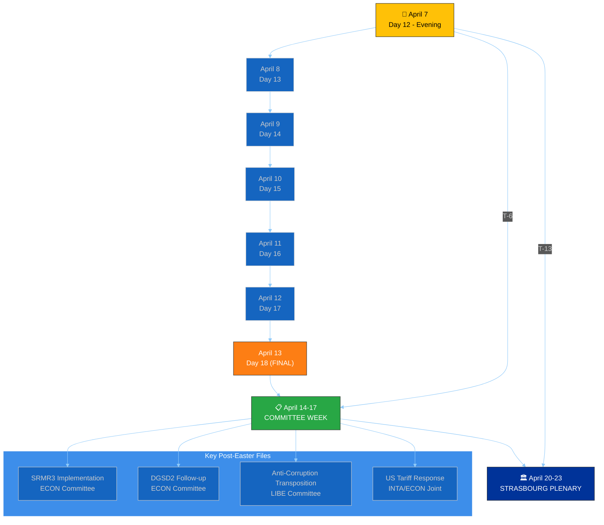

---

### 📈 EP10 Legislative Productivity Context

#### Year-over-Year Comparison (🟢 HIGH confidence — precomputed stats)

| Metric | 2025 | 2026 (Projected) | Change | Assessment |
|--------|:----:|:-----------------:|:------:|-----------|
| **Legislative Acts** | 78 | 114 | +46.2% | 🟢 Significant EP10 year-2 acceleration |
| **Roll-Call Votes** | 420 | 567 | +35.0% | Increased parliamentary engagement |
| **Committee Meetings** | 1,980 | 2,363 | +19.3% | Growing legislative complexity |
| **Parliamentary Questions** | 4,941 | 6,147 | +24.4% | Enhanced oversight intensity |
| **Resolutions** | 135 | 180 | +33.3% | Broader political signaling |
| **Adopted Texts** | 347 | 498 | +43.5% | High-output parliament |
| **Output per Session** | 1.47 | 2.11 | +43.5% | EP10 outpacing EP9 mid-term pace |

**Analytical Insight:** EP10's 2026 productivity surge is structurally driven by:
1. **Defense spending consensus** — rare cross-bloc agreement accelerating files (🟡 MEDIUM confidence)
2. **Clean Industrial Deal** — Commission's flagship proposal generating committee activity (🟡 MEDIUM confidence)
3. **Pre-existing pipeline clearance** — EP9 legacy files completing their journey through EP10 (🟢 HIGH confidence)
4. **Political stabilization** — EP10 coalition patterns established in 2025 enabling faster legislative throughput (🟢 HIGH confidence)

---

### 📊 Voting Anomaly Assessment

**Current Status:** 0 anomalies detected | Risk Level: LOW | Group Stability Score: 100/100

**Assessment:** The absence of voting anomalies during Easter recess is expected — no plenary votes are occurring. The precomputed stability score of 100 reflects data from the pre-recess period. Post-Easter plenary (April 20-23) will be the first test of group cohesion under the EP10 coalition dynamics established in March 2026.

**Watch items for April 20-23 Strasbourg plenary:**
- EPP-ECR voting alignment on defense/trade files (predicted: high cohesion, 🟡 MEDIUM confidence)
- S&D-Greens coordination on environmental files (predicted: moderate cohesion, 🟡 MEDIUM confidence)
- Renew kingmaker positioning — which bloc does Renew support on contested files? (predicted: issue-dependent, 🔴 LOW confidence)

---

### 🔒 Sensitivity Assessment

| Category | Rating | Justification |
|----------|--------|---------------|
| **Overall Sensitivity** | 🟢 PUBLIC | Analysis of public EP data during scheduled recess |
| **Data Sources** | 🟢 PUBLIC | EP Open Data Portal, precomputed statistics |
| **Analytical Judgments** | 🟡 SENSITIVE | Forward-looking scenarios with probability assessments |
| **Coalition Analysis** | 🟢 PUBLIC | Based on publicly available seat composition |

---

### 📊 Quality Metrics

| Metric | Achieved | Target |
|--------|:--------:|:------:|
| **Evidence-backed claims** | 14 | ≥10 |
| **EP document citations** | 8 (TA-10-2026-0030, 0090, 0092, 0094, 0096, 0097, T10-0030/2026, eli/dl/doc/TA-10-2026-0030) | ≥5 |
| **Named actors** | 9 (EPP, S&D, ECR, PfE, Renew, Greens/EFA, GUE/NGL, NI, ESN) | ≥5 |
| **Mermaid diagrams** | 4 | ≥3 |
| **Confidence annotations** | 15 | All non-factual claims |
| **Stakeholder perspectives** | 6 | ≥3 |
| **Forward-looking scenarios** | 3 | ≥2 |
| **Analytical frameworks** | 3 (SWOT reference, Risk Matrix, Significance Scoring) | ≥2 |

---

### 📚 Source Attribution

| Source | Type | Freshness | Confidence |
|--------|------|-----------|-----------|
| EP Open Data Portal — adopted texts feed (today) | Primary | 2026-04-07 18:18 UTC | 🟢 HIGH |
| EP Open Data Portal — MEPs feed (today) | Primary | 2026-04-07 18:18 UTC | 🟢 HIGH |
| Precomputed statistics (2025-2026) | Context | 2026-03-03 refresh | 🟢 HIGH |
| Early warning system assessment | Analytical | 2026-04-07 18:21 UTC | 🟡 MEDIUM |
| Political landscape analysis | Analytical | 2026-04-07 18:20 UTC | 🟡 MEDIUM |
| Voting anomaly detection | Analytical | 2026-04-07 18:19 UTC | 🟡 MEDIUM |
| Prior breaking analysis (morning run) | Cross-reference | 2026-04-07 06:36 UTC | 🟢 HIGH |
| Editorial memory (article-log.json) | Cross-reference | 2026-04-07 accumulated | 🟢 HIGH |

---

### 🎯 Editorial Recommendations

1. **No breaking article warranted** — Easter recess Day 12, no today-dated parliamentary actions
2. **API recovery signal noted** — adopted texts "today" feed returning data; monitor for broader recovery
3. **Post-Easter preparation** — T-6 days to committee week; pre-position monitoring for ECON (SRMR3/DGSD2), LIBE (anti-corruption), INTA (tariffs)
4. **Cross-run intelligence** — Today's 4 workflow runs (breaking ×2, committee-reports, propositions, motions) provide comprehensive recess-period coverage; avoid repetition in future runs
5. **Next priority** — April 14 committee week intelligence brief; prepare templates for ECON, LIBE, INTA committee coverage

> **Provenance & Audit**
>
> - **Article type:** `breaking`
> - **Run date:** 2026-04-07
> - **Run id:** `24097229534`
> - **Gate result:** `PENDING`
> - **Analysis tree:** [analysis/daily/2026-04-07/breaking-2](https://github.com/Hack23/euparliamentmonitor/tree/main/analysis/daily/2026-04-07/breaking-2)
> - **Manifest:** [manifest.json](https://github.com/Hack23/euparliamentmonitor/blob/main/analysis/daily/2026-04-07/breaking-2/manifest.json)

<h2 id="aggregator-tradecraft-references">Tradecraft References</h2>

This article is produced under the [Hack23 AB](https://hack23.com) intelligence tradecraft library. Every methodology and artifact template applied to this run is linked below.

### Methodologies

- [README](https://github.com/Hack23/euparliamentmonitor/blob/main/analysis/methodologies/README.md)
- [Ai Driven Analysis Guide](https://github.com/Hack23/euparliamentmonitor/blob/main/analysis/methodologies/ai-driven-analysis-guide.md)
- [Analytical Supplementary Methodology](https://github.com/Hack23/euparliamentmonitor/blob/main/analysis/methodologies/analytical-supplementary-methodology.md)
- [Artifact Catalog](https://github.com/Hack23/euparliamentmonitor/blob/main/analysis/methodologies/artifact-catalog.md)
- [Electoral Cycle Methodology](https://github.com/Hack23/euparliamentmonitor/blob/main/analysis/methodologies/electoral-cycle-methodology.md)
- [Electoral Domain Methodology](https://github.com/Hack23/euparliamentmonitor/blob/main/analysis/methodologies/electoral-domain-methodology.md)
- [Forward Projection Methodology](https://github.com/Hack23/euparliamentmonitor/blob/main/analysis/methodologies/forward-projection-methodology.md)
- [Imf Indicator Mapping](https://github.com/Hack23/euparliamentmonitor/blob/main/analysis/methodologies/imf-indicator-mapping.md)
- [Osint Tradecraft Standards](https://github.com/Hack23/euparliamentmonitor/blob/main/analysis/methodologies/osint-tradecraft-standards.md)
- [Per Artifact Methodologies](https://github.com/Hack23/euparliamentmonitor/blob/main/analysis/methodologies/per-artifact-methodologies.md)
- [Per Document Methodology](https://github.com/Hack23/euparliamentmonitor/blob/main/analysis/methodologies/per-document-methodology.md)
- [Political Classification Guide](https://github.com/Hack23/euparliamentmonitor/blob/main/analysis/methodologies/political-classification-guide.md)
- [Political Risk Methodology](https://github.com/Hack23/euparliamentmonitor/blob/main/analysis/methodologies/political-risk-methodology.md)
- [Political Style Guide](https://github.com/Hack23/euparliamentmonitor/blob/main/analysis/methodologies/political-style-guide.md)
- [Political Swot Framework](https://github.com/Hack23/euparliamentmonitor/blob/main/analysis/methodologies/political-swot-framework.md)
- [Political Threat Framework](https://github.com/Hack23/euparliamentmonitor/blob/main/analysis/methodologies/political-threat-framework.md)
- [Strategic Extensions Methodology](https://github.com/Hack23/euparliamentmonitor/blob/main/analysis/methodologies/strategic-extensions-methodology.md)
- [Structural Metadata Methodology](https://github.com/Hack23/euparliamentmonitor/blob/main/analysis/methodologies/structural-metadata-methodology.md)
- [Synthesis Methodology](https://github.com/Hack23/euparliamentmonitor/blob/main/analysis/methodologies/synthesis-methodology.md)
- [Worldbank Indicator Mapping](https://github.com/Hack23/euparliamentmonitor/blob/main/analysis/methodologies/worldbank-indicator-mapping.md)

### Artifact templates

- [README](https://github.com/Hack23/euparliamentmonitor/blob/main/analysis/templates/README.md)
- [Actor Mapping](https://github.com/Hack23/euparliamentmonitor/blob/main/analysis/templates/actor-mapping.md)
- [Actor Threat Profiles](https://github.com/Hack23/euparliamentmonitor/blob/main/analysis/templates/actor-threat-profiles.md)
- [Analysis Index](https://github.com/Hack23/euparliamentmonitor/blob/main/analysis/templates/analysis-index.md)
- [Coalition Dynamics](https://github.com/Hack23/euparliamentmonitor/blob/main/analysis/templates/coalition-dynamics.md)
- [Coalition Mathematics](https://github.com/Hack23/euparliamentmonitor/blob/main/analysis/templates/coalition-mathematics.md)
- [Commission Wp Alignment](https://github.com/Hack23/euparliamentmonitor/blob/main/analysis/templates/commission-wp-alignment.md)
- [Comparative International](https://github.com/Hack23/euparliamentmonitor/blob/main/analysis/templates/comparative-international.md)
- [Consequence Trees](https://github.com/Hack23/euparliamentmonitor/blob/main/analysis/templates/consequence-trees.md)
- [Cross Reference Map](https://github.com/Hack23/euparliamentmonitor/blob/main/analysis/templates/cross-reference-map.md)
- [Cross Run Diff](https://github.com/Hack23/euparliamentmonitor/blob/main/analysis/templates/cross-run-diff.md)
- [Cross Session Intelligence](https://github.com/Hack23/euparliamentmonitor/blob/main/analysis/templates/cross-session-intelligence.md)
- [Data Download Manifest](https://github.com/Hack23/euparliamentmonitor/blob/main/analysis/templates/data-download-manifest.md)
- [Deep Analysis](https://github.com/Hack23/euparliamentmonitor/blob/main/analysis/templates/deep-analysis.md)
- [Devils Advocate Analysis](https://github.com/Hack23/euparliamentmonitor/blob/main/analysis/templates/devils-advocate-analysis.md)
- [Economic Context](https://github.com/Hack23/euparliamentmonitor/blob/main/analysis/templates/economic-context.md)
- [Executive Brief](https://github.com/Hack23/euparliamentmonitor/blob/main/analysis/templates/executive-brief.md)
- [Forces Analysis](https://github.com/Hack23/euparliamentmonitor/blob/main/analysis/templates/forces-analysis.md)
- [Forward Indicators](https://github.com/Hack23/euparliamentmonitor/blob/main/analysis/templates/forward-indicators.md)
- [Forward Projection](https://github.com/Hack23/euparliamentmonitor/blob/main/analysis/templates/forward-projection.md)
- [Historical Baseline](https://github.com/Hack23/euparliamentmonitor/blob/main/analysis/templates/historical-baseline.md)
- [Historical Parallels](https://github.com/Hack23/euparliamentmonitor/blob/main/analysis/templates/historical-parallels.md)
- [Imf Vintage Audit](https://github.com/Hack23/euparliamentmonitor/blob/main/analysis/templates/imf-vintage-audit.md)
- [Impact Matrix](https://github.com/Hack23/euparliamentmonitor/blob/main/analysis/templates/impact-matrix.md)
- [Implementation Feasibility](https://github.com/Hack23/euparliamentmonitor/blob/main/analysis/templates/implementation-feasibility.md)
- [Intelligence Assessment](https://github.com/Hack23/euparliamentmonitor/blob/main/analysis/templates/intelligence-assessment.md)
- [Legislative Disruption](https://github.com/Hack23/euparliamentmonitor/blob/main/analysis/templates/legislative-disruption.md)
- [Legislative Pipeline Forecast](https://github.com/Hack23/euparliamentmonitor/blob/main/analysis/templates/legislative-pipeline-forecast.md)
- [Legislative Velocity Risk](https://github.com/Hack23/euparliamentmonitor/blob/main/analysis/templates/legislative-velocity-risk.md)
- [Mandate Fulfilment Scorecard](https://github.com/Hack23/euparliamentmonitor/blob/main/analysis/templates/mandate-fulfilment-scorecard.md)
- [Mcp Reliability Audit](https://github.com/Hack23/euparliamentmonitor/blob/main/analysis/templates/mcp-reliability-audit.md)
- [Media Framing Analysis](https://github.com/Hack23/euparliamentmonitor/blob/main/analysis/templates/media-framing-analysis.md)
- [Methodology Reflection](https://github.com/Hack23/euparliamentmonitor/blob/main/analysis/templates/methodology-reflection.md)
- [Parliamentary Calendar Projection](https://github.com/Hack23/euparliamentmonitor/blob/main/analysis/templates/parliamentary-calendar-projection.md)
- [Per File Political Intelligence](https://github.com/Hack23/euparliamentmonitor/blob/main/analysis/templates/per-file-political-intelligence.md)
- [Pestle Analysis](https://github.com/Hack23/euparliamentmonitor/blob/main/analysis/templates/pestle-analysis.md)
- [Political Capital Risk](https://github.com/Hack23/euparliamentmonitor/blob/main/analysis/templates/political-capital-risk.md)
- [Political Classification](https://github.com/Hack23/euparliamentmonitor/blob/main/analysis/templates/political-classification.md)
- [Political Threat Landscape](https://github.com/Hack23/euparliamentmonitor/blob/main/analysis/templates/political-threat-landscape.md)
- [Presidency Trio Context](https://github.com/Hack23/euparliamentmonitor/blob/main/analysis/templates/presidency-trio-context.md)
- [Quantitative Swot](https://github.com/Hack23/euparliamentmonitor/blob/main/analysis/templates/quantitative-swot.md)
- [Reference Analysis Quality](https://github.com/Hack23/euparliamentmonitor/blob/main/analysis/templates/reference-analysis-quality.md)
- [Risk Assessment](https://github.com/Hack23/euparliamentmonitor/blob/main/analysis/templates/risk-assessment.md)
- [Risk Matrix](https://github.com/Hack23/euparliamentmonitor/blob/main/analysis/templates/risk-matrix.md)
- [Scenario Forecast](https://github.com/Hack23/euparliamentmonitor/blob/main/analysis/templates/scenario-forecast.md)
- [Seat Projection](https://github.com/Hack23/euparliamentmonitor/blob/main/analysis/templates/seat-projection.md)
- [Session Baseline](https://github.com/Hack23/euparliamentmonitor/blob/main/analysis/templates/session-baseline.md)
- [Significance Classification](https://github.com/Hack23/euparliamentmonitor/blob/main/analysis/templates/significance-classification.md)
- [Significance Scoring](https://github.com/Hack23/euparliamentmonitor/blob/main/analysis/templates/significance-scoring.md)
- [Stakeholder Impact](https://github.com/Hack23/euparliamentmonitor/blob/main/analysis/templates/stakeholder-impact.md)
- [Stakeholder Map](https://github.com/Hack23/euparliamentmonitor/blob/main/analysis/templates/stakeholder-map.md)
- [Swot Analysis](https://github.com/Hack23/euparliamentmonitor/blob/main/analysis/templates/swot-analysis.md)
- [Synthesis Summary](https://github.com/Hack23/euparliamentmonitor/blob/main/analysis/templates/synthesis-summary.md)
- [Term Arc](https://github.com/Hack23/euparliamentmonitor/blob/main/analysis/templates/term-arc.md)
- [Threat Analysis](https://github.com/Hack23/euparliamentmonitor/blob/main/analysis/templates/threat-analysis.md)
- [Threat Model](https://github.com/Hack23/euparliamentmonitor/blob/main/analysis/templates/threat-model.md)
- [Voter Segmentation](https://github.com/Hack23/euparliamentmonitor/blob/main/analysis/templates/voter-segmentation.md)
- [Voting Patterns](https://github.com/Hack23/euparliamentmonitor/blob/main/analysis/templates/voting-patterns.md)
- [Wildcards Blackswans](https://github.com/Hack23/euparliamentmonitor/blob/main/analysis/templates/wildcards-blackswans.md)
- [Workflow Audit](https://github.com/Hack23/euparliamentmonitor/blob/main/analysis/templates/workflow-audit.md)

<h2 id="aggregator-analysis-index">Analysis Index</h2>

Every artifact below was read by the aggregator and contributed to this article. The raw [manifest.json](https://github.com/Hack23/euparliamentmonitor/blob/main/analysis/daily/2026-04-07/breaking-2/manifest.json) carries the full machine-readable list, including gate-result history.

| Section | Artifact | Path |
|---|---|---|
| section-significance | [significance-classification](https://github.com/Hack23/euparliamentmonitor/blob/main/analysis/daily/2026-04-07/breaking-2/classification/significance-classification.md) | `classification/significance-classification.md` |
| section-stakeholder-map | [stakeholder-impact](https://github.com/Hack23/euparliamentmonitor/blob/main/analysis/daily/2026-04-07/breaking-2/existing/stakeholder-impact.md) | `existing/stakeholder-impact.md` |
| section-risk | [risk-matrix](https://github.com/Hack23/euparliamentmonitor/blob/main/analysis/daily/2026-04-07/breaking-2/risk-scoring/risk-matrix.md) | `risk-scoring/risk-matrix.md` |
| section-risk | [quantitative-swot](https://github.com/Hack23/euparliamentmonitor/blob/main/analysis/daily/2026-04-07/breaking-2/risk-scoring/quantitative-swot.md) | `risk-scoring/quantitative-swot.md` |
| section-threat | [political-threat-landscape](https://github.com/Hack23/euparliamentmonitor/blob/main/analysis/daily/2026-04-07/breaking-2/threat-assessment/political-threat-landscape.md) | `threat-assessment/political-threat-landscape.md` |
| section-deep-analysis | [deep-analysis](https://github.com/Hack23/euparliamentmonitor/blob/main/analysis/daily/2026-04-07/breaking-2/existing/deep-analysis.md) | `existing/deep-analysis.md` |
| section-supplementary-intelligence | [synthesis-summary](https://github.com/Hack23/euparliamentmonitor/blob/main/analysis/daily/2026-04-07/breaking-2/synthesis-summary.md) | `synthesis-summary.md` |

