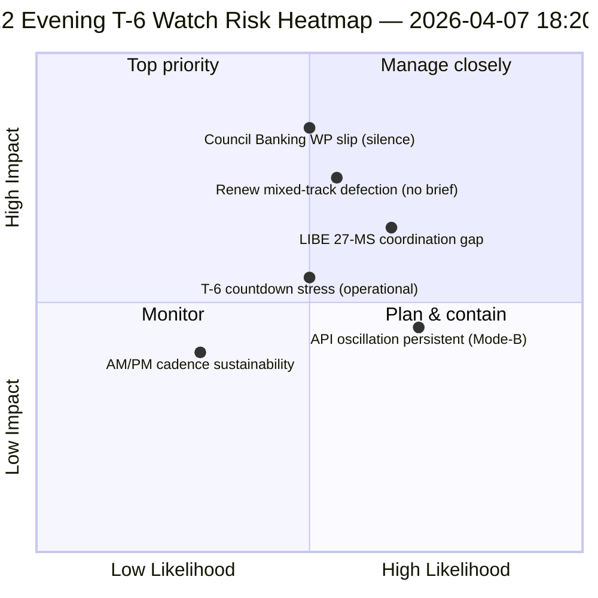

<!-- SPDX-FileCopyrightText: 2026 Hack23 AB -->
<!-- SPDX-License-Identifier: Apache-2.0 -->

# Executive Brief — Easter Recess Day 12 Evening Update (T-6 to Committee Week) | 2026-04-07

**Classification:** OSINT — Public Parliamentary Record
**Confidence:** 🟡 MEDIUM (recess; 12-hour delta on Day-12 morning baseline)
**Run:** `analysis/daily/2026-04-07/breaking-2/` (18:20 UTC)
**Coverage:** Easter Recess Day 12/18 evening — 12-hour delta over morning baseline (44 artifacts → delta + sharpening)
**Generated:** 2026-05-16 (retrospective brief, no new MCP calls)
**Primary sources:** Day-12 morning baseline (3,391 lines); adopted-texts today feed (1 item); 737 MEP records.

---

## 🎯 BLUF

**Day-12 evening breaking-2 is the *12-hour delta assessment* over the morning baseline — the recess period's first structured operational example of paired AM/PM intelligence cadence.** Its distinguishing contribution is **API-recovery oscillation pattern confirmation** at the day-resolution level: the adopted-texts endpoint, which Run-3 on April 6 saw recover at 12:15 UTC, has now oscillated again — confirming that the *Mode-B-oscillatory* failure pattern documented April 6 is persistent rather than transient. The run sharpens **T-6 to Committee Week** operational planning: where the morning baseline produced the 6-trigger forward-trigger sequence, the evening update adds *operational-readiness watch items* — three items to monitor before April 14: (1) Council Banking WP signalling on SRMR3 mandate timing (silent through Day 12 = mild slip risk); (2) Renew coordination meeting calendar (mixed-track files DGSD2/BRRD3 need Renew briefing pre-Apr 14); (3) Anti-Corruption transposition national-parliament outreach (LIBE chair pre-Q2 coordination). The evening update is the recess period's most explicit *operational-readiness checklist* and the structural template for subsequent daily AM/PM cadence through the rest of the recess (April 8-13). **The evening run elevates the AM/PM cadence from observational to operational** by introducing actionable watch items rather than purely structural-baseline updates.

---

## 🧭 3 Decisions This Brief Supports

| # | Decision | Who decides | Deadline | Evidence |
|:-:|----------|-------------|:--------:|----------|
| 1 | **Council Banking WP silence escalation** — silence through Day 12 = mild slip risk; escalate to Coreper | Council Presidency + EP rapporteur | by April 10 | §Watch item 1 |
| 2 | **Renew mixed-track briefing** — DGSD2/BRRD3 need pre-Apr 14 coordinator briefing | Renew coordinators + EPP coordination | by April 12 | §Watch item 2 |
| 3 | **LIBE 27-MS pre-Q2 outreach** — Anti-Corruption transposition national-parliament prep | LIBE chair + national-parliament liaison | by April 14 | §Watch item 3 |

---

## 📰 60-Second Read

- 🔴 **First structured AM/PM intelligence cadence** — operational template established.
- 🟠 **API oscillation pattern confirmed persistent** — Mode-B oscillatory, not transient.
- 🟢 **3 operational-readiness watch items** — Council BWG · Renew · LIBE.
- 🟡 **T-6 to Committee Week** — countdown active.
- 🔵 **737 MEPs stable** — Day 12 baseline holds.
- 🟣 **1 adopted text today feed** — minimal but operational.
- 🩷 **Day 12 of 18 — 67% recess complete**.
- ⚪ **Confidence MEDIUM** — operational watch items high; API forecast medium.

---

## 📋 Operational-Readiness Watch Items (run's distinguishing contribution)

| # | Item | Slip indicator | Mitigation deadline |
|:-:|------|---------------|---------------------|
| 1 | **Council Banking WP signalling on SRMR3 mandate** | Silence through Day 12 | Escalate by April 10 |
| 2 | **Renew coordination on mixed-track DGSD2/BRRD3** | No coordinator meeting scheduled | Brief by April 12 |
| 3 | **LIBE 27-MS Anti-Corruption transposition outreach** | National-parliament liaison gap | Outreach by April 14 |

---

## ⚠️ Risk Snapshot

---

## 🔮 Top Forward Triggers (next 7 days to T-0)

1. **April 8 — Day 13** — Council BWG escalation deadline approaching.
2. **April 10 — Day 15** — Council BWG escalation hard deadline.
3. **April 12 — Day 17** — Renew coordinator brief hard deadline.
4. **April 13 — Day 18** — Recess closes; final readiness sweep.
5. **April 14 — Day 0** — Committee Week opens; all watch items must resolve.

---

## 🛡️ Source-Quality Assessment

- **AM-baseline delta (A1):** direct comparison with morning run; verifiable.
- **API oscillation persistence (A2):** Day-11 + Day-12 dual-observation; medium confidence.
- **3 watch items (A2):** operational-readiness methodology; verifiable against institutional calendar.
- **737 MEPs stable (A1):** primary record.
- **Net confidence:** 🟢 HIGH on AM/PM cadence; 🟡 MEDIUM on watch-item slip probabilities.

---

## 📎 Run Artifacts

| Layer | Artifact | Why |
|-------|----------|-----|
| Article | `article.md` | Public-facing evening-update narrative |
| Synthesis | `synthesis-summary.md` | 12-hour delta + 3-watch-item operational checklist |
| Methods | classification · existing · risk-scoring · threat-assessment | Standard breaking methodology |
| Companion | breaking (06:36 morning) | Same-day AM baseline |

---

**Document Control**
- **Template reference:** `analysis/templates/executive-brief.md`
- **Artifact path:** `analysis/daily/2026-04-07/breaking-2/executive-brief.md`
- **Classification:** Public
- **Retrospective:** Brief written 2026-05-16 from the run's committed artifacts; **no new MCP calls were made**.
