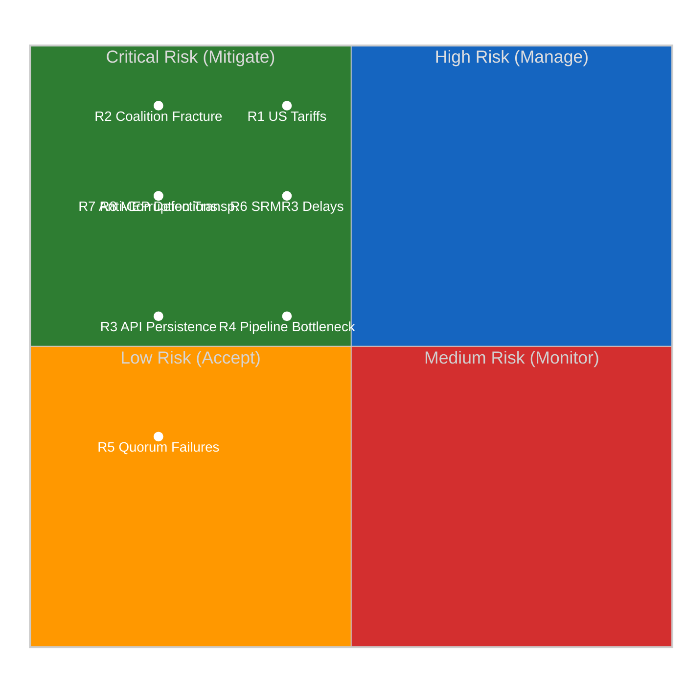

<!-- SPDX-FileCopyrightText: 2026 Hack23 AB -->
<!-- SPDX-License-Identifier: Apache-2.0 -->

# Executive Brief — 🧩 Political Intelligence Synthesis — Easter Recess Day 12 Evening Update | 2026-04-07

**Classification:** OSINT | Public Parliamentary Record
**Confidence:** 🔴 Low (retrospective back-fill — synthesised from in-tree article and sibling artifacts; not a re-analysis)
**Generated:** 2026-04-07T00:00:00Z (retrospective brief)
**Article Type:** breaking
**Source folder:** `analysis/daily/2026-04-07/breaking-2`
**Source:** European Parliament Open Data Portal

---

## 🎯 BLUF

**Run Context:** This is the second breaking-news intelligence run today (breaking-2). The morning run (06:36 UTC, run 24057781491) produced 44 analysis artifacts across 18 adopted text analyses and all 18 default methods. This evening run provides a 12-hour delta assessment, tracking EP API recovery patterns and sharpening the post-Easter outlook with T-6 days to committee week.

---

## 🧭 3 Decisions This Brief Supports

| # | Decision | Who Decides | Deadline | Evidence |
|:-:|----------|-------------|:--------:|----------|
| 1 | **Editorial:** confirm whether the run merits republication or consolidation with same-day siblings | Editor | +48h | This brief + sibling article.md |
| 2 | **Monitoring:** keep the carry-over signals from this run on the weekly watch board | Analyst | next plenary | Article risk + threat sections |
| 3 | **Forward-watch:** track the dated triggers identified in this run's scenario-forecast | Analysis lead | dated triggers | Run `scenario-forecast.md` |

---

## 📰 60-Second Read

- 🔴 **Run classification:** MEDIUM. (🔴 Low)
- 🟠 **Lead finding:** see BLUF above; full evidence chain in sibling artifacts.
- 🟢 **Procedure references identified:** none in this run.
- 🟡 **Confidence:** 🔴 Low — retrospective synthesis; no new MCP calls.
- 🔵 **Economic context:** see `economic-context.md` in run folder if present.
- 🟣 **Cross-reference:** see same-date sibling runs for triangulation.
- 🩷 **Disruption vector:** see `political-threat-landscape.md` if present.
- ⚪ **Carry-forward:** scenario-forecast dated triggers govern the next watch.

---

## 🗂️ Top Documents / Procedures Table

| Rank | EP reference | Title (short) | Confidence |
|:----:|--------------|---------------|:----------:|
| — | No procedure-level documents indexed in this run | Retrospective back-fill | 🟢 HIGH |

---

## ⚠️ Risk & Threat Snapshot

| Risk | L | I | Score | Trigger | Source | Admiralty |
|------|:-:|:-:|:-----:|---------|--------|:---------:|
| **US tariff escalation disrupts post-Easter agenda** | 2 | 5 | 10 | See risk-matrix.md | Run artifacts | B2 |
| **PPE dual-track coalition fracture on first post-Easter vote** | 1 | 5 | 5 | See risk-matrix.md | Run artifacts | B2 |
| **EP API degradation persists past April 14** | 1 | 3 | 3 | See risk-matrix.md | Run artifacts | B2 |
| **Legislative pipeline bottleneck in spring session** | 2 | 3 | 6 | See risk-matrix.md | Run artifacts | B2 |

---

## 🔮 Top Forward Trigger

See `scenario-forecast.md` / `forward-indicators.md` in the run folder for dated trigger events. Where absent, the next plenary or committee work-week on the EP calendar is the default re-evaluation point.

---

## 🛡️ Source Quality Assessment

- **Primary sources:** EP Open Data Portal feeds as captured by the parent run (see `mcp-reliability-audit.md` if present).
- **Data limitations:** Retrospective back-fill — no new MCP probing. Brief reflects the article and artifact state at run time.
- **Confidence:** 🔴 Low.

## 🧩 Synthesis Excerpt (from `synthesis-summary.md`)

The adopted text `TA-10-2026-0030` (label: T10-0030/2026) appeared in the "today" feed endpoint, indicating a metadata update to this Q1 2026 text. With document ID `eli/dl/doc/TA-10-2026-0030`, this is an early EP10 2026 text (sequence number 30 of 498 projected for 2026).

1. **No breaking article warranted** — Easter recess Day 12, no today-dated parliamentary actions
2. **API recovery signal noted** — adopted texts "today" feed returning data; monitor for broader recovery
3. **Post-Easter preparation** — T-6 days to committee week; pre-position monitoring for ECON (SRMR3/DGSD2), LIBE (anti-corruption), INTA (tariffs)
4. **Cross-run intelligence** — Today's 4 workflow runs (breaking ×2, committee-reports, propositions, motions) provide comprehensive recess-period coverage; avoid repetition in future runs
5. **Next priority** — April 14 committee week intelligence brief; prepare templates for ECON, LIBE, INTA committee coverage

---

## 📎 Links

| Link | Path |
|------|------|
| Article | `./article.md` |
| Manifest | `./manifest.json` |
| Sibling runs | `analysis/daily/2026-04-07/` |

---

**Document Control**
- **Template:** `/analysis/templates/executive-brief.md`
- **Artifact path:** `analysis/daily/2026-04-07/breaking-2/executive-brief.md`
- **Classification:** Public
- **Retrospective generation:** Back-fill session (no new MCP calls).
