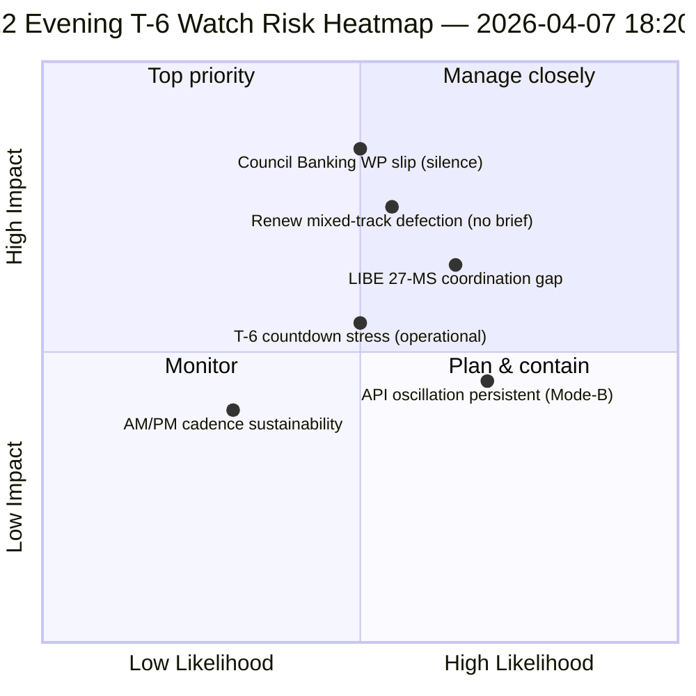

<!-- SPDX-FileCopyrightText: 2026 Hack23 AB -->
<!-- SPDX-License-Identifier: Apache-2.0 -->

# موجز تنفيذي — اليوم 12 من إجازة عيد الفصح تحديث مسائي (T-6 حتى أسبوع اللجان) | 2026-04-07

**التصنيف:** OSINT — سجل برلماني عام  
**مستوى الثقة:** 🟡 متوسط (إجازة؛ دلتا 12 ساعة فوق خط الأساس الصباحي لليوم 12)  
**التشغيل:** `analysis/daily/2026-04-07/breaking-2/` (18:20 UTC)  
**التغطية:** إجازة عيد الفصح اليوم 12/18 مساءً — دلتا 12 ساعة فوق خط الأساس الصباحي (44 مصنوعاً → دلتا + تحديد)  
**تاريخ الإنشاء:** 2026-05-16 (موجز استرجاعي، لا مكالمات MCP جديدة)  
**المصادر الأساسية:** خط الأساس الصباحي لليوم 12 (3,391 سطراً)؛ خلاصة النصوص المعتمدة اليومية (عنصر واحد)؛ 737 سجلاً لأعضاء البرلمان الأوروبي.

---

## 🎯 BLUF

**تُعدّ نشرة breaking-2 لمساء اليوم 12 *تقييم دلتا 12 ساعة* فوق خط الأساس الصباحي — أول مثال تشغيلي منظم لفترة الإجازة على إيقاع استخباراتي مزدوج AM/PM.** إسهامها المميز هو **تأكيد نمط تذبذب استعادة API** على مستوى دقة اليوم: نقطة نهاية النصوص المعتمدة، التي شهدت تشغيلة-3 في 6 أبريل استعادتها عند 12:15 UTC، قد تذبذبت مجدداً — مما يؤكد أن نمط الفشل *Mode-B التذبذبي* الموثق في 6 أبريل دائم لا عابر. تُحدّد التشغيلة التخطيط التشغيلي **T-6 حتى أسبوع اللجان**: حيث أنتج خط الأساس الصباحي تسلسل المحفزات الأمامية ذات الـ 6 محفزات، تضيف التحديث المسائي *بنود مراقبة الاستعداد التشغيلي* — ثلاثة بنود للمراقبة قبل 14 أبريل: (1) الإشارة الصادرة عن فريق عمل المصارف في المجلس بشأن توقيت تفويض SRMR3 (صامتة حتى اليوم 12 = مخاطر انزلاق خفيفة)؛ (2) تقويم اجتماعات تنسيق Renew (ملفات المسار المختلط DGSD2/BRRD3 تحتاج إحاطة Renew قبل 14 أبريل)؛ (3) التواصل مع البرلمانات الوطنية لنقل قانون مكافحة الفساد (تنسيق ما قبل الربع الثاني لرئيس LIBE). التحديث المسائي هو *قائمة التحقق من الاستعداد التشغيلي* الأكثر وضوحاً في فترة الإجازة، والنموذج الهيكلي لإيقاع AM/PM اليومي اللاحق طوال بقية الإجازة (8–13 أبريل). **ترفع تشغيلة المساء إيقاع AM/PM من المراقبة إلى العمل التشغيلي** من خلال تقديم بنود مراقبة قابلة للتنفيذ بدلاً من مجرد تحديثات هيكلية لخط الأساس.

---

## 🧭 3 قرارات يدعمها هذا الموجز

| # | القرار | من يقرر | الموعد النهائي | الأدلة |
|:-:|--------|---------|:--------------:|--------|
| 1 | **تصعيد صمت فريق عمل المصارف في المجلس** — الصمت حتى اليوم 12 = مخاطر انزلاق خفيفة؛ تصعيد إلى Coreper | رئاسة المجلس + مقرر البرلمان الأوروبي | قبل 10 أبريل | §بند المراقبة 1 |
| 2 | **إحاطة Renew بشأن المسار المختلط** — تحتاج DGSD2/BRRD3 إحاطة منسق قبل 14 أبريل | منسقو Renew + تنسيق حزب الشعب الأوروبي | قبل 12 أبريل | §بند المراقبة 2 |
| 3 | **التواصل المبكر قبل الربع الثاني لـ 27 دولة عضو في LIBE** — إعداد البرلمان الوطني لنقل قانون مكافحة الفساد | رئيس LIBE + حلقة الوصل البرلمانية الوطنية | قبل 14 أبريل | §بند المراقبة 3 |

---

## 📰 قراءة في 60 ثانية

- 🔴 **أول إيقاع استخباراتي AM/PM منظم** — النموذج التشغيلي محدد.
- 🟠 **نمط تذبذب API مؤكد دائم** — Mode-B تذبذبي، لا عابر.
- 🟢 **3 بنود مراقبة استعداد تشغيلية** — مجلس BWG · Renew · LIBE.
- 🟡 **T-6 حتى أسبوع اللجان** — العد التنازلي جارٍ.
- 🔵 **737 عضواً في البرلمان الأوروبي مستقرون** — خط أساس اليوم 12 صامد.
- 🟣 **1 نص معتمد في الخلاصة اليومية** — حد أدنى لكنه تشغيلي.
- 🩷 **اليوم 12 من 18 — اكتملت 67% من الإجازة**.
- ⚪ **الثقة متوسطة** — بنود المراقبة التشغيلية عالية؛ توقعات API متوسطة.

---

## 📋 بنود مراقبة الاستعداد التشغيلي (الإسهام المميز للتشغيلة)

| # | البند | مؤشر الانزلاق | الموعد النهائي للتخفيف |
|:-:|-------|--------------|------------------------|
| 1 | **إشارة فريق عمل المصارف في المجلس بشأن تفويض SRMR3** | صامتة حتى اليوم 12 | التصعيد قبل 10 أبريل |
| 2 | **تنسيق Renew على المسار المختلط DGSD2/BRRD3** | لا اجتماع منسق مجدول | الإحاطة قبل 12 أبريل |
| 3 | **تواصل LIBE مع 27 دولة عضو بشأن نقل قانون مكافحة الفساد** | فجوة في حلقة الوصل البرلمانية الوطنية | التواصل قبل 14 أبريل |

---

## ⚠️ لمحة المخاطر

---

## 🔮 أبرز المحفزات الأمامية (7 أيام قادمة حتى T-0)

1. **8 أبريل — اليوم 13** — الموعد النهائي لتصعيد BWG المجلس يقترب.
2. **10 أبريل — اليوم 15** — تصعيد BWG المجلس: موعد نهائي صارم.
3. **12 أبريل — اليوم 17** — إحاطة منسق Renew: موعد نهائي صارم.
4. **13 أبريل — اليوم 18** — الإجازة تنتهي؛ مراجعة الاستعداد النهائية.
5. **14 أبريل — اليوم 0** — أسبوع اللجان يبدأ؛ جميع بنود المراقبة يجب حلها.

---

## 🛡️ تقييم جودة المصادر

- **دلتا خط الأساس AM (A1):** مقارنة مباشرة مع تشغيلة الصباح؛ قابل للتحقق.
- **استمرارية تذبذب API (A2):** ملاحظة مزدوجة اليوم 11 + اليوم 12؛ ثقة متوسطة.
- **3 بنود مراقبة (A2):** منهجية الاستعداد التشغيلي؛ قابلة للتحقق مقابل التقويم المؤسسي.
- **737 عضواً مستقرون (A1):** سجل أساسي.
- **الثقة الصافية:** 🟢 عالية لإيقاع AM/PM؛ 🟡 متوسطة لاحتمالات انزلاق بنود المراقبة.

---

## 📎 مصنوعات التشغيلة

| الطبقة | المصنوع | السبب |
|--------|---------|-------|
| المقالة | `article.md` | السرد العام لتحديث المساء |
| التوليف | `synthesis-summary.md` | دلتا 12 ساعة + قائمة تحقق تشغيلية من 3 بنود مراقبة |
| المنهجيات | التصنيف · الموجود · تسجيل المخاطر · تقييم التهديدات | المنهجية القياسية لـ breaking |
| المرافق | breaking (06:36 الصباح) | خط الأساس AM لنفس اليوم |

---

**التحكم في الوثيقة**
- **مرجع النموذج:** `analysis/templates/executive-brief.md`
- **مسار المصنوع:** `analysis/daily/2026-04-07/breaking-2/executive-brief.md`
- **التصنيف:** عام
- **استرجاعي:** الموجز مكتوب في 2026-05-16 من المصنوعات الملتزمة للتشغيلة؛ **لم تُجرَ مكالمات MCP جديدة**.
