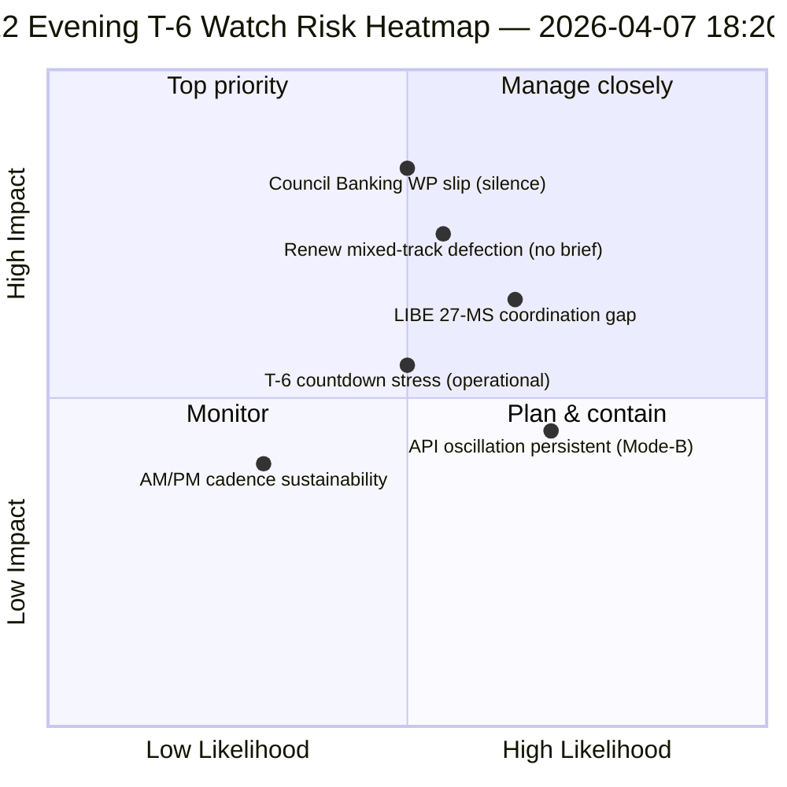

<!-- SPDX-FileCopyrightText: 2026 Hack23 AB -->
<!-- SPDX-License-Identifier: Apache-2.0 -->

# Ledelsesresumé — Påskeferie dag 12 aftensopdatering (T-6 til udvalgsugen) | 2026-04-07

**Klassificering:** OSINT — Offentlig parlamentarisk protokol  
**Tillid:** 🟡 MIDDEL (ferie; 12-timers delta over dag-12 morgenbaseline)  
**Kørsel:** `analysis/daily/2026-04-07/breaking-2/` (18:20 UTC)  
**Dækning:** Påskeferie dag 12/18 aften — 12-timers delta over morgenbaseline (44 artefakter → delta + præcisering)  
**Genereret:** 2026-05-16 (retrospektiv resumé, ingen nye MCP-kald)  
**Primære kilder:** Dag-12 morgenbaseline (3.391 linjer); vedtagne teksters dagsfeed (1 element); 737 MEP-poster.

---

## 🎯 BLUF

**Dag-12 aften breaking-2 er *12-timers deltaovervurderingen* over morgenbaselinen — ferieperiodens første strukturerede operationelle eksempel på parret AM/PM-efterretningsrytme.** Dens særlige bidrag er **bekræftelse af API-genopretningsoscillationsmønster** på dagniveauopløsning: endpoint for vedtagne tekster, som kørsel-3 den 6. april så genoprette sig kl. 12:15 UTC, har nu oscilleret igen — hvilket bekræfter, at det *Mode-B-oscillatoriske* fejlmønster dokumenteret den 6. april er vedvarende snarere end forbigående. Kørslen præciserer **T-6 til udvalgsugen** operationel planlægning: hvor morgenbaselinen producerede den 6-trigger fremadrettede udløsersekvens, tilføjer aftensopdateringen *operationelle beredskapsvagter* — tre elementer at overvåge inden den 14. april: (1) Rådets bankingsarbejdsgruppesignalering om SRMR3-mandatets timing (stille gennem dag 12 = mild glidningsrisiko); (2) Renews koordinationsmødekalender (blandede sporaftaler DGSD2/BRRD3 behøver Renew-briefing inden 14. april); (3) Antikorruptionstranspositions nationalparlamentarisk kontaktarbejde (LIBE-formands pre-Q2-koordination). Aftensopdateringen er ferieperiodens mest eksplicitte *operationelle beredskapsliste* og den strukturelle skabelon for efterfølgende daglige AM/PM-rytme gennem resten af ferien (8.-13. april). **Aftenkørslen løfter AM/PM-rytmen fra observationel til operationel** ved at introducere handlingsorienterede vagtelementer frem for rent strukturelle baslineopdateringer.

---

## 🧭 3 beslutninger denne resumé understøtter

| # | Beslutning | Hvem beslutter | Frist | Dokumentation |
|:-:|------------|---------------|:-----:|---------------|
| 1 | **Eskalering af rådets bankingssarbejdsgruppes tavshed** — tavshed gennem dag 12 = mild glidningsrisiko; eskalér til Coreper | Rådsformandskab + EP-ordfører | inden 10. april | §Vagt 1 |
| 2 | **Renew blandet-spor-briefing** — DGSD2/BRRD3 behøver pre-14. april koordinatorbriefing | Renew-koordinatorer + EPP-koordination | inden 12. april | §Vagt 2 |
| 3 | **LIBE 27-MS pre-Q2 kontaktarbejde** — antikorruptionstranspositions nationalparlamentarisk forberedelse | LIBE-formand + nationalparlamentarisk kontakt | inden 14. april | §Vagt 3 |

---

## 📰 60-sekunders læsning

- 🔴 **Første strukturerede AM/PM-efterretningsrytme** — operationel skabelon etableret.
- 🟠 **API-oscillationsmønster bekræftet vedvarende** — Mode-B oscillatorisk, ikke forbigående.
- 🟢 **3 operationelle beredskapsvagter** — Rådet BWG · Renew · LIBE.
- 🟡 **T-6 til udvalgsugen** — nedtælling aktiv.
- 🔵 **737 MEP'er stabile** — dag 12-baseline holder.
- 🟣 **1 vedtaget tekst dagsfeed** — minimal men operationel.
- 🩷 **Dag 12 af 18 — 67 % af ferien afsluttet**.
- ⚪ **Tillid MIDDEL** — operationelle vagter høj; API-prognose middel.

---

## 📋 Operationelle beredskapsvagter (kørslens særlige bidrag)

| # | Element | Glidningsindikator | Afhjælpningsfrist |
|:-:|---------|-------------------|-------------------|
| 1 | **Rådets bankingsarbejdsgruppes signalering om SRMR3-mandat** | Tavshed gennem dag 12 | Eskalér inden 10. april |
| 2 | **Renew-koordination på blandet spor DGSD2/BRRD3** | Intet koordinatormøde planlagt | Briefing inden 12. april |
| 3 | **LIBE 27-MS antikorruptionstranspositions kontaktarbejde** | Nationalparlamentarisk kontaktgab | Kontaktarbejde inden 14. april |

---

## ⚠️ Risikooversigt

---

## 🔮 Top fremadrettede udløsere (næste 7 dage til T-0)

1. **8. april — dag 13** — Rådets BWG-eskaleringsdeadline nærmer sig.
2. **10. april — dag 15** — Rådets BWG-eskalering hård deadline.
3. **12. april — dag 17** — Renew koordinatorbriefing hård deadline.
4. **13. april — dag 18** — Ferie slutter; endelig beredskapsoversigt.
5. **14. april — dag 0** — Udvalgsuge åbner; alle vagter skal løses.

---

## 🛡️ Kildekvurdering

- **AM-baseline-delta (A1):** direkte sammenligning med morgenkørsel; verificerbar.
- **API-oscillationspersistens (A2):** dag-11 + dag-12 dobbeltobservation; middeltillid.
- **3 vagtelementer (A2):** operationel beredskapetodologi; verificerbar mod institutionel kalender.
- **737 MEP'er stabile (A1):** primær post.
- **Nettotillid:** 🟢 HØJ for AM/PM-rytme; 🟡 MIDDEL for vagtelementers glidningssandsynligheder.

---

## 📎 Kørselss artefakter

| Lag | Artefakt | Hvorfor |
|-----|----------|---------|
| Artikel | `article.md` | Offentlig aftensopdateringsfortælling |
| Syntese | `synthesis-summary.md` | 12-timers delta + 3-vagt operationsliste |
| Metoder | klassificering · eksisterende · risikovurdering · trusselsvurdering | Standard breaking-metodologi |
| Ledsager | breaking (06:36 morgen) | Samme dags AM-baseline |

---

**Dokumentkontrol**
- **Skabelonreference:** `analysis/templates/executive-brief.md`
- **Artefaktsti:** `analysis/daily/2026-04-07/breaking-2/executive-brief.md`
- **Klassificering:** Offentlig
- **Retrospektiv:** Resumé skrevet 2026-05-16 fra kørslens committede artefakter; **ingen nye MCP-kald blev foretaget**.
