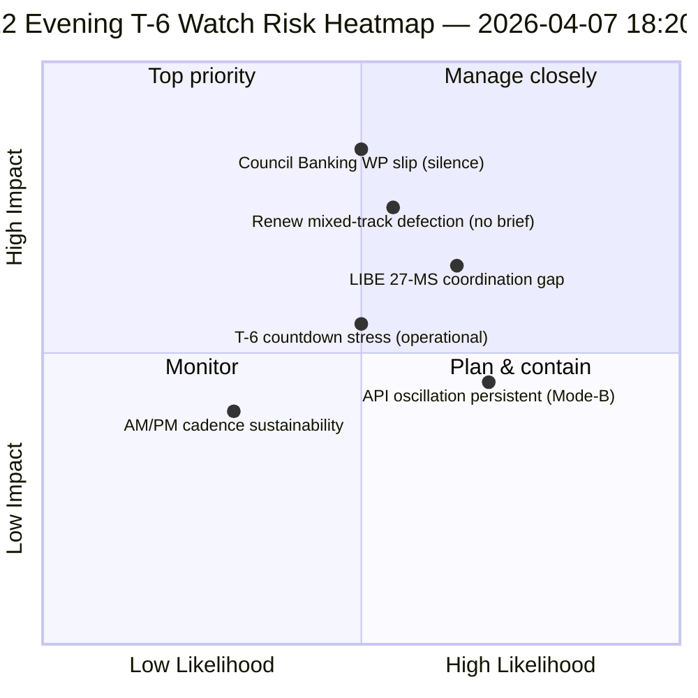

<!-- SPDX-FileCopyrightText: 2026 Hack23 AB -->
<!-- SPDX-License-Identifier: Apache-2.0 -->

# Führungsbriefing — Osterurlaub Tag 12 Abendaktualisierung (T-6 bis Ausschusswoche) | 2026-04-07

**Einstufung:** OSINT — Öffentliche Parlamentsunterlagen  
**Vertrauen:** 🟡 MITTEL (Urlaub; 12-Stunden-Delta gegenüber Tag-12-Morgen-Baseline)  
**Lauf:** `analysis/daily/2026-04-07/breaking-2/` (18:20 UTC)  
**Abdeckung:** Osterurlaub Tag 12/18 Abend — 12-Stunden-Delta gegenüber Morgen-Baseline (44 Artefakte → Delta + Schärfung)  
**Erstellt:** 2026-05-16 (Retrospektives Briefing, keine neuen MCP-Aufrufe)  
**Primärquellen:** Tag-12-Morgen-Baseline (3.391 Zeilen); Tagesnachrichtenfeed angenommener Texte (1 Eintrag); 737 MdEP-Datensätze.

---

## 🎯 BLUF

**Tag-12-Abend breaking-2 ist die *12-Stunden-Delta-Bewertung* gegenüber der Morgen-Baseline — das erste strukturierte operationelle Beispiel des Urlaubszeitraums für einen paarweisen AM/PM-Nachrichtenrhythmus.** Sein besonderer Beitrag ist die **Bestätigung des API-Erholungsoszillationsmusters** auf Tagesauflösungsebene: der Endpunkt für angenommene Texte, der von Lauf-3 am 6. April um 12:15 UTC als wiederhergestellt gemeldet wurde, hat nun erneut oszilliert — und bestätigt damit, dass das am 6. April dokumentierte *Mode-B-Oszillator*-Fehlermuster dauerhaft und nicht vorübergehend ist. Der Lauf schärft die **T-6 bis Ausschusswoche** operative Planung: Während die Morgen-Baseline die 6-Auslöser-Vorwärtssequenz produzierte, fügt das Abend-Update *operative Bereitschaftswachpunkte* hinzu — drei Punkte, die bis zum 14. April zu überwachen sind: (1) Signalisierung der Bankenarbeitsgruppe des Rates zum SRMR3-Mandatszeitplan (schweigend bis Tag 12 = leichtes Verzögerungsrisiko); (2) Kalender für Renew-Koordinationssitzungen (gemischte Spurdateien DGSD2/BRRD3 benötigen Renew-Briefing vor dem 14. April); (3) Nationalparlamentarische Kontaktarbeit zur Antikorruptionstransposition (LIBE-Vorsitz-Pre-Q2-Koordination). Das Abend-Update ist die expliziteste *operative Bereitschaftsliste* des Urlaubszeitraums und die strukturelle Vorlage für den nachfolgenden täglichen AM/PM-Rhythmus bis zum Ende des Urlaubs (8.–13. April). **Der Abendlauf hebt den AM/PM-Rhythmus von beobachtend auf operationell an**, indem er umsetzbare Wachpunkte anstelle rein struktureller Baseline-Aktualisierungen einführt.

---

## 🧭 3 Entscheidungen, die dieses Briefing unterstützt

| # | Entscheidung | Wer entscheidet | Frist | Nachweis |
|:-:|-------------|----------------|:-----:|----------|
| 1 | **Eskalation der Stille der Bankenarbeitsgruppe des Rates** — Stille bis Tag 12 = leichtes Verzögerungsrisiko; Eskalation an Coreper | Ratspräsidentschaft + EP-Berichterstatter | bis 10. April | §Wachpunkt 1 |
| 2 | **Renew-Gemischtspurbriefing** — DGSD2/BRRD3 benötigen Pre-14.-April-Koordinatorbriefing | Renew-Koordinatoren + EVP-Koordination | bis 12. April | §Wachpunkt 2 |
| 3 | **LIBE 27-MS Pre-Q2-Kontaktarbeit** — Antikorruptionstranspositions-Nationalparlaments-Vorbereitung | LIBE-Vorsitz + Nationalparlaments-Verbindung | bis 14. April | §Wachpunkt 3 |

---

## 📰 60-Sekunden-Lektüre

- 🔴 **Erster strukturierter AM/PM-Nachrichtenrhythmus** — operative Vorlage etabliert.
- 🟠 **API-Oszillationsmuster als dauerhaft bestätigt** — Mode-B-Oszillator, nicht vorübergehend.
- 🟢 **3 operative Bereitschaftswachpunkte** — Rat BWG · Renew · LIBE.
- 🟡 **T-6 bis Ausschusswoche** — Countdown aktiv.
- 🔵 **737 MdEP stabil** — Tag-12-Baseline hält.
- 🟣 **1 angenommener Text Tagesnachrichtenfeed** — minimal aber operationell.
- 🩷 **Tag 12 von 18 — 67 % des Urlaubs abgeschlossen**.
- ⚪ **Vertrauen MITTEL** — operative Wachpunkte hoch; API-Prognose mittel.

---

## 📋 Operative Bereitschaftswachpunkte (besonderer Beitrag des Laufs)

| # | Punkt | Verzögerungsindikator | Abhilfefrist |
|:-:|-------|----------------------|--------------|
| 1 | **Signalisierung der Bankenarbeitsgruppe des Rates zum SRMR3-Mandat** | Stille bis Tag 12 | Eskalation bis 10. April |
| 2 | **Renew-Koordination auf gemischtem Spur DGSD2/BRRD3** | Keine Koordinatorsitzung geplant | Briefing bis 12. April |
| 3 | **LIBE 27-MS Antikorruptionstranspositions-Kontaktarbeit** | Nationalparlaments-Verbindungslücke | Kontaktarbeit bis 14. April |

---

## ⚠️ Risikoübersicht

---

## 🔮 Top-Vorwärtsauslöser (nächste 7 Tage bis T-0)

1. **8. April — Tag 13** — Rats-BWG-Eskalationsfrist nähert sich.
2. **10. April — Tag 15** — Rats-BWG-Eskalation harte Frist.
3. **12. April — Tag 17** — Renew-Koordinatorbriefing harte Frist.
4. **13. April — Tag 18** — Urlaub endet; abschließende Bereitschaftsüberprüfung.
5. **14. April — Tag 0** — Ausschusswoche beginnt; alle Wachpunkte müssen gelöst sein.

---

## 🛡️ Quellenqualitätsbewertung

- **AM-Baseline-Delta (A1):** direkter Vergleich mit Morgenlauf; verifizierbar.
- **API-Oszillationsbeständigkeit (A2):** Tag-11 + Tag-12 Doppelbeobachtung; mittleres Vertrauen.
- **3 Wachpunkte (A2):** operative Bereitschaftsmethodik; gegen institutionellen Kalender verifizierbar.
- **737 MdEP stabil (A1):** Primäreintrag.
- **Nettovertrauen:** 🟢 HOCH für AM/PM-Rhythmus; 🟡 MITTEL für Wachpunkt-Verzögerungswahrscheinlichkeiten.

---

## 📎 Laufartefakte

| Schicht | Artefakt | Warum |
|---------|----------|-------|
| Artikel | `article.md` | Öffentliche Abendaktualisierungs-Erzählung |
| Synthese | `synthesis-summary.md` | 12-Stunden-Delta + 3-Wachpunkt-operative Checkliste |
| Methoden | Klassifizierung · bestehend · Risikobewertung · Bedrohungsbewertung | Standard-Breaking-Methodik |
| Begleiter | breaking (06:36 morgens) | Gleichtägige AM-Baseline |

---

**Dokumentenkontrolle**
- **Vorlagenreferenz:** `analysis/templates/executive-brief.md`
- **Artefaktpfad:** `analysis/daily/2026-04-07/breaking-2/executive-brief.md`
- **Einstufung:** Öffentlich
- **Retrospektiv:** Briefing erstellt am 2026-05-16 aus den committed Artefakten des Laufs; **keine neuen MCP-Aufrufe wurden getätigt**.
