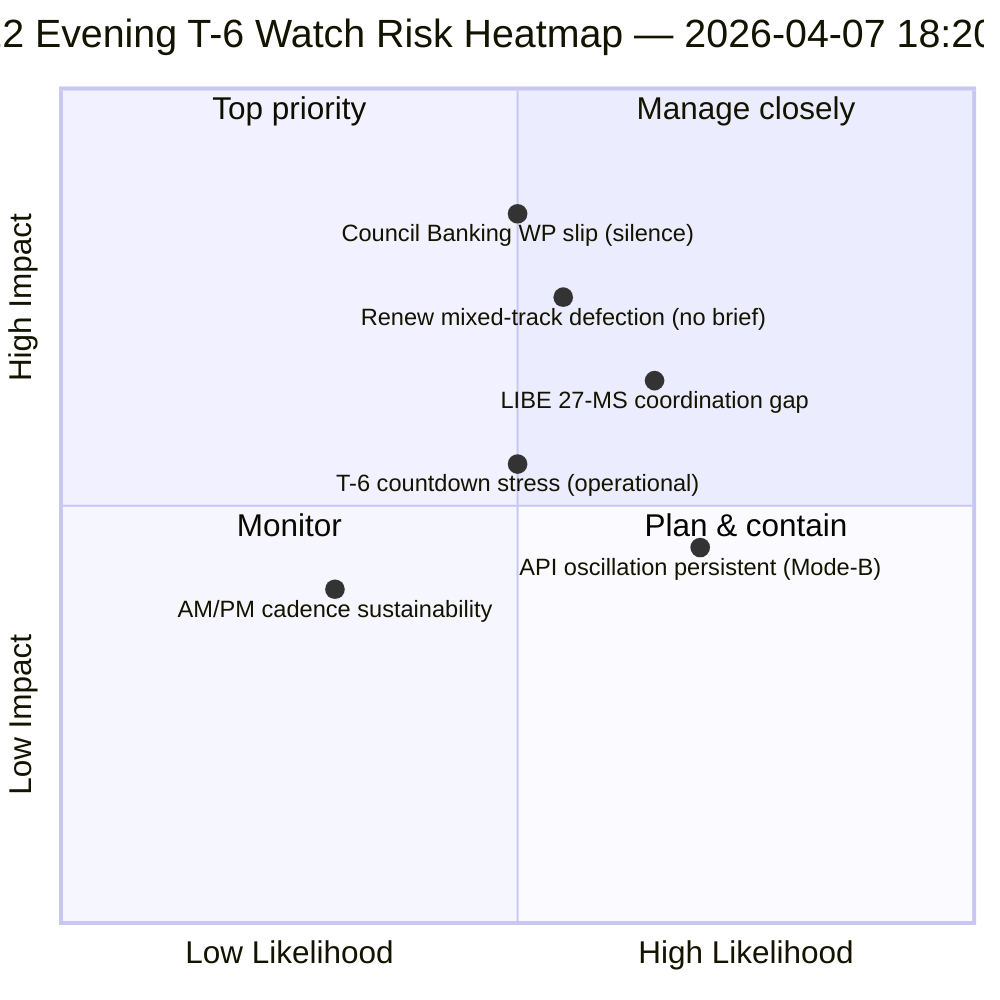

<!-- SPDX-FileCopyrightText: 2026 Hack23 AB -->
<!-- SPDX-License-Identifier: Apache-2.0 -->

# Nota informativa ejecutiva — Receso de Pascua día 12 actualización nocturna (T-6 hasta la semana de comisiones) | 2026-04-07

**Clasificación:** OSINT — Registro parlamentario público  
**Confianza:** 🟡 MEDIA (receso; delta de 12 horas sobre la línea base del día 12 por la mañana)  
**Ejecución:** `analysis/daily/2026-04-07/breaking-2/` (18:20 UTC)  
**Cobertura:** Receso de Pascua día 12/18 tarde — delta de 12 horas sobre la línea base matutina (44 artefactos → delta + refinamiento)  
**Generada:** 2026-05-16 (nota retrospectiva, sin nuevas llamadas MCP)  
**Fuentes primarias:** Línea base matutina del día 12 (3.391 líneas); feed diario de textos adoptados (1 elemento); 737 registros de eurodiputados.

---

## 🎯 BLUF

**La nota breaking-2 de la tarde del día 12 es la *evaluación delta de 12 horas* respecto a la línea base matutina — el primer ejemplo operacional estructurado del período de receso para un ritmo de inteligencia AM/PM emparejado.** Su contribución diferencial es la **confirmación del patrón de oscilación de recuperación de la API** a nivel de resolución diaria: el punto final de textos adoptados, que la ejecución-3 del 6 de abril vio recuperarse a las 12:15 UTC, ha vuelto a oscilar — confirmando que el patrón de fallo *Mode-B oscilatorio* documentado el 6 de abril es persistente y no transitorio. La ejecución refina la planificación operacional **T-6 hasta la semana de comisiones**: donde la línea base matutina produjo la secuencia de 6 disparadores hacia adelante, la actualización nocturna añade *puntos de vigilancia de preparación operacional* — tres elementos a supervisar antes del 14 de abril: (1) señalización del grupo de trabajo bancario del Consejo sobre el calendario del mandato SRMR3 (silencio hasta el día 12 = riesgo leve de deslizamiento); (2) calendario de reuniones de coordinación de Renew (archivos de pistas mixtas DGSD2/BRRD3 necesitan briefing de Renew antes del 14 de abril); (3) trabajo de divulgación parlamentaria nacional para la transposición anticorrupción (coordinación pre-T2 de la presidencia LIBE). La actualización nocturna es la *lista de verificación de preparación operacional* más explícita del período de receso y la plantilla estructural para el ritmo AM/PM diario posterior durante el resto del receso (8–13 de abril). **La ejecución nocturna eleva el ritmo AM/PM de observacional a operacional** al introducir puntos de vigilancia accionables en lugar de actualizaciones puramente estructurales de línea base.

---

## 🧭 3 decisiones que apoya esta nota

| # | Decisión | Quién decide | Plazo | Evidencia |
|:-:|----------|-------------|:-----:|-----------|
| 1 | **Escalada del silencio del grupo de trabajo bancario del Consejo** — silencio hasta el día 12 = riesgo leve de deslizamiento; escalar al Coreper | Presidencia del Consejo + ponente del PE | antes del 10 de abril | §Punto de vigilancia 1 |
| 2 | **Briefing de pista mixta de Renew** — DGSD2/BRRD3 necesitan briefing de coordinador antes del 14 de abril | Coordinadores de Renew + coordinación del PPE | antes del 12 de abril | §Punto de vigilancia 2 |
| 3 | **Divulgación pre-T2 de los 27 EM de LIBE** — preparación del parlamento nacional para la transposición anticorrupción | Presidencia LIBE + enlace parlamentario nacional | antes del 14 de abril | §Punto de vigilancia 3 |

---

## 📰 Lectura en 60 segundos

- 🔴 **Primer ritmo de inteligencia AM/PM estructurado** — plantilla operacional establecida.
- 🟠 **Patrón de oscilación de la API confirmado persistente** — Mode-B oscilatorio, no transitorio.
- 🟢 **3 puntos de vigilancia de preparación operacional** — Consejo BWG · Renew · LIBE.
- 🟡 **T-6 hasta la semana de comisiones** — cuenta atrás activa.
- 🔵 **737 eurodiputados estables** — línea base del día 12 se mantiene.
- 🟣 **1 texto adoptado feed diario** — mínimo pero operacional.
- 🩷 **Día 12 de 18 — 67 % del receso completado**.
- ⚪ **Confianza MEDIA** — puntos de vigilancia operacionales alta; pronóstico API media.

---

## 📋 Puntos de vigilancia de preparación operacional (contribución diferencial de la ejecución)

| # | Punto | Indicador de deslizamiento | Plazo de mitigación |
|:-:|-------|---------------------------|---------------------|
| 1 | **Señalización del grupo de trabajo bancario del Consejo sobre el mandato SRMR3** | Silencio hasta el día 12 | Escalar antes del 10 de abril |
| 2 | **Coordinación de Renew en la pista mixta DGSD2/BRRD3** | Sin reunión de coordinador programada | Briefing antes del 12 de abril |
| 3 | **Divulgación LIBE 27-EM sobre transposición anticorrupción** | Brecha de enlace parlamentario nacional | Divulgación antes del 14 de abril |

---

## ⚠️ Panorama de riesgos

---

## 🔮 Principales disparadores prospectivos (próximos 7 días hasta T-0)

1. **8 de abril — día 13** — Se acerca el plazo de escalada del BWG del Consejo.
2. **10 de abril — día 15** — Escalada del BWG del Consejo: plazo firme.
3. **12 de abril — día 17** — Briefing de coordinador de Renew: plazo firme.
4. **13 de abril — día 18** — El receso termina; revisión final de preparación.
5. **14 de abril — día 0** — La semana de comisiones comienza; todos los puntos de vigilancia deben resolverse.

---

## 🛡️ Evaluación de la calidad de las fuentes

- **Delta de línea base AM (A1):** comparación directa con la ejecución matutina; verificable.
- **Persistencia de la oscilación de la API (A2):** doble observación día 11 + día 12; confianza media.
- **3 puntos de vigilancia (A2):** metodología de preparación operacional; verificable frente al calendario institucional.
- **737 eurodiputados estables (A1):** registro primario.
- **Confianza neta:** 🟢 ALTA para el ritmo AM/PM; 🟡 MEDIA para las probabilidades de deslizamiento de los puntos de vigilancia.

---

## 📎 Artefactos de la ejecución

| Capa | Artefacto | Por qué |
|------|-----------|---------|
| Artículo | `article.md` | Narrativa pública de actualización nocturna |
| Síntesis | `synthesis-summary.md` | Delta de 12 horas + lista de verificación operacional de 3 puntos de vigilancia |
| Métodos | clasificación · existente · puntuación de riesgos · evaluación de amenazas | Metodología estándar de breaking |
| Compañero | breaking (06:36 mañana) | Línea base AM del mismo día |

---

**Control del documento**
- **Referencia de plantilla:** `analysis/templates/executive-brief.md`
- **Ruta del artefacto:** `analysis/daily/2026-04-07/breaking-2/executive-brief.md`
- **Clasificación:** Público
- **Retrospectivo:** Nota redactada el 2026-05-16 a partir de los artefactos comprometidos de la ejecución; **no se realizaron nuevas llamadas MCP**.
