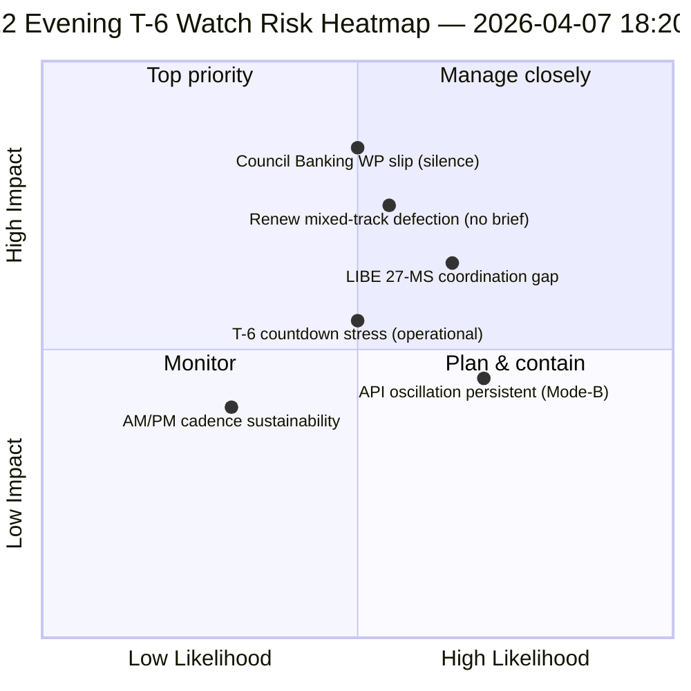

<!-- SPDX-FileCopyrightText: 2026 Hack23 AB -->
<!-- SPDX-License-Identifier: Apache-2.0 -->

# Johdon yhteenveto — Pääsiäisloman päivä 12 iltapäivitys (T-6 valiokuntaviikkoon) | 2026-04-07

**Luokittelu:** OSINT — Julkinen parlamentaarinen asiakirja  
**Luottamus:** 🟡 KESKITASO (loma; 12 tunnin delta päivän 12 aamu-lähtötason suhteen)  
**Ajo:** `analysis/daily/2026-04-07/breaking-2/` (18:20 UTC)  
**Kattavuus:** Pääsiäisloma päivä 12/18 ilta — 12 tunnin delta aamu-lähtötasosta (44 artefaktia → delta + tarkennus)  
**Luotu:** 2026-05-16 (jälkikäteinen yhteenveto, ei uusia MCP-kutsuja)  
**Ensisijaiset lähteet:** Päivän 12 aamu-lähtötaso (3 391 riviä); hyväksyttyjen tekstien päivittäinen syöte (1 kohta); 737 MEP-tietuetta.

---

## 🎯 BLUF

**Päivä 12 ilta breaking-2 on *12 tunnin delta-arvio* aamu-lähtötasosta — lomakauden ensimmäinen jäsennelty operatiivinen esimerkki paritetusta AM/PM-tiedustelurytmistä.** Sen erottuva panos on **API-palautumisoskillaatiomallin vahvistus** päiväresoluutiotasolla: hyväksyttyjen tekstien päätepiste, jonka ajon-3 6. huhtikuuta näki palautuvan klo 12:15 UTC, on nyt oskilloinut uudelleen — vahvistaen, että *Mode-B-oskillatorinen* 6. huhtikuuta dokumentoitu virhemalli on pysyvä eikä ohimenevä. Ajo tarkentaa **T-6 valiokuntaviikkoon** operatiivista suunnittelua: siinä missä aamu-lähtötaso tuotti 6-laukaisijan eteenpäin suuntautuvan laukaisijasekvenssin, iltapäivitys lisää *operatiiviset valmiusseurantakohteet* — kolme kohdetta seurattavaksi ennen 14. huhtikuuta: (1) Neuvoston pankkityöryhmän signalointi SRMR3-toimeksiannon ajoituksesta (hiljainen päivään 12 asti = lievä luisumisriski); (2) Renewn koordinaatiokokouskalenteri (sekatietiedostot DGSD2/BRRD3 tarvitsevat Renew-tiedotuksen ennen 14. huhtikuuta); (3) Antikorruptiotranspositio kansallisparlamentaarinen yhteydenpito (LIBE-puheenjohtajan Q2-esikoordinaatio). Iltapäivitys on lomakauden eksplisiittisin *operatiivinen tarkistuslista* ja rakenteellinen malli myöhemmille päivittäisille AM/PM-rytmeille loman loppuajalle (8.–13. huhtikuuta). **Iltaajo nostaa AM/PM-rytmin havainnoivasta operatiiviseksi** ottamalla käyttöön toimenpidepohjaisia seurantakohteita pelkkien rakenteellisten lähtötasopäivitysten sijaan.

---

## 🧭 3 päätöstä, joita tämä yhteenveto tukee

| # | Päätös | Kuka päättää | Määräaika | Näyttö |
|:-:|--------|-------------|:----------:|--------|
| 1 | **Neuvoston pankkityöryhmän hiljaisuuden eskalointi** — hiljaisuus päivään 12 asti = lievä luisumisriski; eskaloitu Coreperiin | Neuvoston puheenjohtajuus + EP:n esittelijä | 10. huhtikuuta mennessä | §Seurantakohde 1 |
| 2 | **Renew sekatietojen tiedotus** — DGSD2/BRRD3 tarvitsevat ennen 14. huhtikuuta koordinaattorin tiedotuksen | Renewn koordinaattorit + EPP-koordinaatio | 12. huhtikuuta mennessä | §Seurantakohde 2 |
| 3 | **LIBE 27 MS Q2-esi-yhteydenpito** — antikorruptiotranspositio kansallisparlamentaarinen valmistelu | LIBE-puheenjohtaja + kansallisparlamentaarinen yhteyshenkilö | 14. huhtikuuta mennessä | §Seurantakohde 3 |

---

## 📰 60 sekunnin luku

- 🔴 **Ensimmäinen jäsennelty AM/PM-tiedustelurytmi** — operatiivinen malli luotu.
- 🟠 **API-oskillaaatiomalli vahvistettu pysyväksi** — Mode-B oskillatorinen, ei ohimenevä.
- 🟢 **3 operatiivista valmiusseurantakohdetta** — Neuvosto BWG · Renew · LIBE.
- 🟡 **T-6 valiokuntaviikkoon** — lähtölaskenta käynnissä.
- 🔵 **737 MEP:iä vakaana** — päivän 12 lähtötaso pitää.
- 🟣 **1 hyväksytty teksti päivittäinen syöte** — minimaalinen mutta operatiivinen.
- 🩷 **Päivä 12/18 — 67 % lomasta suoritettu**.
- ⚪ **Luottamus KESKITASO** — operatiiviset seurantakohteet korkea; API-ennuste keskitaso.

---

## 📋 Operatiiviset valmiusseurantakohteet (ajon erottuva panos)

| # | Kohde | Luisumisoindikaattori | Lieventämismääräaika |
|:-:|-------|----------------------|----------------------|
| 1 | **Neuvoston pankkityöryhmän signalointi SRMR3-toimeksiannosta** | Hiljaisuus päivään 12 asti | Eskaloi 10. huhtikuuta mennessä |
| 2 | **Renewn koordinaatio sekatietopoluilla DGSD2/BRRD3** | Ei koordinaatiokokousta suunniteltu | Tiedotus 12. huhtikuuta mennessä |
| 3 | **LIBE 27 MS antikorruptiotranspositio yhteydenpito** | Kansallisparlamentaarinen yhteyshenkilöaukko | Yhteydenpito 14. huhtikuuta mennessä |

---

## ⚠️ Riskikatsaus

---

## 🔮 Tärkeimmät eteenpäin suuntautuvat laukaisijat (seuraavat 7 päivää T-0:aan)

1. **8. huhtikuuta — päivä 13** — Neuvoston BWG-eskalointimääräaika lähestyy.
2. **10. huhtikuuta — päivä 15** — Neuvoston BWG-eskalointitiukka määräaika.
3. **12. huhtikuuta — päivä 17** — Renewn koordinaattorin tiedotustiukka määräaika.
4. **13. huhtikuuta — päivä 18** — Loma päättyy; lopullinen valmiuskatselmus.
5. **14. huhtikuuta — päivä 0** — Valiokuntaviikko alkaa; kaikki seurantakohteet on ratkaistava.

---

## 🛡️ Lähteen laadun arviointi

- **AM-lähtötasodelta (A1):** suora vertailu aamuajoon; todennettavissa.
- **API-oskillaaation pysyvyys (A2):** päivä-11 + päivä-12 kaksoishavainto; keskitason luottamus.
- **3 seurantakohdetta (A2):** operatiivinen valmiusmenetelmä; todennettavissa institutionaalista kalenteria vasten.
- **737 MEP:iä vakaana (A1):** ensisijainen tietue.
- **Nettoluottamus:** 🟢 KORKEA AM/PM-rytmille; 🟡 KESKITASO seurantakohteiden luisumistodennäköisyyksille.

---

## 📎 Ajoartefaktit

| Kerros | Artefakti | Miksi |
|--------|-----------|-------|
| Artikkeli | `article.md` | Julkinen iltapäivityskertomus |
| Synteesi | `synthesis-summary.md` | 12 tunnin delta + 3-seurantakohteen operatiivinen tarkistuslista |
| Menetelmät | luokittelu · olemassa olevat · riskipisteet · uhka-arvio | Vakio breaking-metodologia |
| Kumppani | breaking (06:36 aamu) | Saman päivän aamu-lähtötaso |

---

**Asiakirjahallinta**
- **Malliviite:** `analysis/templates/executive-brief.md`
- **Artefaktipolku:** `analysis/daily/2026-04-07/breaking-2/executive-brief.md`
- **Luokittelu:** Julkinen
- **Jälkikäteinen:** Yhteenveto kirjoitettu 2026-05-16 ajon committatuista artefakteista; **uusia MCP-kutsuja ei tehty**.
