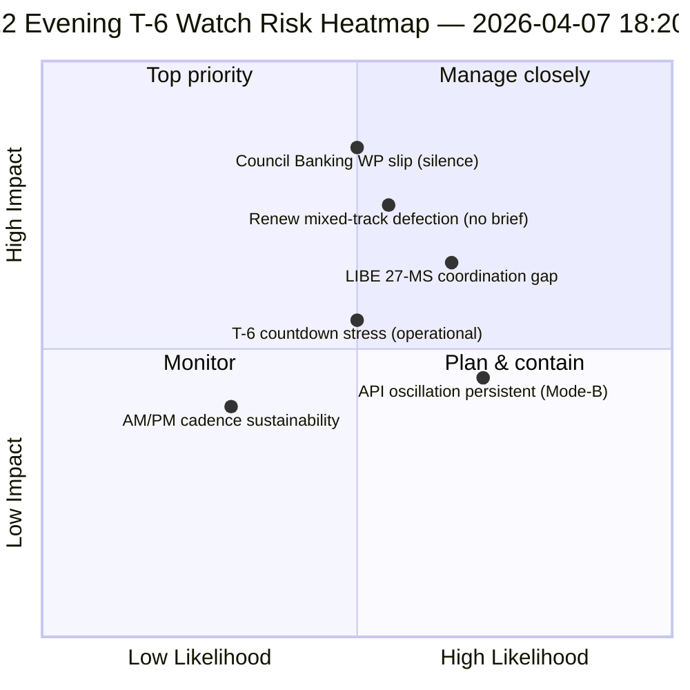

<!-- SPDX-FileCopyrightText: 2026 Hack23 AB -->
<!-- SPDX-License-Identifier: Apache-2.0 -->

# Note de synthèse — Vacances de Pâques jour 12 mise à jour du soir (T-6 jusqu'à la semaine de commission) | 2026-04-07

**Classification :** OSINT — Dossier parlementaire public  
**Confiance :** 🟡 MOYEN (vacances ; delta de 12 heures sur la baseline du matin du jour 12)  
**Run :** `analysis/daily/2026-04-07/breaking-2/` (18:20 UTC)  
**Couverture :** Vacances de Pâques jour 12/18 soir — delta de 12 heures sur la baseline du matin (44 artefacts → delta + affinement)  
**Générée :** 2026-05-16 (note rétrospective, aucun nouvel appel MCP)  
**Sources primaires :** Baseline du matin du jour 12 (3 391 lignes) ; flux quotidien des textes adoptés (1 entrée) ; 737 enregistrements de députés.

---

## 🎯 BLUF

**La note breaking-2 du soir du jour 12 constitue *l'évaluation delta de 12 heures* par rapport à la baseline du matin — le premier exemple opérationnel structuré de la période de vacances pour un rythme de renseignement AM/PM couplé.** Sa contribution distincte est la **confirmation du schéma d'oscillation de récupération de l'API** au niveau de résolution journalière : le point de terminaison des textes adoptés, que le run-3 du 6 avril avait observé se rétablir à 12:15 UTC, a de nouveau oscillé — confirmant que le schéma de défaillance *Mode-B oscillatoire* documenté le 6 avril est persistant et non transitoire. Le run affine la planification opérationnelle **T-6 jusqu'à la semaine de commission** : là où la baseline du matin avait produit la séquence de déclencheurs à 6 déclencheurs, la mise à jour du soir ajoute des *points de surveillance de la préparation opérationnelle* — trois éléments à surveiller avant le 14 avril : (1) la signalisation du groupe de travail bancaire du Conseil sur le calendrier du mandat SRMR3 (silence jusqu'au jour 12 = risque de glissement modéré) ; (2) le calendrier des réunions de coordination de Renew (les dossiers à piste mixte DGSD2/BRRD3 nécessitent un briefing Renew avant le 14 avril) ; (3) le travail de sensibilisation des parlements nationaux pour la transposition anti-corruption (coordination pré-T2 du président LIBE). La mise à jour du soir est la *liste de vérification de la préparation opérationnelle* la plus explicite de la période de vacances et le modèle structurel pour le rythme AM/PM quotidien ultérieur pour le reste des vacances (8–13 avril). **Le run du soir élève le rythme AM/PM de l'observationnel à l'opérationnel** en introduisant des points de surveillance actionnables plutôt que de simples mises à jour de baseline structurelles.

---

## 🧭 3 décisions que cette note soutient

| # | Décision | Qui décide | Échéance | Preuve |
|:-:|----------|-----------|:--------:|--------|
| 1 | **Escalade du silence du groupe de travail bancaire du Conseil** — silence jusqu'au jour 12 = risque de glissement modéré ; escalader au Coreper | Présidence du Conseil + rapporteur PE | avant le 10 avril | §Point de surveillance 1 |
| 2 | **Briefing à piste mixte de Renew** — DGSD2/BRRD3 nécessitent un briefing de coordinateur pré-14 avril | Coordinateurs Renew + coordination PPE | avant le 12 avril | §Point de surveillance 2 |
| 3 | **Sensibilisation pré-T2 des 27 États membres de la LIBE** — préparation du parlement national pour la transposition anti-corruption | Président LIBE + liaison parlementaire nationale | avant le 14 avril | §Point de surveillance 3 |

---

## 📰 Lecture en 60 secondes

- 🔴 **Premier rythme de renseignement AM/PM structuré** — modèle opérationnel établi.
- 🟠 **Schéma d'oscillation de l'API confirmé persistant** — Mode-B oscillatoire, non transitoire.
- 🟢 **3 points de surveillance de la préparation opérationnelle** — Conseil BWG · Renew · LIBE.
- 🟡 **T-6 jusqu'à la semaine de commission** — compte à rebours actif.
- 🔵 **737 députés stables** — baseline du jour 12 tient.
- 🟣 **1 texte adopté flux quotidien** — minimal mais opérationnel.
- 🩷 **Jour 12 sur 18 — 67 % des vacances écoulées**.
- ⚪ **Confiance MOYEN** — points de surveillance opérationnels élevés ; prévision API moyen.

---

## 📋 Points de surveillance de la préparation opérationnelle (contribution distinctive du run)

| # | Point | Indicateur de glissement | Échéance d'atténuation |
|:-:|-------|-------------------------|------------------------|
| 1 | **Signalisation du groupe de travail bancaire du Conseil sur le mandat SRMR3** | Silence jusqu'au jour 12 | Escalader avant le 10 avril |
| 2 | **Coordination de Renew sur la piste mixte DGSD2/BRRD3** | Aucune réunion de coordinateur programmée | Briefing avant le 12 avril |
| 3 | **Sensibilisation LIBE 27-MS à la transposition anti-corruption** | Lacune dans la liaison parlementaire nationale | Sensibilisation avant le 14 avril |

---

## ⚠️ Aperçu des risques

---

## 🔮 Principaux déclencheurs prospectifs (7 prochains jours jusqu'à T-0)

1. **8 avril — jour 13** — Échéance d'escalade du BWG du Conseil approche.
2. **10 avril — jour 15** — Escalade du BWG du Conseil : échéance ferme.
3. **12 avril — jour 17** — Briefing coordinateur Renew : échéance ferme.
4. **13 avril — jour 18** — Les vacances se terminent ; vérification finale de la préparation.
5. **14 avril — jour 0** — La semaine de commission commence ; tous les points de surveillance doivent être résolus.

---

## 🛡️ Évaluation de la qualité des sources

- **Delta de la baseline AM (A1) :** comparaison directe avec le run du matin ; vérifiable.
- **Persistance de l'oscillation de l'API (A2) :** double observation jour 11 + jour 12 ; confiance moyenne.
- **3 points de surveillance (A2) :** méthodologie de préparation opérationnelle ; vérifiable par rapport au calendrier institutionnel.
- **737 députés stables (A1) :** enregistrement primaire.
- **Confiance nette :** 🟢 ÉLEVÉE pour le rythme AM/PM ; 🟡 MOYEN pour les probabilités de glissement des points de surveillance.

---

## 📎 Artefacts du run

| Couche | Artefact | Pourquoi |
|--------|----------|----------|
| Article | `article.md` | Récit public de la mise à jour du soir |
| Synthèse | `synthesis-summary.md` | Delta de 12 heures + liste de contrôle opérationnelle à 3 points de surveillance |
| Méthodes | classification · existant · notation des risques · évaluation des menaces | Méthodologie standard de breaking |
| Compagnon | breaking (06:36 matin) | Baseline AM du même jour |

---

**Contrôle du document**
- **Référence du modèle :** `analysis/templates/executive-brief.md`
- **Chemin de l'artefact :** `analysis/daily/2026-04-07/breaking-2/executive-brief.md`
- **Classification :** Public
- **Rétrospectif :** Note rédigée le 2026-05-16 à partir des artefacts commis du run ; **aucun nouvel appel MCP n'a été effectué**.
