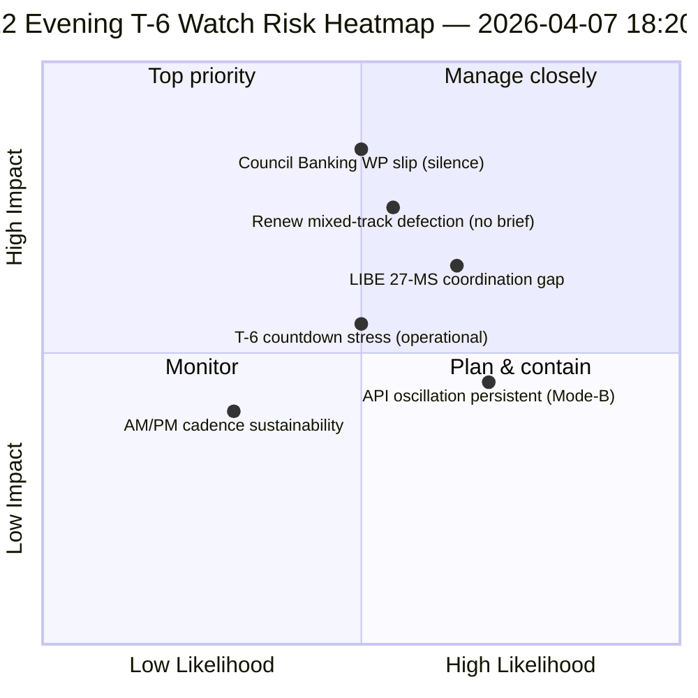

<!-- SPDX-FileCopyrightText: 2026 Hack23 AB -->
<!-- SPDX-License-Identifier: Apache-2.0 -->

# תקציר מנהלים — חופשת פסחא יום 12 עדכון ערב (T-6 עד שבוע ועדות) | 2026-04-07

**סיווג:** OSINT — תיעוד פרלמנטרי ציבורי  
**אמינות:** 🟡 בינונית (חופשה; דלתא של 12 שעות מעל קו הבסיס של בוקר יום 12)  
**ריצה:** `analysis/daily/2026-04-07/breaking-2/` (18:20 UTC)  
**כיסוי:** חופשת פסחא יום 12/18 ערב — דלתא 12 שעות מעל קו הבסיס של הבוקר (44 יצירות → דלתא + חידוד)  
**נוצר:** 2026-05-16 (תקציר רטרוספקטיבי, ללא קריאות MCP חדשות)  
**מקורות ראשיים:** קו הבסיס של בוקר יום 12 (3,391 שורות); פיד יומי של טקסטים שאומצו (פריט 1); 737 רשומות חברי פרלמנט.

---

## 🎯 BLUF

**ריצת breaking-2 ערב יום 12 היא *הערכת דלתא של 12 שעות* מעל קו הבסיס של הבוקר — הדוגמה התפעולית המובנית הראשונה של תקופת החופשה לקצב מודיעין מזווג AM/PM.** תרומתה המיוחדת היא **אישור דפוס תנודת ההתאוששות של ה-API** ברמת רזולוציה יומית: נקודת הקצה של הטקסטים שאומצו, שריצה-3 ב-6 באפריל ראתה מתאוששת ב-12:15 UTC, תנודה שוב — ומאשרת שדפוס הכשל *Mode-B המתנדנד* שתועד ב-6 באפריל הוא מתמשך ולא חולף. הריצה מחדדת את התכנון התפעולי **T-6 עד שבוע הוועדות**: בעוד שקו הבסיס של הבוקר הפיק את רצף 6 הגורמים המפעילים קדימה, עדכון הערב מוסיף *פריטי מעקב מוכנות תפעולית* — שלושה פריטים לניטור לפני 14 באפריל: (1) איתות קבוצת העבודה הבנקאית של המועצה על תזמון מנדט SRMR3 (שקט עד יום 12 = סיכון החלקה קל); (2) לוח זמנים ישיבות תיאום Renew (קבצי מסלול מעורב DGSD2/BRRD3 זקוקים לתדרוך Renew לפני 14 באפריל); (3) קשר עם פרלמנטים לאומיים לטרנספוזיציה של חוק נגד שחיתות (תיאום פרה-Q2 של יו"ר LIBE). עדכון הערב הוא *רשימת הבדיקה של המוכנות התפעולית* המפורשת ביותר של תקופת החופשה והתבנית המבנית לקצב AM/PM היומי הבא לאורך שארית החופשה (8–13 באפריל). **ריצת הערב מרימה את קצב AM/PM מתצפיתי לתפעולי** על ידי הכנסת פריטי מעקב הניתנים לפעולה במקום עדכוני קו בסיס מבניים גרידא.

---

## 🧭 3 החלטות שתקציר זה תומך בהן

| # | החלטה | מי מחליט | מועד אחרון | ראיות |
|:-:|-------|---------|:----------:|-------|
| 1 | **הסלמת שתיקת קבוצת העבודה הבנקאית של המועצה** — שקט עד יום 12 = סיכון החלקה קל; להסלים ל-Coreper | נשיאות המועצה + מדווח הפרלמנט האירופי | לפני 10 באפריל | §פריט מעקב 1 |
| 2 | **תדרוך מסלול מעורב של Renew** — DGSD2/BRRD3 זקוקים לתדרוך מתאם פרה-14 באפריל | מתאמי Renew + תיאום EPP | לפני 12 באפריל | §פריט מעקב 2 |
| 3 | **קשר פרה-Q2 עם 27 מ"ח של LIBE** — הכנת פרלמנטים לאומיים לטרנספוזיציה של חוק נגד שחיתות | יו"ר LIBE + קשר פרלמנט לאומי | לפני 14 באפריל | §פריט מעקב 3 |

---

## 📰 קריאה של 60 שניות

- 🔴 **קצב מודיעין AM/PM מובנה ראשון** — תבנית תפעולית הוקמה.
- 🟠 **דפוס תנודת API אושר כמתמשך** — Mode-B מתנדנד, לא חולף.
- 🟢 **3 פריטי מעקב מוכנות תפעולית** — מועצה BWG · Renew · LIBE.
- 🟡 **T-6 עד שבוע הוועדות** — ספירה לאחור פעילה.
- 🔵 **737 חברי פרלמנט יציבים** — קו הבסיס של יום 12 מחזיק.
- 🟣 **1 טקסט שאומץ בפיד היומי** — מינימלי אך תפעולי.
- 🩷 **יום 12 מתוך 18 — 67% מהחופשה הושלמה**.
- ⚪ **אמינות בינונית** — פריטי מעקב תפעוליים גבוהים; תחזית API בינונית.

---

## 📋 פריטי מעקב מוכנות תפעולית (תרומתה המיוחדת של הריצה)

| # | פריט | מחוון החלקה | מועד אחרון להפחתה |
|:-:|------|------------|-------------------|
| 1 | **איתות קבוצת העבודה הבנקאית של המועצה על מנדט SRMR3** | שקט עד יום 12 | הסלמה לפני 10 באפריל |
| 2 | **תיאום Renew על מסלול מעורב DGSD2/BRRD3** | אין ישיבת מתאם מתוכננת | תדרוך לפני 12 באפריל |
| 3 | **קשר LIBE עם 27 מ"ח על טרנספוזיציה נגד שחיתות** | פער בקשר פרלמנט לאומי | קשר לפני 14 באפריל |

---

## ⚠️ סקירת סיכונים

---

## 🔮 גורמים מפעילים עתידיים עיקריים (7 ימים הבאים עד T-0)

1. **8 באפריל — יום 13** — מועד ההסלמה של BWG המועצה מתקרב.
2. **10 באפריל — יום 15** — הסלמת BWG המועצה: מועד אחרון קשיח.
3. **12 באפריל — יום 17** — תדרוך מתאם Renew: מועד אחרון קשיח.
4. **13 באפריל — יום 18** — החופשה נגמרת; סקירת מוכנות סופית.
5. **14 באפריל — יום 0** — שבוע הוועדות מתחיל; כל פריטי המעקב חייבים להיפתר.

---

## 🛡️ הערכת איכות מקורות

- **דלתא קו בסיס AM (A1):** השוואה ישירה עם ריצת הבוקר; ניתן לאימות.
- **התמדת תנודת API (A2):** תצפית כפולה יום 11 + יום 12; אמינות בינונית.
- **3 פריטי מעקב (A2):** מתודולוגיית מוכנות תפעולית; ניתן לאימות מול לוח שנה מוסדי.
- **737 חברי פרלמנט יציבים (A1):** רשומה ראשית.
- **אמינות נטו:** 🟢 גבוהה לקצב AM/PM; 🟡 בינונית להסתברויות החלקה של פריטי מעקב.

---

## 📎 יצירות הריצה

| שכבה | יצירה | מדוע |
|------|-------|------|
| מאמר | `article.md` | נרטיב ציבורי של עדכון הערב |
| סינתזה | `synthesis-summary.md` | דלתא 12 שעות + רשימת בדיקה תפעולית של 3 פריטי מעקב |
| מתודולוגיות | סיווג · קיים · ניקוד סיכונים · הערכת איומים | מתודולוגיית breaking סטנדרטית |
| מלווה | breaking (06:36 בוקר) | קו בסיס AM של אותו יום |

---

**בקרת מסמכים**
- **הפניה לתבנית:** `analysis/templates/executive-brief.md`
- **נתיב היצירה:** `analysis/daily/2026-04-07/breaking-2/executive-brief.md`
- **סיווג:** ציבורי
- **רטרוספקטיבי:** התקציר נכתב ב-2026-05-16 מהיצירות המחויבות של הריצה; **לא בוצעו קריאות MCP חדשות**.
