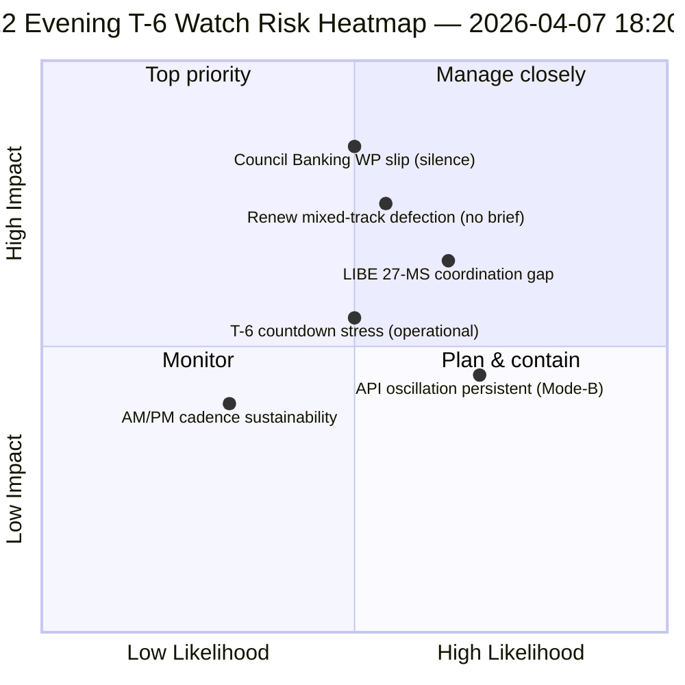

<!-- SPDX-FileCopyrightText: 2026 Hack23 AB -->
<!-- SPDX-License-Identifier: Apache-2.0 -->

# エグゼクティブブリーフ — イースター休会第12日夜間更新（委員会週まであとT-6）| 2026-04-07

**分類：** OSINT — 公開議会記録  
**信頼度：** 🟡 中程度（休会中；第12日朝のベースラインに対する12時間デルタ）  
**実行：** `analysis/daily/2026-04-07/breaking-2/`（18:20 UTC）  
**対象範囲：** イースター休会第12/18日夜 — 朝のベースラインに対する12時間デルタ（44アーティファクト → デルタ＋精緻化）  
**生成日：** 2026-05-16（回顧的ブリーフ、新規MCP呼び出しなし）  
**主要情報源：** 第12日朝のベースライン（3,391行）；採択テキスト日次フィード（1件）；737欧州議会議員レコード。

---

## 🎯 BLUF

**第12日夜のbreaking-2は、朝のベースラインに対する*12時間デルタ評価*であり、休会期間中のAM/PM連携インテリジェンスリズムの最初の体系的な運用例である。** その際立った貢献は、日次解像度レベルでの**APIリカバリ発振パターンの確認**である。4月6日の実行-3が12:15 UTCに回復を確認していた採択テキストエンドポイントが再び発振し、4月6日に記録された*モードB発振型*障害パターンが一過性ではなく持続的であることを確認した。この実行は**T-6委員会週**の運用計画を精緻化する。朝のベースラインが6トリガーの先行トリガーシーケンスを生成したのに対し、夜間更新は*運用準備監視項目*を追加する。4月14日までに監視すべき3項目：(1) SRMR3マンデートのタイミングに関する理事会銀行業務作業部会のシグナル（第12日まで沈黙＝軽微なズレリスク）；(2) Renewの調整会議カレンダー（混合トラックファイルDGSD2/BRRD3は4月14日前にRenewブリーフィングが必要）；(3) 汚職防止転換に関する国内議会アウトリーチ（LIBE議長のQ2前調整）。夜間更新は休会期間中で最も明示的な*運用準備チェックリスト*であり、残りの休会期間（4月8日〜13日）の後続の日次AM/PMリズムの構造的テンプレートである。**夜間実行はAM/PMリズムを観測的から運用的に昇格させ**、純粋な構造的ベースライン更新ではなく実行可能な監視項目を導入する。

---

## 🧭 このブリーフが支援する3つの意思決定

| # | 決定 | 決定者 | 期限 | 根拠 |
|:-:|------|-------|:----:|------|
| 1 | **理事会銀行業務作業部会の沈黙のエスカレーション** — 第12日まで沈黙＝軽微なズレリスク；Coreperにエスカレート | 理事会議長国＋欧州議会報告者 | 4月10日まで | §監視項目1 |
| 2 | **Renew混合トラックブリーフィング** — DGSD2/BRRD3は4月14日前にコーディネーターブリーフィングが必要 | Renewコーディネーター＋EPP調整 | 4月12日まで | §監視項目2 |
| 3 | **LIBE 27加盟国Q2前アウトリーチ** — 汚職防止転換の国内議会準備 | LIBE議長＋国内議会連絡担当 | 4月14日まで | §監視項目3 |

---

## 📰 60秒リーディング

- 🔴 **最初の体系的AM/PMインテリジェンスリズム** — 運用テンプレート確立。
- 🟠 **API発振パターンが持続的と確認** — モードB発振型、一過性ではない。
- 🟢 **3つの運用準備監視項目** — 理事会BWG・Renew・LIBE。
- 🟡 **委員会週まであとT-6** — カウントダウン実施中。
- 🔵 **欧州議会議員737名が安定** — 第12日ベースライン維持。
- 🟣 **採択テキスト日次フィード1件** — 最小限だが運用上有効。
- 🩷 **18日中の第12日 — 休会の67%完了**。
- ⚪ **信頼度 中程度** — 運用監視項目は高；APIの予測は中程度。

---

## 📋 運用準備監視項目（この実行の際立った貢献）

| # | 項目 | ズレ指標 | 緩和期限 |
|:-:|------|---------|---------|
| 1 | **理事会銀行業務作業部会のSRMR3マンデートに関するシグナル** | 第12日まで沈黙 | 4月10日までにエスカレート |
| 2 | **混合トラックDGSD2/BRRD3に関するRenew調整** | コーディネーター会議が未予定 | 4月12日までにブリーフィング |
| 3 | **LIBE 27加盟国の汚職防止転換アウトリーチ** | 国内議会連絡ギャップ | 4月14日までにアウトリーチ |

---

## ⚠️ リスクスナップショット

---

## 🔮 主要先行トリガー（T-0まで7日間）

1. **4月8日 — 第13日** — 理事会BWGエスカレーション期限が近づく。
2. **4月10日 — 第15日** — 理事会BWGエスカレーション：ハード期限。
3. **4月12日 — 第17日** — Renewコーディネーターブリーフィング：ハード期限。
4. **4月13日 — 第18日** — 休会終了；最終準備状況確認。
5. **4月14日 — 第0日** — 委員会週開始；すべての監視項目を解決する必要あり。

---

## 🛡️ 情報源品質評価

- **AMベースラインデルタ（A1）：** 朝の実行との直接比較；検証可能。
- **API発振持続性（A2）：** 第11日＋第12日の二重観察；中程度の信頼性。
- **3監視項目（A2）：** 運用準備手法；機関カレンダーと照合して検証可能。
- **欧州議会議員737名安定（A1）：** 一次レコード。
- **総合信頼度：** 🟢 AM/PMリズムは高；🟡 監視項目のズレ確率は中程度。

---

## 📎 実行アーティファクト

| レイヤー | アーティファクト | 理由 |
|---------|--------------|------|
| 記事 | `article.md` | 公開夜間更新ナラティブ |
| 統合 | `synthesis-summary.md` | 12時間デルタ＋3監視項目の運用チェックリスト |
| 手法 | 分類・既存・リスクスコアリング・脅威評価 | 標準breaking手法 |
| 同伴 | breaking（06:36 朝） | 同日AMベースライン |

---

**文書管理**
- **テンプレート参照：** `analysis/templates/executive-brief.md`
- **アーティファクトパス：** `analysis/daily/2026-04-07/breaking-2/executive-brief.md`
- **分類：** 公開
- **回顧的：** ブリーフは2026-05-16に実行のコミット済みアーティファクトから作成；**新規MCP呼び出しは行われなかった**。
