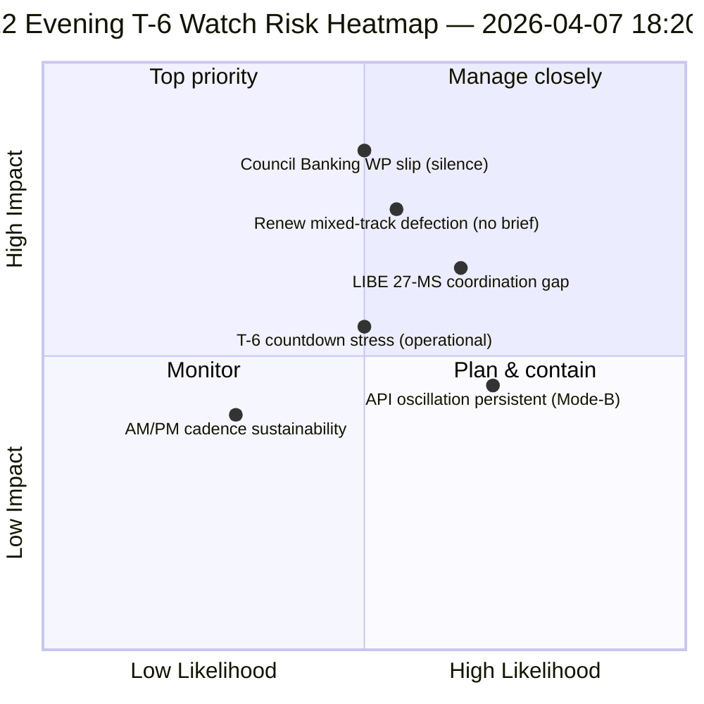

<!-- SPDX-FileCopyrightText: 2026 Hack23 AB -->
<!-- SPDX-License-Identifier: Apache-2.0 -->

# 집행부 브리핑 — 부활절 휴회 12일 야간 업데이트 (위원회 주까지 T-6) | 2026-04-07

**분류:** OSINT — 공개 의회 기록  
**신뢰도:** 🟡 중간 (휴회; 12일차 오전 기준선 대비 12시간 델타)  
**실행:** `analysis/daily/2026-04-07/breaking-2/` (18:20 UTC)  
**범위:** 부활절 휴회 12/18일 야간 — 오전 기준선 대비 12시간 델타 (44개 아티팩트 → 델타 + 정밀화)  
**생성일:** 2026-05-16 (소급 브리핑, 새로운 MCP 호출 없음)  
**주요 출처:** 12일차 오전 기준선 (3,391행); 채택된 텍스트 일일 피드 (1건); 유럽의회 의원 737명 기록.

---

## 🎯 BLUF

**12일 야간 breaking-2는 오전 기준선에 대한 *12시간 델타 평가*로서 — 휴회 기간의 쌍방 AM/PM 정보 리듬을 위한 첫 번째 체계적인 운영 사례이다.** 그 독보적인 기여는 일별 해상도 수준에서의 **API 복구 진동 패턴 확인**이다: 4월 6일 실행-3이 12:15 UTC에 복구되는 것을 확인했던 채택 텍스트 엔드포인트가 다시 진동하여 — 4월 6일에 기록된 *Mode-B 진동형* 오류 패턴이 일시적이 아닌 지속적임을 확인했다. 이 실행은 **T-6 위원회 주** 운영 계획을 정밀화한다: 오전 기준선이 6개 트리거 전방 트리거 시퀀스를 생성한 반면, 야간 업데이트는 *운영 준비 감시 항목*을 추가한다 — 4월 14일 전에 모니터링해야 할 3가지 항목: (1) SRMR3 위임 일정에 관한 이사회 은행 실무그룹 신호 (12일까지 침묵 = 경미한 지연 위험); (2) Renew 조정 회의 일정 (혼합 트랙 파일 DGSD2/BRRD3는 4월 14일 전에 Renew 브리핑 필요); (3) 부패방지 전환에 관한 국가 의회 아웃리치 (LIBE 의장 Q2 이전 조정). 야간 업데이트는 휴회 기간의 가장 명시적인 *운영 준비 체크리스트*이며, 나머지 휴회 기간 동안의 후속 일일 AM/PM 리듬을 위한 구조적 템플릿이다 (4월 8일~13일). **야간 실행은 AM/PM 리듬을 관찰적에서 운영적으로 격상시키며** 순수한 구조적 기준선 업데이트 대신 실행 가능한 감시 항목을 도입한다.

---

## 🧭 이 브리핑이 지원하는 3가지 결정

| # | 결정 | 결정자 | 기한 | 증거 |
|:-:|------|-------|:----:|------|
| 1 | **이사회 은행 실무그룹 침묵 에스컬레이션** — 12일까지 침묵 = 경미한 지연 위험; Coreper에 에스컬레이트 | 이사회 의장국 + 유럽의회 보고자 | 4월 10일까지 | §감시 항목 1 |
| 2 | **Renew 혼합 트랙 브리핑** — DGSD2/BRRD3는 4월 14일 전에 조정관 브리핑 필요 | Renew 조정관 + EPP 조정 | 4월 12일까지 | §감시 항목 2 |
| 3 | **LIBE 27개 회원국 Q2 이전 아웃리치** — 부패방지 전환 국가 의회 준비 | LIBE 의장 + 국가 의회 연락 | 4월 14일까지 | §감시 항목 3 |

---

## 📰 60초 읽기

- 🔴 **첫 번째 체계적 AM/PM 정보 리듬** — 운영 템플릿 확립.
- 🟠 **API 진동 패턴이 지속적으로 확인** — Mode-B 진동형, 일시적이 아님.
- 🟢 **3개 운영 준비 감시 항목** — 이사회 BWG · Renew · LIBE.
- 🟡 **위원회 주까지 T-6** — 카운트다운 진행 중.
- 🔵 **유럽의회 의원 737명 안정** — 12일차 기준선 유지.
- 🟣 **채택된 텍스트 일일 피드 1건** — 최소이지만 운영적.
- 🩷 **18일 중 12일 — 휴회의 67% 완료**.
- ⚪ **신뢰도 중간** — 운영 감시 항목 높음; API 예측 중간.

---

## 📋 운영 준비 감시 항목 (이 실행의 독보적인 기여)

| # | 항목 | 지연 지표 | 완화 기한 |
|:-:|------|---------|---------|
| 1 | **SRMR3 위임에 관한 이사회 은행 실무그룹 신호** | 12일까지 침묵 | 4월 10일까지 에스컬레이트 |
| 2 | **혼합 트랙 DGSD2/BRRD3에 관한 Renew 조정** | 조정관 회의 미예정 | 4월 12일까지 브리핑 |
| 3 | **LIBE 27개 회원국 부패방지 전환 아웃리치** | 국가 의회 연락 공백 | 4월 14일까지 아웃리치 |

---

## ⚠️ 위험 스냅샷

---

## 🔮 주요 전방 트리거 (T-0까지 7일)

1. **4월 8일 — 13일차** — 이사회 BWG 에스컬레이션 기한 다가옴.
2. **4월 10일 — 15일차** — 이사회 BWG 에스컬레이션: 고정 기한.
3. **4월 12일 — 17일차** — Renew 조정관 브리핑: 고정 기한.
4. **4월 13일 — 18일차** — 휴회 종료; 최종 준비 점검.
5. **4월 14일 — 0일차** — 위원회 주 개시; 모든 감시 항목 해결 필요.

---

## 🛡️ 출처 품질 평가

- **AM 기준선 델타 (A1):** 오전 실행과의 직접 비교; 검증 가능.
- **API 진동 지속성 (A2):** 11일차 + 12일차 이중 관측; 중간 신뢰도.
- **3개 감시 항목 (A2):** 운영 준비 방법론; 기관 일정과 대조하여 검증 가능.
- **유럽의회 의원 737명 안정 (A1):** 1차 기록.
- **총 신뢰도:** 🟢 AM/PM 리듬 높음; 🟡 감시 항목 지연 확률 중간.

---

## 📎 실행 아티팩트

| 레이어 | 아티팩트 | 이유 |
|--------|---------|------|
| 기사 | `article.md` | 공개 야간 업데이트 내러티브 |
| 종합 | `synthesis-summary.md` | 12시간 델타 + 3개 감시 항목 운영 체크리스트 |
| 방법론 | 분류 · 기존 · 위험 점수 · 위협 평가 | 표준 breaking 방법론 |
| 동반 | breaking (06:36 오전) | 당일 AM 기준선 |

---

**문서 관리**
- **템플릿 참조:** `analysis/templates/executive-brief.md`
- **아티팩트 경로:** `analysis/daily/2026-04-07/breaking-2/executive-brief.md`
- **분류:** 공개
- **소급:** 브리핑은 실행의 커밋된 아티팩트에서 2026-05-16에 작성됨; **새로운 MCP 호출은 이루어지지 않았다**.
