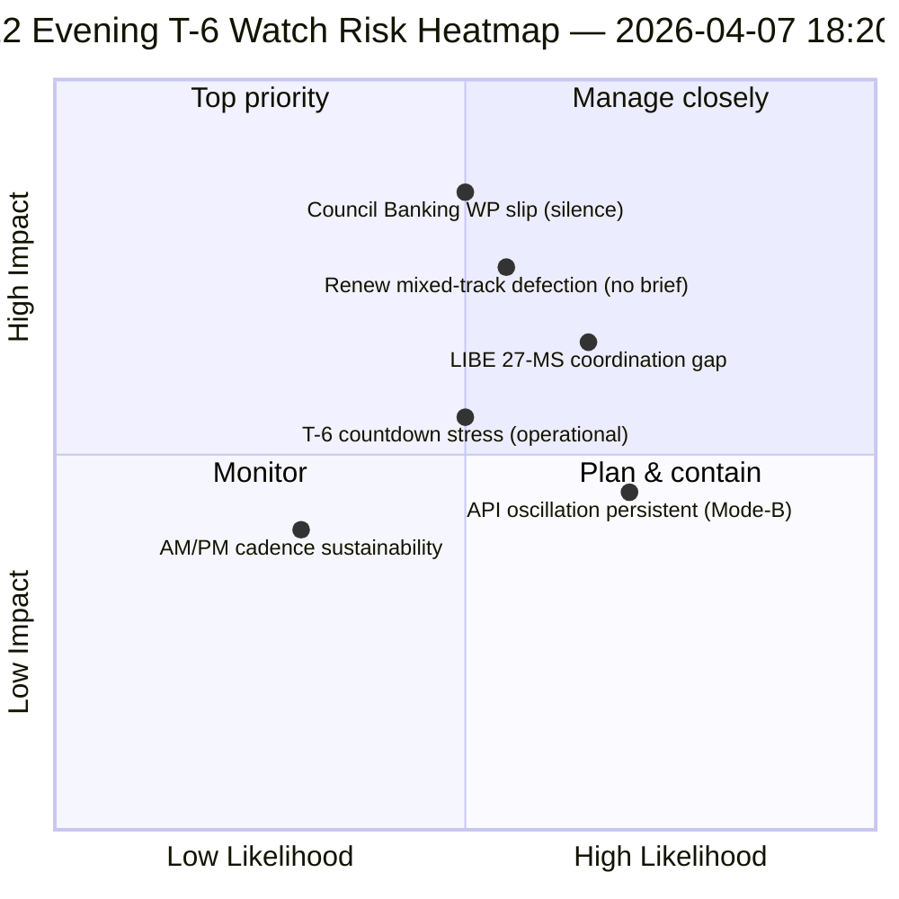

<!-- SPDX-FileCopyrightText: 2026 Hack23 AB -->
<!-- SPDX-License-Identifier: Apache-2.0 -->

# Bestuurlijk overzicht — Paasvakantie dag 12 avondupdate (T-6 tot commissieweek) | 2026-04-07

**Classificatie:** OSINT — Openbaar parlementair dossier  
**Vertrouwen:** 🟡 GEMIDDELD (vakantie; 12-uur delta ten opzichte van dag-12-ochtendbasislijn)  
**Run:** `analysis/daily/2026-04-07/breaking-2/` (18:20 UTC)  
**Dekking:** Paasvakantie dag 12/18 avond — 12-uur delta ten opzichte van ochtendbasislijn (44 artefacten → delta + verfijning)  
**Gegenereerd:** 2026-05-16 (retrospectief overzicht, geen nieuwe MCP-oproepen)  
**Primaire bronnen:** Dag-12-ochtendbasislijn (3.391 regels); dagelijkse feed aangenomen teksten (1 item); 737 MEP-records.

---

## 🎯 BLUF

**Dag-12-avond breaking-2 is de *12-uur delta-beoordeling* ten opzichte van de ochtendbasislijn — het eerste gestructureerde operationele voorbeeld van de vakantieperiode voor een gekoppeld AM/PM-inlichtingenritme.** Zijn onderscheidende bijdrage is de **bevestiging van het API-hersteloscillatiepatroon** op dagresolutieniveau: het eindpunt voor aangenomen teksten, dat run-3 op 6 april om 12:15 UTC zag herstellen, heeft nu opnieuw geoscilleerd — en bevestigt daarmee dat het *Mode-B-oscillatorische* foutpatroon dat op 6 april werd gedocumenteerd, persistent en niet voorbijgaand is. De run verfijnt de **T-6 tot commissieweek** operationele planning: waar de ochtendbasislijn de 6-trigger voorwaartse triggersequentie produceerde, voegt de avondupdate *operationele gereedheidstoezichtpunten* toe — drie punten om te bewaken voor 14 april: (1) signalering van de Bankwerkgroep van de Raad over de timing van het SRMR3-mandaat (stil tot dag 12 = mild risico op vertraging); (2) Renew-coördinatievergaderingskalender (gemengde spoordossiers DGSD2/BRRD3 hebben Renew-briefing nodig vóór 14 april); (3) nationaal parlementair contactwerk voor de antikorruptietranspositie (pre-T2-coördinatie LIBE-voorzitter). De avondupdate is de meest expliciete *operationele gereedheidscontrolelijst* van de vakantieperiode en de structurele sjabloon voor het dagelijkse AM/PM-ritme voor de rest van de vakantie (8–13 april). **De avondrun verheft het AM/PM-ritme van observationeel naar operationeel** door uitvoerbare toezichtpunten in te voeren in plaats van puur structurele basislijnupdates.

---

## 🧭 3 beslissingen die dit overzicht ondersteunt

| # | Beslissing | Wie beslist | Deadline | Bewijs |
|:-:|-----------|------------|:--------:|--------|
| 1 | **Escalatie van stilte Bankwerkgroep Raad** — stilte tot dag 12 = mild risico op vertraging; escaleren naar Coreper | Raadsvoorzitterschap + EP-rapporteur | voor 10 april | §Toezichtpunt 1 |
| 2 | **Renew gemengd-spoor-briefing** — DGSD2/BRRD3 hebben coördinatorenbriefing vóór 14 april nodig | Renew-coördinatoren + EVP-coördinatie | voor 12 april | §Toezichtpunt 2 |
| 3 | **LIBE 27-LS pre-T2 contactwerk** — nationaal parlementair voorbereidingswerk voor antikorruptietransposit ie | LIBE-voorzitter + nationaal parlementair contactpersoon | voor 14 april | §Toezichtpunt 3 |

---

## 📰 Lezen in 60 seconden

- 🔴 **Eerste gestructureerd AM/PM-inlichtingenritme** — operationeel sjabloon vastgesteld.
- 🟠 **API-oscillatiepatroon bevestigd als persistent** — Mode-B oscillatorisch, niet voorbijgaand.
- 🟢 **3 operationele gereedheidstoezichtpunten** — Raad BWG · Renew · LIBE.
- 🟡 **T-6 tot commissieweek** — aftelling actief.
- 🔵 **737 MEP's stabiel** — dag-12-basislijn houdt.
- 🟣 **1 aangenomen tekst dagelijkse feed** — minimaal maar operationeel.
- 🩷 **Dag 12 van 18 — 67% van de vakantie voorbij**.
- ⚪ **Vertrouwen GEMIDDELD** — operationele toezichtpunten hoog; API-prognose gemiddeld.

---

## 📋 Operationele gereedheidstoezichtpunten (onderscheidende bijdrage van de run)

| # | Punt | Vertragingsindicator | Mitigatiedeadline |
|:-:|------|---------------------|-------------------|
| 1 | **Signalering Bankwerkgroep Raad over SRMR3-mandaat** | Stilte tot dag 12 | Escaleren voor 10 april |
| 2 | **Renew-coördinatie op gemengd spoor DGSD2/BRRD3** | Geen coördinatorenvergadering gepland | Briefing voor 12 april |
| 3 | **LIBE 27-LS antikorruptietransposit ie contactwerk** | Nationaal parlementair contactpersoonsgat | Contactwerk voor 14 april |

---

## ⚠️ Risico-overzicht

---

## 🔮 Top voorwaartse triggers (volgende 7 dagen tot T-0)

1. **8 april — dag 13** — Escalatiedeadline BWG Raad nadert.
2. **10 april — dag 15** — Escalatie BWG Raad: harde deadline.
3. **12 april — dag 17** — Renew-coördinatorenbriefing: harde deadline.
4. **13 april — dag 18** — Vakantie eindigt; definitieve gereedheidscontrole.
5. **14 april — dag 0** — Commissieweek begint; alle toezichtpunten moeten zijn opgelost.

---

## 🛡️ Bronnenkwaliteitsbeoordeling

- **AM-basislijn-delta (A1):** directe vergelijking met ochtendrrun; verifieerbaar.
- **API-oscillatiepersistentie (A2):** dag-11 + dag-12 dubbele observatie; gemiddeld vertrouwen.
- **3 toezichtpunten (A2):** operationele gereedheidsmethoologie; verifieerbaar aan de hand van institutionele kalender.
- **737 MEP's stabiel (A1):** primaire record.
- **Nettovertrouwen:** 🟢 HOOG voor AM/PM-ritme; 🟡 GEMIDDELD voor vertragingswaarschijnlijkheden van toezichtpunten.

---

## 📎 Run-artefacten

| Laag | Artefact | Waarom |
|------|----------|--------|
| Artikel | `article.md` | Openbaar avondupdate-verhaal |
| Synthese | `synthesis-summary.md` | 12-uur delta + operationele controlelijst met 3 toezichtpunten |
| Methoden | classificatie · bestaand · risicoscoring · dreigingsbeoordeling | Standaard breaking-methodologie |
| Begeleider | breaking (06:36 ochtend) | AM-basislijn van dezelfde dag |

---

**Documentbeheer**
- **Sjabloonreferentie:** `analysis/templates/executive-brief.md`
- **Artefactpad:** `analysis/daily/2026-04-07/breaking-2/executive-brief.md`
- **Classificatie:** Openbaar
- **Retrospectief:** Overzicht geschreven op 2026-05-16 vanuit de gecommitte artefacten van de run; **er zijn geen nieuwe MCP-oproepen gedaan**.
