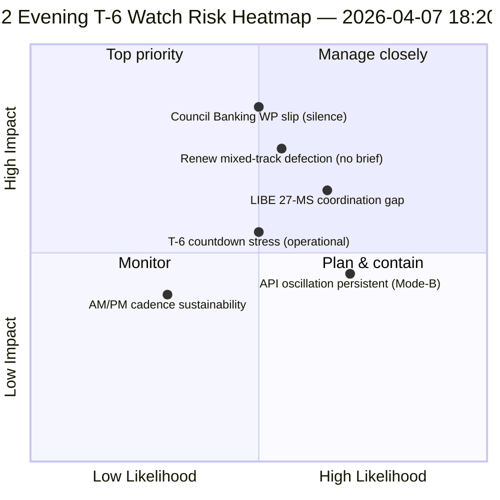

<!-- SPDX-FileCopyrightText: 2026 Hack23 AB -->
<!-- SPDX-License-Identifier: Apache-2.0 -->

# Sammendrag for ledelse — Påskeferie dag 12 kveldsoppdatering (T-6 til utvalgsuke) | 2026-04-07

**Klassifisering:** OSINT — Offentlig parlamentarisk protokoll  
**Tillit:** 🟡 MIDDELS (ferie; 12-timers delta over dag-12 morgenbaseline)  
**Kjøring:** `analysis/daily/2026-04-07/breaking-2/` (18:20 UTC)  
**Dekning:** Påskeferie dag 12/18 kveld — 12-timers delta over morgenbaseline (44 artefakter → delta + skjerping)  
**Generert:** 2026-05-16 (retrospektivt sammendrag, ingen nye MCP-kall)  
**Primære kilder:** Dag-12 morgenbaseline (3 391 linjer); vedtatte teksters dagsfeed (1 element); 737 MEP-poster.

---

## 🎯 BLUF

**Dag-12 kveld breaking-2 er *12-timers delta-vurderingen* over morgenbaselinen — ferieperiodens første strukturerte operasjonelle eksempel på parret AM/PM-etterretningstakt.** Dens særegne bidrag er **bekreftelse av API-gjenoppretting-oscillasjonsmønster** på dagsoppløsningsnivå: endepunktet for vedtatte tekster, som kjøring-3 den 6. april så gjenopprette seg kl. 12:15 UTC, har nå oscillert igjen — og bekrefter at det *Mode-B-oscillatoriske* feilmønsteret dokumentert 6. april er vedvarende snarere enn forbigående. Kjøringen skjerper **T-6 til utvalgsuke** operasjonell planlegging: der morgenbaselinen produserte den 6-trigger fremover-utløsersekvensen, legger kveldsoppdateringen til *operasjonelle beredskapsvaktelementer* — tre elementer å overvåke før 14. april: (1) Rådets bankarbeidsgruppes signalering om SRMR3-mandatets timing (stille gjennom dag 12 = mild glidningsrisiko); (2) Renews koordinasjonsmøtekalender (blandede sporsfiler DGSD2/BRRD3 trenger Renew-briefing før 14. april); (3) Antikorrupsjonstransposisjonens nasjonalparlamentariske kontaktarbeid (LIBE-lederens pre-Q2-koordinasjon). Kveldsoppdateringen er ferieperiodens mest eksplisitte *operasjonelle beredskapsliste* og den strukturelle malen for påfølgende daglige AM/PM-takt gjennom resten av ferien (8.–13. april). **Kveldskjøringen løfter AM/PM-takten fra observasjonell til operasjonell** ved å introdusere handlingsorienterte vaktelementer snarere enn rent strukturelle baslineoppdateringer.

---

## 🧭 3 beslutninger dette sammendraget støtter

| # | Beslutning | Hvem bestemmer | Frist | Dokumentasjon |
|:-:|------------|---------------|:-----:|---------------|
| 1 | **Eskalering av rådets bankarbeidsgruppetaushet** — taushet gjennom dag 12 = mild glidningsrisiko; eskaler til Coreper | Rådsformannskap + EP-ordfører | innen 10. april | §Vakt 1 |
| 2 | **Renew blandet-spor-briefing** — DGSD2/BRRD3 trenger pre-14. april koordinatorbriefing | Renew-koordinatorer + EPP-koordinasjon | innen 12. april | §Vakt 2 |
| 3 | **LIBE 27-MS pre-Q2 kontaktarbeid** — antikorrupsjonstransposisjonens nasjonalparlamentariske forberedelse | LIBE-leder + nasjonalparlamentarisk kontakt | innen 14. april | §Vakt 3 |

---

## 📰 60-sekunders lesing

- 🔴 **Første strukturerte AM/PM-etterretningstakt** — operasjonell mal etablert.
- 🟠 **API-oscillasjonsmønster bekreftet vedvarende** — Mode-B oscillatorisk, ikke forbigående.
- 🟢 **3 operasjonelle beredskapsvaktelementer** — Rådet BWG · Renew · LIBE.
- 🟡 **T-6 til utvalgsuke** — nedtelling aktiv.
- 🔵 **737 MEPer stabile** — dag 12-baseline holder.
- 🟣 **1 vedtatt tekst dagsfeed** — minimal men operasjonell.
- 🩷 **Dag 12 av 18 — 67 % av ferien fullført**.
- ⚪ **Tillit MIDDELS** — operasjonelle vaktelementer høy; API-prognose middels.

---

## 📋 Operasjonelle beredskapsvaktelementer (kjøringens særegne bidrag)

| # | Element | Glidningsindikator | Tiltaksdeadline |
|:-:|---------|-------------------|-----------------|
| 1 | **Rådets bankarbeidsgruppesignalering om SRMR3-mandat** | Taushet gjennom dag 12 | Eskaler innen 10. april |
| 2 | **Renew-koordinasjon på blandet spor DGSD2/BRRD3** | Ingen koordinatormøte planlagt | Briefing innen 12. april |
| 3 | **LIBE 27-MS antikorrupsjonstransposisjon kontaktarbeid** | Nasjonalparlamentarisk kontaktgap | Kontaktarbeid innen 14. april |

---

## ⚠️ Risikooversikt

---

## 🔮 Topp fremover-utløsere (neste 7 dager til T-0)

1. **8. april — dag 13** — Rådets BWG-eskaleringsdeadline nærmer seg.
2. **10. april — dag 15** — Rådets BWG-eskalering hard deadline.
3. **12. april — dag 17** — Renew koordinatorbriefing hard deadline.
4. **13. april — dag 18** — Ferie avsluttes; endelig beredskapsoversikt.
5. **14. april — dag 0** — Utvalgsuke åpner; alle vaktelementer må løses.

---

## 🛡️ Kildekvalitetsvurdering

- **AM-baseline-delta (A1):** direkte sammenligning med morgenkjøring; verifiserbar.
- **API-oscillasjonspersistens (A2):** dag-11 + dag-12 dobbeltobservasjon; middels tillit.
- **3 vaktelementer (A2):** operasjonell beredskapmetodologi; verifiserbar mot institusjonell kalender.
- **737 MEPer stabile (A1):** primær post.
- **Nettotillit:** 🟢 HØY for AM/PM-takt; 🟡 MIDDELS for vaktelementers glidningssannsynligheter.

---

## 📎 Kjøringsartefakter

| Lag | Artefakt | Hvorfor |
|-----|----------|---------|
| Artikkel | `article.md` | Offentlig kveldsoppdateringsfortelling |
| Syntese | `synthesis-summary.md` | 12-timers delta + 3-vakt operasjonsliste |
| Metoder | klassifisering · eksisterende · risikovurdering · trusselsvurdering | Standard breaking-metodologi |
| Følgedokument | breaking (06:36 morgen) | Samme dags AM-baseline |

---

**Dokumentkontroll**
- **Malreferanse:** `analysis/templates/executive-brief.md`
- **Artefaktsti:** `analysis/daily/2026-04-07/breaking-2/executive-brief.md`
- **Klassifisering:** Offentlig
- **Retrospektiv:** Sammendrag skrevet 2026-05-16 fra kjøringens committede artefakter; **ingen nye MCP-kall ble foretatt**.
