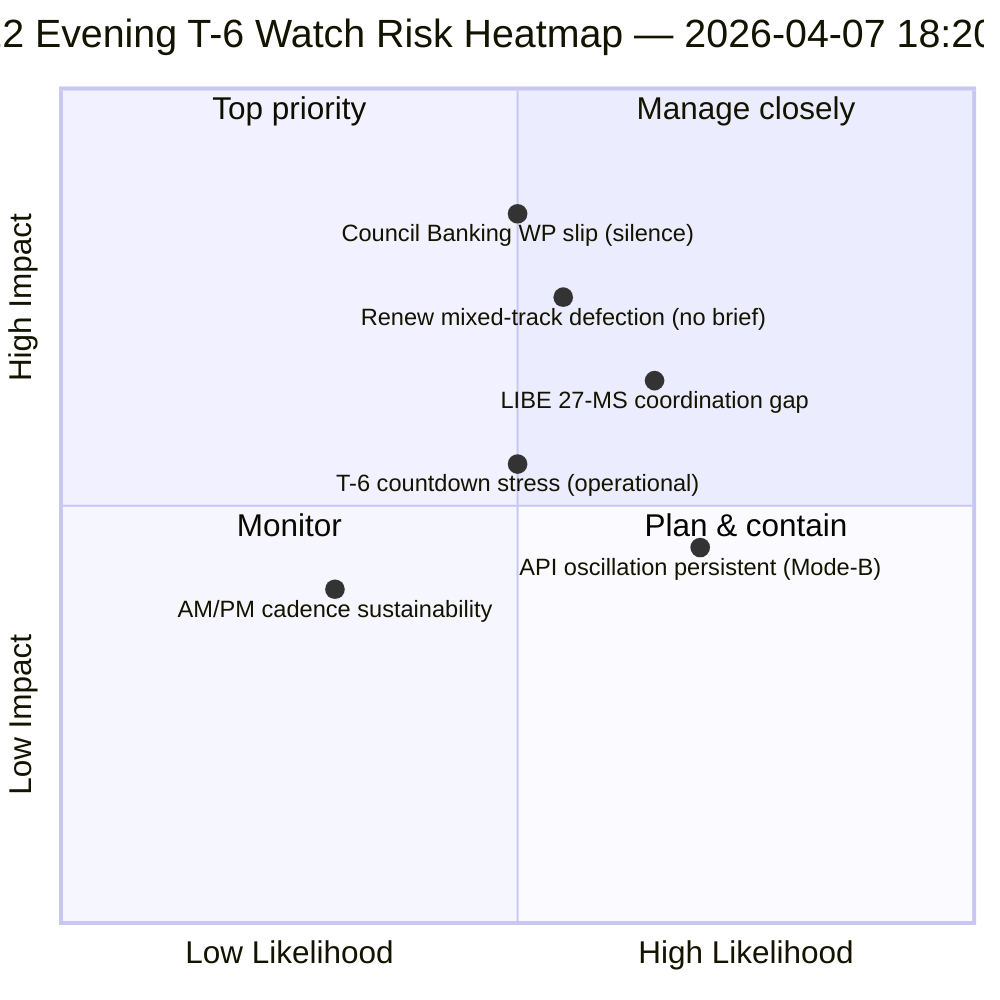

<!-- SPDX-FileCopyrightText: 2026 Hack23 AB -->
<!-- SPDX-License-Identifier: Apache-2.0 -->

# Exekutiv sammanfattning — Påskuppehåll dag 12 kvällsuppdatering (T-6 till utskottsvecka) | 2026-04-07

**Klassificering:** OSINT — Offentlig parlamentarisk handling  
**Förtroende:** 🟡 MEDEL (uppehåll; 12-timmars delta mot dag-12 morgonbaslinjen)  
**Körning:** `analysis/daily/2026-04-07/breaking-2/` (18:20 UTC)  
**Täckning:** Påskuppehåll dag 12/18 kväll — 12-timmars delta mot morgonbaslinjen (44 artefakter → delta + skärpning)  
**Genererad:** 2026-05-16 (retrospektiv sammanfattning, inga nya MCP-anrop)  
**Primära källor:** Dag-12 morgonbaslinjen (3 391 rader); antagna texters dagsfeed (1 post); 737 MEP-poster.

---

## 🎯 BLUF

**Dag-12 kväll breaking-2 är *12-timmarsdelta-bedömningen* mot morgonbaslinjen — uppehållsperiodens första strukturerade operationella exempel på parade AM/PM-underrättelsetakt.** Dess utmärkande bidrag är **bekräftelse av API-återhämtningsoscillationsmönster** på dagsupplösningsnivå: slutpunkten för antagna texter, som körning-3 den 6 april såg återhämta sig vid 12:15 UTC, har nu oscillerat igen — vilket bekräftar att det *Mode-B-oscillatoriska* felmönstret dokumenterat den 6 april är beständigt snarare än övergående. Körningen skärper **T-6 till utskottsvecka** operationell planering: där morgonbaslinjen producerade den 6-triggers framåtutlösarsekvensen, lägger kvällsuppdateringen till *operationsberedskapsposter* — tre poster att bevaka före den 14 april: (1) Rådets bankarbetsgruppssignalering om SRMR3-mandatets tidpunkt (tyst genom dag 12 = mild riskinträde); (2) Renews koordinationsmöteskalender (blandspårsfiler DGSD2/BRRD3 behöver Renew-genomgång före 14 april); (3) Antikorruptionsharmonisering nationellt parlamentariskt kontaktarbete (LIBE-ordförandes pre-Q2-koordination). Kvällsuppdateringen är uppehållsperiodens mest explicita *operationsberedskapslista* och den strukturella mallen för efterföljande dagliga AM/PM-takt under resten av uppehållet (8–13 april). **Kvällskörningen höjer AM/PM-takten från observationell till operationell** genom att introducera åtgärdsbara bevakningsposter snarare än enbart strukturella baslinjeuppdateringar.

---

## 🧭 3 beslut som denna sammanfattning stödjer

| # | Beslut | Vem beslutar | Deadline | Underlag |
|:-:|--------|-------------|:--------:|----------|
| 1 | **Eskalering av rådets bankarbetsgruppstystnad** — tystnad genom dag 12 = mild riskinträde; eskalera till Coreper | Rådsordförandeskap + EP-föredragande | senast 10 april | §Bevakningspost 1 |
| 2 | **Renew blandspårsgenomgång** — DGSD2/BRRD3 behöver pre-14 april koordinatörsdirektivgenomgång | Renew-koordinatorer + EPP-koordination | senast 12 april | §Bevakningspost 2 |
| 3 | **LIBE 27 MS pre-Q2-kontaktarbete** — Antikorruptionsharmonisering nationellt parlamentariskt förberedelse | LIBE-ordförande + nationell parlamentarisk kontakt | senast 14 april | §Bevakningspost 3 |

---

## 📰 60-sekunders läsning

- 🔴 **Första strukturerade AM/PM-underrättelsetakt** — operationell mall etablerad.
- 🟠 **API-oscillationsmönster bekräftat beständigt** — Mode-B oscillatorisk, inte övergående.
- 🟢 **3 operationsberedskapsposter** — Rådet BWG · Renew · LIBE.
- 🟡 **T-6 till utskottsvecka** — nedräkning aktiv.
- 🔵 **737 MEP stabila** — dag 12-baslinjen håller.
- 🟣 **1 antagen text dagsfeed** — minimal men operationell.
- 🩷 **Dag 12 av 18 — 67 % av uppehållet avklarat**.
- ⚪ **Förtroende MEDEL** — operationella bevakningsposter högt; API-prognos medel.

---

## 📋 Operationsberedskapsposter (körningens utmärkande bidrag)

| # | Post | Riskindikatorer | Åtgärdsdeadline |
|:-:|------|----------------|-----------------|
| 1 | **Rådets bankarbetsgruppssignalering om SRMR3-mandat** | Tystnad genom dag 12 | Eskalera senast 10 april |
| 2 | **Renew-koordination på blandspår DGSD2/BRRD3** | Inget koordinatörsmöte planerat | Genomgång senast 12 april |
| 3 | **LIBE 27 MS antikorruptionsharmonisering kontaktarbete** | Nationell parlamentarisk kontaktlucka | Kontaktarbete senast 14 april |

---

## ⚠️ Risköversikt

---

## 🔮 Topp framåtutlösare (nästa 7 dagar till T-0)

1. **8 april — dag 13** — rådets BWG-eskaleringsdeadline närmar sig.
2. **10 april — dag 15** — rådets BWG-eskalering hård deadline.
3. **12 april — dag 17** — Renew koordinatörsdirektivgenomgång hård deadline.
4. **13 april — dag 18** — uppehåll avslutas; slutlig beredskapsgranskning.
5. **14 april — dag 0** — utskottsvecka öppnar; alla bevakningsposter måste lösas.

---

## 🛡️ Källkvalitetsbedömning

- **AM-baslinjedelta (A1):** direkt jämförelse med morgonkörning; verifierbar.
- **API-oscillationsbeständighet (A2):** dag-11 + dag-12 dubbel observation; medelförtroende.
- **3 bevakningsposter (A2):** operationsberedskapsmetodik; verifierbar mot institutionell kalender.
- **737 MEP stabila (A1):** primär post.
- **Nettförtroende:** 🟢 HÖGT för AM/PM-takt; 🟡 MEDEL för bevakningsposternas risksannolikheter.

---

## 📎 Körningsartefakter

| Lager | Artefakt | Varför |
|-------|----------|--------|
| Artikel | `article.md` | Offentlig kvällsuppdateringsberättelse |
| Syntes | `synthesis-summary.md` | 12-timmars delta + 3-bevakningsposters operationslista |
| Metoder | klassificering · befintlig · riskbedömning · hotbedömning | Standardmetodik för breaking |
| Följedokument | breaking (06:36 morgon) | Samma dags AM-baslinje |

---

**Dokumentkontroll**
- **Mallreferens:** `analysis/templates/executive-brief.md`
- **Artefaktsökväg:** `analysis/daily/2026-04-07/breaking-2/executive-brief.md`
- **Klassificering:** Offentlig
- **Retrospektiv:** Sammanfattning skriven 2026-05-16 från körningens committed artefakter; **inga nya MCP-anrop gjordes**.
