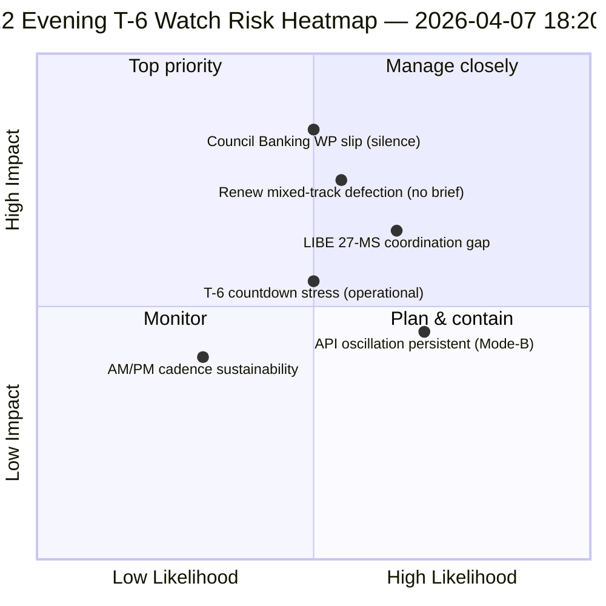

<!-- SPDX-FileCopyrightText: 2026 Hack23 AB -->
<!-- SPDX-License-Identifier: Apache-2.0 -->

# 执行简报 — 复活节休会第12日夜间更新（距委员会周T-6）| 2026-04-07

**分类：** OSINT — 公开议会记录  
**置信度：** 🟡 中等（休会；相对于第12日上午基线的12小时增量）  
**运行：** `analysis/daily/2026-04-07/breaking-2/`（18:20 UTC）  
**覆盖范围：** 复活节休会第12/18日夜 — 相对于上午基线的12小时增量（44份产物 → 增量 + 精炼）  
**生成日期：** 2026-05-16（回顾性简报，无新MCP调用）  
**主要来源：** 第12日上午基线（3,391行）；当日通过文本动态（1项）；737名欧洲议会议员记录。

---

## 🎯 BLUF

**第12日夜间breaking-2是相对于上午基线的*12小时增量评估* — 休会期间配对AM/PM情报节奏的首个有结构的运营示例。** 其独特贡献在于以日分辨率水平**确认API恢复振荡模式**：4月6日运行-3于12:15 UTC目睹恢复的通过文本终端节点再次发生振荡，证实4月6日记录的*模式B振荡型*故障模式具有持续性而非偶发性。此次运行细化了**T-6直至委员会周**的运营计划：上午基线生成了6个触发器的前向触发序列，夜间更新则补充了*运营准备监控项目* — 4月14日之前需重点关注的三项内容：(1) 理事会银行工作组关于SRMR3授权时间表的信号（沉默至第12日 = 轻度滑点风险）；(2) Renew协调会议日历（混合轨道文件DGSD2/BRRD3需在4月14日前完成Renew简报）；(3) 反腐移植的国家议会推广工作（LIBE主席Q2前协调）。夜间更新是休会期间最为明确的*运营准备核查表*，也是其余休会期间（4月8日至13日）后续每日AM/PM节奏的结构模板。**夜间运行将AM/PM节奏从观察性提升至运营性**，引入可执行的监控项目，而非纯粹的结构性基线更新。

---

## 🧭 此简报支持的3项决策

| # | 决策 | 决策者 | 截止日期 | 依据 |
|:-:|------|-------|:-------:|------|
| 1 | **理事会银行工作组沉默升级** — 沉默至第12日 = 轻度滑点风险；升级至常驻代表委员会 | 理事会主席国 + 欧洲议会报告人 | 4月10日前 | §监控项目1 |
| 2 | **Renew混合轨道简报** — DGSD2/BRRD3需要4月14日前的协调员简报 | Renew协调员 + 欧洲人民党协调 | 4月12日前 | §监控项目2 |
| 3 | **LIBE 27成员国Q2前推广** — 反腐移植国家议会准备 | LIBE主席 + 国家议会联络员 | 4月14日前 | §监控项目3 |

---

## 📰 60秒阅读

- 🔴 **首个有结构的AM/PM情报节奏** — 运营模板建立。
- 🟠 **API振荡模式确认为持续性** — 模式B振荡型，非偶发性。
- 🟢 **3项运营准备监控项目** — 理事会BWG · Renew · LIBE。
- 🟡 **距委员会周T-6** — 倒计时进行中。
- 🔵 **737名欧洲议会议员稳定** — 第12日基线维持。
- 🟣 **1项通过文本日度动态** — 最小但运营有效。
- 🩷 **18天中第12天 — 休会67%完成**。
- ⚪ **置信度中等** — 运营监控项目高；API预测中等。

---

## 📋 运营准备监控项目（此次运行的独特贡献）

| # | 项目 | 滑点指标 | 缓解截止日期 |
|:-:|------|---------|------------|
| 1 | **理事会银行工作组关于SRMR3授权的信号** | 沉默至第12日 | 4月10日前升级 |
| 2 | **Renew在混合轨道DGSD2/BRRD3上的协调** | 未安排协调员会议 | 4月12日前简报 |
| 3 | **LIBE 27成员国反腐移植推广** | 国家议会联络缺口 | 4月14日前推广 |

---

## ⚠️ 风险快照

---

## 🔮 主要前向触发器（T-0前7天）

1. **4月8日 — 第13日** — 理事会BWG升级截止日期临近。
2. **4月10日 — 第15日** — 理事会BWG升级：硬性截止日期。
3. **4月12日 — 第17日** — Renew协调员简报：硬性截止日期。
4. **4月13日 — 第18日** — 休会结束；最终准备状态审查。
5. **4月14日 — 第0日** — 委员会周开始；所有监控项目必须解决。

---

## 🛡️ 来源质量评估

- **AM基线增量（A1）：** 与上午运行直接比较；可核实。
- **API振荡持续性（A2）：** 第11日 + 第12日双重观测；中等置信度。
- **3项监控项目（A2）：** 运营准备方法论；可对照机构日历核实。
- **737名议员稳定（A1）：** 主要记录。
- **综合置信度：** 🟢 AM/PM节奏高；🟡 监控项目滑点概率中等。

---

## 📎 运行产物

| 层级 | 产物 | 原因 |
|------|------|------|
| 文章 | `article.md` | 公开夜间更新叙述 |
| 综合 | `synthesis-summary.md` | 12小时增量 + 3项监控项目运营核查表 |
| 方法论 | 分类 · 现有 · 风险评分 · 威胁评估 | 标准breaking方法论 |
| 配套 | breaking（06:36 上午） | 当日AM基线 |

---

**文档控制**
- **模板参考：** `analysis/templates/executive-brief.md`
- **产物路径：** `analysis/daily/2026-04-07/breaking-2/executive-brief.md`
- **分类：** 公开
- **回顾性：** 简报于2026-05-16依据运行已提交产物撰写；**未进行新的MCP调用**。
