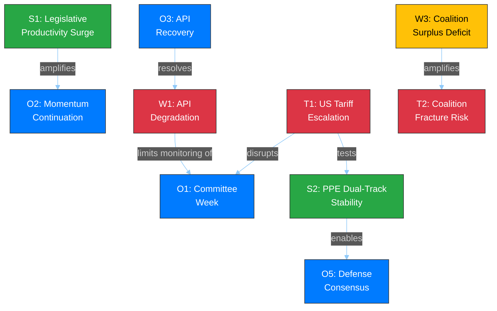

# 📊 Quantitative SWOT Analysis — Easter Recess Day 12 Evening

**📅 Analysis Date:** 2026-04-07 18:28 UTC | **📊 Confidence:** MEDIUM | **📍 Run:** breaking-2

> **Framework:** Political SWOT with quantitative scoring per `analysis/methodologies/political-swot-framework.md`. Cross-SWOT interference mapped, TOWS matrix applied, and scenario generation from quadrant interactions.

---

## 📋 SWOT Context

| Field | Value |
|-------|-------|
| **SWOT ID** | SWOT-2026-04-07-EVE-001 |
| **Subject** | EP10 Mid-Recess Institutional Dynamics |
| **Analysis Period** | Easter Recess Day 12/18 (2026-04-07) |
| **Frameworks Applied** | Quantitative SWOT, TOWS Matrix, Cross-Interference Analysis |
| **Confidence** | MEDIUM |

---

## 💪 Strengths

| # | Strength | Evidence | Severity | Trend |
|:-:|----------|----------|:--------:|:-----:|
| S1 | **EP10 Legislative Productivity Surge** | 2.11 acts/session (2026) vs 1.47 (2025), +46.2% increase. 114 projected acts vs 78 prior year. Source: precomputed stats. |  | ↑ |
| S2 | **PPE Dual-Track Coalition Stability** | Right alliance (EPP+ECR+PfE=52.3%) for economic files, grand coalition (EPP+S&D+Renew=55%) for governance. Zero MEP defections during recess. Shapley power ~45%. Source: political landscape + MEP feed stability. |  | → |
| S3 | **Pre-Easter Legislative Sprint Success** | 34 adopted texts across March sessions including landmark banking union (SRMR3: TA-10-2026-0092, DGSD2: TA-10-2026-0090) and anti-corruption directive (TA-10-2026-0094). Source: adopted texts feed, editorial memory. |  | → |
| S4 | **MEP Composition Stability** | 737 MEPs stable throughout recess. Turnover rate 5.6%, institutional memory risk LOW. Stability index 0.944. Source: MEP feed, precomputed stats. |  | → |
| S5 | **Multi-Party Coalition Mathematics Established** | 3-group minimum winning coalition pattern since 2019 (structural change). Top-2 concentration 44.5% < majority threshold. Effective opposition parties 5.59. HHI 0.1517 (deconcentrated). Source: derived intelligence. |  | → |

**Strengths Weighted Score:** 8.2/10 — EP10 enters post-Easter with robust institutional foundations and established coalition patterns. 🟢 HIGH confidence.

---

## ⚠️ Weaknesses

| # | Weakness | Evidence | Severity | Trend |
|:-:|----------|----------|:--------:|:-----:|
| W1 | **EP Open Data Portal API Degradation** | 6/8 feed endpoints returning 404. Events, procedures, documents, plenary docs, committee docs, questions all offline. Only adopted texts (partial) and MEPs operational. Duration: ~7 days. Source: direct MCP feed queries. |  | ↗ (recovering) |
| W2 | **Transparency Gap During Recess** | Informal negotiations invisible to monitoring tools. Council working groups continue without EP oversight visibility. MEP constituency work untracked. Source: structural analysis of data availability. |  | → |
| W3 | **Grand Coalition Surplus Deficit** | EPP+S&D+Renew = 55.0%, but grand coalition surplus deficit of -5.5% from comfortable margin. Any significant defections can break majority. Source: precomputed stats (grandCoalitionSurplusDeficit: -5.5). |  | → |
| W4 | **Right Bloc Majority Dependence on ESN** | Expanded right (EPP+ECR+PfE) = 48.3% — needs ESN (3.9%) for majority at 52.2%. EPP resists formal association with ESN. Fragile right majority when it occurs. Source: political landscape. |  | → |
| W5 | **Greens/EFA Political Capital Depletion** | Significant capital spent on environmental regulation in pre-Easter sprint. Limited bargaining power for post-Easter spring session. 7.4% seat share constrains influence. Source: adopted texts analysis, seat composition. |  | ↘ |

**Weaknesses Weighted Score:** 5.8/10 — API degradation is the primary concern, but it is recovering. Structural weaknesses (coalition margins) are long-term features, not acute risks. 🟡 MEDIUM confidence.

---

## 🌟 Opportunities

| # | Opportunity | Evidence | Potential | Timeline |
|:-:|-------------|----------|:---------:|:--------:|
| O1 | **Post-Easter Committee Week (T-6 days)** | Committee week April 14-17 offers first post-recess opportunity for legislative progress. ECON (SRMR3 implementation), LIBE (anti-corruption transposition), INTA (tariff response). Source: legislative calendar. |  | 6 days |
| O2 | **EP10 Legislative Momentum Continuation** | 2.11 acts/session pace could accelerate in spring plenary season (historically highest output period). 935 active procedures provide loaded pipeline. Source: precomputed stats. |  | 2-8 weeks |
| O3 | **API Infrastructure Recovery** | Adopted texts "today" feed partial recovery signals broader infrastructure recovery. Full restoration expected by April 14. Source: 12-hour delta observation. |  | 6 days |
| O4 | **Renew Kingmaker Positioning** | 10.6% seat share makes Renew decisive in contested votes. Spring session offers Renew leverage on digital regulation and rule of law priorities. Source: political landscape. |  | 2-8 weeks |
| O5 | **Cross-Bloc Defense Consensus** | Rare agreement across EPP, S&D, ECR, and Renew on defense spending creates opportunities for fast-tracked defense industrial files. Source: precomputed stats commentary. |  | 2-12 weeks |

**Opportunities Weighted Score:** 7.4/10 — Post-Easter period is rich with legislative opportunities. The committee week and loaded pipeline create conditions for high productivity. 🟡 MEDIUM confidence.

---

## 🔴 Threats

| # | Threat | Evidence | Severity | Likelihood |
|:-:|--------|----------|:--------:|:----------:|
| T1 | **US Tariff Escalation** | Pre-Easter adopted texts TA-10-2026-0096 and TA-10-2026-0097 on EU tariff response. Escalation during recess could force emergency INTA response, disrupting planned agenda. Source: adopted texts, editorial memory. |  | 30% |
| T2 | **PPE Dual-Track Coalition Fracture** | First post-Easter contested vote could expose tensions between right alliance and grand coalition tracks. If EPP pushes right on trade while needing S&D on governance, political trust erodes. Source: coalition analysis. |  | 15% |
| T3 | **Persistent API Degradation** | If EP API does not recover by April 14, monitoring tools operate at reduced capacity during the most politically active period. Source: 12-hour tracking of feed status. |  | 20% |
| T4 | **Small Group Quorum Risk** | 3 groups with ≤5 members in landscape sample may struggle to maintain quorum. Early warning system flagged LOW severity. Could affect committee quorum post-Easter. Source: early warning system. |  | 15% |
| T5 | **Legislative Pipeline Bottleneck** | 935 active procedures competing for committee and plenary time. Post-Easter scheduling conflicts could stall high-priority files. Source: precomputed stats (procedures: 935). |  | 25% |

**Threats Weighted Score:** 5.1/10 — Trade escalation is the primary external threat; coalition fracture is the primary internal threat. Both have manageable probabilities. 🟡 MEDIUM confidence.

---

## 🔄 TOWS Strategic Matrix

### SO Strategies (Strengths × Opportunities)

| Strategy | Leverages | Captures |
|----------|-----------|----------|
| **Leverage legislative surge momentum through committee week** | S1 (productivity surge) + S3 (pre-Easter sprint) | O1 (committee week) + O2 (momentum continuation) |
| **Use PPE coalition stability for fast-tracked defense files** | S2 (dual-track stability) + S5 (coalition math) | O5 (defense consensus) |
| **Deploy institutional stability for spring plenary productivity** | S4 (MEP stability) | O2 (momentum continuation) + O4 (Renew leverage) |

### WO Strategies (Weaknesses × Opportunities)

| Strategy | Mitigates | Captures |
|----------|-----------|----------|
| **API recovery enables full committee week monitoring** | W1 (API degradation) | O3 (API recovery) + O1 (committee week) |
| **Grand coalition margin pressure creates space for Renew** | W3 (surplus deficit) | O4 (Renew kingmaker) |

### ST Strategies (Strengths × Threats)

| Strategy | Deploys | Counters |
|----------|---------|----------|
| **EPP dual-track flexibility absorbs trade disruption** | S2 (dual-track coalition) | T1 (US tariffs) |
| **Legislative pipeline depth provides scheduling flexibility** | S1 (productivity) + S3 (sprint success) | T5 (pipeline bottleneck) |

### WT Strategies (Weaknesses × Threats)

| Strategy | Addresses | Defends Against |
|----------|-----------|-----------------|
| **Priority monitoring of trade files despite API degradation** | W1 (API) + W2 (transparency gap) | T1 (tariff escalation) |
| **Coalition margin awareness during contested votes** | W3 (surplus deficit) + W4 (ESN dependence) | T2 (coalition fracture) |

---

## 📊 Cross-SWOT Interference Map

---

## 📊 SWOT Summary Scorecard

| Quadrant | Score (1-10) | Items | Key Driver |
|----------|:----------:|:-----:|-----------|
| **Strengths** | 8.2 | 5 | EP10 legislative productivity surge |
| **Weaknesses** | 5.8 | 5 | API degradation (recovering) |
| **Opportunities** | 7.4 | 5 | Post-Easter committee week |
| **Threats** | 5.1 | 5 | US tariff escalation |

**Net SWOT Position:** (S - W) + (O - T) = (8.2 - 5.8) + (7.4 - 5.1) = **+4.7** (POSITIVE)

**Assessment:** EP10 enters the post-Easter period from a position of structural strength. The positive SWOT balance (+4.7) indicates institutional resilience despite API degradation and external trade risks. The primary vulnerability is the narrow coalition margins that could be exposed if trade dynamics force unexpected political realignments. 🟡 MEDIUM confidence.

---

## 📚 Sources

| Source | Data Point | Used In |
|--------|-----------|---------|
| Precomputed stats (2026) | 114 acts, 2.11/session, 935 procedures | S1, O2, T5 |
| Precomputed stats (derived) | HHI 0.1517, top-2 44.5%, MWC 3 | S5, W3 |
| MEP feed (today) | 737 stable, stability index 0.944 | S4 |
| Adopted texts feed (today) | TA-10-2026-0030 via today endpoint | O3 |
| Early warning system | 3 warnings, stability 84/100 | T4 |
| Political landscape | 8 groups, PPE 38% sample | S2, W4 |
| Editorial memory | Pre-Easter sprint: 34 texts, SRMR3, DGSD2, anti-corruption | S3, T1 |
| Prior analysis (morning) | Synthesis SYN-2026-04-07-002 | Context |
