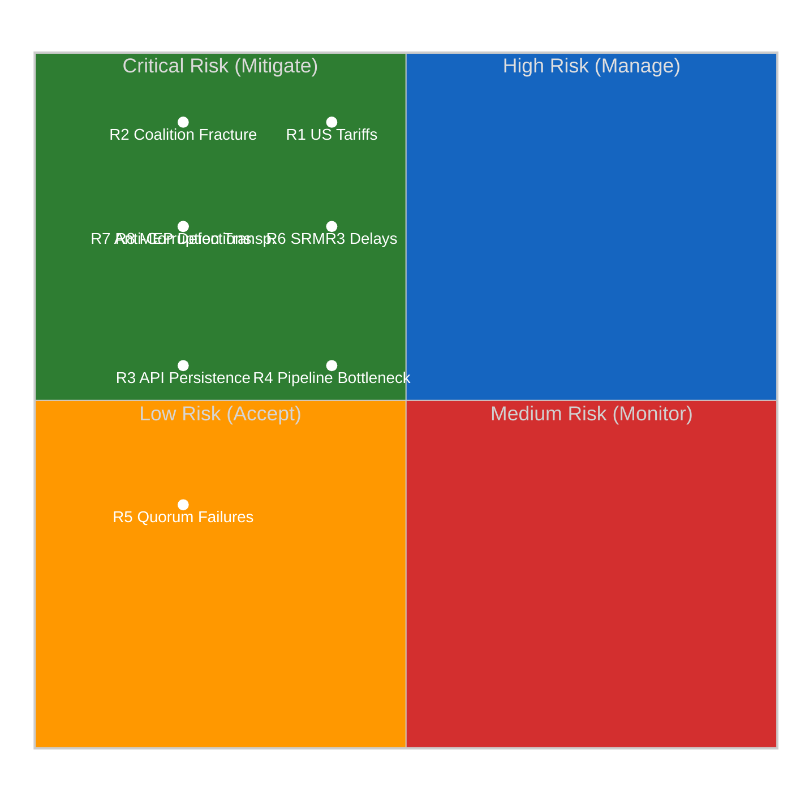
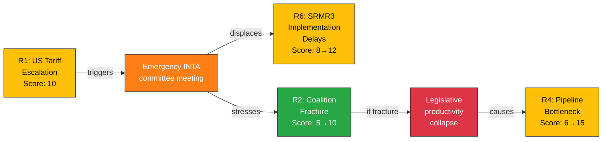

# ⚠️ Political Risk Matrix — Easter Recess Day 12 Evening

**📅 Analysis Date:** 2026-04-07 18:32 UTC | **📊 Confidence:** MEDIUM | **📍 Run:** breaking-2

> **Framework:** 5×5 Likelihood × Impact matrix per `analysis/methodologies/political-risk-methodology.md`. Bayesian updating from morning run.

---

## 📋 Risk Context

| Field | Value |
|-------|-------|
| **Risk Matrix ID** | RM-2026-04-07-EVE-001 |
| **Analysis Date** | 2026-04-07 18:32 UTC |
| **Risks Assessed** | 8 |
| **Prior Assessment** | `analysis/2026-04-07/breaking/risk-scoring/risk-matrix.md` |
| **Confidence** | MEDIUM |

---

## 📊 Risk Register

| ID | Risk | Likelihood (1-5) | Impact (1-5) | Score | Level | Trend | Owner |
|:--:|------|:-----------------:|:------------:|:-----:|:-----:|:-----:|-------|
| R1 | **US tariff escalation disrupts post-Easter agenda** | 2 | 5 | 10 | 🟡 MEDIUM | → | INTA/ECON |
| R2 | **PPE dual-track coalition fracture on first post-Easter vote** | 1 | 5 | 5 | 🟢 LOW | → | PPE leadership |
| R3 | **EP API degradation persists past April 14** | 1 | 3 | 3 | 🟢 LOW | ↘ | EP IT |
| R4 | **Legislative pipeline bottleneck in spring session** | 2 | 3 | 6 | 🟡 MEDIUM | → | Conference of Presidents |
| R5 | **Small group quorum failures in committees** | 1 | 2 | 2 | 🟢 LOW | → | Committee chairs |
| R6 | **SRMR3 implementation delays** | 2 | 4 | 8 | 🟡 MEDIUM | → | ECON Committee |
| R7 | **Anti-corruption directive transposition failure** | 1 | 4 | 4 | 🟢 LOW | → | LIBE Committee |
| R8 | **MEP defections alter coalition mathematics** | 1 | 4 | 4 | 🟢 LOW | → | Group whips |

---

### 5×5 Risk Matrix Visualization

---

## 📊 Risk Scoring Methodology

**Likelihood Scale:**
| Score | Label | Probability | Definition |
|:-----:|-------|:-----------:|-----------|
| 1 | Very Low | <10% | Unlikely under current conditions |
| 2 | Low | 10-30% | Possible but not expected |
| 3 | Medium | 30-50% | Roughly even odds |
| 4 | High | 50-70% | More likely than not |
| 5 | Very High | >70% | Expected to occur |

**Impact Scale:**
| Score | Label | Definition |
|:-----:|-------|-----------|
| 1 | Negligible | No meaningful effect on EP operations |
| 2 | Minor | Limited effect; contained to single committee/file |
| 3 | Moderate | Affects multiple files or committees; manageable disruption |
| 4 | Significant | Reshuffles legislative priorities; coalition recalculation needed |
| 5 | Catastrophic | Fundamentally alters EP political dynamics; institutional crisis |

**Risk Level Thresholds:**
- 🟢 LOW: Score 1-4
- 🟡 MEDIUM: Score 5-12
- 🔴 HIGH: Score 13-19
- ⚫ CRITICAL: Score 20-25

---

## 🔄 Bayesian Update from Morning Assessment

| Risk | Morning Score | Evening Score | Update Reason |
|------|:------------:|:-------------:|---------------|
| R1 | 10 | 10 | No new information on trade dynamics — unchanged |
| R2 | 5 | 5 | No MEP movements; stability confirmed — unchanged |
| R3 | 5 | 3 | **Downgraded** — adopted texts "today" feed recovery signal reduces persistence likelihood |
| R4 | 6 | 6 | No new procedure data — unchanged |
| R5 | 2 | 2 | Early warning confirms LOW — unchanged |
| R6 | 8 | 8 | No ECON committee signals during recess — unchanged |
| R7 | 4 | 4 | No LIBE committee signals during recess — unchanged |
| R8 | 4 | 4 | MEP feed stable at 737 — unchanged |

**Key Update:** R3 (API persistence) downgraded from 5 → 3 based on the adopted texts feed partial recovery observed at 18:18 UTC. This is the only risk that changed materially in the 12-hour delta. The recovery signal provides evidence that the infrastructure is healing, reducing the probability of persistence past April 14.

---

## 📊 Cascading Risk Analysis

### Primary Cascade: US Tariff Escalation (R1)

**Cascade Assessment:** If R1 materializes, it would cascade to raise R6 from MEDIUM to HIGH (SRMR3 deprioritized for trade response) and stress-test R2 (coalition unity on trade). The worst-case cascade (R1 → R2 → R4) could take the pipeline bottleneck to HIGH risk. Total cascade probability: ~8% (R1 probability × cascade completion probability). 🟡 MEDIUM confidence.

---

## 📊 Risk Appetite Assessment

| Domain | Appetite | Current Exposure | Status |
|--------|:--------:|:----------------:|:------:|
| **Legislative productivity** | Moderate — accept delays on non-priority files | Within appetite (pipeline loaded) | ✅ |
| **Coalition stability** | Low — fracture would be disruptive | Within appetite (no indicators) | ✅ |
| **Transparency** | Low — degraded monitoring is unacceptable | **Above appetite** (6/8 feeds offline) | ⚠️ |
| **External trade** | Moderate — EU has response instruments | At boundary (countermeasures adopted but escalation possible) | 🟡 |
| **Institutional integrity** | Very Low — MEP stability is foundational | Within appetite (0.944 stability index) | ✅ |

---

## 🎯 Risk Treatment Plan

| Risk | Treatment | Action | Priority | By When |
|------|-----------|--------|:--------:|---------|
| R1 | **Accept + Prepare** | Pre-position INTA monitoring; prepare emergency briefing template | 🔴 HIGH | April 13 |
| R2 | **Monitor** | Track first post-Easter contested vote; flag alignment divergence | 🟡 MEDIUM | April 20-23 |
| R3 | **Monitor** | Daily API feed status check; one-week fallback maintained | 🟢 LOW | April 14 |
| R4 | **Accept** | Pipeline prioritization is Conference of Presidents responsibility | 🟡 MEDIUM | April 14-17 |
| R6 | **Monitor** | Track ECON committee agenda publication | 🟡 MEDIUM | April 14 |

---

## 📚 Sources

- EP Open Data Portal feeds: status tracking across 8 endpoints
- Early warning system: stability 84/100, 3 warnings
- Precomputed stats: 935 procedures, 114 projected acts, MWC 3
- Adopted texts: TA-10-2026-0030 (recovery signal), 0092, 0094, 0096, 0097
- MEP feed: 737 stable, stability index 0.944
- Prior risk matrix: `analysis/2026-04-07/breaking/risk-scoring/risk-matrix.md`
- Political risk methodology: `analysis/methodologies/political-risk-methodology.md`
