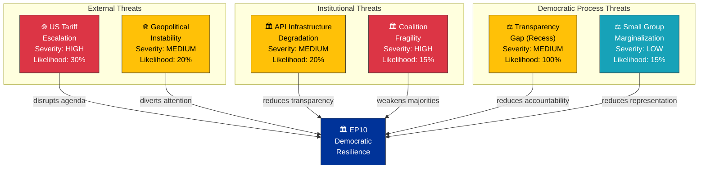
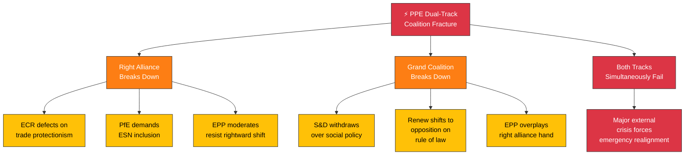
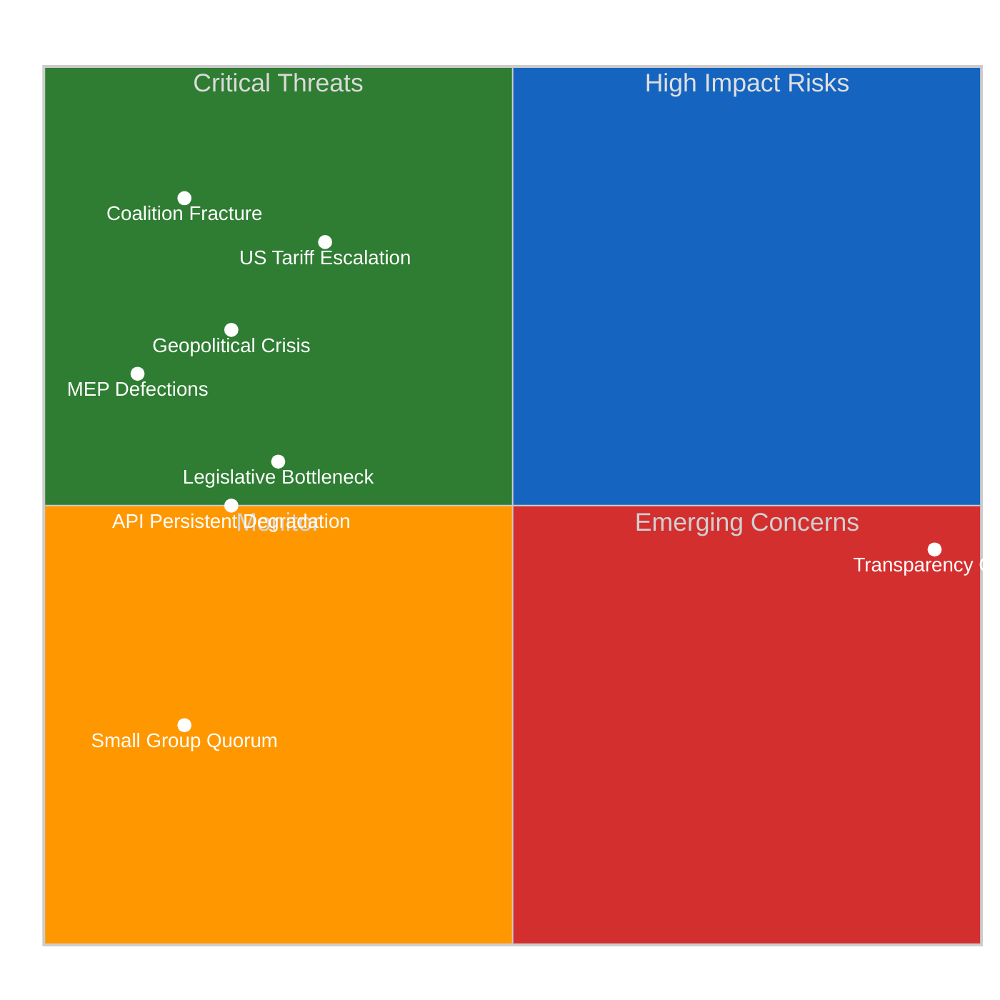

# 🎭 Political Threat Landscape — Easter Recess Day 12 Evening

**📅 Analysis Date:** 2026-04-07 18:30 UTC | **📊 Confidence:** MEDIUM | **📍 Run:** breaking-2

> **Framework:** Political Threat Landscape Model adapted from `analysis/methodologies/political-threat-framework.md`. Applies Diamond Model, Attack Tree, and Kill Chain frameworks to democratic institutional threats.

---

## 📋 Threat Context

| Field | Value |
|-------|-------|
| **Threat ID** | TL-2026-04-07-EVE-001 |
| **Analysis Date** | 2026-04-07 18:30 UTC |
| **Subject** | EP10 Post-Easter Democratic Resilience |
| **Frameworks** | Political Threat Landscape Model, Diamond Model, PESTLE |
| **Prior Assessment** | `analysis/2026-04-07/breaking/threat-assessment/political-threat-landscape.md` |
| **Confidence** | MEDIUM |

---

## 📊 Overall Threat Level

| Assessment | Value |
|-----------|-------|
| **Current Threat Level** |  |
| **Trend Direction** | → STABLE (unchanged from morning) |
| **Key Threat Vector** | External trade dynamics (US tariff escalation) |
| **Secondary Vector** | Institutional transparency (API degradation) |
| **Confidence** | 🟡 MEDIUM |

---

## 🎯 Threat Landscape Overview

---

## 🔍 Diamond Model Analysis: US Tariff Escalation

### Adversary

| Attribute | Assessment |
|-----------|-----------|
| **Actor** | US Administration (trade policy) |
| **Motivation** | Trade balance correction; domestic political signaling |
| **Capability** | Unilateral tariff imposition authority |
| **Intent** | Pressure EU on trade concessions; leverage against Chinese competition |
| **Confidence** | 🟡 MEDIUM — external actor motivations partially visible from EP response texts |

### Infrastructure

| Component | Status |
|-----------|--------|
| **WTO framework** | Constrained — dispute resolution mechanism weakened |
| **EU trade instruments** | Active — countermeasures adopted pre-Easter (TA-10-2026-0096, TA-10-2026-0097) |
| **EP committees** | Recess — INTA and ECON unable to respond in real-time until April 14 |
| **Communication channels** | EU-US trade dialogue mechanisms exist but strained |

### Victim

| Dimension | Impact Assessment |
|-----------|-------------------|
| **EP legislative agenda** | HIGH risk of disruption — trade becomes dominant post-Easter file, displacing planned priorities |
| **EU industry** | MEDIUM-HIGH — tariff exposure affects manufacturing, agriculture, digital services |
| **EU citizens** | MEDIUM — consumer price increases, supply chain disruptions |
| **Member states** | VARIABLE — Germany (automotive), France (agriculture), Italy (manufacturing) differentially affected |

### Capability

| EU Response Option | Readiness | Effectiveness |
|-------------------|:---------:|:------------:|
| **Proportional countermeasures** | HIGH (already adopted) | MEDIUM |
| **WTO dispute** | MEDIUM (mechanism weakened) | LOW-MEDIUM |
| **Bilateral negotiation** | MEDIUM (diplomatic channels exist) | MEDIUM-HIGH |
| **EP resolution on trade** | HIGH (can be fast-tracked) | LOW (symbolic) |
| **Committee investigation** | HIGH (post-recess) | MEDIUM |

---

## 🌳 Attack Tree: Coalition Fracture Scenarios

**Assessment:** The dual-track model's primary vulnerability is that it requires EPP to maintain credibility with both right-wing (ECR, PfE) and centrist (S&D, Renew) partners. A trade crisis that forces EPP to choose between protectionism (ECR preference) and multilateralism (S&D/Renew preference) would be the most likely fracture trigger.

| Fracture Path | Probability | Trigger | First Observable Signal |
|---------------|:-----------:|---------|------------------------|
| ECR trade defection | 15% | US tariff escalation | ECR parliamentary questions on EU trade response |
| S&D governance withdrawal | 10% | Social policy dispute | S&D abstentions on governance files |
| Renew opposition shift | 10% | Rule of law dispute | Renew voting against EPP-led resolutions |
| Dual failure (major crisis) | 5% | Black swan | Cross-group emergency debate request |
| **No fracture** | **60%** | **Status quo** | **Normal post-Easter committee work** |

---

## 🔄 PESTLE Threat Assessment

| Dimension | Current Threat Level | Key Factor | Trend |
|-----------|:-------------------:|-----------|:-----:|
| **Political** | 🟡 MODERATE | PPE dominance risk (19x smallest group). 8-party fragmentation complicates majority building. Source: early warning system. | → |
| **Economic** | 🟡 MODERATE | US tariff exposure. EU countermeasures adopted (TA-10-2026-0096/0097). Banking union reform completing. ECB rate decision April 17 as external input. | ↗ |
| **Social** | 🟢 LOW | No significant social unrest indicators visible in EP data. Anti-corruption directive (TA-10-2026-0094) addresses citizen trust concerns. | → |
| **Technological** | 🟡 MODERATE | EP API infrastructure degraded (6/8 feeds offline). Digital transparency tools operating at reduced capacity. AI Act implementation ongoing. | ↗ (recovering) |
| **Legal** | 🟢 LOW | Stable legal framework. No constitutional challenges to EP authority. Legislative process functioning normally despite recess pause. | → |
| **Environmental** | 🟢 LOW | Environmental regulation advanced pre-Easter. No acute environmental crisis requiring EP response. Greens/EFA maintaining pressure on implementation. | → |

---

## 📊 Threat Severity × Likelihood Matrix

---

## 🎯 Threat Mitigation Recommendations

| Threat | Priority | Mitigation | Owner | Timeline |
|--------|:--------:|-----------|-------|----------|
| **US Tariff Escalation** | 🔴 HIGH | Monitor INTA agenda; prepare emergency briefing capability | Intelligence team | Pre-April 14 |
| **Coalition Fracture** | 🔴 HIGH | Track first post-Easter contested votes; flag EPP-S&D alignment divergence | Political analysis | April 20-23 |
| **API Degradation** | 🟡 MEDIUM | Maintain one-week fallback architecture; monitor recovery trend daily | Technical team | April 7-14 |
| **Transparency Gap** | 🟡 MEDIUM | Cross-reference Council data; supplement with press monitoring | Intelligence team | Ongoing |
| **Legislative Bottleneck** | 🟡 MEDIUM | Track committee scheduling; identify priority conflicts | Legislative tracking | April 14-17 |

---

## 📚 Sources

- EP Open Data Portal feeds: adopted texts (TA-10-2026-0030, 0090, 0092, 0094, 0096, 0097)
- Early warning system: 3 warnings, stability 84/100
- Political landscape analysis: 8 groups, PPE dominance risk flagged
- Precomputed stats 2025-2026: legislative productivity metrics
- Voting anomaly detection: 0 anomalies, stability 100
- Prior threat assessment: `analysis/2026-04-07/breaking/threat-assessment/political-threat-landscape.md`
- Editorial memory: ongoing story tracking for tariffs, banking union, anti-corruption
