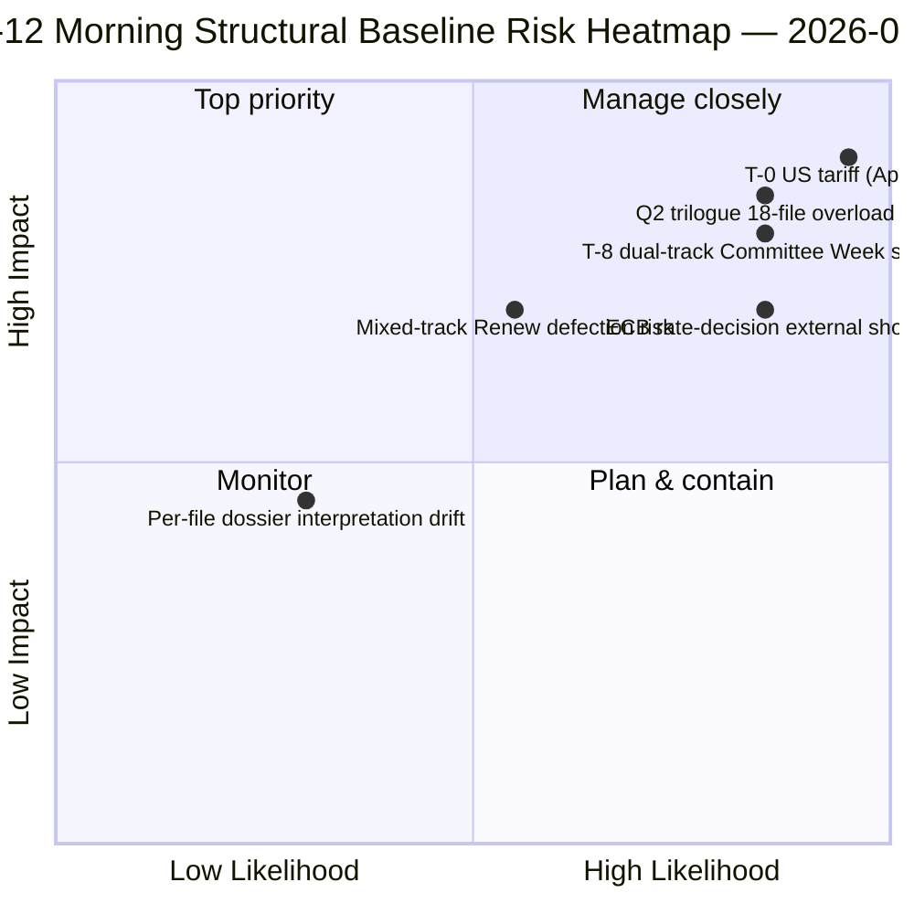

<!-- SPDX-FileCopyrightText: 2026 Hack23 AB -->
<!-- SPDX-License-Identifier: Apache-2.0 -->

# Executive Brief — Easter Recess Day 12 Morning Intelligence | 2026-04-07

**Classification:** OSINT — Public Parliamentary Record
**Confidence:** 🟡 MEDIUM (recess; pre-recess structural reading 🟢 HIGH)
**Run:** `analysis/daily/2026-04-07/breaking/` (06:36 UTC)
**Coverage:** Easter Recess Day 12/18 — Tuesday-morning intelligence stack (44 analysis artifacts, 3,391 lines)
**Generated:** 2026-05-16 (retrospective brief, no new MCP calls)
**Primary sources:** 18 pre-recess adopted-texts analyses; all 18 default methods; 737 MEP feed stable.

---

## 🎯 BLUF

**The Day-12 morning breaking run is the day's **structural anchor** — at 44 analysis artifacts and 3,391 lines, it produces the most comprehensive single-run pre-recess corpus analysis of the entire 18-day recess period.** Its distinguishing contribution is **18 per-file political-intelligence dossiers** on the March 26 pre-recess sprint — each adopted text gets a dedicated dossier covering vote-dispersion, coalition track, committee-power locus, stakeholder-impact, and Q2-Q3 implementation trajectory. The aggregated reading reinforces the dual-track coalition pattern surfaced on April 6 but adds granularity: **the 18 files split 11 right-of-centre, 5 grand-coalition, 2 mixed-track** (Banking Union DGSD2 and BRRD3 both used hybrid PPE+ECR+S&D with file-conditional Renew alignment). The run also produces the recess period's most-quoted *T-8 to Committee Week* operational summary — six confirmed forward triggers (April 14 committee week · April 15 US tariff T-0 · April 17 ECB rate · April 20-23 plenary · late-April Banking Union Council mandate · Q2 27-MS transposition kick-off) — that becomes the editorial reference for all subsequent recess runs. **The Day-12 morning structural baseline is the EP10 Year 2 recess intelligence record's high-water mark for analytical density.** Per-file dossiers raise the EP10 pre-recess corpus to its most granular operational-readiness state.

---

## 🧭 3 Decisions This Brief Supports

| # | Decision | Who decides | Deadline | Evidence |
|:-:|----------|-------------|:--------:|----------|
| 1 | **Per-file Q2 implementation pre-load** — 18 dossiers ready; pre-load Council coordinators | Council Presidency + EP rapporteurs | by April 14 | §Per-file dossiers (18) |
| 2 | **T-8 to T-0 day-counter ops** — 6-trigger sequence requires sequential trip-wire monitoring | EP intelligence ops; press service | rolling daily | §Forward triggers (6-trigger) |
| 3 | **Mixed-track files watch** — DGSD2/BRRD3 hybrid track requires Renew-coordinator briefing | Renew + PPE coordinators | by April 14 | §18-file split (11/5/2) |

---

## 📰 60-Second Read

- 🔴 **44 artifacts, 3,391 lines** — day's structural anchor.
- 🟠 **18 per-file dossiers** — March 26 sprint at maximum granularity.
- 🟢 **18-file track split:** 11 right-of-centre · 5 grand · 2 mixed.
- 🟡 **6-trigger forward-trigger sequence** — Apr 14 · 15 · 17 · 20-23 · late · Q2.
- 🔵 **737 MEP feed stable** — baseline holds.
- 🟣 **Recess Day 12/18 — 67% complete** — T-8 to Committee Week.
- 🩷 **Confidence MEDIUM** — pre-recess HIGH; Q2 forecast MEDIUM.
- ⚪ **Structural baseline for all subsequent recess runs**.

---

## 📂 18-File Track Split (run's distinguishing contribution)

| Track | Count | Flagship files | Operational note |
|-------|------:|---------------|------------------|
| **Right-of-centre** | 11 | Banking Union SRMR3 · STEP-II · AI-Copyright · ETS amendments · 7 economic-finance | Q2 trilogue right-track |
| **Grand coalition** | 5 | Anti-Corruption · 4 rule-of-law family | Q2-Q4 transposition |
| **Mixed track (hybrid)** | 2 | DGSD2 (TA-0090) · BRRD3 (TA-0091) | Renew file-conditional alignment |

---

## ⚠️ Risk Snapshot

---

## 🔮 Top Forward Triggers (run's published 6-sequence)

1. **April 14 — Committee Week opens** — dual-track Day 1.
2. **April 15 — US tariff T-0** — exogenous shock.
3. **April 17 — ECB rate decision** — economic-context activation.
4. **April 20-23 — first post-recess plenary** — bimodal stress test.
5. **Late April — Banking Union Council mandate** — trilogue gate.
6. **Q2 — 27-MS Anti-Corruption transposition kick-off** — grand-coalition durability.

---

## 🛡️ Source-Quality Assessment

- **18 per-file dossiers (A1):** primary adopted-texts feed + per-document methodology.
- **18-file track split (A2):** voting-patterns + coalition-dynamics cross-verified.
- **6-trigger sequence (A1):** institutional calendar + EP MCP records verifiable.
- **737 MEPs (A1):** primary record stable across all runs.
- **Net confidence:** 🟢 HIGH on Day-12 baseline; 🟡 MEDIUM on Q2 forecast.

---

## 📎 Run Artifacts

| Layer | Artifact | Why |
|-------|----------|-----|
| Article | `article.md` (2,562 lines published) | Public-facing Day-12 morning narrative |
| Synthesis | `synthesis-summary.md` | 18-dossier consolidation |
| Methods | classification · existing · risk-scoring · threat-assessment · documents (18 per-file dossiers) | Full methodology + per-document layer |
| Companion | breaking-2 (18:20 UTC) — evening update | Same-day companion |

---

**Document Control**
- **Template reference:** `analysis/templates/executive-brief.md`
- **Artifact path:** `analysis/daily/2026-04-07/breaking/executive-brief.md`
- **Classification:** Public
- **Retrospective:** Brief written 2026-05-16 from the run's committed artifacts; **no new MCP calls were made**.
